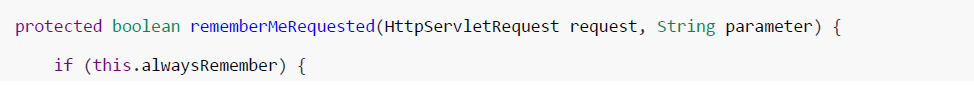
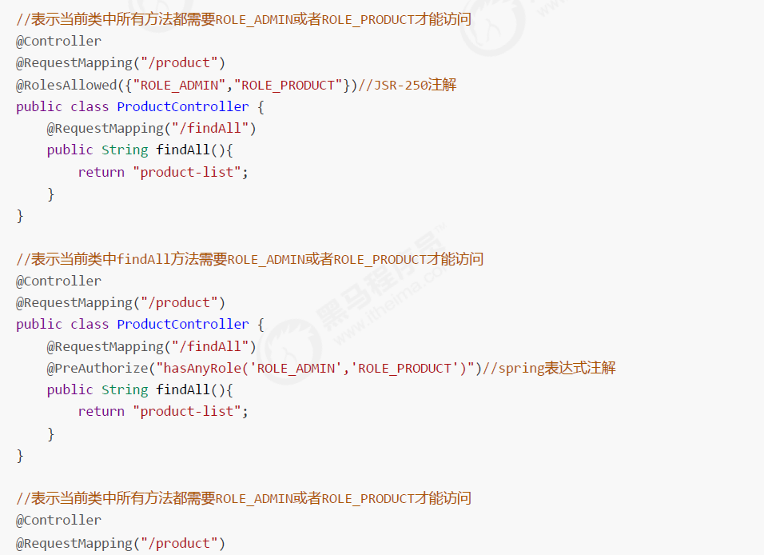
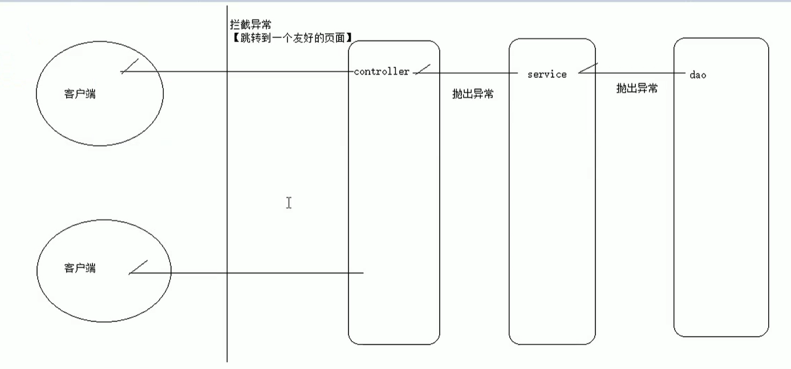

# SpringSecurity认证过程

## 参考

来源于黑马程序员： [手把手教你精通新版SpringSecurity](https://www.bilibili.com/video/BV1EE411u7YV?p=17)

## 设置用户状态

用户认证业务里，我们封装User对象时，选择了三个构造参数的构造方法，其实还有另一个构造方法：

```java
public User(String username, String password, boolean enabled, boolean accountNonExpired,
boolean credentialsNonExpired, boolean accountNonLocked, Collection<? extends GrantedAuthority>
authorities) {
    if (username != null && !"".equals(username) && password != null) {
        this.username = username;
        this.password = password;
        this.enabled = enabled;
        this.accountNonExpired = accountNonExpired;
        this.credentialsNonExpired = credentialsNonExpired;
        this.accountNonLocked = accountNonLocked;
        this.authorities = Collections.unmodifiableSet(sortAuthorities(authorities));
    } else {
        throw new IllegalArgumentException("Cannot pass null or empty values to constructor");
    }
}
```

可以看到，这个构造方法里多了四个布尔类型的构造参数，其实我们使用的三个构造参数的构造方法里这四个布尔
值默认都被赋值为了true，那么这四个布尔值到底是何意思呢？

- boolean enabled 是否可用
- boolean accountNonExpired 账户是否失效
- boolean credentialsNonExpired 密码是否失效
- boolean accountNonLocked 账户是否锁定


在蘑菇博客中，就是这里进行定义的，然后在通过下面代码来进行判断该用户是否处于正常

```java
    /**
     * 通过管理员Admin，生成一个SpringSecurity用户
     * @param admin
     * @return
     */
    public static SecurityUser create(Admin admin) {
        boolean enabled = admin.getStatus() == EStatus.ENABLE;
        return new SecurityUser(
                admin.getUid(),
                admin.getUserName(),
                admin.getPassWord(),
                enabled,
                mapToGrantedAuthorities(admin.getRoleNames())
        );
    }
```

## 注销功能

注意：一旦开启了csrf防护功能，logout处理器便只支持POST请求方式了！修改header.jsp中注销请求：

```html
<form action="${pageContext.request.contextPath}/logout" method="post">
    <security:csrfInput/>
    <input type="submit" value="注销">
</form>
```

## 记住我功能

### 流程分析

还记得前面咱们分析认证流程时，提到的记住我功能吗？现在继续跟踪找到AbstractRememberMeServices对象的loginSuccess方法：


再点进去上面if判断中的rememberMeRequested方法，还在当前类中



如果上面方法返回true，就表示页面勾选了记住我选项了。继续顺着调用的方法找到PersistentTokenBasedRememberMeServices的onLoginSuccess方法：


### 记住我功能页面代码

注意name和value属性的值不要写错哦！


先测试一下，认证通过后，关掉浏览器，再次打开页面，发现还要认证！为什么没有起作用呢？这是因为remember me功能使用的过滤器RememberMeAuthenticationFilter默认是不开启的！

### 开启remember me过滤器

```java
<!--设置可以用spring的el表达式配置Spring Security并自动生成对应配置组件（过滤器）-->
<security:http auto-config="true" use-expressions="true">
    <!--省略其余配置-->
    <!--开启remember me过滤器，设置token存储时间为60秒-->
    <security:remember-me token-validity-seconds="60"/>
</security:http>
```

说明：RememberMeAuthenticationFilter中功能非常简单，会在打开浏览器时，自动判断是否认证，如果没有则
调用autoLogin进行自动认证。

### remember me安全性分析

记住我功能方便是大家看得见的，但是安全性却令人担忧。因为Cookie毕竟是保存在客户端的，很容易盗取，而且 Cookie的值还与用户名、密码这些敏感数据相关，虽然加密了，但是将敏感信息存在客户端，还是不太安全。那么 这就要提醒喜欢使用此功能的，用完网站要及时手动退出登录，清空认证信息。

此外，SpringSecurity还提供了remember me的另一种相对更安全的实现机制 :在客户端的cookie中，仅保存一个
无意义的加密串（与用户名、密码等敏感数据无关），然后在db中保存该加密串-用户信息的对应关系，自动登录
时，用cookie中的加密串，到db中验证，如果通过，自动登录才算通过。

### 持久化remember me信息

创建一张表，注意这张表的名称和字段都是固定的，不要修改。

```sql
CREATE TABLE `persistent_logins` (
`username` varchar(64) NOT NULL,
`series` varchar(64) NOT NULL,
`token` varchar(64) NOT NULL,
`last_used` timestamp NOT NULL,
PRIMARY KEY (`series`)
) ENGINE=InnoDB DEFAULT CHARSET=utf8
```

然后将spring-security.xml中 改为：

```xml
<!--
开启remember me过滤器，
data-source-ref="dataSource" 指定数据库连接池
token-validity-seconds="60" 设置token存储时间为60秒 可省略
remember-me-parameter="remember-me" 指定记住的参数名 可省略
-->
<security:remember-me data-source-ref="dataSource"
token-validity-seconds="60" remember-me-parameter="remember-me"/>
```

最后测试发现数据库中自动多了一条记录：


## 显示当前认证信息

在header.jsp中找到页面头部最右侧图片处添加如下信息：

```jsp
<span class="hidden-xs">
	<security:authentication property="principal.username" />
</span>
或者
<span class="hidden-xs">
	<security:authentication property="name" />
</span>
```

## 授权准备工作

为了模拟授权操作，咱们临时编写两个业务功能：处理器代码：


aside.jsp页面：


## 动态展示菜单

在aside.jsp对每个菜单通过SpringSecurity标签库指定访问所需角色


我们做个测试，xiaozhi这个用户现在只有普通用户角色ROLE_USER，用xiaozhi登录后，果然只看到了订单管理：


那么问题来了，是不是现在已经授权成功了呢？答案是否定的！你可以试试直接去访问产品的http请求地址：


我们发现xiaozhi其实是可以操作产品模块的，只是没有把产品功能展示给xiaozhi而已！

总结一句：页面动态菜单的展示只是为了用户体验，并未真正控制权限！

## 授权操作

### IOC容器介绍


从这里我们就可以知道，我们的spring-security.xml需要放到父容器中被保护起来，不能放到子容器中被直接访问

说明：SpringSecurity可以通过注解的方式来控制类或者方法的访问权限。注解需要对应的注解支持，若注解放在
controller类中，对应注解支持应该放在mvc配置文件中，因为controller类是有mvc配置文件扫描并创建的，同
理，注解放在service类中，对应注解支持应该放在spring配置文件中。由于我们现在是模拟业务操作，并没有
service业务代码，所以就把注解放在controller类中了。

### 开启授权的注解支持

这里给大家演示三类注解，但实际开发中，用一类即可！

```xml
<!--
开启权限控制注解支持
jsr250-annotations="enabled"    表示支持jsr250-api的注解，需要jsr250-api的jar包
pre-post-annotations="enabled"  表示支持spring表达式注解
secured-annotations="enabled"   这才是SpringSecurity提供的注解
-->
<security:global-method-security jsr250-annotations="enabled"
pre-post-annotations="enabled"
secured-annotations="enabled"/>
```

### 在注解支持对应类或者方法上添加注解




我们也可以使用多种注解的方式

```java
@Controller
@RequestMapping("/product")
public class ProductController {

    //@Secured({"ROLE_PRODUCT","ROLE_ADMIN"})//springSecurity内部制定的注解
    //@RolesAllowed({"ROLE_PRODUCT","ROLE_ADMIN"})//jsr250注解
    @PreAuthorize("hasAnyAuthority('ROLE_PRODUCT','ROLE_ADMIN')")//spring的el表达式注解
    @RequestMapping("/findAll")
    public String findAll(){
        return "product-list";
    }
}
```

## 权限不足异常处理

大家也发现了，每次权限不足都出现403页面，着实难堪！体会一下：


用户体验不是很好，现在我们立马消灭它！



### 方式一：在spring-security.xml配置文件中处理

```xml
<!--设置可以用spring的el表达式配置Spring Security并自动生成对应配置组件（过滤器）-->
<security:http auto-config="true" use-expressions="true">
<!--省略其它配置-->
<!--403异常处理-->
<security:access-denied-handler error-page="/403.jsp"/>
</security:http>
```

### 方式二：在web.xml中处理

```bash
<error-page>
    <error-code>403</error-code>
    <location>/403.jsp</location>
</error-page>
```

### 方式三：编写异常处理器

拦截器和过滤器的区别

- 拦截器：可以在Spring中进行使用
- 过滤器：只能在web.xml中进行配置，也就是只能在web工程中使用

或者我们可以实现一个Spring给我们提供好的接口

```java
@Component
public class HandlerControllerException implements HandlerExceptionResolver {
    /**
     * @param httpServletRequest
     * @param httpServletResponse
     * @param o  出现异常的对象
     * @param e  出现的异常信息
     * @return   ModelAndView
     */
    @Override
    public ModelAndView resolveException(HttpServletRequest httpServletRequest, HttpServletResponse httpServletResponse, Object o, Exception e) {
        ModelAndView mv = new ModelAndView();
        //将异常信息放入request域中，基本不用
        mv.addObject("errorMsg", e.getMessage());
        //指定不同异常跳转的页面
        if(e instanceof AccessDeniedException){
            mv.setViewName("redirect:/403.jsp");
        }else {
            mv.setViewName("redirect:/500.jsp");
        }
        return mv;
    }
}
```

下面一个更简单的方式，通过注解就相当于我们实现了 HandlerExceptionResolver

```java
@ControllerAdvice
public class HandlerControllerAdvice{

    @ExceptionHandler(AccessDeniedException.class)
    public String handlerException(){
        return "redirect:/403.jsp";
    }

    @ExceptionHandler(RuntimeException.class)
    public String runtimeHandlerException(){
        return "redirect:/500.jsp";
    }
}
```

