# SpringSecurity在分布式环境下的使用

## 参考

来源于黑马程序员： [手把手教你精通新版SpringSecurity](https://www.bilibili.com/video/BV1EE411u7YV?p=43)

## 分布式认证概念说明

分布式认证，即我们常说的单点登录，简称SSO，指的是在多应用系统的项目中，用户只需要登录一次，就可以访
问所有互相信任的应用系统。

## 分布式认证流程图

首先，我们要明确，在分布式项目中，每台服务器都有各自独立的session，而这些session之间是无法直接共享资
源的，所以，session通常不能被作为单点登录的技术方案。最合理的单点登录方案流程如下图所示：

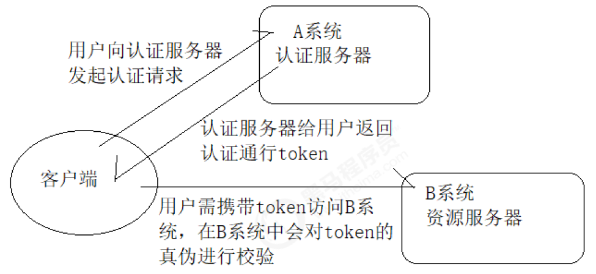

**总结一下，单点登录的实现分两大环节：**

- **用户认证：**这一环节主要是用户向认证服务器发起认证请求，认证服务器给用户返回一个成功的令牌token，
  主要在认证服务器中完成，即图中的A系统，注意A系统只能有一个。
- **身份校验：**这一环节是用户携带token去访问其他服务器时，在其他服务器中要对token的真伪进行检验，主
  要在资源服务器中完成，即图中的B系统，这里B系统可以有很多个。

## JWT介绍

### 概念说明

从分布式认证流程中，我们不难发现，这中间起最关键作用的就是token，token的安全与否，直接关系到系统的
健壮性，这里我们选择使用JWT来实现token的生成和校验。
JWT，全称JSON Web Token，官网地址https://jwt.io，是一款出色的分布式身份校验方案。可以生成token，也可以解析检验token。

### JWT生成的token由三部分组成

- **头部**：主要设置一些规范信息，签名部分的编码格式就在头部中声明。
- **载荷**：token中存放有效信息的部分，比如用户名，用户角色，过期时间等，但是不要放密码，会泄露！
- **签名**：将头部与载荷分别采用base64编码后，用“.”相连，再加入**盐**，最后使用头部声明的编码类型进行编
  码，就得到了签名。【通过随机盐在进行加密】

### JWT生成token的安全性分析

从JWT生成的token组成上来看，要想避免token被伪造，主要就得看签名部分了，而签名部分又有三部分组成，其中头部和载荷的base64编码，几乎是透明的，毫无安全性可言，那么最终守护token安全的重担就落在了加入的盐上面了！

试想：如果生成token所用的盐与解析token时加入的盐是一样的。岂不是类似于中国人民银行把人民币防伪技术
公开了？大家可以用这个盐来解析token，就能用来伪造token。这时，我们就需要对盐采用非对称加密的方式进行加密，以达到生成token与校验token方所用的盐不一致的安全效果！

## 非对称加密RSA介绍

- **基本原理：**同时生成两把密钥：私钥和公钥，私钥隐秘保存，公钥可以下发给信任客户端
- **私钥加密**，持有私钥或公钥才可以解密
- **公钥加密**，持有私钥才可解密
- **优点**：安全，难以破解
- **缺点**：算法比较耗时，为了安全，可以接受
- **历史**：三位数学家Rivest、Shamir 和 Adleman 设计了一种算法，可以实现非对称加密。这种算法用他们三
  个人的名字缩写：RSA。

【总结】：也就是说，我们加密信息的时候，使用的是公钥，而验证token真伪的时候，使用的是公钥

## JWT相关工具类

### jar包 

```xml
<dependency>
    <groupId>io.jsonwebtoken</groupId>
    <artifactId>jjwt-api</artifactId>
    <version>0.10.7</version>
</dependency>

<dependency>
    <groupId>io.jsonwebtoken</groupId>
    <artifactId>jjwt-impl</artifactId>
    <version>0.10.7</version>
    <scope>runtime</scope>
</dependency>

<dependency>
    <groupId>io.jsonwebtoken</groupId>
    <artifactId>jjwt-jackson</artifactId>
    <version>0.10.7</version>
    <scope>runtime</scope>
</dependency>
```

### 载荷对象

```java
/**
* 为了方便后期获取token中的用户信息，将token中载荷部分单独封装成一个对象
*/
@Data
public class Payload<T> {

}
```

### JWT工具类

```java
/**
 * 生成token以及校验token相关方法
 */
public class JwtUtils {

    private static final String JWT_PAYLOAD_USER_KEY = "user";

    /**
     * 私钥加密token
     *
     * @param userInfo   载荷中的数据
     * @param privateKey 私钥
     * @param expire     过期时间，单位分钟
     * @return JWT
     */
    public static String generateTokenExpireInMinutes(Object userInfo, PrivateKey privateKey, int expire) {
        return Jwts.builder()
                .claim(JWT_PAYLOAD_USER_KEY, JsonUtils.toString(userInfo))
                .setId(createJTI())
                .setExpiration(DateTime.now().plusMinutes(expire).toDate())
                .signWith(privateKey, SignatureAlgorithm.RS256)
                .compact();
    }

    /**
     * 私钥加密token
     *
     * @param userInfo   载荷中的数据
     * @param privateKey 私钥
     * @param expire     过期时间，单位秒
     * @return JWT
     */
    public static String generateTokenExpireInSeconds(Object userInfo, PrivateKey privateKey, int expire) {
        return Jwts.builder()
                .claim(JWT_PAYLOAD_USER_KEY, JsonUtils.toString(userInfo))
                .setId(createJTI())
                .setExpiration(DateTime.now().plusSeconds(expire).toDate())
                .signWith(privateKey, SignatureAlgorithm.RS256)
                .compact();
    }

    /**
     * 公钥解析token
     *
     * @param token     用户请求中的token
     * @param publicKey 公钥
     * @return Jws<Claims>
     */
    private static Jws<Claims> parserToken(String token, PublicKey publicKey) {
        return Jwts.parser().setSigningKey(publicKey).parseClaimsJws(token);
    }

    private static String createJTI() {
        return new String(Base64.getEncoder().encode(UUID.randomUUID().toString().getBytes()));
    }

    /**
     * 获取token中的用户信息
     *
     * @param token     用户请求中的令牌
     * @param publicKey 公钥
     * @return 用户信息
     */
    public static <T> Payload<T> getInfoFromToken(String token, PublicKey publicKey, Class<T> userType) {
        Jws<Claims> claimsJws = parserToken(token, publicKey);
        Claims body = claimsJws.getBody();
        Payload<T> claims = new Payload<>();
        claims.setId(body.getId());
        claims.setUserInfo(JsonUtils.toBean(body.get(JWT_PAYLOAD_USER_KEY).toString(), userType));
        claims.setExpiration(body.getExpiration());
        return claims;
    }

    /**
     * 获取token中的载荷信息
     *
     * @param token     用户请求中的令牌
     * @param publicKey 公钥
     * @return 用户信息
     */
    public static <T> Payload<T> getInfoFromToken(String token, PublicKey publicKey) {
        Jws<Claims> claimsJws = parserToken(token, publicKey);
        Claims body = claimsJws.getBody();
        Payload<T> claims = new Payload<>();
        claims.setId(body.getId());
        claims.setExpiration(body.getExpiration());
        return claims;
    }
}
```

### RSA工具类

非对称加密工具列

```java
public class RsaUtils {

    private static final int DEFAULT_KEY_SIZE = 2048;
    /**
     * 从文件中读取公钥
     *
     * @param filename 公钥保存路径，相对于classpath
     * @return 公钥对象
     * @throws Exception
     */
    public static PublicKey getPublicKey(String filename) throws Exception {
        byte[] bytes = readFile(filename);
        return getPublicKey(bytes);
    }

    /**
     * 从文件中读取密钥
     *
     * @param filename 私钥保存路径，相对于classpath
     * @return 私钥对象
     * @throws Exception
     */
    public static PrivateKey getPrivateKey(String filename) throws Exception {
        byte[] bytes = readFile(filename);
        return getPrivateKey(bytes);
    }

    /**
     * 获取公钥
     *
     * @param bytes 公钥的字节形式
     * @return
     * @throws Exception
     */
    private static PublicKey getPublicKey(byte[] bytes) throws Exception {
        bytes = Base64.getDecoder().decode(bytes);
        X509EncodedKeySpec spec = new X509EncodedKeySpec(bytes);
        KeyFactory factory = KeyFactory.getInstance("RSA");
        return factory.generatePublic(spec);
    }

    /**
     * 获取密钥
     *
     * @param bytes 私钥的字节形式
     * @return
     * @throws Exception
     */
    private static PrivateKey getPrivateKey(byte[] bytes) throws NoSuchAlgorithmException, InvalidKeySpecException {
        bytes = Base64.getDecoder().decode(bytes);
        PKCS8EncodedKeySpec spec = new PKCS8EncodedKeySpec(bytes);
        KeyFactory factory = KeyFactory.getInstance("RSA");
        return factory.generatePrivate(spec);
    }

    /**
     * 根据密文，生存rsa公钥和私钥,并写入指定文件
     *
     * @param publicKeyFilename  公钥文件路径
     * @param privateKeyFilename 私钥文件路径
     * @param secret             生成密钥的密文
     */
    public static void generateKey(String publicKeyFilename, String privateKeyFilename, String secret, int keySize) throws Exception {
        KeyPairGenerator keyPairGenerator = KeyPairGenerator.getInstance("RSA");
        SecureRandom secureRandom = new SecureRandom(secret.getBytes());
        keyPairGenerator.initialize(Math.max(keySize, DEFAULT_KEY_SIZE), secureRandom);
        KeyPair keyPair = keyPairGenerator.genKeyPair();
        // 获取公钥并写出
        byte[] publicKeyBytes = keyPair.getPublic().getEncoded();
        publicKeyBytes = Base64.getEncoder().encode(publicKeyBytes);
        writeFile(publicKeyFilename, publicKeyBytes);
        // 获取私钥并写出
        byte[] privateKeyBytes = keyPair.getPrivate().getEncoded();
        privateKeyBytes = Base64.getEncoder().encode(privateKeyBytes);
        writeFile(privateKeyFilename, privateKeyBytes);
    }

    private static byte[] readFile(String fileName) throws Exception {
        return Files.readAllBytes(new File(fileName).toPath());
    }

    private static void writeFile(String destPath, byte[] bytes) throws IOException {
        File dest = new File(destPath);
        if (!dest.exists()) {
            dest.createNewFile();
        }
        Files.write(dest.toPath(), bytes);
    }
}
```

## SpringSecurity+JWT+RSA分布式认证思路分析

SpringSecurity主要是通过过滤器来实现功能的！我们要找到SpringSecurity实现认证和校验身份的过滤器！
回顾集中式认证流程

### 用户认证

使用UsernamePasswordAuthenticationFilter过滤器中attemptAuthentication方法实现认证功能，该过滤
器父类中successfulAuthentication方法实现认证成功后的操作。

### 身份校验

使用BasicAuthenticationFilter过滤器中doFilterInternal方法验证是否登录，以决定能否进入后续过滤器。
分析分布式认证流程

### 用户认证

由于，分布式项目，多数是前后端分离的架构设计，我们要满足可以接受异步post的认证请求参数，需要修
改UsernamePasswordAuthenticationFilter过滤器中attemptAuthentication方法，让其能够接收请求体。

另外，默认successfulAuthentication方法在认证通过后，是把用户信息直接放入session就完事了，现在我
们需要修改这个方法，在认证通过后生成token并返回给用户。

### 身份校验

原来BasicAuthenticationFilter过滤器中doFilterInternal方法校验用户是否登录，就是看session中是否有用
户信息，我们要修改为，验证用户携带的token是否合法，并解析出用户信息，交给SpringSecurity，以便于
后续的授权功能可以正常使用。

## SpringSecurity+JWT+RSA分布式认证实现

### 创建父工程并导入jar包

```xml
<?xml version="1.0" encoding="UTF-8"?>
<project xmlns="http://maven.apache.org/POM/4.0.0"
         xmlns:xsi="http://www.w3.org/2001/XMLSchema-instance"
         xsi:schemaLocation="http://maven.apache.org/POM/4.0.0 http://maven.apache.org/xsd/maven-4.0.0.xsd">
    <modelVersion>4.0.0</modelVersion>

    <groupId>com.itheima</groupId>
    <artifactId>springboot_security_jwt_rsa_parent</artifactId>
    <packaging>pom</packaging>
    <version>1.0-SNAPSHOT</version>
    <modules>
        <module>heima_common</module>
        <module>heima_auth_server</module>
        <module>heima_source_product</module>
    </modules>

    <parent>
        <groupId>org.springframework.boot</groupId>
        <artifactId>spring-boot-starter-parent</artifactId>
        <version>2.1.3.RELEASE</version>
        <relativePath/>
    </parent>
</project>
```

## 通用模块

创建通用子模块并导入JWT相关jar包

```xml
<?xml version="1.0" encoding="UTF-8"?>
<project xmlns="http://maven.apache.org/POM/4.0.0"
         xmlns:xsi="http://www.w3.org/2001/XMLSchema-instance"
         xsi:schemaLocation="http://maven.apache.org/POM/4.0.0 http://maven.apache.org/xsd/maven-4.0.0.xsd">
    <parent>
        <artifactId>springboot_security_jwt_rsa_parent</artifactId>
        <groupId>com.itheima</groupId>
        <version>1.0-SNAPSHOT</version>
    </parent>
    <modelVersion>4.0.0</modelVersion>

    <artifactId>heima_common</artifactId>

    <dependencies>
        <dependency>
            <groupId>io.jsonwebtoken</groupId>
            <artifactId>jjwt-api</artifactId>
            <version>0.10.7</version>
        </dependency>
        <dependency>
            <groupId>io.jsonwebtoken</groupId>
            <artifactId>jjwt-impl</artifactId>
            <version>0.10.7</version>
            <scope>runtime</scope>
        </dependency>
        <dependency>
            <groupId>io.jsonwebtoken</groupId>
            <artifactId>jjwt-jackson</artifactId>
            <version>0.10.7</version>
            <scope>runtime</scope>
        </dependency>
        <!--jackson包-->
        <dependency>
            <groupId>com.fasterxml.jackson.core</groupId>
            <artifactId>jackson-databind</artifactId>
            <version>2.9.9</version>
        </dependency>
        <!--日志包-->
        <dependency>
            <groupId>org.springframework.boot</groupId>
            <artifactId>spring-boot-starter-logging</artifactId>
        </dependency>
        <dependency>
            <groupId>joda-time</groupId>
            <artifactId>joda-time</artifactId>
        </dependency>
        <dependency>
            <groupId>org.projectlombok</groupId>
            <artifactId>lombok</artifactId>
        </dependency>
        <dependency>
            <groupId>org.springframework.boot</groupId>
            <artifactId>spring-boot-starter-test</artifactId>
        </dependency>
    </dependencies>
</project>
```

### 导入工具类

工具类如下

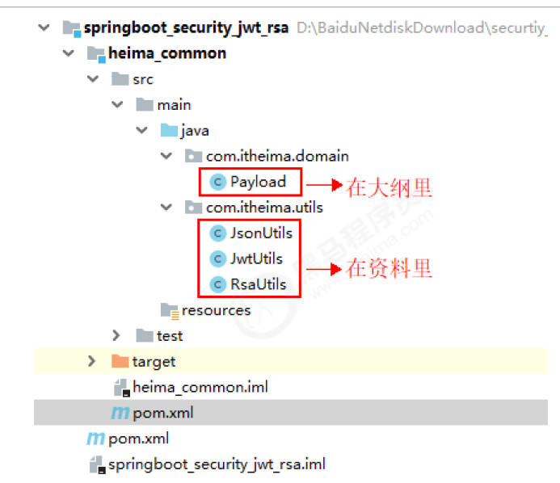

### Payload.java

```java
/**
 * 为了方便后期获取token中的用户信息，将token中载荷部分单独封装成一个对象
 */
@Data
public class Payload<T> {
    private String id;
    private T userInfo;
    private Date expiration;
}
```

### JsonUtil.java

```java
public class JsonUtils {

    public static final ObjectMapper mapper = new ObjectMapper();

    private static final Logger logger = LoggerFactory.getLogger(JsonUtils.class);

    public static String toString(Object obj) {
        if (obj == null) {
            return null;
        }
        if (obj.getClass() == String.class) {
            return (String) obj;
        }
        try {
            return mapper.writeValueAsString(obj);
        } catch (JsonProcessingException e) {
            logger.error("json序列化出错：" + obj, e);
            return null;
        }
    }

    public static <T> T toBean(String json, Class<T> tClass) {
        try {
            return mapper.readValue(json, tClass);
        } catch (IOException e) {
            logger.error("json解析出错：" + json, e);
            return null;
        }
    }

    public static <E> List<E> toList(String json, Class<E> eClass) {
        try {
            return mapper.readValue(json, mapper.getTypeFactory().constructCollectionType(List.class, eClass));
        } catch (IOException e) {
            logger.error("json解析出错：" + json, e);
            return null;
        }
    }

    public static <K, V> Map<K, V> toMap(String json, Class<K> kClass, Class<V> vClass) {
        try {
            return mapper.readValue(json, mapper.getTypeFactory().constructMapType(Map.class, kClass, vClass));
        } catch (IOException e) {
            logger.error("json解析出错：" + json, e);
            return null;
        }
    }

    public static <T> T nativeRead(String json, TypeReference<T> type) {
        try {
            return mapper.readValue(json, type);
        } catch (IOException e) {
            logger.error("json解析出错：" + json, e);
            return null;
        }
    }
}
```

### jwtUitls.java

```java
public class JwtUtils {

    private static final String JWT_PAYLOAD_USER_KEY = "user";

    /**
     * 私钥加密token
     *
     * @param userInfo   载荷中的数据
     * @param privateKey 私钥
     * @param expire     过期时间，单位分钟
     * @return JWT
     */
    public static String generateTokenExpireInMinutes(Object userInfo, PrivateKey privateKey, int expire) {
        return Jwts.builder()
                .claim(JWT_PAYLOAD_USER_KEY, JsonUtils.toString(userInfo))
                .setId(createJTI())
                .setExpiration(DateTime.now().plusMinutes(expire).toDate())
                .signWith(privateKey, SignatureAlgorithm.RS256)
                .compact();
    }

    /**
     * 私钥加密token
     *
     * @param userInfo   载荷中的数据
     * @param privateKey 私钥
     * @param expire     过期时间，单位秒
     * @return JWT
     */
    public static String generateTokenExpireInSeconds(Object userInfo, PrivateKey privateKey, int expire) {
        return Jwts.builder()
                .claim(JWT_PAYLOAD_USER_KEY, JsonUtils.toString(userInfo))
                .setId(createJTI())
                .setExpiration(DateTime.now().plusSeconds(expire).toDate())
                .signWith(privateKey, SignatureAlgorithm.RS256)
                .compact();
    }

    /**
     * 公钥解析token
     *
     * @param token     用户请求中的token
     * @param publicKey 公钥
     * @return Jws<Claims>
     */
    private static Jws<Claims> parserToken(String token, PublicKey publicKey) {
        return Jwts.parser().setSigningKey(publicKey).parseClaimsJws(token);
    }

    private static String createJTI() {
        return new String(Base64.getEncoder().encode(UUID.randomUUID().toString().getBytes()));
    }

    /**
     * 获取token中的用户信息
     *
     * @param token     用户请求中的令牌
     * @param publicKey 公钥
     * @return 用户信息
     */
    public static <T> Payload<T> getInfoFromToken(String token, PublicKey publicKey, Class<T> userType) {
        Jws<Claims> claimsJws = parserToken(token, publicKey);
        Claims body = claimsJws.getBody();
        Payload<T> claims = new Payload<>();
        claims.setId(body.getId());
        claims.setUserInfo(JsonUtils.toBean(body.get(JWT_PAYLOAD_USER_KEY).toString(), userType));
        claims.setExpiration(body.getExpiration());
        return claims;
    }

    /**
     * 获取token中的载荷信息
     *
     * @param token     用户请求中的令牌
     * @param publicKey 公钥
     * @return 用户信息
     */
    public static <T> Payload<T> getInfoFromToken(String token, PublicKey publicKey) {
        Jws<Claims> claimsJws = parserToken(token, publicKey);
        Claims body = claimsJws.getBody();
        Payload<T> claims = new Payload<>();
        claims.setId(body.getId());
        claims.setExpiration(body.getExpiration());
        return claims;
    }
}
```

### RsaUtils.java

```java
public class RsaUtils {

    private static final int DEFAULT_KEY_SIZE = 2048;
    /**
     * 从文件中读取公钥
     *
     * @param filename 公钥保存路径，相对于classpath
     * @return 公钥对象
     * @throws Exception
     */
    public static PublicKey getPublicKey(String filename) throws Exception {
        byte[] bytes = readFile(filename);
        return getPublicKey(bytes);
    }

    /**
     * 从文件中读取密钥
     *
     * @param filename 私钥保存路径，相对于classpath
     * @return 私钥对象
     * @throws Exception
     */
    public static PrivateKey getPrivateKey(String filename) throws Exception {
        byte[] bytes = readFile(filename);
        return getPrivateKey(bytes);
    }

    /**
     * 获取公钥
     *
     * @param bytes 公钥的字节形式
     * @return
     * @throws Exception
     */
    private static PublicKey getPublicKey(byte[] bytes) throws Exception {
        bytes = Base64.getDecoder().decode(bytes);
        X509EncodedKeySpec spec = new X509EncodedKeySpec(bytes);
        KeyFactory factory = KeyFactory.getInstance("RSA");
        return factory.generatePublic(spec);
    }

    /**
     * 获取密钥
     *
     * @param bytes 私钥的字节形式
     * @return
     * @throws Exception
     */
    private static PrivateKey getPrivateKey(byte[] bytes) throws NoSuchAlgorithmException, InvalidKeySpecException {
        bytes = Base64.getDecoder().decode(bytes);
        PKCS8EncodedKeySpec spec = new PKCS8EncodedKeySpec(bytes);
        KeyFactory factory = KeyFactory.getInstance("RSA");
        return factory.generatePrivate(spec);
    }

    /**
     * 根据密文，生存rsa公钥和私钥,并写入指定文件
     *
     * @param publicKeyFilename  公钥文件路径
     * @param privateKeyFilename 私钥文件路径
     * @param secret             生成密钥的密文
     */
    public static void generateKey(String publicKeyFilename, String privateKeyFilename, String secret, int keySize) throws Exception {
        KeyPairGenerator keyPairGenerator = KeyPairGenerator.getInstance("RSA");
        SecureRandom secureRandom = new SecureRandom(secret.getBytes());
        keyPairGenerator.initialize(Math.max(keySize, DEFAULT_KEY_SIZE), secureRandom);
        KeyPair keyPair = keyPairGenerator.genKeyPair();
        // 获取公钥并写出
        byte[] publicKeyBytes = keyPair.getPublic().getEncoded();
        publicKeyBytes = Base64.getEncoder().encode(publicKeyBytes);
        writeFile(publicKeyFilename, publicKeyBytes);
        // 获取私钥并写出
        byte[] privateKeyBytes = keyPair.getPrivate().getEncoded();
        privateKeyBytes = Base64.getEncoder().encode(privateKeyBytes);
        writeFile(privateKeyFilename, privateKeyBytes);
    }

    private static byte[] readFile(String fileName) throws Exception {
        return Files.readAllBytes(new File(fileName).toPath());
    }

    private static void writeFile(String destPath, byte[] bytes) throws IOException {
        File dest = new File(destPath);
        if (!dest.exists()) {
            dest.createNewFile();
        }
        Files.write(dest.toPath(), bytes);
    }
}
```

### 在通用子模块中编写测试类生成rsa公钥和私钥

```java
public class RsaUtilsTest {
    private String publicFile = "D:\\auth_key\\rsa_key.pub";
    private String privateFile = "D:\\auth_key\\rsa_key";
    @Test
    public void generateKey() throws Exception {
    	RsaUtils.generateKey(publicFile, privateFile, "heima", 2048);
    }
}
```

执行后查看D:\auth_key目录发现私钥和公钥文件生成成功

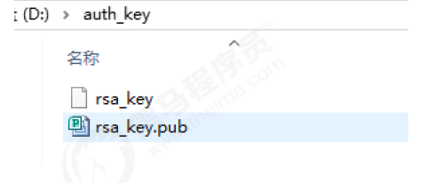

## 认证服务

创建认证服务工程并导入jar包

```xml
<?xml version="1.0" encoding="UTF-8"?>
<project xmlns="http://maven.apache.org/POM/4.0.0"
         xmlns:xsi="http://www.w3.org/2001/XMLSchema-instance"
         xsi:schemaLocation="http://maven.apache.org/POM/4.0.0 http://maven.apache.org/xsd/maven-4.0.0.xsd">
    <parent>
        <artifactId>springboot_security_jwt_rsa_parent</artifactId>
        <groupId>com.itheima</groupId>
        <version>1.0-SNAPSHOT</version>
    </parent>
    <modelVersion>4.0.0</modelVersion>

    <artifactId>heima_auth_server</artifactId>

    <dependencies>
        <dependency>
            <groupId>org.springframework.boot</groupId>
            <artifactId>spring-boot-starter-web</artifactId>
        </dependency>
        <dependency>
            <groupId>org.springframework.boot</groupId>
            <artifactId>spring-boot-starter-security</artifactId>
        </dependency>
        <dependency>
            <groupId>com.itheima</groupId>
            <artifactId>heima_common</artifactId>
            <version>1.0-SNAPSHOT</version>
        </dependency>
        <dependency>
            <groupId>mysql</groupId>
            <artifactId>mysql-connector-java</artifactId>
            <version>5.1.47</version>
        </dependency>
        <dependency>
            <groupId>org.mybatis.spring.boot</groupId>
            <artifactId>mybatis-spring-boot-starter</artifactId>
            <version>2.1.0</version>
        </dependency>
    </dependencies>
</project>
```

### 创建认证服务配置文件

```yaml
server:
  port: 9001
spring:
  datasource:
    driver-class-name: com.mysql.jdbc.Driver
    url: jdbc:mysql:///security_authority
    username: root
    password: root
mybatis:
  type-aliases-package: com.itheima.domain
  configuration:
    map-underscore-to-camel-case: true
logging:
  level:
    com.itheima: debug
rsa:
  key:
    pubKeyFile: D:\auth_key\id_key_rsa.pub
    priKeyFile: D:\auth_key\id_key_rsa
```

### 提供解析公钥和私钥的配置类

```java
@Data
@ConfigurationProperties(prefix = "heima.key")
public class RsaKeyProperties {
    private String pubKeyPath;
    private String priKeyPath;
    private PublicKey publicKey;
    private PrivateKey privateKey;
    @PostConstruct
    public void loadKey() throws Exception {
        publicKey = RsaUtils.getPublicKey(pubKeyPath);
        privateKey = RsaUtils.getPrivateKey(priKeyPath);
    }
}
```

### 创建认证服务启动类

```java
@SpringBootApplication
@MapperScan("com.itheima.mapper")
@EnableConfigurationProperties(RsaKeyProperties.class)
public class AuthApplication {
    public static void main(String[] args) {
    	SpringApplication.run(AuthApplication.class, args);
    }
}
```

### 将上面集中式案例中数据库认证相关代码复制到认证服务中

需要复制的代码如果所示：

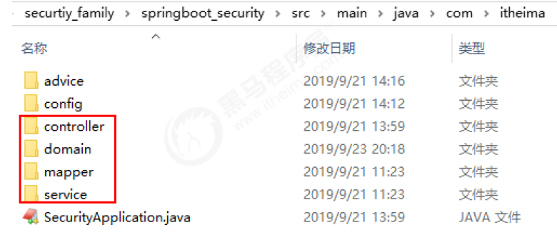

注意这里要去掉mapper中继承的通用mapper接口，处理器类上换成@RestController，这里前后端绝对分离，不能再跳转页面了，要返回数据。

```java
public class JwtLoginFilter extends UsernamePasswordAuthenticationFilter {

    private AuthenticationManager authenticationManager;
    private RsaKeyProperties prop;

    public JwtLoginFilter(AuthenticationManager authenticationManager, RsaKeyProperties prop) {
        this.authenticationManager = authenticationManager;
        this.prop = prop;
    }

    public Authentication attemptAuthentication(HttpServletRequest request, HttpServletResponse response) throws AuthenticationException {
        try {
            SysUser sysUser = new ObjectMapper().readValue(request.getInputStream(), SysUser.class);
            UsernamePasswordAuthenticationToken authRequest = new UsernamePasswordAuthenticationToken(sysUser.getUsername(), sysUser.getPassword());
            return authenticationManager.authenticate(authRequest);
        }catch (Exception e){
            try {
                response.setContentType("application/json;charset=utf-8");
                response.setStatus(HttpServletResponse.SC_UNAUTHORIZED);
                PrintWriter out = response.getWriter();
                Map resultMap = new HashMap();
                resultMap.put("code", HttpServletResponse.SC_UNAUTHORIZED);
                resultMap.put("msg", "用户名或密码错误！");
                out.write(new ObjectMapper().writeValueAsString(resultMap));
                out.flush();
                out.close();
            }catch (Exception outEx){
                outEx.printStackTrace();
            }
            throw new RuntimeException(e);
        }
    }

    public void successfulAuthentication(HttpServletRequest request, HttpServletResponse response, FilterChain chain, Authentication authResult) throws IOException, ServletException {
        SysUser user = new SysUser();
        user.setUsername(authResult.getName());
        user.setRoles((List<SysRole>) authResult.getAuthorities());
        String token = JwtUtils.generateTokenExpireInMinutes(user, prop.getPrivateKey(), 24 * 60);
        response.addHeader("Authorization", "Bearer "+token);
        try {
            response.setContentType("application/json;charset=utf-8");
            response.setStatus(HttpServletResponse.SC_OK);
            PrintWriter out = response.getWriter();
            Map resultMap = new HashMap();
            resultMap.put("code", HttpServletResponse.SC_OK);
            resultMap.put("msg", "认证通过！");
            out.write(new ObjectMapper().writeValueAsString(resultMap));
            out.flush();
            out.close();
        }catch (Exception outEx){
            outEx.printStackTrace();
        }
    }
}
```

### 编写检验token过滤器

```java
public class JwtVerifyFilter extends BasicAuthenticationFilter {

    private RsaKeyProperties prop;

    public JwtVerifyFilter(AuthenticationManager authenticationManager, RsaKeyProperties prop) {
        super(authenticationManager);
        this.prop = prop;
    }

    public void doFilterInternal(HttpServletRequest request, HttpServletResponse response, FilterChain chain) throws IOException, ServletException {
        String header = request.getHeader("Authorization");
        if (header == null || !header.startsWith("Bearer ")) {
            //如果携带错误的token，则给用户提示请登录！
            chain.doFilter(request, response);
            response.setContentType("application/json;charset=utf-8");
            response.setStatus(HttpServletResponse.SC_FORBIDDEN);
            PrintWriter out = response.getWriter();
            Map resultMap = new HashMap();
            resultMap.put("code", HttpServletResponse.SC_FORBIDDEN);
            resultMap.put("msg", "请登录！");
            out.write(new ObjectMapper().writeValueAsString(resultMap));
            out.flush();
            out.close();
        } else {
            //如果携带了正确格式的token要先得到token
            String token = header.replace("Bearer ", "");
            //验证tken是否正确
            Payload<SysUser> payload = JwtUtils.getInfoFromToken(token, prop.getPublicKey(), SysUser.class);
            SysUser user = payload.getUserInfo();
            if(user!=null){
                UsernamePasswordAuthenticationToken authResult = new UsernamePasswordAuthenticationToken(user.getUsername(), null, user.getAuthorities());
                SecurityContextHolder.getContext().setAuthentication(authResult);
                chain.doFilter(request, response);
            }
        }
    }
}
```

### 编写SpringSecurity配置类

```java
@Configuration
@EnableWebSecurity
@EnableGlobalMethodSecurity(securedEnabled=true)
public class WebSecurityConfig extends WebSecurityConfigurerAdapter {

    @Autowired
    private UserService userService;

    @Autowired
    private RsaKeyProperties prop;

    @Bean
    public BCryptPasswordEncoder passwordEncoder(){
        return new BCryptPasswordEncoder();
    }

    //指定认证对象的来源
    public void configure(AuthenticationManagerBuilder auth) throws Exception {
        auth.userDetailsService(userService).passwordEncoder(passwordEncoder());
    }
    //SpringSecurity配置信息
    public void configure(HttpSecurity http) throws Exception {
        http.csrf()
            .disable()
            .authorizeRequests()
            .antMatchers("/product").hasAnyRole("USER")
            .anyRequest()
            .authenticated()
            .and()
            .addFilter(new JwtLoginFilter(super.authenticationManager(), prop))
            .addFilter(new JwtVerifyFilter(super.authenticationManager(), prop))
            .sessionManagement().sessionCreationPolicy(SessionCreationPolicy.STATELESS);
    }
}
```

### 启动测试认证服务

认证请求

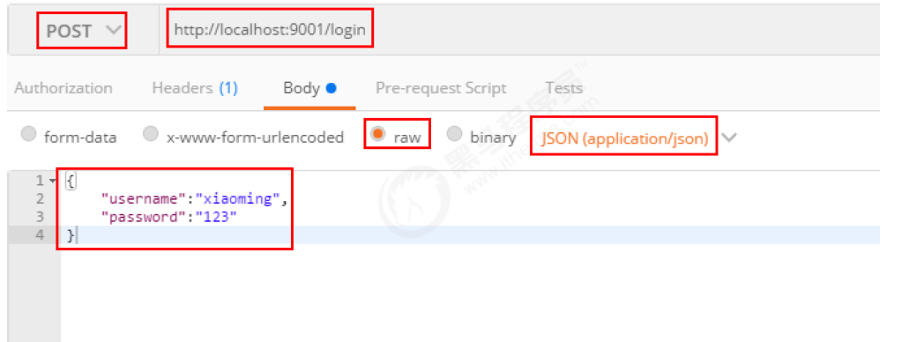

认证通过结果

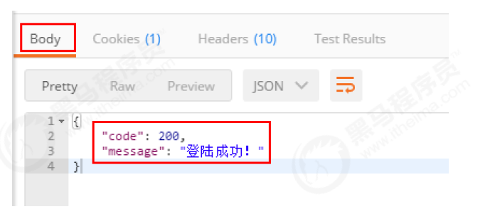

token在Headers中：

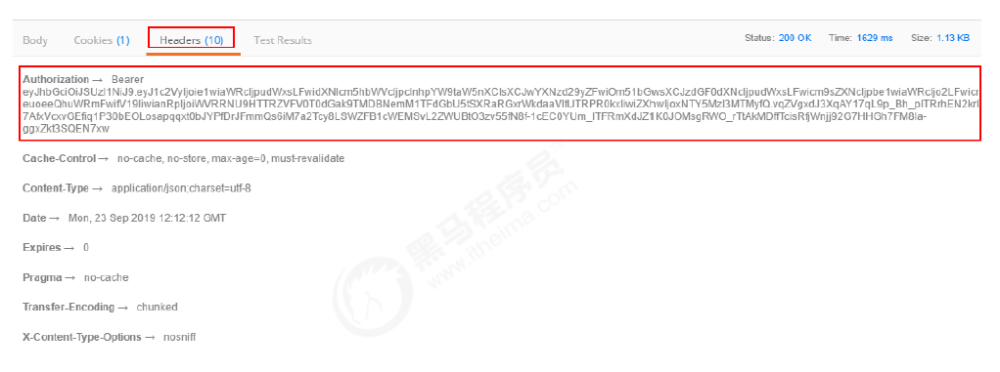

验证认证请求

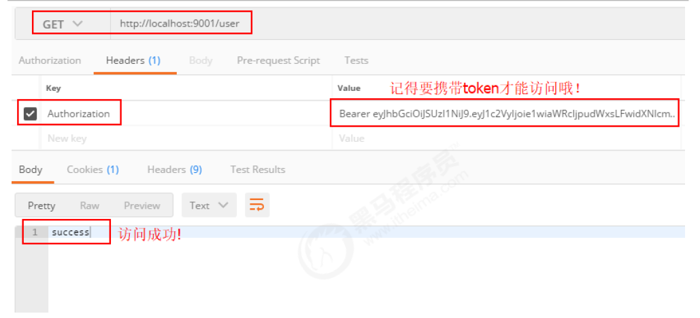

## 资源服务

### 说明

资源服务可以有很多个，这里只拿产品服务为例，记住，资源服务中只能通过公钥验证认证。不能签发token！

### 创建产品服务并导入jar包

根据实际业务导包即可，咱们就暂时和认证服务一样了。

```xml
<?xml version="1.0" encoding="UTF-8"?>
<project xmlns="http://maven.apache.org/POM/4.0.0"
         xmlns:xsi="http://www.w3.org/2001/XMLSchema-instance"
         xsi:schemaLocation="http://maven.apache.org/POM/4.0.0 http://maven.apache.org/xsd/maven-4.0.0.xsd">
    <parent>
        <artifactId>springboot_security_jwt_rsa_parent</artifactId>
        <groupId>com.itheima</groupId>
        <version>1.0-SNAPSHOT</version>
    </parent>
    <modelVersion>4.0.0</modelVersion>

    <artifactId>heima_source_product</artifactId>

    <dependencies>
        <dependency>
            <groupId>org.springframework.boot</groupId>
            <artifactId>spring-boot-starter-web</artifactId>
        </dependency>
        <dependency>
            <groupId>org.springframework.boot</groupId>
            <artifactId>spring-boot-starter-security</artifactId>
        </dependency>
        <dependency>
            <groupId>com.itheima</groupId>
            <artifactId>heima_common</artifactId>
            <version>1.0-SNAPSHOT</version>
        </dependency>
        <dependency>
            <groupId>mysql</groupId>
            <artifactId>mysql-connector-java</artifactId>
            <version>5.1.47</version>
        </dependency>
        <dependency>
            <groupId>org.mybatis.spring.boot</groupId>
            <artifactId>mybatis-spring-boot-starter</artifactId>
            <version>2.1.0</version>
        </dependency>
    </dependencies>
</project>
```

### 编写产品服务配置文件

切记这里只能有公钥地址！

```yaml
server:
  port: 9002
spring:
  datasource:
    driver-class-name: com.mysql.jdbc.Driver
    url: jdbc:mysql:///security_authority
    username: root
    password: root
mybatis:
  type-aliases-package: com.itheima.domain
  configuration:
    map-underscore-to-camel-case: true
logging:
  level:
    com.itheima: debug
rsa:
  key:
    pubKeyFile: D:\auth_key\id_key_rsa.pub
```

### 编写读取公钥的配置类

```java
@ConfigurationProperties("rsa.key")
public class RsaKeyProperties {

    private String pubKeyFile;

    private PublicKey publicKey;

    @PostConstruct
    public void createRsaKey() throws Exception {
        publicKey = RsaUtils.getPublicKey(pubKeyFile);
    }

    public String getPubKeyFile() {
        return pubKeyFile;
    }

    public void setPubKeyFile(String pubKeyFile) {
        this.pubKeyFile = pubKeyFile;
    }

    public PublicKey getPublicKey() {
        return publicKey;
    }

    public void setPublicKey(PublicKey publicKey) {
        this.publicKey = publicKey;
    }
}
```

### 编写启动类

```java
@SpringBootApplication
@MapperScan("com.itheima.mapper")
@EnableConfigurationProperties(RsaKeyProperties.class)
public class AuthSourceApplication {
    public static void main(String[] args) {
        SpringApplication.run(AuthSourceApplication.class, args);
    }
}
```

### 复制认证服务中，用户对象，角色对象和校验认证的接口

这时目录结构如图：

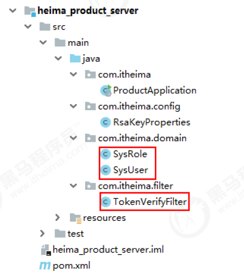

复制认证服务中SpringSecurity配置类做修改，去掉“增加自定义认证过滤器”即可！

```java
@Configuration
@EnableWebSecurity
@EnableGlobalMethodSecurity(securedEnabled=true)
public class WebSecurityConfig extends WebSecurityConfigurerAdapter {

    @Autowired
    private RsaKeyProperties prop;

    //SpringSecurity配置信息
    public void configure(HttpSecurity http) throws Exception {
        http.csrf()
            .disable()
            .authorizeRequests()
            .antMatchers("/product").hasAnyRole("USER")
            .anyRequest()
            .authenticated()
            .and()
            .addFilter(new JwtVerifyFilter(super.authenticationManager(), prop))
            .sessionManagement().sessionCreationPolicy(SessionCreationPolicy.STATELESS);
    }
}
```

### 编写产品处理器

```java
@RestController
@RequestMapping("/product")
public class ProductController {
    @GetMapping
    public String findAll(){
    	return "产品测试成功！";
    }
}
```

### 启动产品服务做测试

携带token

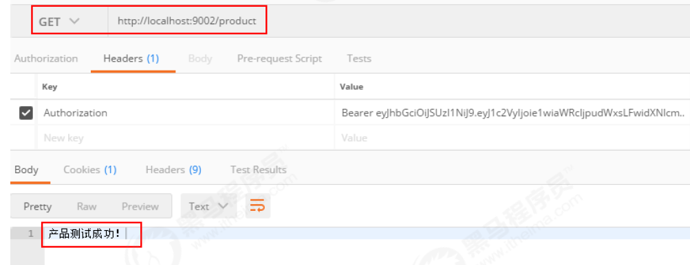

在产品处理器上添加访问需要ADMIN角色

```java
@RestController
@RequestMapping("/product")
public class ProductController {
    @Secured("ROLE_ADMIN")
    @GetMapping
    public String findAll(){
    	return "产品测试成功！";
    }
}
```

重启测试权限不足

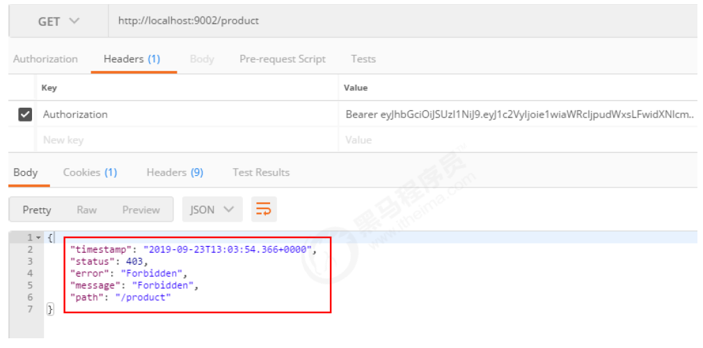

在数据库中手动给用户添加ADMIN角色


重新认证获取新token再测试OK了！

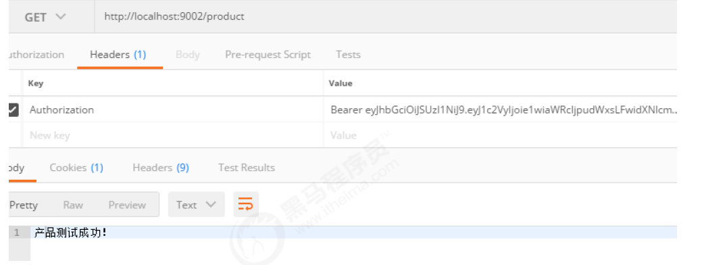