# OAuth2.0介绍

## 参考

来源于黑马程序员： [手把手教你精通新版SpringSecurity](https://www.bilibili.com/video/BV1EE411u7YV?p=52)

## 概念说明

先说OAuth，OAuth是Open Authorization的简写。OAuth协议为用户资源的授权提供了一个安全的、开放而又简易的标准。与以往的授权方式不同之处是OAuth的授权不会使第三方触及到用户的帐号信息（如用户名与密码），即第三方无需使用用户的用户名与密码就可以申请获得该用户资源的授权，因此OAuth是安全的。

OAuth2.0是OAuth协议的延续版本，但不向前兼容(即完全废止了OAuth1.0)。

## 使用场景

假设，A网站是一个打印照片的网站，B网站是一个存储照片的网站，二者原本毫无关联。
如果一个用户想使用A网站打印自己存储在B网站的照片，那么A网站就需要使用B网站的照片资源才行。
按照传统的思考模式，我们需要A网站具有登录B网站的用户名和密码才行，但是，现在有了OAuth2，只需要A网
站获取到使用B网站照片资源的一个通行令牌即可！这个令牌无需具备操作B网站所有资源的权限，也无需永久有
效，只要满足A网站打印照片需求即可。
这么听来，是不是有点像单点登录？NONONO！千万不要混淆概念！单点登录是用户一次登录，自己可以操作其
他关联的服务资源。OAuth2则是用户给一个系统授权，可以直接操作其他系统资源的一种方式。
但SpringSecurity的OAuth2也是可以实现单点登录的！

总结一句：SpringSecurity的OAuth2可以做服务之间资源共享，也可以实现单点登录！

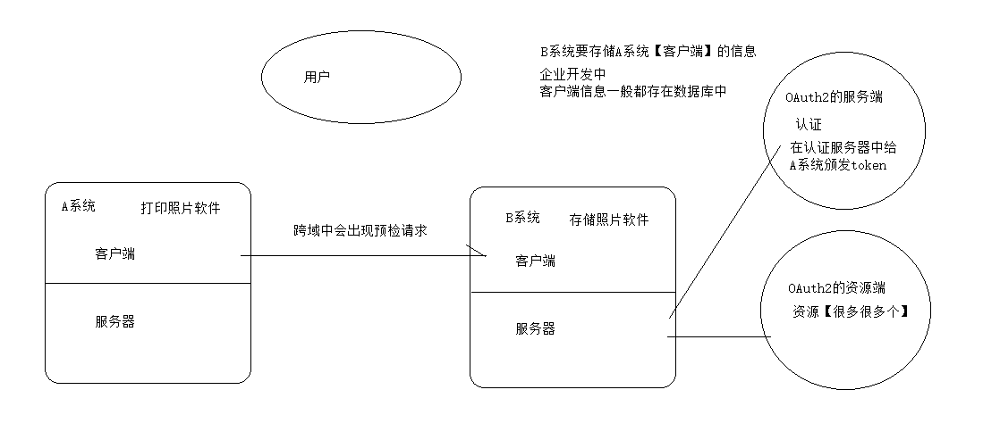

## OAuth2.0中四种授权方式

为了说明四种模式先准备一张图

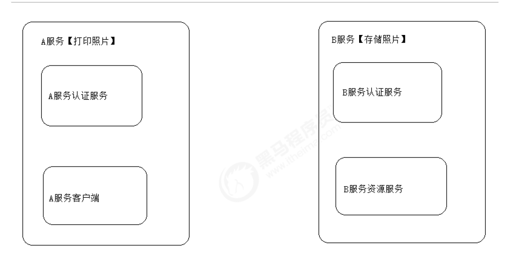

### 授权码模式（authorization code）

#### 流程

说明：【A服务客户端】需要用到【B服务资源服务】中的资源

- 第一步：【A服务客户端】将用户自动导航到【B服务认证服务】，这一步用户需要提供一个回调地址，以备
  【B服务认证服务】返回授权码使用。
- 第二步：用户点击授权按钮表示让【A服务客户端】使用【B服务资源服务】，这一步需要用户登录B服务，也
  就是说用户要事先具有B服务的使用权限。
- 第三步：【B服务认证服务】生成授权码，授权码将通过第一步提供的回调地址，返回给【A服务客户端】。
  注意这个授权码并非通行【B服务资源服务】的通行凭证。
- 第四步：【A服务认证服务】携带上一步得到的授权码向【B服务认证服务】发送请求，获取通行凭证token。
- 第五步：【B服务认证服务】给【A服务认证服务】返回令牌token和更新令牌refresh token。

#### 使用场景

授权码模式是OAuth2中最安全最完善的一种模式，应用场景最广泛，可以实现服务之间的调用，常见的微
信，QQ等第三方登录也可采用这种方式实现。

### 简化模式（implicit）

#### 流程

说明：简化模式中没有【A服务认证服务】这一部分，全部有【A服务客户端】与B服务交互，整个过程不再有
授权码，token直接暴露在浏览器。

- 第一步：【A服务客户端】将用户自动导航到【B服务认证服务】，这一步用户需要提供一个回调地址，以备
  【B服务认证服务】返回token使用，还会携带一个【A服务客户端】的状态标识state。
- 第二步：用户点击授权按钮表示让【A服务客户端】使用【B服务资源服务】，这一步需要用户登录B服务，也
  就是说用户要事先具有B服务的使用权限。
- 第三步：【B服务认证服务】生成通行令牌token，token将通过第一步提供的回调地址，返回给【A服务客户
  端】。

#### 使用场景

适用于A服务没有服务器的情况。比如：纯手机小程序，JavaScript语言实现的网页插件等

### 密码模式（resource owner password credentials）

#### 流程

- 第一步：直接告诉【A服务客户端】自己的【B服务认证服务】的用户名和密码
- 第二步：【A服务客户端】携带【B服务认证服务】的用户名和密码向【B服务认证服务】发起请求获取
  token。
- 第三步：【B服务认证服务】给【A服务客户端】颁发token。

#### 使用场景

此种模式虽然简单，但是用户将B服务的用户名和密码暴露给了A服务，需要两个服务信任度非常高才能使
用

### 客户端模式（client credentials）

#### 流程

说明：这种模式其实已经不太属于OAuth2的范畴了。A服务完全脱离用户，以自己的身份去向B服务索取
token。换言之，用户无需具备B服务的使用权也可以。完全是A服务与B服务内部的交互，与用户无关了。

- 第一步：A服务向B服务索取token。
- 第二步：B服务返回token给A服务。

#### 使用场景

A服务本身需要B服务资源，与用户无关。

## OAuth2.0中表结构说明

### 说明

如果只是写个测试案例，完全可以不用连接数据库，直接将用户等信息写在项目中就行。但是，我们应该把眼光放在企业开发中。试想，我们自己做的一个软件，想使用微信第三方登录。难道你还指望微信去修改他们的代码，让我们去访问？想都别想！那么微信会怎么做呢？微信会提供好一个接入的入口，让我们自己去申请访问权限。这些数据自然而然需要保存在数据库中！

所以，我们将直接讲解数据库版实现方式！

### 建表语句

官方SQL地址：
https://github.com/spring-projects/spring-security-oauth/blob/master/spring-security-oauth2/src/test/resources/schema.sql

### oauth_client_details【核心表】

| 字段名                  | 字段说明                                                     |
| ----------------------- | ------------------------------------------------------------ |
| client_id               | 主键,必须唯一,不能为空. 用于唯一标识每一个客户端(client); 在注册时必须填写(也可由服务端自动生成). 对于不同的grant_type,该字段都是必须的. 在实际应用中的另一个名称叫appKey,与client_id是同一个概念 |
| resource_ids            | 资源的编号，相当于要访问的资源服务器编号                     |
| client_secret           | 用于指定客户端(client)的访问密匙; 在注册时必须填写(也可由服务端自动生成). 对于不同的grant_type,该字段都是必须的. 在实际应用中的另一个名称叫appSecret,与client_secret是同一个概念. |
| scope                   | 指定客户端申请的权限范围,可选值包括read,write,trust;若有多个权限范围用逗号(,)分隔,如:“read,write”. scope的值与security.xml中配置的‹intercept-url的access属性有关系.如‹intercept-url的配置为‹intercept-url pattern="/m/**"access=“ROLE_MOBILE,SCOPE_READ”/>则说明访问该URL时的客户端必须有read权限范围. write的配置值为SCOPE_WRITE, trust的配置值为SCOPE_TRUST. 在实际应该中, 该值一般由服务端指定, 常用的值为read,write. |
| authorized_grant_types  | 指定客户端支持的grant_type,可选值包括<authorization_code,password,refresh_token,implicit,client_credentials, 若支持多个grant_type用逗号(,)分隔,如: “authorization_code,password”. 在实际应用中,当注册时,该字段是一般由服务器端指定的,而不是由申请者去选择的,最常用的grant_type组合有:“authorization_code,refresh_token”(针对通过浏览器访问的客户端);“password,refresh_token”(针对移动设备的客户端). implicit与client_credentials在实际中很少使用. |
| web_server_redirect_uri | 客户端的重定向URI,可为空, 当grant_type为authorization_code或implicit时, 在Oauth的流程中会使用并检查与注册时填写的redirect_uri是否一致. 下面分别说明:当grant_type=authorization_code时, 第一步 从 spring-oauth-server获取 'code’时客户端发起请求时必须有redirect_uri参数, 该参数的值必须与 web_server_redirect_uri的值一致. 第二步 用 ‘code’ 换取 ‘access_token’ 时客户也必须传递相同的redirect_uri. 在实际应用中,web_server_redirect_uri在注册时是必须填写的, 一般用来处理服务器返回的code, 验证state是否合法与通过code去换取access_token值.在spring-oauth-client项目中, 可具体参考AuthorizationCodeController.java中的authorizationCodeCallback方法.当grant_type=implicit时通过redirect_uri的hash值来传递access_token值.如: |
| authorities             | 指定客户端所拥有的Spring Security的权限值,可选, 若有多个权限值,用逗号(,)分隔, 如: "ROLE_ |
| access_token_validity   | 设定客户端的access_token的有效时间值(单位:秒),可选, 若不设定值则使用默认的有效时间值(60 * 60 * 12, 12小时). 在服务端获取的access_token JSON数据中的expires_in字段的值即为当前access_token的有效时间值. 在项目中, 可具体参考DefaultTokenServices.java中属性accessTokenValiditySeconds. 在实际应用中, 该值一般是由服务端处理的, 不需要客户端自定义.refresh_token_validity 设定客户端的refresh_token的有效时间值(单位:秒),可选,若不设定值则使用默认的有效时间值(60 * 60 * 24 * 30, 30天). 若客户端的grant_type不包括refresh_token,则不用关心该字段 在项目中, 可具体参考DefaultTokenServices.java中属性refreshTokenValiditySeconds. 在实际应用中, 该值一般是由服务端处理的, 不需要客户端自定义. |
| additional_information  | 这是一个预留的字段,在Oauth的流程中没有实际的使用,可选,但若设置值,必须是JSON格式的数据,如:{“country”:“CN”,“country_code”:“086”}按照spring-security-oauth项目中对该字段的描述 Additional information for this client, not need by the vanilla OAuth protocolbut might be useful, for example,for storing descriptive information. (详见ClientDetails.java的getAdditionalInformation()方法的注释)在实际应用中, 可以用该字段来存储关于客户端的一些其他信息,如客户端的国家,地区,注册时的IP地址等等.create_time数据的创建时间,精确到秒,由数据库在插入数据时取当前系统时间自动生成(扩展字段) |
| archived                | 用于标识客户端是否已存档(即实现逻辑删除),默认值为’0’(即未存档). 对该字段的具体使用请参考CustomJdbcClientDetailsService.java,在该类中,扩展了在查询client_details的SQL加上archived = 0条件 (扩展字段) |
| trusted                 | 设置客户端是否为受信任的,默认为’0’(即不受信任的,1为受信任的). 该字段只适用于grant_type="authorization_code"的情况,当用户登录成功后,若该值为0,则会跳转到让用户Approve的页面让用户同意授权, 若该字段为1,则在登录后不需要再让用户Approve同意授权(因为是受信任的). 对该字段的具体使用请参考OauthUserApprovalHandler.java. (扩展字段) |
| autoapprove             | 设置用户是否自动Approval操作, 默认值为 ‘false’, 可选值包括 ‘true’,‘false’, ‘read’,‘write’. 该字段只适用于grant_type="authorization_code"的情况,当用户登录成功后,若该值为’true’或支持的scope值,则会跳过用户Approve的页面, 直接授权. 该字段与 trusted 有类似的功能, 是spring-security-oauth2 的 2.0 版本后添加的新属性. 在项目中,主要操作oauth_client_details表的类是JdbcClientDetailsService.java, 更多的细节请参考该类. 也可以根据实际的需要,去扩展或修改该类的实现. |

### oauth_client_token

该表用于在客户端系统中存储从服务端获取的token数据, 在spring-oauth-server项目中未使用到.。对
oauth_client_token表的主要操作在JdbcClientTokenServices.java类中, 更多的细节请参考该类.

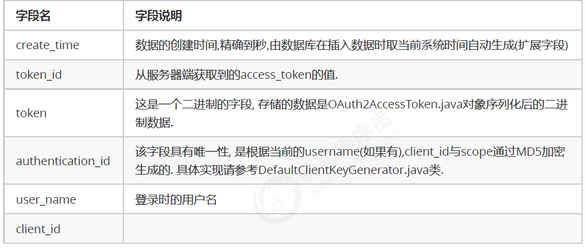

### oauth_access_token

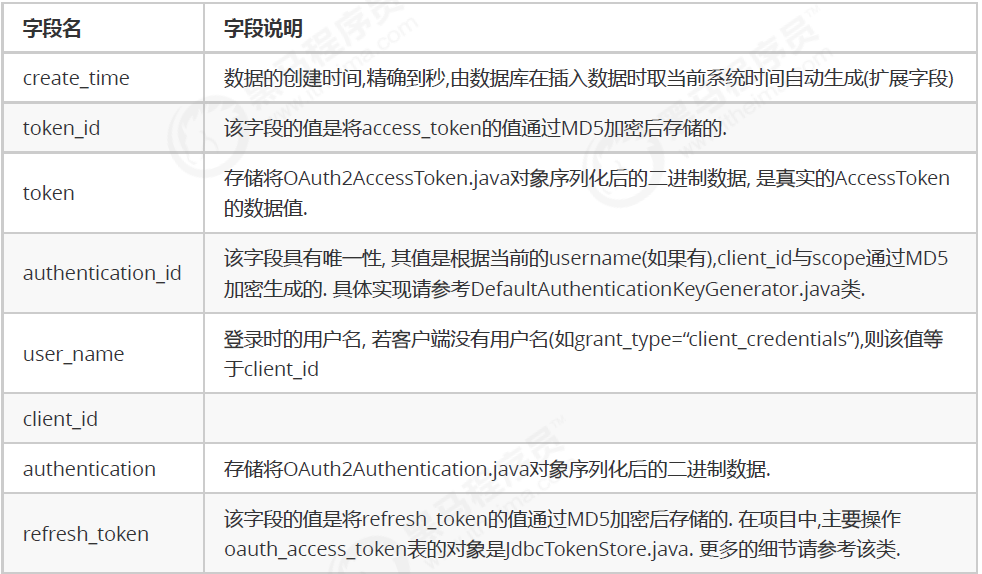

### oauth_refresh_token

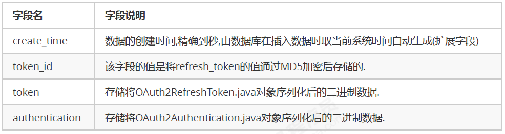

在项目中,主要操作oauth_refresh_token表的对象是JdbcTokenStore.java. (与操作oauth_access_token表的对象
一样);更多的细节请参考该类. 如果客户端的grant_type不支持refresh_token,则不会使用该表.

### oauth_code

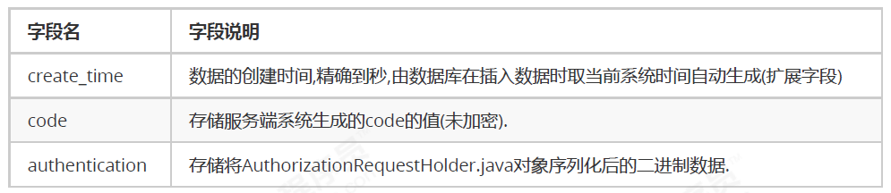

在项目中,主要操作oauth_code表的对象是JdbcAuthorizationCodeServices.java. 更多的细节请参考该类。 只有当grant_type为"authorization_code"时,该表中才会有数据产生; 其他的grant_type没有使用该表。

## OAuth2.0实战案例

### 创建父工程并导入jar包

```xml
<?xml version="1.0" encoding="UTF-8"?>
<project xmlns="http://maven.apache.org/POM/4.0.0"
         xmlns:xsi="http://www.w3.org/2001/XMLSchema-instance"
         xsi:schemaLocation="http://maven.apache.org/POM/4.0.0 http://maven.apache.org/xsd/maven-4.0.0.xsd">
    <modelVersion>4.0.0</modelVersion>

    <groupId>com.itheima</groupId>
    <artifactId>springboot_security_oauth</artifactId>
    <packaging>pom</packaging>
    <version>1.0-SNAPSHOT</version>
    <modules>
        <module>heima_oauth_source</module>
        <module>heima_oauth_server</module>
    </modules>

    <parent>
        <groupId>org.springframework.boot</groupId>
        <artifactId>spring-boot-starter-parent</artifactId>
        <version>2.1.3.RELEASE</version>
        <relativePath/>
    </parent>

    <properties>
        <spring-cloud.version>Greenwich.RELEASE</spring-cloud.version>
    </properties>

    <dependencyManagement>
        <dependencies>
            <dependency>
                <groupId>org.springframework.cloud</groupId>
                <artifactId>spring-cloud-dependencies</artifactId>
                <version>${spring-cloud.version}</version>
                <type>pom</type>
                <scope>import</scope>
            </dependency>
        </dependencies>
    </dependencyManagement>

    <repositories>
        <repository>
            <id>spring-snapshots</id>
            <name>Spring Snapshots</name>
            <url>https://repo.spring.io/snapshot</url>
            <snapshots>
                <enabled>true</enabled>
            </snapshots>
        </repository>
        <repository>
            <id>spring-milestones</id>
            <name>Spring Milestones</name>
            <url>https://repo.spring.io/milestone</url>
            <snapshots>
                <enabled>false</enabled>
            </snapshots>
        </repository>
    </repositories>
</project>
```

### 创建资源模块

#### 我们需要引入oauth2.0包

```xml
<dependency>
    <groupId>org.springframework.cloud</groupId>
    <artifactId>spring-cloud-starter-oauth2</artifactId>
    <version>2.1.0.RELEASE</version>
</dependency>
```

完整如下

```xml
<?xml version="1.0" encoding="UTF-8"?>
<project xmlns="http://maven.apache.org/POM/4.0.0"
         xmlns:xsi="http://www.w3.org/2001/XMLSchema-instance"
         xsi:schemaLocation="http://maven.apache.org/POM/4.0.0 http://maven.apache.org/xsd/maven-4.0.0.xsd">
    <parent>
        <artifactId>springboot_security_oauth</artifactId>
        <groupId>com.itheima</groupId>
        <version>1.0-SNAPSHOT</version>
    </parent>
    <modelVersion>4.0.0</modelVersion>
    <artifactId>heima_oauth_source</artifactId>
    <dependencies>
        <dependency>
            <groupId>org.springframework.boot</groupId>
            <artifactId>spring-boot-starter-web</artifactId>
        </dependency>
        <dependency>
            <groupId>org.springframework.boot</groupId>
            <artifactId>spring-boot-starter-security</artifactId>
        </dependency>
        <dependency>
            <groupId>org.springframework.cloud</groupId>
            <artifactId>spring-cloud-starter-oauth2</artifactId>
            <version>2.1.0.RELEASE</version>
        </dependency>
        <dependency>
            <groupId>mysql</groupId>
            <artifactId>mysql-connector-java</artifactId>
            <version>5.1.47</version>
        </dependency>
        <dependency>
            <groupId>org.mybatis.spring.boot</groupId>
            <artifactId>mybatis-spring-boot-starter</artifactId>
            <version>2.1.0</version>
        </dependency>
    </dependencies>
</project>
```

#### 然后创建配置文件

```yaml
server:
  port: 9002
spring:
  datasource:
    driver-class-name: com.mysql.jdbc.Driver
    url: jdbc:mysql:///security_authority
    username: root
    password: root
  main:
    allow-bean-definition-overriding: true #允许我们自己覆盖spring放入到IOC容器的对象
mybatis:
  type-aliases-package: com.itheima.domain
  configuration:
    map-underscore-to-camel-case: true
logging:
  level:
    com.itheima: debug
```

#### 提供启动类

```java
@SpringBootApplication
@MapperScan("com.itheima.mapper")
public class OauthSourceApplication {
    public static void main(String[] args) {
        SpringApplication.run(OauthSourceApplication.class, args);
    }
}
```

#### 提供处理器

这里不再连数据库了

```java
@RestController
@RequestMapping("/product")
public class ProductController {

    @GetMapping("/findAll")
    public String findAll(){
        return "产品列表查询成功！";
    }
}
```

#### 启动项目测试

由于此刻，项目中添加的有SpringBoot的Security包，默认不通过认证是无法访问处理器的，这个结果咱们在第三
天都已经知道了！那么如何解决呢？第三天我们是采用单点登录的方式解决了这个问题，那么今天我们把这个资源交给OAuth2来管理，使用通行的token来访问资源!

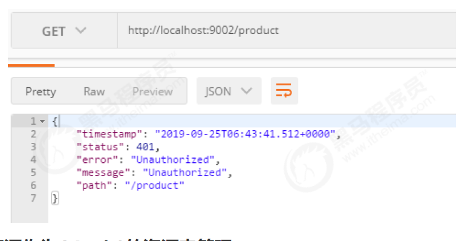

#### 将访问资源作为OAuth2的资源来管理

复制昨天项目中用户和角色对象，即便是用OAuth2管理资源，也一样需要认证，这两个对象还是需要的。

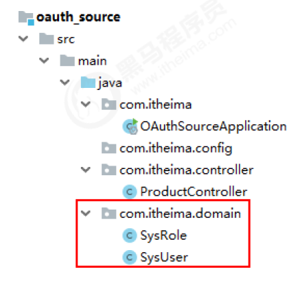

#### SysRole.java

```java
public class SysRole implements GrantedAuthority {

    private Integer id;
    private String roleName;
    private String roleDesc;
}
```

#### SysUser.java

```java
public class SysUser implements UserDetails {

    private Integer id;
    private String username;
    private String password;
    private Integer status;
    private List<SysRole> roles;
}
```

#### 编写资源管理配置类

```java
@Configuration
@EnableResourceServer
public class OauthSourceConfig extends ResourceServerConfigurerAdapter {

    // 只要配置了数据库的配置，就会将DataSource放入到IOC容器中
    @Autowired
    private DataSource dataSource;

    /**
     * 指定token的持久化策略
     * InMemoryTokenStore表示将token存储在内存
     * Redis表示将token存储在redis中
     * JdbcTokenStore存储在数据库中
     * @return
     */
    @Bean
    public TokenStore jdbcTokenStore(){
        return new JdbcTokenStore(dataSource);
    }

    /**
     * 指定当前资源的id和存储方案
     * @param resources
     * @throws Exception
     */
    @Override
    public void configure(ResourceServerSecurityConfigurer resources) throws Exception {
        // 也就是当前资源服务的id
        resources.resourceId("product_api").tokenStore(jdbcTokenStore());
    }

    @Override
    public void configure(HttpSecurity http) throws Exception{
        http.authorizeRequests()
                //指定不同请求方式访问资源所需要的权限，一般查询是read，其余是write。
                .antMatchers(HttpMethod.GET, "/**").access("#oauth2.hasScope('read')")
                .antMatchers(HttpMethod.POST, "/**").access("#oauth2.hasScope('write')")
                .antMatchers(HttpMethod.PATCH, "/**").access("#oauth2.hasScope('write')")
                .antMatchers(HttpMethod.PUT, "/**").access("#oauth2.hasScope('write')")
                .antMatchers(HttpMethod.DELETE, "/**").access("#oauth2.hasScope('write')")
                .and()
                .headers().addHeaderWriter((request, response) -> {
            //允许跨域
            response.addHeader("Access-Control-Allow-Origin", "*");
            //如果是跨域的预检请求，则原封不动向下传达请求头信息
            if (request.getMethod().equals("OPTIONS")) {
                response.setHeader("Access-Control-Allow-Methods", request.getHeader("Access-Control-Request-Method"));
                response.setHeader("Access-Control-Allow-Headers", request.getHeader("Access-Control-Request-Headers"));
            }
        });
    }
}
```

### 创建授权模块

#### 创建工程导入jar包

```xml
<?xml version="1.0" encoding="UTF-8"?>
<project xmlns="http://maven.apache.org/POM/4.0.0"
         xmlns:xsi="http://www.w3.org/2001/XMLSchema-instance"
         xsi:schemaLocation="http://maven.apache.org/POM/4.0.0 http://maven.apache.org/xsd/maven-4.0.0.xsd">
    <parent>
        <artifactId>springboot_security_oauth</artifactId>
        <groupId>com.itheima</groupId>
        <version>1.0-SNAPSHOT</version>
    </parent>
    <modelVersion>4.0.0</modelVersion>

    <artifactId>heima_oauth_server</artifactId>

    <dependencies>
        <dependency>
            <groupId>org.springframework.boot</groupId>
            <artifactId>spring-boot-starter-web</artifactId>
        </dependency>
        <dependency>
            <groupId>org.springframework.boot</groupId>
            <artifactId>spring-boot-starter-security</artifactId>
        </dependency>
        <dependency>
            <groupId>org.springframework.cloud</groupId>
            <artifactId>spring-cloud-starter-oauth2</artifactId>
            <version>2.1.0.RELEASE</version>
        </dependency>
        <dependency>
            <groupId>mysql</groupId>
            <artifactId>mysql-connector-java</artifactId>
            <version>5.1.47</version>
        </dependency>
        <dependency>
            <groupId>org.mybatis.spring.boot</groupId>
            <artifactId>mybatis-spring-boot-starter</artifactId>
            <version>2.1.0</version>
        </dependency>
    </dependencies>
</project>
```

#### 编写配置文件

```yaml
server:
  port: 9001
spring:
  datasource:
    driver-class-name: com.mysql.jdbc.Driver
    url: jdbc:mysql:///security_authority
    username: root
    password: root
  main:
    allow-bean-definition-overriding: true
mybatis:
  type-aliases-package: com.itheima.domain
  configuration:
    map-underscore-to-camel-case: true
logging:
  level:
    com.itheima: debug
```

#### 提供启动类

```java
@SpringBootApplication
@MapperScan("com.itheima.mapper")
public class OauthServerApplication {
    public static void main(String[] args) {
        SpringApplication.run(OauthServerApplication.class, args);
    }
}
```

#### 将之前所有认证的代码复制进来

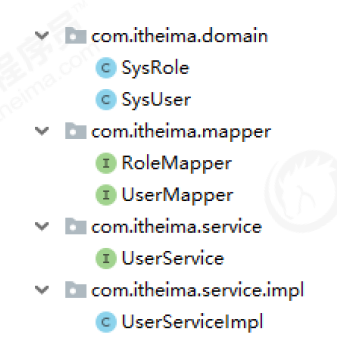

#### 提供SpringSecurity配置类

```java
@Configuration
@EnableWebSecurity
public class WebSecurityConfig extends WebSecurityConfigurerAdapter {

    @Autowired
    private UserService userService;

    @Bean
    public BCryptPasswordEncoder passwordEncoder(){
        return new BCryptPasswordEncoder();
    }

    @Override
    public void configure(AuthenticationManagerBuilder auth) throws Exception {
        auth.userDetailsService(userService).passwordEncoder(passwordEncoder());
    }

    @Override
    protected void configure(HttpSecurity http) throws Exception {
        http.authorizeRequests()
                .anyRequest().authenticated()
                .and()
                .formLogin()
                .loginProcessingUrl("/login")
            	// 允许匿名访问
                .permitAll()
                .and()
                .csrf()
                .disable();
    }

    //AuthenticationManager对象在OAuth2认证服务中要使用，提前放入IOC容器中【授权码模式使用】
    @Override
    @Bean
    public AuthenticationManager authenticationManagerBean() throws Exception {
        return super.authenticationManagerBean();
    }
}
```

#### 提供OAuth2授权配置类

```java
@Configuration
@EnableAuthorizationServer
public class OauthServerConfig extends AuthorizationServerConfigurerAdapter {

    //数据库连接池对象
    @Autowired
    private DataSource dataSource;

    //认证业务对象
    @Autowired
    private UserService userService;

    //授权模式专用对象
    @Autowired
    private AuthenticationManager authenticationManager;

    //客户端信息来源
    @Bean
    public JdbcClientDetailsService jdbcClientDetailsService(){
        return new JdbcClientDetailsService(dataSource);
    }

    //token保存策略
    @Bean
    public TokenStore tokenStore(){
        return new JdbcTokenStore(dataSource);
    }

    //授权信息保存策略
    @Bean
    public ApprovalStore approvalStore(){
        return new JdbcApprovalStore(dataSource);
    }

    //授权码模式数据来源
    @Bean
    public AuthorizationCodeServices authorizationCodeServices(){
        return new JdbcAuthorizationCodeServices(dataSource);
    }

    //指定客户端信息的数据库来源
    @Override
    public void configure(ClientDetailsServiceConfigurer clients) throws Exception {
        clients.withClientDetails(jdbcClientDetailsService());
    }

    //检查token的策略
    @Override
    public void configure(AuthorizationServerSecurityConfigurer security) throws Exception {
        security.allowFormAuthenticationForClients();
        security.checkTokenAccess("isAuthenticated()");
    }

    //OAuth2的主配置信息
    @Override
    public void configure(AuthorizationServerEndpointsConfigurer endpoints) throws Exception {
        endpoints
                .approvalStore(approvalStore())
                .authenticationManager(authenticationManager)
                .authorizationCodeServices(authorizationCodeServices())
                .tokenStore(tokenStore());
    }
}
```

### 测试

#### 在数据库中手动添加客户端信息

所有要使用当前项目资源的项目，都是我们的客户端。比如我们之前举的例子，A服务打印照片，B服务存储照
片。A服务要使用B服务的资源，那么A服务就是B服务的客户端。这里要区分用户的信息和客户端信息，用户信息是用户在B服务上注册的用户信息，在sys_user表中。客户端信息是A服务在B服务中注册的账号，在OAuth2的oauth_client_details表中。测试数据sql语句如下：

```sql
INSERT INTO `oauth_client_details` (`client_id`,`resource_ids`,`client_secret`,`scope`,`authorized_grant_types`,`web_server_redirect_uri`,`authorities`,`access_token_validity`,`refresh_token_validity`,`additional_information`,`autoapprove`) VALUES
('heima_one','product_api','$2a$10$CYX9OMv0yO8wR8rE19N2fOaXDJondci5uR68k2eQJm50q8ESsDMlC','read, write','client_credentials,implicit,authorization_code,refresh_token,password','http://www.baidu.com',NULL,NULL,NULL,NULL,'false');
```

这里注意resource_ids不要写错，回调地址web_server_redirect_uri先写成百度。

### 授权码模式测试

在地址栏访问地址 http://localhost:9001/oauth/authorize?response_type=code&client_id=heima_one
跳转到SpringSecurity默认认证页面，提示用户登录个人账户【这里是sys_user表中的数据】

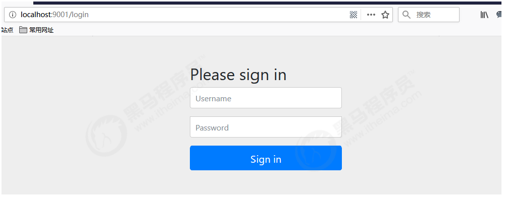

登录成功后询问用户是否给予操作资源的权限，具体给什么权限。Approve是授权，Deny是拒绝。这里我们选择read和write都给予Approve

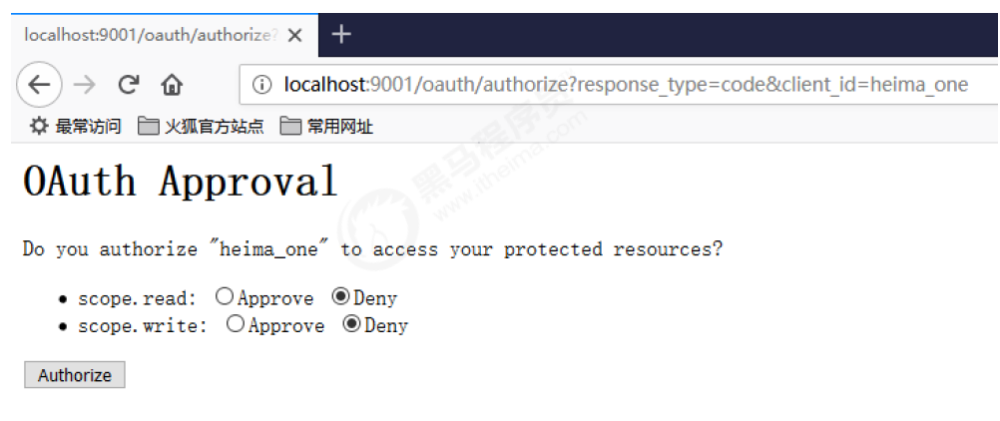

点击Authorize后跳转到回调地址并获取授权码

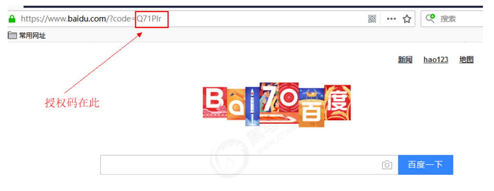

使用授权码到服务器申请通行令牌token

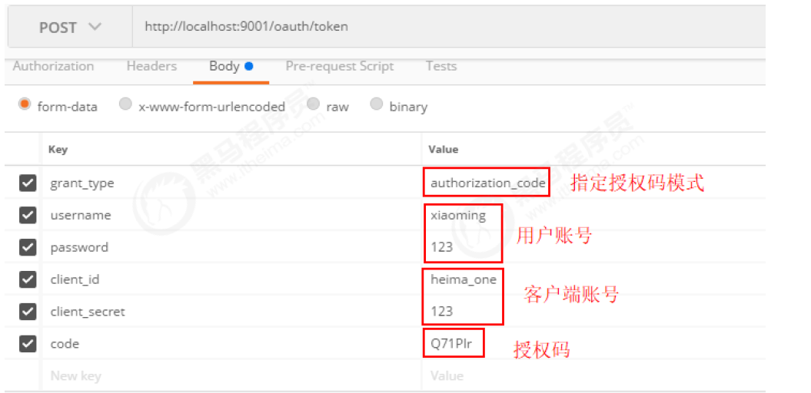

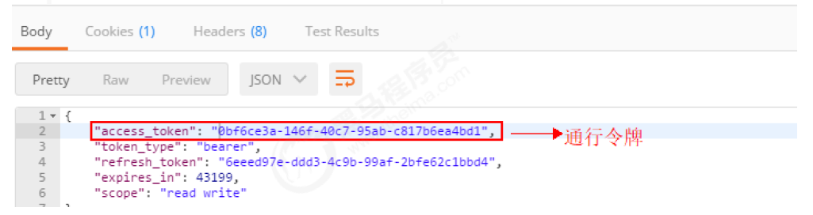

重启资源服务器，然后携带通行令牌再次去访问资源服务器，大功告成！

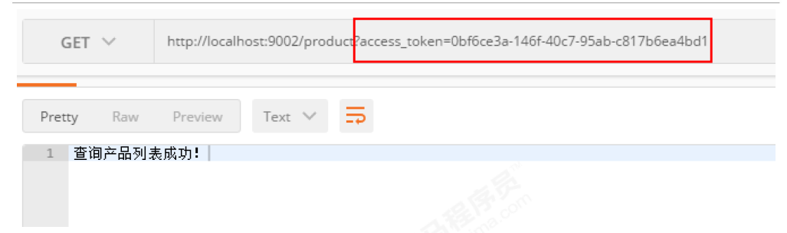

### 简化模式测试

在地址栏访问地址
http://localhost:9001/oauth/authorize?response_type=token&client_id=heima_one
由于上面用户已经登录过了，所以无需再次登录，其实和上面是有登录步骤的，这时，浏览器直接返回了token

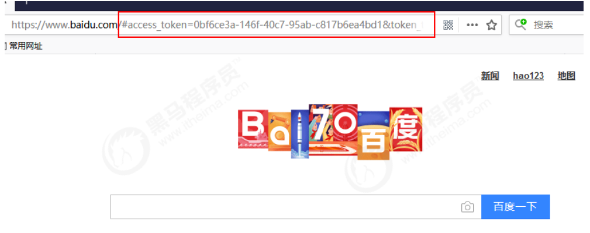

直接访问资源服务器

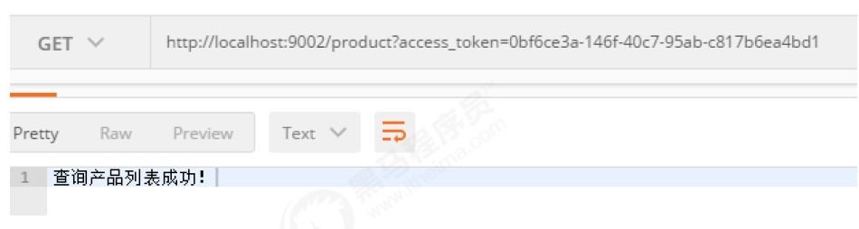

### 密码模式测试

申请token

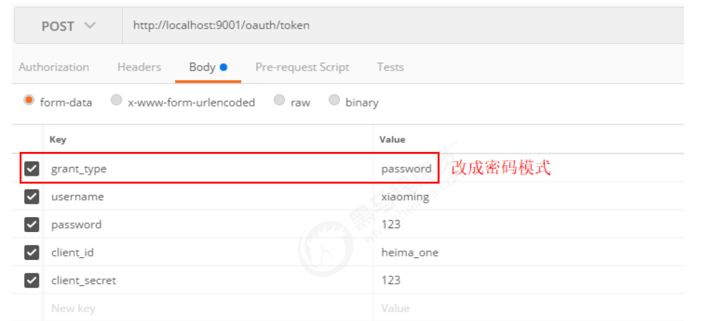

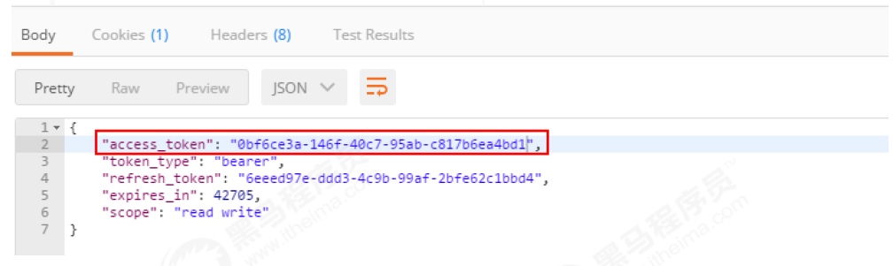

访问资源服务器

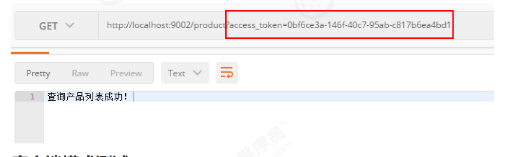

### 客户端模式测试

申请token

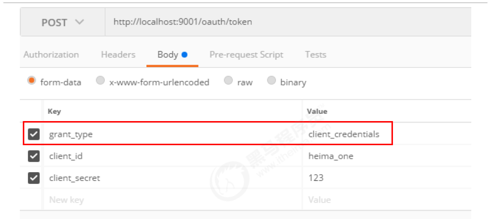

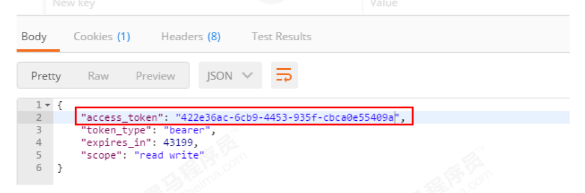

访问资源服务

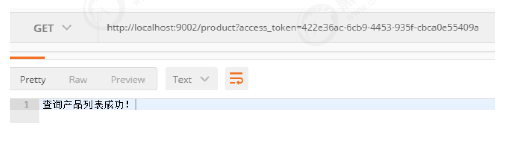

### 刷新Token

前面三种模式中都会返回刷新token，因此我们如果想要刷新token 的时候，就需要携带对应的字段请求即可

