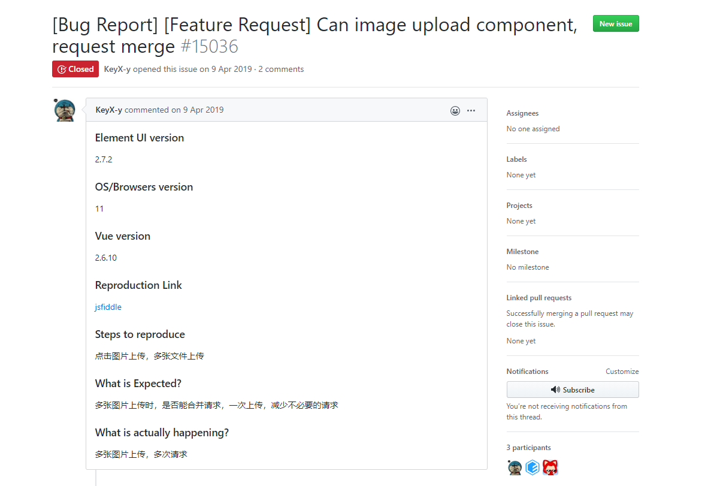
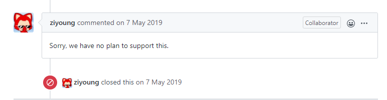
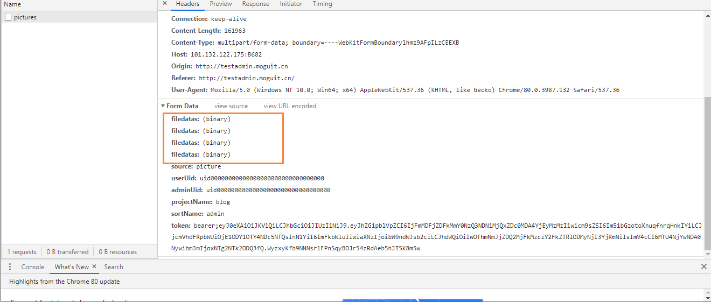
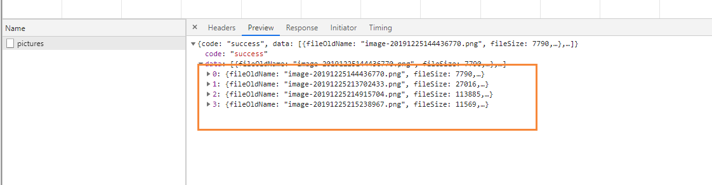

# ElementUI中Upload组件如何批量上传

## 前言

最近一直使用Element提供的文件上传组件，但是使用后发现，其实当我们批量选中的时候，文件不是一次性都上传进去的，而是把它又拆分成一个个的文件进行上传。首先这容易造成的问题就是我们如果同时提交多个图片文件的时候，会重复的请求接口，造成接口并发访问的时可能出现的问题，下面是Element 的Github写的一个Issue

地址：[Element](https://github.com/ElemeFE/element/issues/15036)



上面也是提出了这个问题，就是希望能够合并请求提交，但是得到的官方回复却是：这个合并提交不在计划内，并不打算支持。





## 解决方案

后面通过查看issue发现，有一篇能够解决图片合并上传的需求：[issue](https://github.com/ElemeFE/element/issues/8052)

主要是定义了两个方法，首先就是我们写的upload组件

```
      <el-upload
        class="upload-demo"
        ref="uploadFile"
        name="filedatas"
        :headers="importHeaders"
        :action="uploadAdminHost"
        :auto-upload="false"
        multiple
      >
        <el-button slot="trigger" size="small" type="primary">选取博客文件</el-button>
        <el-button style="margin-left: 10px;" size="small" type="success" @click="submitUpload">提交到服务器</el-button>
      </el-upload>
```

然后我们是上传逻辑，我们首先获取到upload组件上的dom，然后获取文件，上传地址和数据

```
    // 文件上传
    submitUpload() {
      let {uploadFiles, action, data} = this.$refs.uploadFile      
      this.uploadFiles({
        uploadFiles,
        data,
        action,
        success: (response) => {
          console.log(response)
          // 上传成功后，将里面的内容删除
          this.$refs.uploadFile.clearFiles();
          this.$refs.uploadPicture.clearFiles();
        },
        error: (error) => {
          console.log('失败了', error)
        }
      })
    },
```

下面封装了一个 uploadFiles 方法，这里uploadFiles 就可以是多文件，通过封装ajax方式

```
    /**
     * 自定义上传文件
     * @param fileList 文件列表
     * @param data 上传时附带的额外参数
     * @param url 上传的URL地址
     * @param success 成功回调
     * @param error 失败回调
     */
    uploadFiles({uploadFiles, headers, data, action, success, error}) {
      let form = new FormData()
      // 文件对象
      uploadFiles.map(file => form.append("filedatas", file.raw))
      // 附件参数
      for (let key in data) {
        form.append(key, data[key])
      }
      let xhr = new XMLHttpRequest()
      // 异步请求
      xhr.open("post", action, true)
      // 设置请求头
      xhr.setRequestHeader("Authorization", getToken());
      xhr.onreadystatechange = function() {
        if (xhr.readyState == 4){
          if ((xhr.status >= 200 && xhr.status < 300) || xhr.status == 304){
            success && success(xhr.responseText)
          } else {
            error && error(xhr.status)
          }
        }
      }
      xhr.send(form)
    }
```

最后后台接口，同时接受多个文件

```
    @PostMapping("/pictures")
    public Object uploadPics(HttpServletRequest request, List<MultipartFile> filedatas) {
          // 逻辑代码
	}
```

最后我们查看请求，会同时携带多个文件



并且返回多个上传成功的结果

