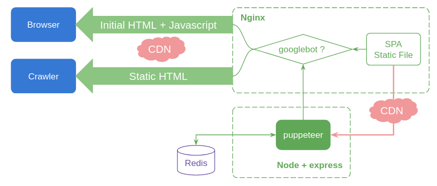

# SPA 的 SEO 方案对比、最终实践

## 前言

前端开发技术日新月异，由于现代化构建、用户体验的需求，angular/vue/react 等框架已经成为开发标配，大部分应用都是 [SPA](https://zh.wikipedia.org/zh-hans/单页应用)，同时也带来了很多新问题：

- [SEO](https://zh.wikipedia.org/wiki/搜尋引擎最佳化) 不友好
- 首屏渲染慢

为了解决这些问题，开源社区有很多方案，本文主要对这些方案进行对比，最后给出我们实际使用的插件式方案。

## 一、客户端渲染（CSR）方案

[](https://content.markdowner.net/pub/p2DkVy-V5a10pn)

React开发的SPA就是一种CSR方案，如图所示，在到达浏览器之前的html页面是没有内容的，要等到浏览器执行相应异步请求获取数据填充后才显示界面。

**优点**

- SPA 的优点（用户体验较好）

**缺点**

- SEO不友好（爬虫如果没有执行js的能力，如百度，获取到的页面是空的，不利于网站推广）
- 首屏加载慢（到达浏览器端后再加载数据，增加用户等待时间）

## 二、服务端渲染 （SSR）方案

[](https://content.markdowner.net/pub/WDEPGk-V389w79)**基本原理：** 在服务端起一个node应用，浏览器到来时，先拦截执行部分 js 异步请求，提前将数据填充到 html 页面中返回浏览器。这样爬虫抓取到的页面就是带数据的，有利于SEO

**需解决问题：**

1. 大部分应用开发时都有状态管理方案（[Vuex](https://vuex.vuejs.org/zh/guide/), [Redux](https://redux.js.org/)），SPA 应用到达浏览器前状态都是空的，使用SSR后意味着需要在服务端提前填充数据到 store
2. 需要拦截相应 hook（vue 的 created、react 的 componentDidMount），等待异步数据请求完成，确认渲染完成

针对这些问题，社区也有相应框架可参考：

| 框架    | 解决方案                          | Github star |
| :------ | :-------------------------------- | :---------- |
| Vue     | [Nuxt.js](https://zh.nuxtjs.org/) | 28.4k       |
| React   | [Nextjs](https://nextjs.org/)     | 50.8k       |
| Angular | -                                 | -           |

不想使用框架，也可以自己修改react、vue 的 render 方法实现（改动工作量更大）

**优点**

- SEO 友好
- 首屏渲染快（可在服务端缓存页面，请求到来直接给 html）

**缺点**

- 代码改动大、需要做特定SSR框架的改动（经过我们实践、原有SPA代码改动非常大）
- 丢失了部分SPA体验
- node 容易成为性能瓶颈

## 三、构建时预渲染方案

| Solution                                                     | Github Star |
| :----------------------------------------------------------- | :---------- |
| [prerender-spa-plugin](https://github.com/chrisvfritz/prerender-spa-plugin) | 6k          |
| [puppeteer](https://github.com/puppeteer/puppeteer)          | 63.2k       |
| [phantomjs](https://github.com/Medium/phantomjs)             | 1.4k        |

**基本原理：** 利用webpack 等构建工具，针对 SPA 应用开发后只有一个 index.html 文件入口问题，用上述预渲染中间件在前端项目构建时预先获取页面数据，生成多个页面，如 about、help 、contact 等页面，优化首屏渲染与部分页面SEO

**优点**

- 代码侵入性小

**缺点**

- 无法用于大量动态路径页面场景（生成的 html 页面数据大，而且页面数据会有更新。如 /article/123，文章页面）
- 后台请求数据变动时前端应该同步更新版本

## 四、服务端动态渲染（利用user-agent）

[](https://content.markdowner.net/pub/4Vmk3n-aon3eGQ)

回归到原始需求，为了提高用户体验我们用了SPA技术、为了SEO 我们用了 SSR、预渲染等技术。不同技术方案有一定差距，不能兼顾优点。但仔细想，需要这些技术优点的“用户”，其实时不一样的，SPA 针对的是浏览器普通用户、SSR 针对的是网页爬虫，如 googlebot、baiduspider 等，那为什么我们不能给不同“用户”不同的页面呢，服务端动态渲染就是这种方案。

**基本原理：** 服务端对请求的 user-agent 进行判断，浏览器端直接给 SPA 页面，如果是爬虫，给经过动态渲染的 html 页面

**PS：** 你可能会问，给了爬虫不同的页面，会不会被认为是网页作弊行为呢？

Google 给了[回复](https://developers.google.com/search/docs/guides/dynamic-rendering)：

> ## Dynamic rendering is not cloaking
>
> Googlebot generally doesn't consider dynamic rendering as [cloaking](https://support.google.com/webmasters/answer/66355). As long as your dynamic rendering produces similar content, Googlebot won't view dynamic rendering as cloaking.
>
> When you're setting up dynamic rendering, your site may produce error pages. Googlebot doesn't consider these error pages as cloaking and [treats the error as any other error page](https://developers.google.com/search/docs/guides/javascript-seo-basics#use-meaningful-http-status-codes).
>
> Using dynamic rendering to serve completely different content to users and crawlers can be considered cloaking. For example, a website that serves a page about cats to users and a page about dogs to crawlers can be considered cloaking.

也就是说，如果我们没有刻意去作弊，而是使用动态渲染方案去解决SEO问题，爬虫经过对比网站内容，没有明显差异，不会认为这是作弊行为。

**优点**

- 兼顾 SPA优点同时解决SEO问题

**缺点**

- 需要服务端应用（但动态渲染只针对爬虫、不会成为性能瓶颈）

**总结：** 经过前期其他方案的实践、优缺点权衡、最终我们选择了方案四的动态渲染作为 SPA 的 SEO 方案。

## 实现细节

[](https://content.markdowner.net/pub/1qa8x4-V1bWyeo)

上图为最终实现。（存在优化点：右边CDN整合、可以考虑使用Node替代nginx部分功能，简化架构）

#### 社区方案：

| 方案                                                         | github star | 描述                                        |
| :----------------------------------------------------------- | :---------- | :------------------------------------------ |
| [puppeteer](https://developers.google.com/web/tools/puppeteer/get-started) | 63.2k       | 可用于动态渲染、前端测试、操作模拟。API丰富 |
| [rendertron](https://github.com/GoogleChrome/rendertron)     | 4.9k        | 动态渲染                                    |
| [prerender.io](https://prerender.io/)                        | 5.6k        | 动态渲染                                    |

选型使用 puppeteer 作为动态渲染方案。

依赖：

```json
{
  "dependencies": {
    "bluebird": "^3.7.2",
    "express": "^4.17.1",
    "puppeteer": "^5.2.0",
    "redis": "^3.0.2",
    "request": "^2.88.2"
  }
}
```

代码参考[Google 官方 Demo](https://developers.google.com/web/tools/puppeteer/articles/ssr)进行改造，下面是基础代码：

**server.js**

```javascript
import express from 'express';
import request from 'request';
import ssr from './ssr.js';

const app = express();

const host = 'https://www.abc.com';

app.get('*', async (req, res) => {
    const {html, ttRenderMs} = await ssr(`${host}${req.originalUrl}`);
    res.set('Server-Timing', `Prerender;dur=${ttRenderMs};desc="Headless render time (ms)"`);
    return res.status(200).send(html); // Serve prerendered page as response.
});

app.listen(8080, () => console.log('Server started. Press Ctrl + C to quit'));
```

**ssr.js**

```javascript
import puppeteer from 'puppeteer';

// In-memory cache of rendered pages.
const RENDER_CACHE = new Map();

async function ssr(url) {
    if (RENDER_CACHE.has(url)) {
        return {html: RENDER_CACHE.get(url), ttRenderMs: 0};
    }
    const start = Date.now();

    const browser = await puppeteer.launch({
        args: ['--no-sandbox', '--disable-setuid-sandbox']
    });
    const page = await browser.newPage();
    try {
        // networkidle0 waits for the network to be idle (no requests for 500ms).
        await page.goto(url, {waitUntil: 'networkidle0'});
        await page.waitForSelector('#root'); // ensure #posts exists in the DOM.
    } catch (err) {
        console.error(err);
        throw new Error('page.goto/waitForSelector timed out.');
    }

    const html = await page.content(); // serialized HTML of page DOM.
    await browser.close();

    const ttRenderMs = Date.now() - start;
    console.info(`Puppeteer rendered page: ${url} in: ${ttRenderMs}ms`);

    RENDER_CACHE.set(url, html); // cache rendered page.

    return {html, ttRenderMs};
}

export {ssr as default};
```

Demo 代码存在以下问题：

- 页面渲染后返回浏览器，有时会再次执行异步请求获取数据（重复请求）
- 使用了 Map 做页面缓存，在node服务崩溃时会丢失全部缓存。没有超时限制，随着时间增长，内存消耗大（缓存机制）
- 样式错乱：虽然内容有渲染进html，但是打开样式是错乱的（如postman 上打开）
- 重复请求 React/Vue 静态文件，ssr 函数会当成一个页面进行渲染（错误渲染）

下面对这些问题逐个击破

### 重复请求

根本原因是React/Vue 代码生命周期函数重复执行。一般我们在created/componentDidMount hook 进行异步数据请求，这个hook在动态渲染的时候执行了一次，在HTML返回浏览器的时候，dom挂载又执行了一次，此问题在[Google Support](https://developers.google.com/web/tools/puppeteer/articles/ssr#rerender)也有提及。可以通过小小改造前端代码，判断页面是否已被动态渲染再执行异步请求。可参考：

```javascript
componentDidMount() {
    const PRE_RENDERED = document.querySelector('#posts');
    if(!PRE_RENDERED) {
        // 异步请求
        // 插入含有 #posts id 的 dom 元素
    }
}
```

### 缓存机制

针对 Map 缓存的问题，我们使用了Redis进行改造，增加超时机制，同时可以避免node崩溃缓存击穿问题

**redis/index.js**

```javascript
import redis from 'redis';
import bluebird from 'bluebird';

bluebird.promisifyAll(redis);

const host = 'www.abc.com';
const port = 6379;
const password = '123456';

const client = redis.createClient({
    host,
    port,
    password,
    retry_strategy: function(options) {
        if (options.error && options.error.code === "ECONNREFUSED") {
            return new Error("The server refused the connection");
        }
        if (options.total_retry_time > 1000 * 60 * 60) {
            return new Error("Retry time exhausted");
        }
        if (options.attempt > 10) {
            return undefined;
        }
        return Math.min(options.attempt * 100, 3000);
    },
});

client.on("error", function(e) {
    console.error('dynamic-render redis error: ', e);
});

export default client;
```

### 样式错乱

出现这个问题的原因是：

```html
<link href="/static/css/7.82e13697.chunk.css" rel="stylesheet">
```

如果爬虫没有 js 执行能力，并不会去请求这类样式文件，所以我们需要将link标签转换为 style 标签。

这部分工作在以前可以不搞，反正主要内容已经给到爬虫了，但是现在爬虫越来越聪明，能够通过样式文件识别网站是否有作弊行为，而且如果不做这块，在百度、谷歌的快照页面看到的是错乱的页面，会降低排名，所以我们要帮爬虫安排好样式文件。

下面代码利用 puppeteer 请求样式文件，用 style 替代 link 标签。 **ssr.js**

```javascript
import puppeteer from 'puppeteer';
import redisClient from './redis/index.js';

async function ssr(url) {
    const REDIS_KEY = `ssr:${url}`;
    const CACHE_TIME = 600; // 10 分钟缓存
    const CACHE_HTML = await redisClient.getAsync(REDIS_KEY);

    if (CACHE_HTML) {
        return { html: CACHE_HTML, ttRenderMs: 0 };
    }
    const start = Date.now();

    const browser = await puppeteer.launch({
        args: ['--no-sandbox', '--disable-setuid-sandbox']
    });

    try {
        const page = await browser.newPage();
        const stylesheetContents = {};

        // 1. Stash the responses of local stylesheets.
        page.on('response', async resp => {
            const responseUrl = resp.url();
            const sameOrigin = new URL(responseUrl).origin === new URL(url).origin;
            const isStylesheet = resp.request().resourceType() === 'stylesheet';
            if (sameOrigin && isStylesheet) {
                stylesheetContents[responseUrl] = await resp.text();
            }
        });

        // 2. Load page as normal, waiting for network requests to be idle.
        // networkidle0 waits for the network to be idle (no requests for 500ms).
        await page.goto(url, {waitUntil: 'networkidle0'});
        await page.waitForSelector('#root'); // ensure #posts exists in the DOM.

        // 3. Inline the CSS.
        // Replace stylesheets in the page with their equivalent <style>.
        await page.$$eval('link[rel="stylesheet"]', (links, content) => {
            links.forEach(link => {
                const cssText = content[link.href];
                if (cssText) {
                    const style = document.createElement('style');
                    style.textContent = cssText;
                    link.replaceWith(style);
                }
            });
        }, stylesheetContents);

        // 4. Get updated serialized HTML of page.
        const html = await page.content(); // serialized HTML of page DOM.
        await browser.close();

        const ttRenderMs = Date.now() - start;
        redisClient.set(REDIS_KEY, html, 'EX', CACHE_TIME); // cache rendered page.
        return {html, ttRenderMs};
    } catch (err) {
        console.error(err);
        throw new Error('render fail');
    }
}

export {ssr as default};
```

这部分代码可以参考 [google 文档](https://developers.google.com/web/tools/puppeteer/articles/ssr#inline)

### 错误渲染

渲染后的页面回到浏览器后，有时执行操作会重新加载样式文件，请求路径类似：/static/1231234sdf.css，这些路径会被当做一个页面路径，而不是静态资源进行渲染，导致渲染错误。解决方式：增加 path 匹配拦截，资源文件直接向原域名请求

```javascript
import express from 'express';
import request from 'request';
import ssr from './ssr.js';

const app = express();

const host = 'https://www.abc.com';

app.get('/static/*', async (req, res) => {
    request(`${host}${req.url}`).pipe(res);
});

app.get('/manifest.json', async (req, res) => {
    request(`${host}${req.url}`).pipe(res);
});

app.get('/favicon.ico', async (req, res) => {
    request(`${host}${req.url}`).pipe(res);
});

app.get('/logo*', async (req, res) => {
    request(`${host}${req.url}`).pipe(res);
});

app.get('*', async (req, res) => {
    const {html, ttRenderMs} = await ssr(`${host}${req.originalUrl}`);
    res.set('Server-Timing', `Prerender;dur=${ttRenderMs};desc="Headless render time (ms)"`);
    return res.status(200).send(html); // Serve prerendered page as response.
});

app.listen(8080, () => console.log('Server started. Press Ctrl + C to quit'));
```

动态渲染相比SSR有几点明显好处：

- 和 SSR 一致的 SEO 效果，通过 puppeteer 还可进一步定制 SEO 方案
- node 应用负载压力小，只需应对爬虫请求，相当于只有爬虫来了页面才做SSR
- 从整体架构上来说相当于一个插件，可随时插拔，无副作用
- 不需要大量修改SPA代码（只在重复请求问题上用一个标志位去识别，当然也可以不管这个问题）

*（重复请求只在爬虫有js执行能力时才出现，一般再次请求数据也没问题）*

## Nginx 配置

这部分配置可以参考：[这里](https://gist.github.com/thoop/8165802)

## 附录

#### 常见爬虫 user-agent

| 主体      | user-agent                          | 用途                                |
| :-------- | :---------------------------------- | :---------------------------------- |
| Google    | googlebot                           | 搜索引擎                            |
| Google    | google-structured-data-testing-tool | 测试工具                            |
| Google    | Mediapartners-Google                | Adsense广告网页被访问后，爬虫就来访 |
| Microsoft | bingbot                             | 搜索引擎                            |
| Linked    | linkedinbot                         | 应用内搜索                          |
| 百度      | baiduspider                         | 搜索引擎                            |
| 奇虎 360  | 360Spider                           | 搜索引擎                            |
| 搜狗      | Sogou Spider                        | 搜索引擎                            |
| Yahoo     | Yahoo! Slurp China                  | 搜索引擎                            |
| Yahoo     | Yahoo! Slurp                        | 搜索引擎                            |
| Twitter   | twitterbot                          | 应用内搜索                          |
| Facebook  | facebookexternalhit                 | 应用内搜索                          |
| -         | rogerbot                            | -                                   |
| -         | embedly                             | -                                   |
| Quora     | quora link preview                  | -                                   |
| -         | showyoubot                          | -                                   |
| -         | outbrain                            | -                                   |
| -         | pinterest                           | -                                   |
| -         | slackbot                            | -                                   |
| -         | vkShare                             | -                                   |
| -         | W3C_Validator                       | -                                   |

#### 模拟爬虫测试

```shell
# 不带 user-agent 返回SPA页面，html 上无数据
curl 你的网站全路径
# 模拟爬虫、返回页面应该带有 title，body 等数据，方便 SEO
curl -H 'User-agent:Googlebot' 你的网站全路径
```

#### 参考资料

【1】[构建时预渲染：网页首帧优化实践](https://tech.meituan.com/2018/11/15/first-contentful-paint-practice.html)

【2】[Implement dynamic rendering](https://developers.google.com/search/docs/guides/dynamic-rendering)

【3】[Google 抓取工具（用户代理）概览](https://support.google.com/webmasters/answer/1061943?hl=zh-Hans)