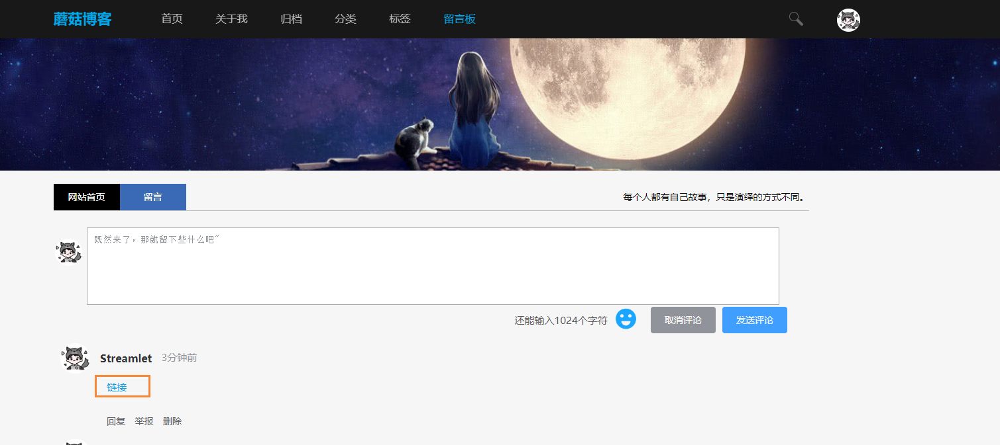
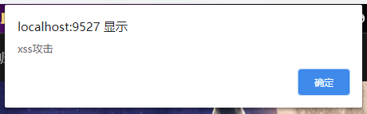
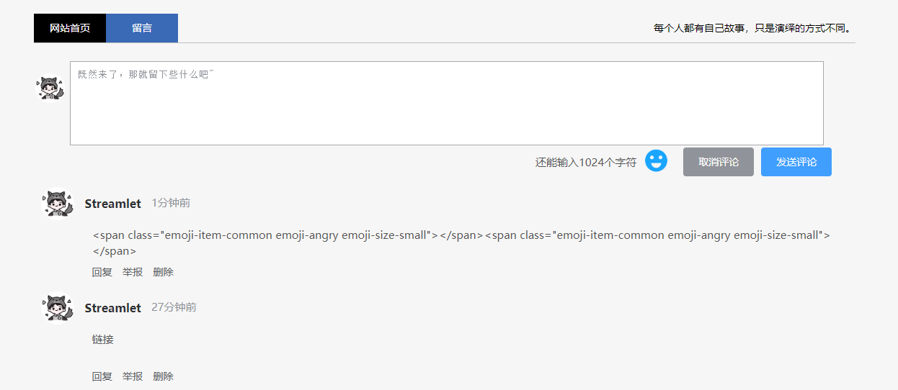
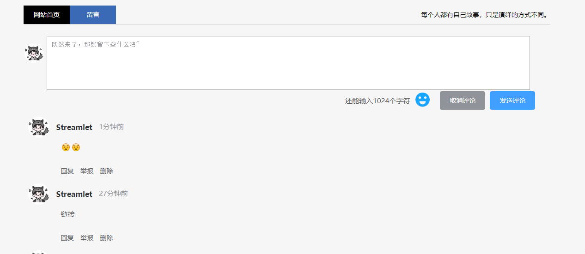

# Vue中防止XSS脚本攻击

最近写了一个博客评论模块，因为引入了表情包，所以就将原来的v-text的形式，改成了v-html，也就是渲染html标签，但是这样不可不免的会带来问题，就是XSS跨站脚本攻击

XSS解决方案官网：[点我传送](https://jsxss.com/zh/index.html)

## XSS脚本攻击

跨站脚本攻击缩写为XSS。恶意攻击者往Web页面里插入恶意Script代码，当用户浏览该页面时，嵌入Web里面的Script代码会被执行，从而达到恶意攻击用户的目的。XSS攻击针对的是用户层面的攻击！

例如我在评论框输入以下内容

```
<a onclick='let count=10;while(count>0){alert("xss攻击");count=count-1;}'>链接</a>
```

这个时候评论就会出现一个超链接



只要我们点击这个链接后，就会出现一个alert弹框



上面代码因为写的的是循环10次后，alert消失，但是如果是`while(true)`，那么后果不堪设想，会进入无止无休的弹框

## 解决XSS脚本攻击

首先需要安装`xss`模块

```
npm install xss --save
```

然后在`main.js`中引入

```
import xss from 'xss'
// 定义全局XSS解决方法
Object.defineProperty(Vue.prototype, '$xss', {
  value: xss
})
```

然后针对需要渲染的页面，调用`$xss()`方法

```
<div class="rightCenter" v-html="$xss(item.content)"></div>
```

我们在点击刚刚的页面，发现已经不会有弹框了，但是有出来了新的问题，就是我引入的标签也被过滤了


引入xss后



这个时候，我们就需要自定义拦截规则了，我们在data中添加如下配置，下面是自定义白名单，也就是什么标签以及标签的属性能够正常使用，其它的都会被拦截

```
    data() {
      return {
        // xss白名单配置
        options : {
          whiteList: {
            a: ['href', 'title', 'target'],
            span: ['class']
          }
        }
      };
    },
```

然后在使用的时候，增加option配置

```
<div class="rightCenter" v-html="$xss(item.content, options)"></div>
```

这个时候，表情已经成功显示了，并且原来的脚本攻击也不生效，达到了我们的目的~

