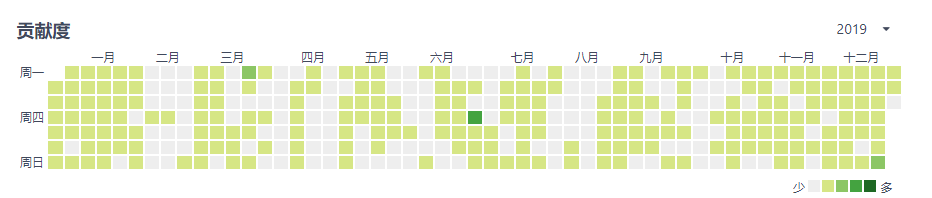
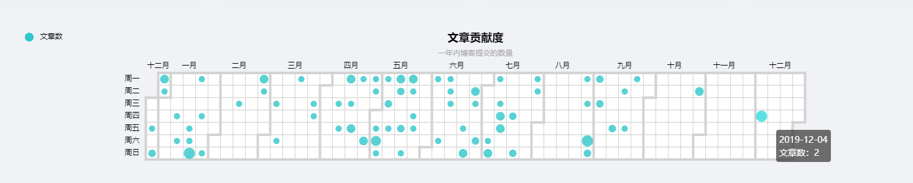
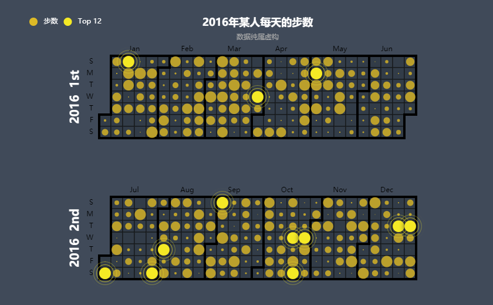
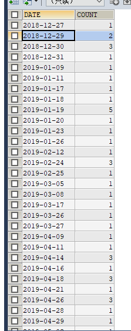

# 使用SpringBoot+Vue+Echarts制作一个文章贡献度表

## 前言

最近想给博客做一个类似于码云代码提交记录的图表，就类似于下面这样的



然后将每天的博客提交的博客生成对应的记录，下面先看最终的结果图



有点不一样的地方是，这里使用圆圈的大小，来表示提交的次数

## 制作博客贡献表

这个博客贡献表是使用了ECharts中的 calendar-effectscatter 组件：[点我传送](https://www.echartsjs.com/examples/en/editor.html?c=calendar-effectscatter)



首先附上完整的vue代码：

```vue
<template>
  <div id="container" style=" width: 100%; height: 300px;"></div>
</template>

<script>
  import { getBlogContributeCount } from "@/api/index";
  import echarts from "echarts";

  export default {
    mounted() {
      this.initDate();
    },
    data() {
      return {
        contributeDate: [],
        blogContributeCount: [],
      }
    },
    created() {

    },
    methods: {
      initDate: function() {

        getBlogContributeCount().then(response => {
          console.log("我来啦", response.data.blogContributeCount);
          if(response.code == "success") {

            var contributeDate = response.data.contributeDate;

            var blogContributeCount = response.data.blogContributeCount;


            let chart = echarts.init(document.getElementById('container'))

            let option = {

              //设置背景
              // backgroundColor: '#d0d0d0',

              title: {
                top: 30,
                text: '文章贡献度',
                subtext: '一年内博客提交的数量',
                left: 'center',
                textStyle: {
                  color: '#000'
                }
              },
              tooltip : {
                trigger: 'item',
                formatter:function(params){
                  return (params.data[0] +  '<br>文章数：' + params.data[1])
                }
              },
              legend: {
                top: '30',
                left: '100',
                data:['文章数', 'Top 12'],
                textStyle: {
                  // 设置字体颜色
                  color: '#000'
                }
              },
              calendar: [{
                top: 100,
                left: 'center',
                range: ['2018-12-25', '2019-12-25'],
                splitLine: {
                  show: true,
                  lineStyle: {
                    // 设置月份分割线的颜色
                    color: '#D3D3D3',
                    width: 4,
                    type: 'solid'
                  }
                },
                yearLabel: {show: false},
                dayLabel: {
                  nameMap: ["周一","周二","周三","周四","周五","周六","周日"], // 设置中文显示
                  textStyle: {
                    // 设置周显示颜色
                    color: '#000'
                  }
                },
                monthLabel: {
                  nameMap: 'cn', // 设置中文显示
                  textStyle: {
                    // 设置月显示颜色
                    color: '#000'
                  }
                },
                itemStyle: {
                  normal: {
                    // 设置背景颜色
                    color: '#ffffff',
                    borderWidth: 1,
                    // 设置方块分割线段颜色
                    borderColor: '#D3D3D3'
                  }
                }
              }],
              series : [
                {
                  name: '文章数',
                  type: 'scatter',
                  coordinateSystem: 'calendar',
                  data: blogContributeCount,
                  // 根据值设置原点大小
                  symbolSize: function (val) {
                    if(val[1] == 0) {
                      return val[1];
                    } else {
                      let size = 8 + val[1]*2;
                      if(size > 18) {
                        size = 18;
                      }
                      return size;
                    }

                  },
                  itemStyle: {
                    normal: {
                      // 设置圆点颜色
                      color: '#2ec7c9'
                    }
                  }
                }
              ]
            };

            chart.setOption(option);

          }

        });
      }
    }
  }

</script>

```

首先我们需要的是对博客表进行操作，我们需要统计按日期统计每天的贡献度

```sql
SELECT DISTINCT DATE_FORMAT(create_time, '%Y-%m-%d') DATE, COUNT(uid) COUNT FROM t_blog WHERE 1=1 && STATUS = 1 && create_time > "2018-12-24 02:28:04" && create_time < "2019-12-24 02:28:04" GROUP BY DATE_FORMAT(create_time, '%Y-%m-%d')
```

执行完成后得到的结果如下：



将统计出每天的文章数，通过上面我们能够看到，里面的日期不是连续的，所以我们还需要编写代码针对那些没有记录的日期，初始化贡献度为0。

我们首先需要写一个方法，用来得到指定时间段内的全部日期

```java
    /**
     * 获取某个时间段内所有日期
     * @param begin
     * @param end
     * @return
     */
    public static List<String> getDayBetweenDates(String begin, String end) {
        Date dBegin = strToDateTime(begin);
        Date dEnd = strToDateTime(end);
        List<String> lDate = new ArrayList<String>();
        SimpleDateFormat sd = new SimpleDateFormat("yyyy-MM-dd");
        lDate.add(sd.format(dBegin));
        Calendar calBegin = Calendar.getInstance();
        // 使用给定的 Date 设置此 Calendar 的时间
        calBegin.setTime(dBegin);
        Calendar calEnd = Calendar.getInstance();
        // 使用给定的 Date 设置此 Calendar 的时间
        calEnd.setTime(dEnd);
        // 测试此日期是否在指定日期之后
        while (dEnd.after(calBegin.getTime())) {
            // 根据日历的规则，为给定的日历字段添加或减去指定的时间量
            calBegin.add(Calendar.DAY_OF_MONTH, 1);
            lDate.add(sd.format(calBegin.getTime()));
        }
        return lDate;
    }
```

然后在通过将我们SQL查询出来的进行对比，如果该日期内有记录的话，就赋值成对应的贡献度，代码如下：

```java
 public Map<String, Object> getBlogContributeCount() {

        // 获取今天结束时间
        String endTime = DateUtils.getNowTime();

        // 获取365天前的日期
        Date temp = DateUtils.getDate(endTime, -365);

        String startTime = DateUtils.dateTimeToStr(temp);

        List<Map<String, Object>> blogContributeMap = blogMapper.getBlogContributeCount(startTime, endTime);

        List<String> dateList = DateUtils.getDayBetweenDates(startTime, endTime);

        Map<String, Object> dateMap = new HashMap<>();

        for(Map<String, Object> itemMap : blogContributeMap) {

            dateMap.put(itemMap.get("DATE").toString(), itemMap.get("COUNT"));
        }

        List<List<Object>> resultList = new ArrayList<>();
        for(String item : dateList) {
            Integer count = 0;
            if(dateMap.get(item) != null) {
                count = Integer.valueOf(dateMap.get(item).toString());
            }
            List<Object> objectList = new ArrayList<>();
            objectList.add(item);
            objectList.add(count);
            resultList.add(objectList);
        }

        Map<String, Object> resultMap = new HashMap<>();
        List<String> contributeDateList = new ArrayList<>();
        contributeDateList.add(startTime);
        contributeDateList.add(endTime);
        resultMap.put("contributeDate", contributeDateList);
        resultMap.put("blogContributeCount", resultList);

        return resultMap;
    }
```

最终我们将得到的数据进行渲染，就得到最开始的贡献表了~

