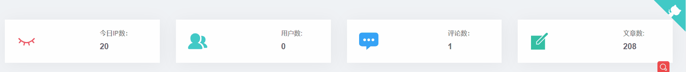

# Vue使用vue-count-to插件对数字显示美化

## 前言

这两天在搬砖，领导说页面上的数字不要显示的太死板，要有动态的效果，能够看够看到逐步递增或者递减的效果

其实在蘑菇博客的使用的后台模板：[vue-template-admin](https://github.com/PanJiaChen/vue-admin-template) 也使用了一个的数字显示大大插件，也就是在首页显示的时候，如下图所示，当进入admin管理页面的时候



能够看到数字是逐渐递增的，也能满足对应的要求，数字动态递增的效果是使用一款插件完成的：[vue-count-to](https://github.com/PanJiaChen/vue-countTo)

后面发现原来这两个都是由[花裤衩大大PanJiaChen](https://github.com/PanJiaChen)编写的，感谢开源的贡献~

## Vue-count-to介绍

官网地址：[vue-count-to](https://github.com/PanJiaChen/vue-countTo)

Vue-count-to是一款简单好用的一个数字滚动插件，并且是一个无依赖，轻量级的vue组件，可以自行覆盖easingFn，你可以设置 startVal 和 endVal，它会自动判断计数或倒计时。支持vue-ssr。vue-countTo参考于countUp.js

## 依赖安装

npm安装

```
npm install vue-count-to
```

或 yarn安装

```
yarn add vue-count-to
```

## 使用

引入组件

```
import countTo from 'vue-count-to';
```

然后注册

```
components: { countTo },
```

完整代码如下所示：

```
<template>
  <countTo :startVal='startVal' :endVal='endVal' :duration='3000'></countTo>
</template>

<script>
  import countTo from 'vue-count-to';
  export default {
    components: { countTo },
    data () {
      return {
        startVal: 0,
        endVal: 2020
      }
    }
  }
</script>
```

完整demo如下所示：


## 配置

我们可以修改对应的配置，来完成我们对数字变化的需求

| Property  | Description            | type     | default |
| --------- | ---------------------- | -------- | ------- |
| startVal  | 开始值                 | Number   | 0       |
| endVal    | 结束值                 | Number   | 2017    |
| duration  | 持续时间，以毫秒为单位 | Number   | 3000    |
| autoplay  | 自动播放               | Boolean  | true    |
| decimals  | 要显示的小数位数       | Number   | 0       |
| decimal   | 十进制分割             | String   | .       |
| separator | 分隔符                 | String   | ,       |
| prefix    | 前缀                   | String   | ''      |
| suffix    | 后缀                   | String   | ''      |
| useEasing | 使用缓和功能           | Boolean  | true    |
| easingFn  | 缓和回调               | Function | —       |

**tip：当autoplay：true时，它将在startVal或endVal更改时自动启动**

| mountedCallback | 挂载以后返回回调 |
| --------------- | ---------------- |
| start           | 开始计数         |
| pause           | 暂停计数         |
| reset           | 重置countTo      |