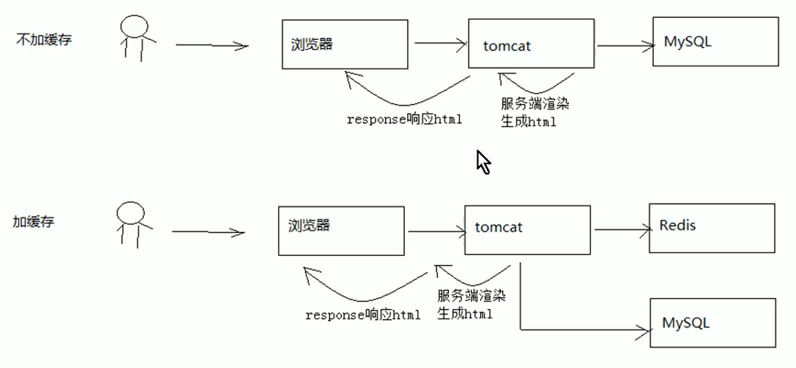
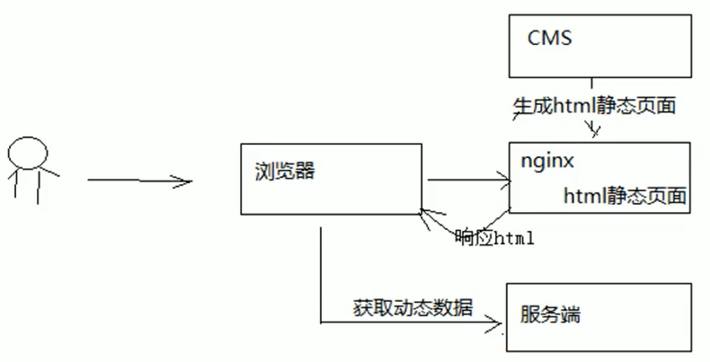

# Vue内容页面SEO优化方案

课程预览所浏览到的页面就是课程详情页面，需要先确定课程详情页面的技术方案后方可确定课程预览的技术方案。而Vue作为单页面应用技术，非常不利于SEO优化

## 技术需求

课程详情页面是向用户展示课程信息的窗口，课程相当于网站的商品，本页面的访问量会非常大。此页面的内容设计不仅要展示出课程核心重要的内容而且用户访问页面的速度要有保证，有统计显示打开一个页面超过4秒用户就走掉了，所以本页面的性能要求是本页面的重要需求。本页面另一个需求就是SEO，要非常有利于爬虫抓取页面上信息，并且生成页面快照，利于用户通过搜索引擎

## 解决方案

如何在保证SEO的前提下提高页面的访问速度：

### 方案1：

对于信息获取类的需求，要想提高页面速度就要使用缓存来减少或避免对数据库的访问，从而提高页面的访问速度。下图是使用缓存与不使用缓存的区别

此页面为动态页面，会根据课程的不同而不同，方案一采用传统的JavaEEServlet/jsp的方式在Tomcat完成页面渲染，相比不加缓存速度会有提升。

- 优点：使用redis作为缓存，速度有提升。
- 缺点：采用Servlet/jsp动态页面渲染技术，服务器使用Tomcat，面对高并发量的访问存在性能瓶颈

### 方案2

对于不会频繁改变的信息可以采用页面静态化的技术提前让页面生成html静态页面存储在nginx服务器，用户直接访问nginx即可，对于一些动态信息可以访问服务端获取json数据在页面渲染。

