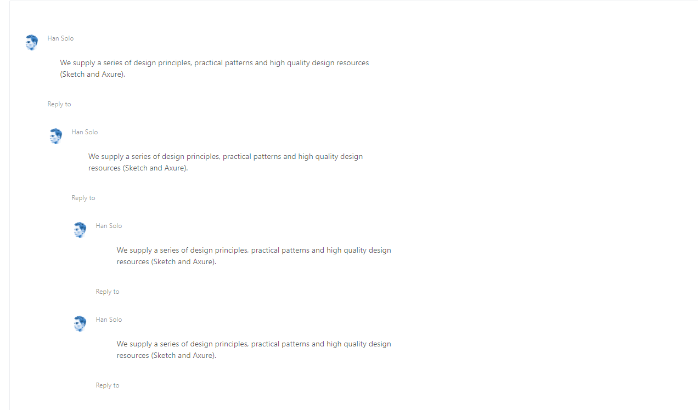
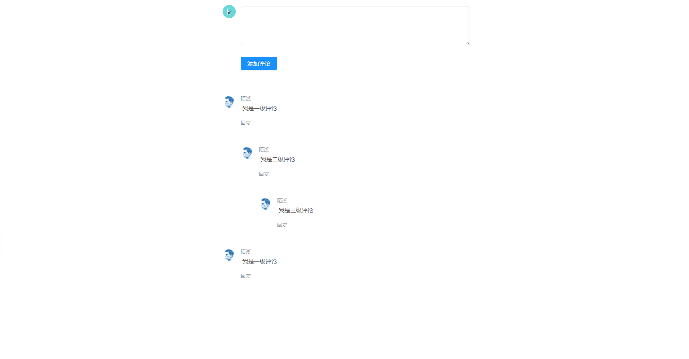
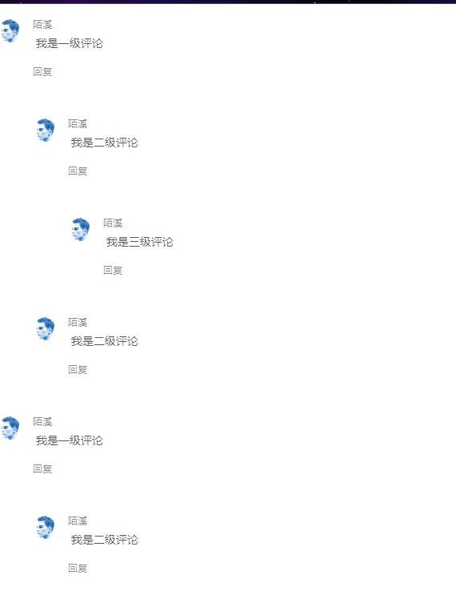
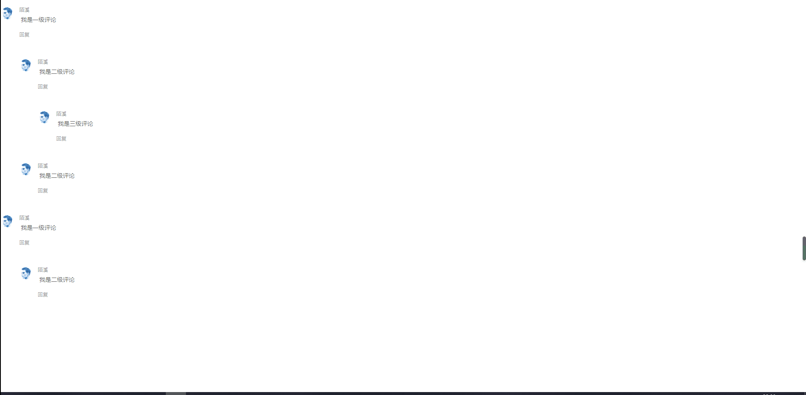
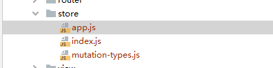

# Vue如何制作一个评论模块

## 前言

一直想着重写蘑菇博客的评论功能，但是一直之前一直没有头绪，最比较让人头疼的是前端的样式问题，最近在看蚂蚁的UI框架的时候，偶然看到了评论组件：[点我传送](https://www.antdv.com/components/comment-cn/)



瞬间感觉发现了新大陆，但是相对来说功能还有些简单，无法满足博客的要求，所以想办法改造一下，下面看最终封装好的组件为： 

源码地址为：https://gitee.com/moxi159753/Vue_Comment_Component



## 封装CommentList组件

为了实现多级递归渲染，首先要做的是，将单条评论封装成一个组件，然后里面重复调用自身

```
<template>
    <div>
        <a-comment v-for="item in comments" :key="item.uid">
            <span slot="actions" @click="replyTo(0)">回复</span>
            <a slot="author">{{item.userName}}</a>
            <a-avatar
                    slot="avatar"
                    :src="item.avatar"
                    :alt="item.userName"
            />
            <p slot="content">
                {{item.content}}
            </p>
            <CommentList :comments="item.reply"></CommentList>
        </a-comment>
    </div>
</template>
<script>
    export default {
        name:"CommentList",
        props: ['comments'],
        data() {
            return {};
        },
        components: {

        },
        methods: {},
    };
</script>
```

在这里需要用到的一个非常重要的字段就是：

```
name:"CommentList",
```

如果我们想要在该组件中嵌套本身，那么直接就可以在模板中使用name属性值 递归调用自身，之前一直不太明白name字段是做什么用处的，有的时候可以加，有的时候删除也可以，今天才了解是为了在组件中调用自己的时候就能用得上。

## 在父组件中调用该CommentList组件

首先我们需要定义一些多级评论的数据，这里的数据是多层嵌套的，通过reply字段

```
comments: [
                    {
                        uid: 'uid000',
                        userName: "陌溪",
                        avatar: 'https://zos.alipayobjects.com/rmsportal/ODTLcjxAfvqbxHnVXCYX.png',
                        content: '我是一级评论',
                        reply: [
                            {
                                uid: 'uid001',
                                userName: "陌溪",
                                avatar: 'https://zos.alipayobjects.com/rmsportal/ODTLcjxAfvqbxHnVXCYX.png',
                                content: '我是二级评论',
                                reply: [
                                    {
                                        uid: 'uid002',
                                        userName: "陌溪",
                                        avatar: 'https://zos.alipayobjects.com/rmsportal/ODTLcjxAfvqbxHnVXCYX.png',
                                        content: '我是三级评论',
                                        reply: []
                                    }
                                ]

                            }, {
                                uid: 'uid003',
                                userName: "陌溪",
                                avatar: 'https://zos.alipayobjects.com/rmsportal/ODTLcjxAfvqbxHnVXCYX.png',
                                content: '我是二级评论',
                                reply: []
                            }
                        ]
                    },
                    {
                        uid: 'uid004',
                        userName: "陌溪",
                        avatar: 'https://zos.alipayobjects.com/rmsportal/ODTLcjxAfvqbxHnVXCYX.png',
                        content: '我是一级评论',
                        reply: [
                            {
                                uid: 'uid005',
                                userName: "陌溪",
                                avatar: 'https://zos.alipayobjects.com/rmsportal/ODTLcjxAfvqbxHnVXCYX.png',
                                content: '我是二级评论',
                                reply: []

                            }
                        ]
                    },

                ],
```

然后我们需要引入刚刚定义的CommentList子组件，传递进对应的评论数据，完整的代码如下所示：

```html
<template>
    <div>
        <CommentList :comments="comments"></CommentList>
    </div>
</template>
<script>
    import CommentList from "../components/CommentList";
    export default {
        data() {
            return {
                comments: [
                    {
                        uid: 'uid000',
                        userName: "陌溪",
                        avatar: 'https://zos.alipayobjects.com/rmsportal/ODTLcjxAfvqbxHnVXCYX.png',
                        content: '我是一级评论',
                        reply: [
                            {
                                uid: 'uid001',
                                userName: "陌溪",
                                avatar: 'https://zos.alipayobjects.com/rmsportal/ODTLcjxAfvqbxHnVXCYX.png',
                                content: '我是二级评论',
                                reply: [
                                    {
                                        uid: 'uid002',
                                        userName: "陌溪",
                                        avatar: 'https://zos.alipayobjects.com/rmsportal/ODTLcjxAfvqbxHnVXCYX.png',
                                        content: '我是三级评论',
                                        reply: []
                                    }
                                ]

                            }, {
                                uid: 'uid003',
                                userName: "陌溪",
                                avatar: 'https://zos.alipayobjects.com/rmsportal/ODTLcjxAfvqbxHnVXCYX.png',
                                content: '我是二级评论',
                                reply: []
                            }
                        ]
                    },
                    {
                        uid: 'uid004',
                        userName: "陌溪",
                        avatar: 'https://zos.alipayobjects.com/rmsportal/ODTLcjxAfvqbxHnVXCYX.png',
                        content: '我是一级评论',
                        reply: [
                            {
                                uid: 'uid005',
                                userName: "陌溪",
                                avatar: 'https://zos.alipayobjects.com/rmsportal/ODTLcjxAfvqbxHnVXCYX.png',
                                content: '我是二级评论',
                                reply: []

                            }
                        ]
                    },

                ],
            };
        },
        watch: {},
        components: {
            CommentList
        },
        methods: {

        },
    };
</script>
```

到目前为止，我们渲染出来的评论模块已经具备层次关系了



下面我们需要做的就是引入回复模块

## 封装CommentBox组件

ant design也提供了回复框，如下所示


我们将其封装成对应的组件 CommentBox

```html
<template>
    <div>
        <a-comment>
            <a-avatar
                    slot="avatar"
                    :src="userInfo.avatar"
                    alt="Han Solo"
            />
            <div slot="content">
                <a-form-item>
                    <a-textarea :rows="4" @change="handleChange" :value="value"></a-textarea>
                </a-form-item>
                <a-form-item>
                    <a-button htmlType="submit" :loading="submitting" @click="handleSubmit" type="primary">
                        添加评论
                    </a-button>
                    <a-button v-if="showCancle" style="margin-left:5px;"  @click="handleCancle">
                        取消评论
                    </a-button>
                </a-form-item>
            </div>
        </a-comment>
    </div>
</template>
<script>

    export default {
        props: {
            userInfo: {
                type: Object
            },
            replyInfo: {
                type: Object
            },
            showCancle: {
                type: Boolean,
                default: true
            }
        },
        data() {
            return {
                comments: [],
                submitting: false,
                value: '',
            };
        },
        methods: {
            handleSubmit() {
                this.comments = {
                    uid: this.$store.state.app.id,
                    replyUid: this.replyInfo.replyUid,
                    userName: this.userInfo.userName,
                    avatar: this.userInfo.avatar,
                    content: this.value,
                    reply: []
                }
                this.value = '';
                this.$emit("submit-box", this.comments)
            },
            handleChange(e) {
                this.value = e.target.value;
            },
            handleCancle() {
                this.value = '';
                this.$emit("cancel-box", this.replyInfo.replyUid)
            }
        },
    };
</script>
```

然后在CommentList中引入对应的模块，具体需要做的事情是，在回复按钮出设置点击时间，当我们点击的时候，将对应的评论渲染出来，我们首先将CommentBox设置为不显示

```
<CommentBox class="comment" :userInfo="userInfo" :reply-info="replyInfo" :id="item.uid"
 @submit-box="submitBox" @cancel-box="cancelBox"></CommentBox>
```

然后当我们点击的时候，就需要将我们点击的comment设置为显示状态，其它的设置为none

```
replyTo: function (uid) {
    var lists = document.getElementsByClassName("comment");
    for (var i = 0; i < lists.length; i++) {
    lists[i].style.display = 'none';
    }
    document.getElementById(uid).style.display = 'block';
    this.replyInfo.replyUid = uid
},
```

我们通过document.getElementByClassName把所有的CommentBox获取到来，然后设置成none，同时将我们点击的CommentBox设置成显示即可

运行效果如下所示：

 

## 引入Vuex

通过上面所述，我们就能完成点击回复，弹出对话框，然后输入对话框的内容后，我们还需要回显到页面上

但是这样的方式存在一个问题，就是通过this.$emit和父组件通信的时候，父组件只有在一级评论时，才能够监听到子组件的改变，所以后面就改变了策略，采用vuex存储data数据，也就是评论数据

首先创建如下文件：



app.js文件内容如下，该文件主要是编写操作store的一些方法

```
import {SET_COMMENT_LIST, INCREMENT} from "./mutation-types";

const app = {
  // 全局状态
  state: {
    commentList: [],
    id: 100,
  },
  // getters是对数据的包装，例如对数据进行拼接，或者过滤
  getters: {
    //类似于计算属性
    // 增加的方法

  },
  // 如果我们需要更改store中的状态，一定要通过mutations来进行操作
  mutations: {

    // 传入自定义参数
    [SET_COMMENT_LIST](state, commentList) {
      state.commentList = commentList
    },
    [INCREMENT](state) {
      state.id += 1
    },
  },

  // actions是我们定义的一些操作，正常情况下，我们很少会直接调用mutation方法来改变state
  actions: {

  }
}
export default app

```

mutation-types.js文件，用来定义一些常量

```
export const SET_COMMENT_LIST =  "setCommentList"
export const INCREMENT =  "increment"
export const DECREMENT =  "decrement"
```

index.js，如果是多模块，则可以在这里进行配置

```
import Vue from 'vue'
import Vuex from 'vuex'
import app from './app'

//让vuex生效
Vue.use(Vuex)

const store = new Vuex.Store({

  // 将app和user放在store中
  modules: {
    app
  }
})
export default  store
```

然后修改最新的CommentList组件

```
<template>
    <div>
        <a-comment v-for="item in comments" :key="item.uid">
            <span slot="actions" @click="replyTo(item.uid)">回复</span>
            <a slot="author">{{item.userName}}</a>
            <a-avatar
                    slot="avatar"
                    :src="item.avatar"
                    :alt="item.userName"
            />
            <p slot="content">
                {{item.content}}
            </p>

            <CommentBox class="comment" :userInfo="userInfo" :reply-info="replyInfo" :id="item.uid"
                        @submit-box="submitBox" @cancel-box="cancelBox"></CommentBox>

            <CommentList :comments="item.reply"></CommentList>

        </a-comment>
    </div>
</template>
<script>

    import {mapMutations} from 'vuex';
    import CommentBox from "../components/CommentBox";

    export default {
        name: "CommentList",
        props: ['comments'],
        data() {
            return {
                showCancle: true,
                submitting: false,
                value: '',
                userInfo: {
                    uid: "uid000001",
                    userName: "张三",
                    avatar: "https://wpimg.wallstcn.com/f778738c-e4f8-4870-b634-56703b4acafe.gif"

                },
                replyInfo: {
                    uid: "",
                    blogUid: "uid000003",
                    replyUserUid: 0,
                    avatar: "https://zos.alipayobjects.com/rmsportal/ODTLcjxAfvqbxHnVXCYX.png"
                },
            };
        },
        created() {

        },
        components: {
            CommentBox
        },

        compute: {},
        methods: {
            ...mapMutations(['setCommentList', 'increment']),
            replyTo: function (uid) {
                var lists = document.getElementsByClassName("comment");
                for (var i = 0; i < lists.length; i++) {
                    lists[i].style.display = 'none';
                }
                document.getElementById(uid).style.display = 'block';
                this.replyInfo.replyUid = uid
            },
            submitBox(e) {
                // 一级评论
                if (e.replyUid == 0) {
                    var firstComment = this.$store.state.app.commentList;
                    firstComment.push(e);
                    this.$store.commit("setCommentList", firstComment);
                    this.$store.commit("increment");

                    return;
                }

                document.getElementById(e.replyUid).style.display = 'none'
                var comments = this.$store.state.app.commentList;
                this.getMenuBtnList(comments, e.replyUid, e)
                this.$store.commit("setCommentList", comments);
                this.$store.commit("increment");

            },
            cancelBox(e) {
                document.getElementById(e).style.display = 'none'
            },
            getMenuBtnList(menuTreeList, uid, comment) {

                if (menuTreeList == undefined || menuTreeList.length <= 0) {
                    return;
                }

                for (let item of menuTreeList) {
                    console.log("递归中", item.uid, uid)
                    if (item.uid === uid) {
                        var menu = item.reply;
                        menu.push(comment);
                    } else {
                        this.getMenuBtnList(item.reply, uid, comment);
                    }
                }
            }
        },
    };
</script>
<style>
    .comment {
        display: none;
    }
</style>
```

这里Vuex参考了之前的一篇博客：[Vuex学习指南-实现一个计数器](http://moguit.cn/#/info?blogUid=a00ebe1473c584ff94bdd40402a4d573)

主要实现思路是：首先当用户在CommentBox中输入内容，并且提交后，触发CommentList中的submitBox方法，该方法传入参数e，也就是发送的评论，然后我们首先判断是否是一级评论

```
submitBox(e) {
// 一级评论
    if (e.replyUid == 0) {
        var firstComment = this.$store.state.app.commentList;
        firstComment.push(e);
        this.$store.commit("setCommentList", firstComment);
        this.$store.commit("increment");
        return;
    }

    document.getElementById(e.replyUid).style.display = 'none'
    var comments = this.$store.state.app.commentList;
    this.getMenuBtnList(comments, e.replyUid, e)
    this.$store.commit("setCommentList", comments);
    this.$store.commit("increment");

},
```

通过replyUid来判断，如果replyUid为0，说明该评论是一级评论，那么直接从store中获取，关于store中的commentList，是在index.vue页面，初始化的时候填入的

```
mounted() {
	this.setCommentList(this.comments);
},
```

如果是一级评论，我们直接把评论追加到commentList中，然后通过 

```
this.$store.commit("setCommentList", comments);
this.$store.commit("increment");
```

更新CommentList列表的数据，那么页面就会重新渲染，也就看到我们新加入的评论了，同时我们的id也需要变换，id的改变，是为了唯一表示CommentBox，这样我们就可以通过以下代码

```
document.getElementById(e.replyUid).style.display = 'none'
```

来控制评论box的显示与否，同时当不是一级评论的时候，我们需要通过递归，找到该评论的父ID，这个方法需要三个参数，一个是评论列表，一个是 父评论Uid，一个是需要填充的评论，那么执行该方法后，会自动将评论填充到指定的父评论的reply下

```
updateCommentList(commentList, uid, targetComment) {

    if (commentList == undefined || commentList.length <= 0) {
    	return;
    }

    for (let item of commentList) {
    	console.log("递归中", item.uid, uid)
        if (item.uid === uid) {
        var menu = item.reply;
        menu.push(targetComment);
      } else {
        this.updateCommentList(item.reply, uid, targetComment);
       }
    }
}
```

index.vue完整代码，如下

```
<template>
    <div class="contain">
        <CommentBox :userInfo="userInfo" :reply-info="replyInfo"  @submit-box="submitBox" :showCancle="showCancle"></CommentBox>

        <CommentList :comments="comments"></CommentList>
    </div>
</template>
<script>
    import CommentList from "../components/CommentList";
    import CommentBox from "../components/CommentBox";

    // vuex中有mapState方法，相当于我们能够使用它的getset方法
    import {mapMutations} from 'vuex';

    export default {
        data() {
            return {
                showCancle: false,
                submitting: false,
                value: '',
                userInfo: {
                    uid: "uid000001",
                    userName: "张三",
                    avatar: "https://wpimg.wallstcn.com/f778738c-e4f8-4870-b634-56703b4acafe.gif"

                },
                replyInfo: {
                    uid: "",
                    blogUid: "uid000003",
                    replyUserUid: "uid000004",
                    replyUid: 0,
                    avatar: "https://zos.alipayobjects.com/rmsportal/ODTLcjxAfvqbxHnVXCYX.png"
                },
                comments: [
                    {
                        uid: 'uid000',
                        userName: "陌溪",
                        avatar: 'https://zos.alipayobjects.com/rmsportal/ODTLcjxAfvqbxHnVXCYX.png',
                        content: '我是一级评论',
                        reply: [
                            {
                                uid: 'uid001',
                                userName: "陌溪",
                                avatar: 'https://zos.alipayobjects.com/rmsportal/ODTLcjxAfvqbxHnVXCYX.png',
                                content: '我是二级评论',
                                reply: [
                                    {
                                        uid: 'uid002',
                                        userName: "陌溪",
                                        avatar: 'https://zos.alipayobjects.com/rmsportal/ODTLcjxAfvqbxHnVXCYX.png',
                                        content: '我是三级评论',
                                        reply: []
                                    }
                                ]
                            }
                        ]
                    },
                    {
                        uid: 'uid004',
                        userName: "陌溪",
                        avatar: 'https://zos.alipayobjects.com/rmsportal/ODTLcjxAfvqbxHnVXCYX.png',
                        content: '我是一级评论',
                        reply: [
                        ]
                    },
                ],
            };
        },
        watch: {},
        computed: {

        },
        components: {
            CommentList,
            CommentBox
        },
        mounted() {
            this.setCommentList(this.comments);
        },
        methods: {
            //拿到vuex中的写的两个方法
            ...mapMutations(['setCommentList', 'increment']),
            submitBox(e) {
                var comments = this.$store.state.app.commentList;
                e.uid = this.$store.state.app.id
                comments.push(e);
                this.$store.commit("setCommentList", comments);
                this.$store.commit("increment");
            }
        },
    };
</script>
<style>
    .contain{
        width: 600px;
        margin:0 auto;
    }
</style>
```

