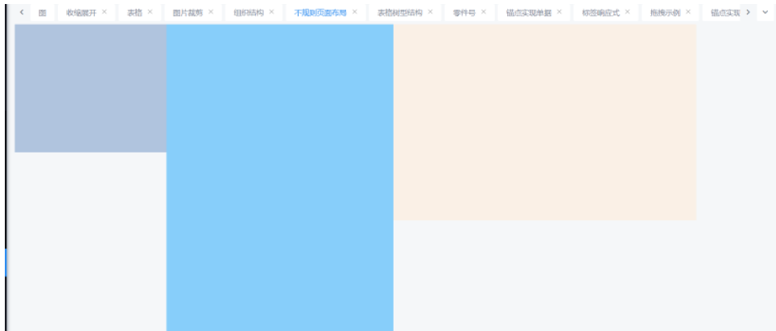

VUE标签根据宽度按比例实现高度
1、安装指令 “vue-proportion-directive”: “^1.1.0”,

```bash
npm install vue-proportion-directive --save
```

2、在main.js中引入指令

// 控制标签宽高成比例的指令

```vue
import proportion from 'vue-proportion-directive';
Vue.use(proportion);
```

3、示例

```vue
<div class="div1" style="width: 20%;float: left" v-proportion="0.85"></div>
<div class="div2" style="width: 30%;float: left" v-proportion="1.6"></div>
<div class="div3" style="width: 40%;float: left" v-proportion="0.65"></div>
```

效果如下

