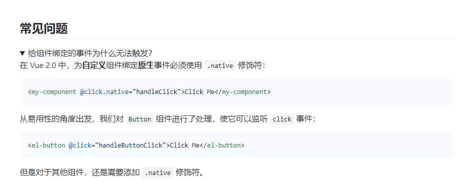

# Vue对Element中的el-tag添加@click事件无效

## 前言

今天在做评论模块的时候，想着对el-tag元素添加点击事件，发现无法触发，代码如下所示

```
<el-tag type="error" @click="onClick(scope.row.blog)">scope.row.blog.title}}</el-tag>
```

我们在点击el-tag标签的时候，无法触发其点击事件

## 解决方法

通过查阅资料发现官方给定了解答



也就是所，必须使用@click.native才能够触发点击行为，而对于button，直接使用@click即可，修改后的代码如下所示，能够正常完成点击事件了~

```
<el-tag type="error" @click.native="onClick(scope.row.blog)">scope.row.blog.title}}</el-tag>
```

