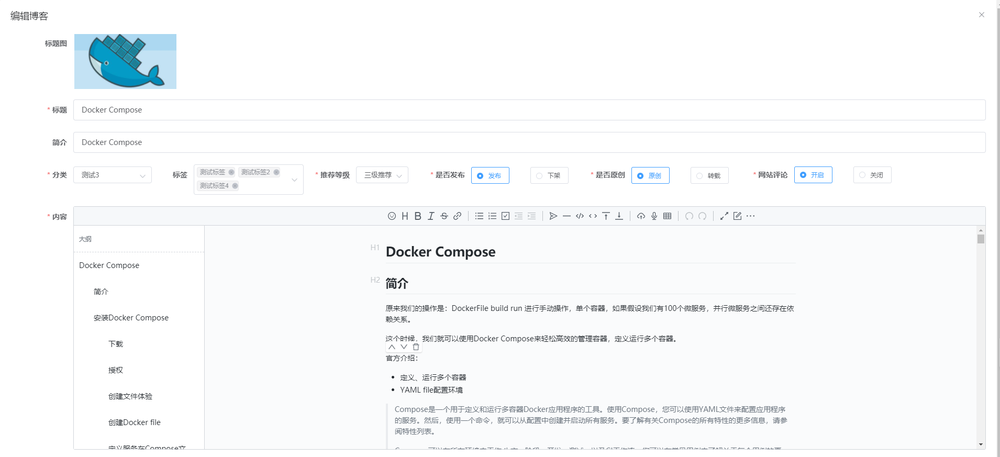

# Vue项目中引入markdown编辑器vditor

## 前言

这阵子在Github上看到一个非常不错的Markdown编辑器[Vditor](https://github.com/Vanessa219/vditor)，和我使用Typora写博客的体验几乎一致，所以这次就打算在项目中集成一下vditor

演示地址：https://vditor.b3log.org/demo/vue.html

## 安装依赖

首先我们需要安装对应的依赖

```bash
npm install vditor --save
```

然后到html页面中，引入对应的CDN文件

```bash
<!-- ⚠️生产环境请指定版本号，如 https://cdn.jsdelivr.net/npm/vditor@x.x.x/dist... -->
<link rel="stylesheet" href="https://cdn.jsdelivr.net/npm/vditor/dist/index.css" />
<script src="https://cdn.jsdelivr.net/npm/vditor/dist/index.min.js" defer></script>
```

## 封装成组件

为了以后使用更加的方便，这里我对vditor再次进行了封装，创建一个MarkdownEditor的文件夹，idex.vue如下

```vue
<template>
  <div class="index-page" v-loading="isLoading">
    <div id="vditor" class="vditor" :style="vditorClass" />
  </div>
</template>

<script>
  import Vditor from 'vditor'
  import { getToken } from '@/utils/auth'
  export default {
    name: 'MarkdownEditor',
    props: ["height"],
    data() {
      return {
        isLoading: true,
        isMobile: window.innerWidth <= 960,
        vditor: null
      }
    },
    created() {

    },
    components: {

    },
    computed:{
      vditorClass: function(){
        return {
          height: this.height + 'px'
        }
      }
    },
    mounted() {
      this.initVditor()
      this.$nextTick(() => {
        this.isLoading = false
      })
    },
    methods: {
      initVditor() {
        const that = this
        const options = {
          width: this.isMobile ? '100%' : '100%',
          height: '0',
          tab: '\t',
          counter: '999999',
          typewriterMode: true,
          mode: 'wysiwyg',
          preview: {
            delay: 100,
            show: !this.isMobile
          },
          outline: true,
          upload: {
            max: 5 * 1024 * 1024,
            handler(file) {
              let formData = new FormData()
              for (let i in file) {
                formData.append('smfile', file[i])
              }
              let request = new XMLHttpRequest()
              // 图片上传路径
              request.open('POST', process.env.PICTURE_API + '/ckeditor/imgUpload?token=' + getToken())
              request.onload = that.onloadCallback
              request.send(formData)
            }
          }
        }
        this.vditor = new Vditor('vditor', options)
        // this.vditor.focus()
      },
      onloadCallback(oEvent) {
        const currentTarget = oEvent.currentTarget
        console.log("返回的结果", currentTarget)
        if (currentTarget.status !== 200) {
          return this.$message({
            type: 'error',
            message: currentTarget.status + ' ' + currentTarget.statusText
          })
        }
        let resp = JSON.parse(currentTarget.response)
        let imgMdStr = ''
        if (resp.uploaded !== 1) {
          return this.$message({
            type: 'error',
            message: resp.error.message
          })
        }
        if (resp.uploaded === 1) {
          imgMdStr = ``
        }
        this.vditor.insertValue(imgMdStr)
      },
      //获取data
      getData: function() {
        // let text = localStorage.getItem('vditorvditor')
        // 返回的文本
        // return this.$commonUtil.markdownToHtml(text);

        return this.vditor.getHTML();
      },
      setData: function(data) {

        // console.log("将html转", this.vditor.html2md(data))
        var that = this;
        this.$nextTick(() => {
          //DOM现在更新了
          that.initVditor()

          let markdownText = that.$commonUtil.htmlToMarkdown(data)
          console.log("转换前", data)
          console.log("得到的html", markdownText)
          localStorage.setItem('vditorvditor', markdownText)
        });
      },
      initData: function () {
        var that = this
        this.$nextTick(() => {
          that.vditor.setValue("")
        });
      }
    }
  }
</script>

<style>
  .vditor-panel {
    line-height: 0px;
  }
  .index-page {
    width: 100%;
    height: 100%;
    background-color: #FFFFFF;
  }
  .vditor {
    width: 100%;
    /*height: calc(100vh - 100px);*/
    top: 20px;
    /*margin: 20px auto;*/
    text-align: left;
  }
  .vditor-reset {
    font-size: 14px;
  }
  .vditor-textarea {
    font-size: 14px;
    height: 100% !important;
  }
</style>
```

通过上述的代码，可以修改我们的上传逻辑和返回的结果

```js
let request = new XMLHttpRequest()
// 图片上传路径
request.open('POST', process.env.PICTURE_API + '/ckeditor/imgUpload?token=' + getToken())
```

关于更多的配置，可以去 [官网](https://github.com/Vanessa219/vditor)

封装完成后，我们就可以在其它的页面直接使用了

```vue
// 引入组件
import MarkdownEditor from "../../components/MarkdownEditor";

// 声明组件
components: {
	MarkdownEditor
},
```

然后在页面中进行使用

```html
<MarkdownEditor :content="form.content" ref="editor" :height="465"></MarkdownEditor>
```

## 效果

最后我们看引入后的效果



