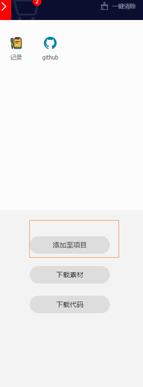
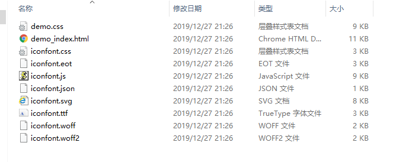
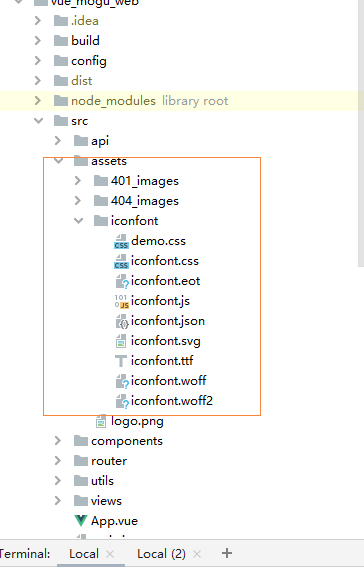
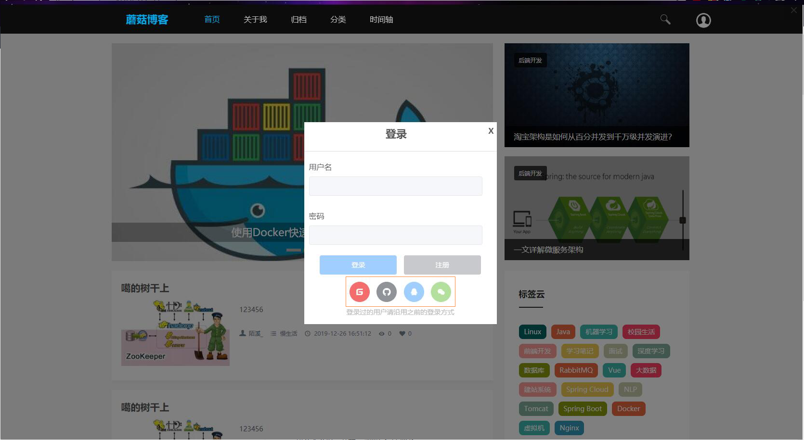

# Vue项目使用阿里巴巴矢量图标库

## 前言

最近想给前端的一些小图标都更换成矢量图，经过调查后，发现目前存在的矢量图网站有下面几个：

- [阿里巴巴矢量图标库](https://www.iconfont.cn/)
- [Fontawesome](http://www.fontawesome.com.cn/)

这两者也是有些区别的：

首先FontAwesome是可以商用并且免费，而阿里的商用具有潜在风险，因为一些图标具备版权和原创的，作者不允许商用到其它网站，当然如果没有用在商业用途上的话，是可以正常使用的

## 采购矢量图标

首先进入阿里巴巴矢量图标库的官网：[点我传送](https://www.iconfont.cn/)

首先进入的是一个搜索页面，我们输入我们需要下载的内容，然后搜索：


然后在选中对应的图标，加入购物车，挑选完成后，我们点击购物车，然后点击添加至项目



这个时候，下面会出现有一个弹框，如果没有对应的项目的话，我们需要自己创建一个


然后点击下载到本地


## 引入矢量图标

下载完成后，我们解压文件夹，得到以下的内容



我们打开demo_index.html文件


能看到每个图标对应的Unicode码，我们就安装第一种方式引入到Vue项目中

首先将刚刚文件夹内，除了demo_index.html的文件都复制到vue项目的assest中，创建一个文件夹叫iconfont 



然后我们需要在main.js中引入样式文件

```javascript
import "@/assets/iconfont/iconfont.css";
```

然后就可以使用了，注意<span>标签中的内容，就是个刚刚demo_index.html中的Unicode编码，我们引入对应的编码即可得到对应的图标

```
<span class="iconfont">&#xe601;</span>
<span class="iconfont">&#xe66f;</span>
```

下面看看最终的效果图

