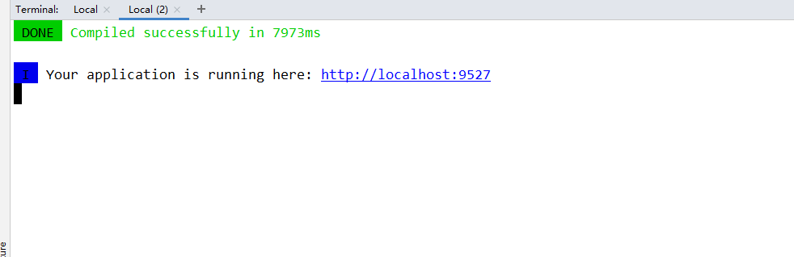

# Vue项目如何关闭Eslint校验

## 前言

最近有老哥提出蘑菇博客每次在运行的时候，都会出现一堆的错误，其实这是因为开启了ESlint校验而引起的，但是因为校验过于严格，我们没办法按照自己的喜好随心所欲书写代码，所有下面采纳了老哥的意见，将Eslint校验关闭。

## 关闭Eslint

首先我们进入vue_mogu_web项目，然后我们找到build目录下的webpack.base.conf.js文件

```
const createLintingRule = () => ({
  // test: /\.(js|vue)$/,
  // loader: 'eslint-loader',
  // enforce: 'pre',
  // include: [resolve('src'), resolve('test')],
  // options: {
  //   formatter: require('eslint-friendly-formatter'),
  //   emitWarning: !config.dev.showEslintErrorsInOverlay
  // }
})
```

然后找到createLintingRule，将里面的代码注释即可

使用 npm run dev命令，重新启动项目，能够发现原来的错误提示都没有了，瞬间感觉清爽了很多

