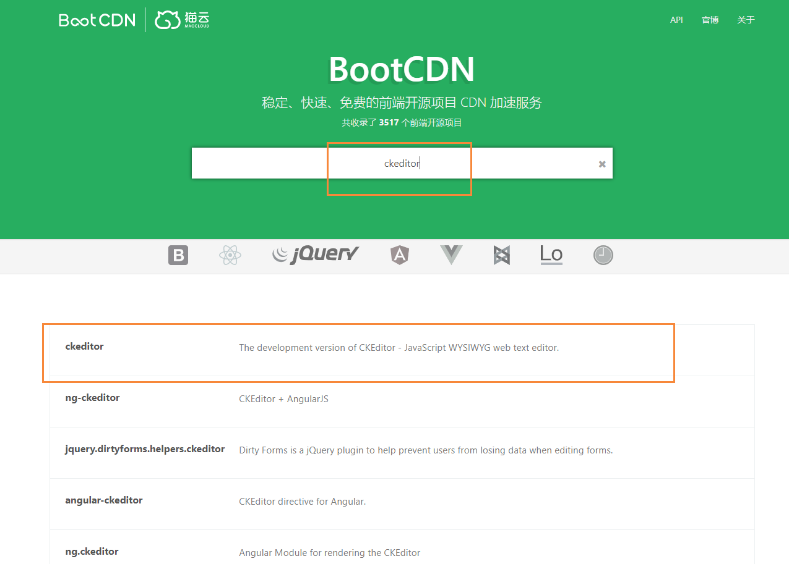
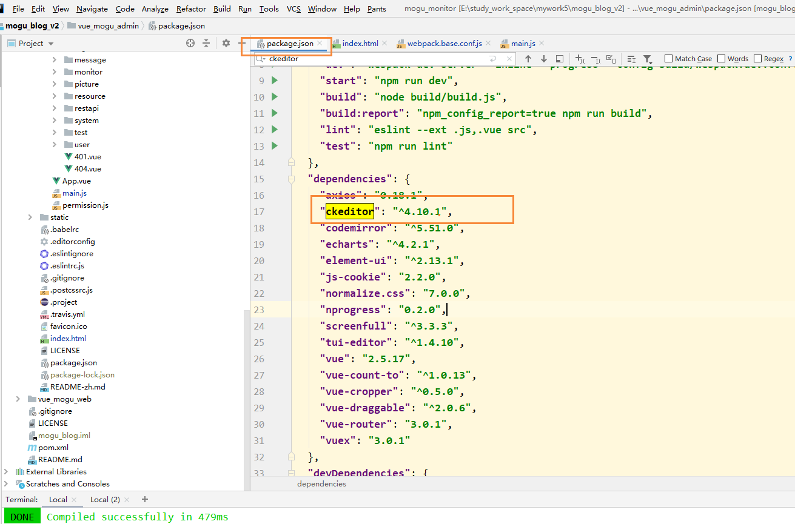

# Vue项目引入CDN加速

## 前言

最近领取的阿里云服务器，使用的是1M带宽，因此在加载一下样式，例如 ElementUI，Ckeditor的时候，非常的慢，所以考虑是用CDN来加速。


## 引入Vue和Element

首先我们需要引入的是Element的CDN加速：[传送门](https://element.eleme.cn/#/zh-CN/component/installation)

目前可以通过 [unpkg.com/element-ui](https://unpkg.com/element-ui/) 获取到最新版本的资源，在页面上引入 js 和 css 文件即可开始使用。

```
<!-- 引入样式 -->
<link rel="stylesheet" href="https://unpkg.com/element-ui/lib/theme-chalk/index.css">
<!-- 引入组件库 -->
<script src="https://unpkg.com/element-ui/lib/index.js"></script>
```

我们得到下面的最新版本，也就是 2.13.1，写入我们的index.html文件内

```
<!DOCTYPE html>
<html>

<head>
  <meta charset="utf-8">
  <meta name="viewport" content="width=device-width,initial-scale=1.0">
  <title>蘑菇云后台管理系统</title>
</head>

<!-- 引入 CKeditor-->
<!--<script src='static/ckeditor/ckeditor.js' type="text/javascript"></script>-->

<!--引入Element 和 Vue的CDN加速-->
<link rel="stylesheet" href="https://unpkg.com/element-ui@2.13.1/lib/theme-chalk/index.css">
<script src="https://unpkg.com/vue@2.5.17/dist/vue.js"></script>
<script src="https://unpkg.com/element-ui@2.13.1/lib/index.js"></script>

<body>
  <div id="app"></div>
  <!-- built files will be auto injected -->
</body>

</html>
```

## 引入Ckeditor

同时我们还是用了Ckeditor，这个时候，我们就需要通过BootCDN，找到Ckeditor进行引入。

BootCDN 是 [Bootstrap 中文网](https://www.bootcss.com/)支持并维护的前端开源项目免费 CDN 服务，致力于为 Bootstrap、jQuery、Angular、Vuejs 一样优秀的前端开源项目提供稳定、快速的免费 CDN 加速服务。BootCDN 所收录的开源项目主要同步于 [cdnjs](https://github.com/cdnjs/cdnjs) 仓库。



然后在package.json找到我们的版本号



选择对应的版本，引入即可

```
<script src="https://cdn.bootcss.com/ckeditor/4.10.1/ckeditor.js"></script>
```

## 修改main.js文件

因为我们使用CDN的方式引入文件了，因此就不需要导入element-ui了，我们将下面的代码注释

```
// element使用CDN全局引入，因此这里可以注释
// import ElementUI from 'element-ui'
// import 'element-ui/lib/theme-chalk/index.css'
// import locale from 'element-ui/lib/locale/lang/en'

// Vue.use(ElementUI, { locale })
```


## 修改webpack.base.conf.js

找到webpack.base.conf.js文件，添加下面的内容

```
  externals: {
    "CKEDITOR": "window.CKEDITOR",
    'vue': 'Vue',
    'element-ui': 'ELEMENT'
  },
```

