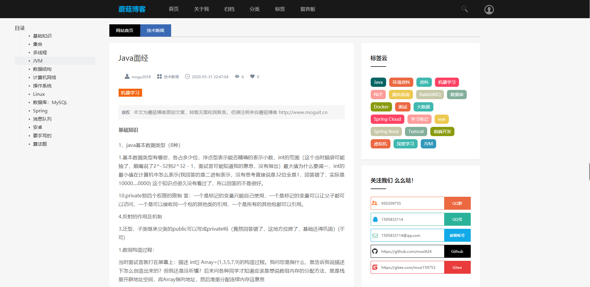
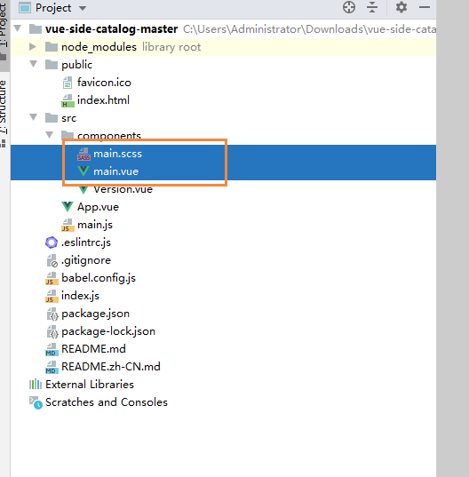
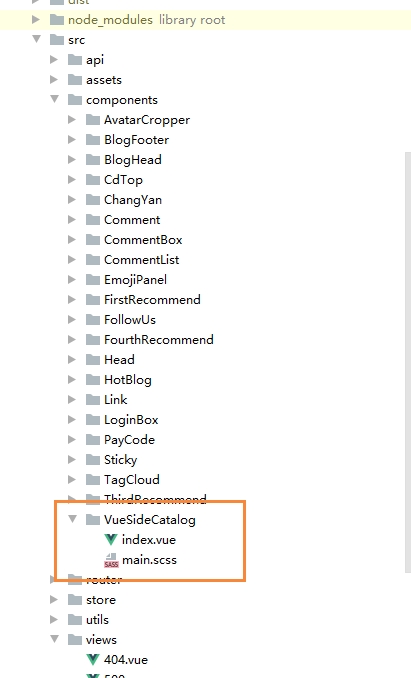
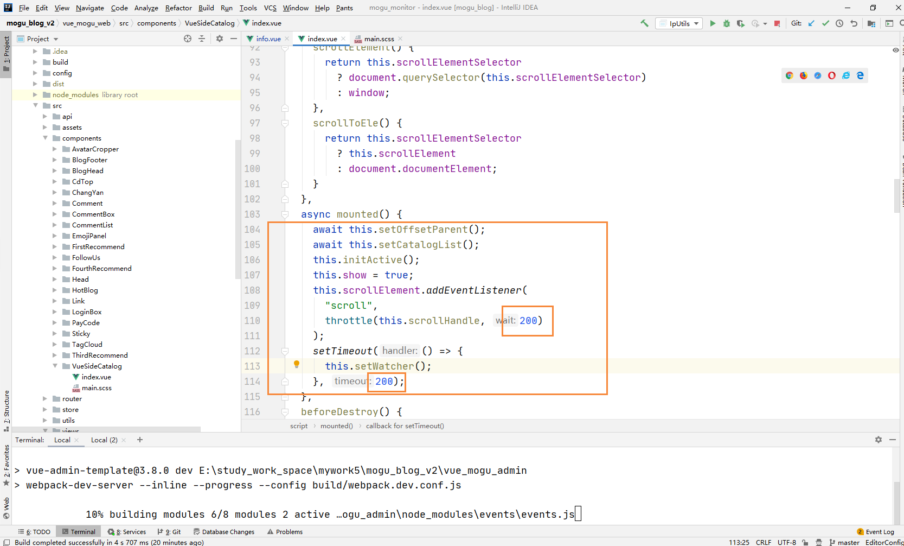

# Vue项目引入侧边导航栏

## 前言

今天打算给蘑菇博客添加一个侧边导航栏，因为之前看很多博客项目都是有侧边目录导航的，能够非常方便的我们进行信息的检索，刚好今天在逛Github的时候，发现了一款不错的侧边导航栏：[vue-side-catalog](https://github.com/yaowei9363/vue-side-catalog)，基本上能满足自己的需求，下面看看最终的效果图，如下所示



我们通过点击左侧的导航，就能够快速定位到我们的内容了，非常棒~

## 安装

### 官网

首先我们需要进入**[ vue-side-catalog](https://github.com/yaowei9363/vue-side-catalog)**的官网，然后下载对应的源码，下载完成后，我们使用一下命令进行项目启动

```
# 安装依赖
npm install

# 启动
npm run serve
```

启动完成后，然后进入  `http://localhost:8080/` 就能看到demo了

然后我们需要做的就是将源码中的components组件复制到我们的项目中




然后在我们项目的components文件夹下，创建一个VueSideCatalog中，然后把刚刚的代码复制进去，修改main.vue 为 index.vue



### 安装依赖

因为vue-side-catalog还依赖 `lodash.debounce` 和 `odash.throttle"` 因此我们还需要在我们的项目中，安装这两个的依赖

```
npm install lodash.debounce --save
npm install lodash.throttle --save
```

### 使用

在完成上面的步骤后，我们就可以开始使用了，首先引入我们的组件

```
import SideCatalog from "../components/VueSideCatalog"
```

然后配置catalogProps

```
<template>
 <div id="app">
   <div class="demo" v-html="vhtml">
   	{{vhtml}}
   </div>
  <side-catalog 
    v-bind="catalogProps"
  ></side-catalog>
  </div>
</template>
import SideCatalog from "../components/VueSideCatalog"
export default {
  components: {
    SideCatalog,
  },
  data() {
    return {
      vhtml: "",
      catalogProps:{
         containerElementSelector: '.demo',
      },
    };
  },
  mounted(){
    setTimeout(()=>{
      this.vhtml=`
        <h1>h1</h1>
        <h2>h2</h2>
        <h3>n3</h3>
      `;
    },2000);
  },
}
```

运行成功后就能够看到我们的效果了


## 注意

我们在渲染侧边栏的时候，一定需要添加把代码添加到我们的setTimeout中，也就是放在下一次dom渲染的时候。例如，下面也是博客的渲染过程，同时也需要添加setTimeout

```
setTimeout(()=>{
	this.blogDataContent = this.blogData.content
},200);
```

其中这里设置的是200ms后进行渲染，但是这个可是也是可以设置的，但是需要在index.vue文件中修改



修改完成后，就能够正常显示我们的侧边栏了~