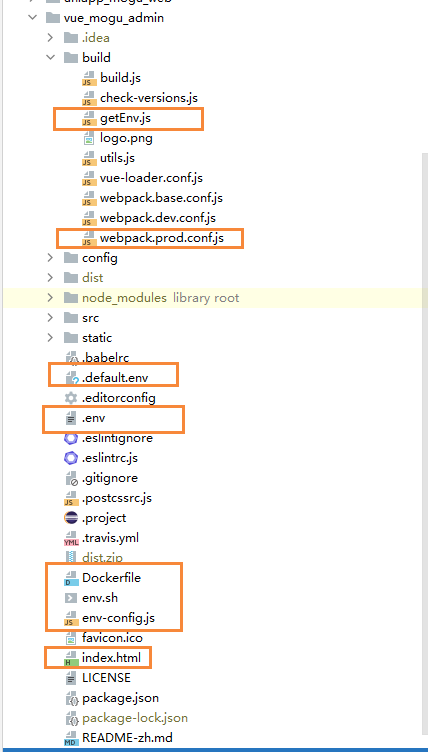
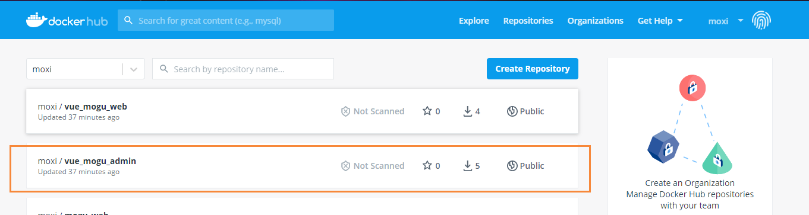
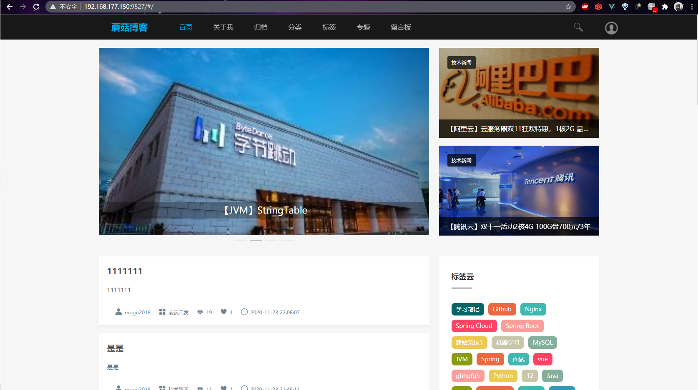
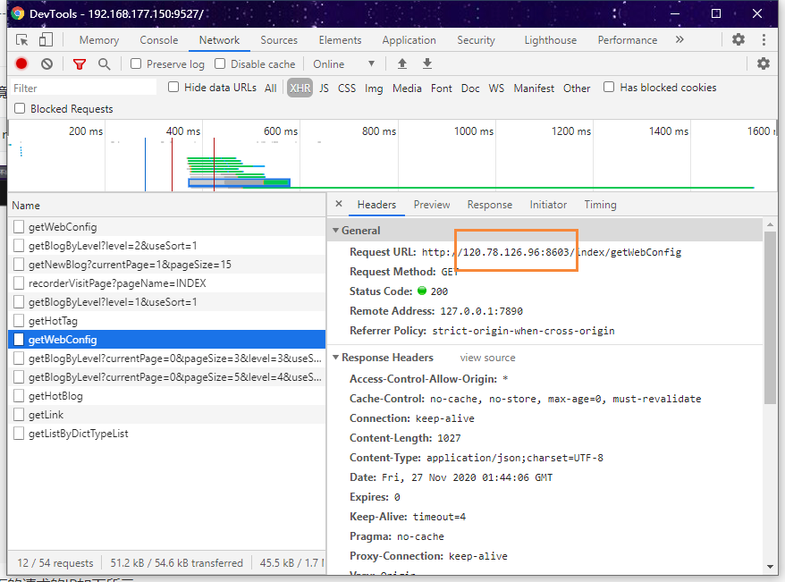
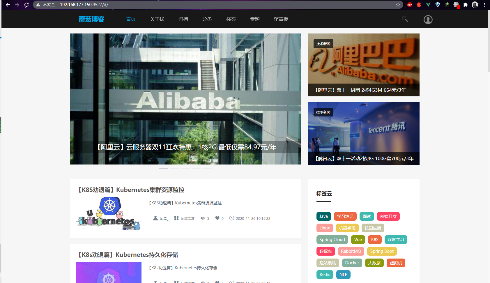
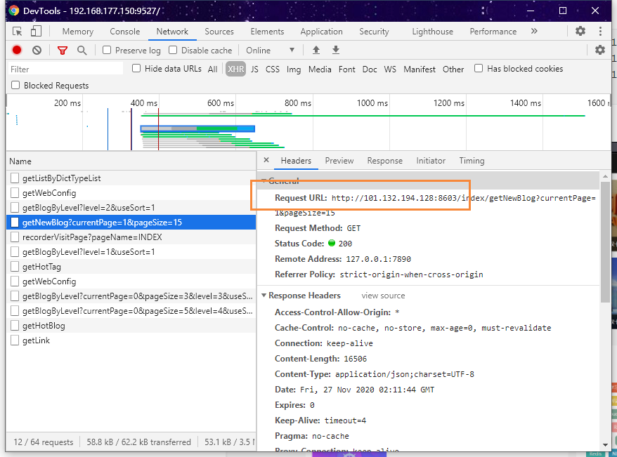

# Vue项目打包后动态配置解决方案

## 前言

首先特别感谢群里小伙伴 [@你钉钉响了](https://gitee.com/it00021hot) 提供Vue项目打包后动态配置的解决方案~【趁机白嫖过来】

最近在用docker compose构建蘑菇博客的镜像，后端容器在启动的时候，因为是从nacos中读取配置的，因此别人拉取到镜像后，只需要修改nacos的配置即可动态的修改后端项目配置。

前端项目使用Vue开发，在制作前端镜像时，对Vue项目打包后生成dist静态文件，无法读取到系统配置。这也造成了我之前的局面：每次提交一个镜像后，如果别人拉取到镜像下来，需要进行 重新 修改配置，依赖安装，打包成镜像 等繁琐的操作。这种方式简直对小白不太友好，增加了部署时的成本【环境搭建劝退】，后面参考 猪齿鱼 项目的环境解决方案，来进行修改。

## 需要修改的文件

这里主要列举出需要修改的文件，下面可以对照着进行添加和修改



## 添加.env文件

首先我们在 vue_mogu_admin项目的目录下，添加 `.env` 文件，用来保存变量，内容如下

```bash
NODE_ENV=production
WEB_API=http://120.78.126.96:8603
FILE_API=http://120.78.126.96:8600/
RABBIT_MQ_ADMIN=http://120.78.126.96:15672
SENTINEL_ADMIN=http://120.78.126.96:8070/sentinel/
EUREKA_API=http://120.78.126.96:8761
Search_API=http://120.78.126.96:8605
ADMIN_API=http://120.78.126.96:8601
Zipkin_Admin=http://120.78.126.96:9411/zipkin/
DRUID_ADMIN=http://120.78.126.96:8601/druid/login.html
SPRING_BOOT_ADMIN=http://120.78.126.96:8606/wallboard
BLOG_WEB_URL=http://120.78.126.96:9527
ELASTIC_SEARCH=http://120.78.126.96:5601
PICTURE_API=http://120.78.126.96:8602
SOLR_API=http://120.78.126.96:8080/solr
```

这里的环境变量，其实就是原来的  `prod.env.js` 里面的

## 添加.defualt.env文件

我们在 vue_mogu_admin项目的目录下， 创建一个空的文件 `.defualt.env` ，用于以后添加默认配置

## 添加 env-config.js文件

然后我们继续在 `vue_mogu_admin` 项目的目录下，添加 `env-config.js` 文件，内容如下

```bash
window._env_ = {};
```


## 添加 getEnv.js文件

在vue_mogu_admin\build 目录下，添加 `getEnv.js` 文件，用于获取 `.env` 中的配置，解析为js字符串

```js
const fs = require('fs');
const paths = require('path');

const appDirectory = fs.realpathSync(process.cwd());
const resolveApp = (relativePath) => paths.resolve(appDirectory, relativePath);
function parse(src, options) {
  const debug = Boolean(options && options.debug);
  const obj = {};

  src.toString().split('\n').forEach((line, idx) => {
    const keyValueArr = line.match(/^\s*([\w.-]+)\s*=\s*(.*)?\s*$/);
    if (keyValueArr != null) {
      const key = keyValueArr[1];

      let value = keyValueArr[2] || '';

      const len = value ? value.length : 0;
      if (len > 0 && value.charAt(0) === '"' && value.charAt(len - 1) === '"') {
        value = value.replace(/\\n/gm, '\n');
      }

      value = value.replace(/(^['"]|['"]$)/g, '').trim();

      obj[key] = value;
    } else if (debug) {
      // eslint-disable-next-line no-console
      console.log(`did not match key and value when parsing line ${idx + 1}: ${line}`);
    }
  });

  return obj;
}

function config(filePath) {
  const encoding = 'utf8';
  const debug = false;
  if (filePath) {
    try {
      const parsed = parse(fs.readFileSync(filePath, { encoding }), { debug });
      return { parsed };
    } catch (e) {
      return { error: e };
    }
  }
  throw new Error('.env path cannot be empty');
}

/**
 * 获取.env中的配置，解析为js字符串
 * @param {*} isDev
 */
function getEnv() {
  const customConfig = config(resolveApp('.env'));
  const combineEnv = customConfig.parsed;
  return `window._env_ = ${JSON.stringify(combineEnv)};`;
}

module.exports = getEnv;
```


## 更改webpack.prod.conf.js文件

### 核心代码

接着我们在`webpack.prod.conf.js` 文件中修改我们的环境变量值，改成从 `window._env_` 中获取，而不是从原来的`prod.env.js` 中获取 【这也说明.. 我们原来的 `prod.env.js ` 已经用不上了~】

```js
const fs = require('fs');
const paths = require('path');

const appDirectory = fs.realpathSync(process.cwd());
const resolveApp = (relativePath) => paths.resolve(appDirectory, relativePath);
function parse(src, options) {
  const debug = Boolean(options && options.debug);
  const obj = {};

  src.toString().split('\n').forEach((line, idx) => {
    const keyValueArr = line.match(/^\s*([\w.-]+)\s*=\s*(.*)?\s*$/);
    if (keyValueArr != null) {
      const key = keyValueArr[1];

      let value = keyValueArr[2] || '';

      const len = value ? value.length : 0;
      if (len > 0 && value.charAt(0) === '"' && value.charAt(len - 1) === '"') {
        value = value.replace(/\\n/gm, '\n');
      }

      value = value.replace(/(^['"]|['"]$)/g, '').trim();

      obj[key] = value;
    } else if (debug) {
      // eslint-disable-next-line no-console
      console.log(`did not match key and value when parsing line ${idx + 1}: ${line}`);
    }
  });

  return obj;
}

function config(filePath) {
  const encoding = 'utf8';
  const debug = false;
  if (filePath) {
    try {
      const parsed = parse(fs.readFileSync(filePath, { encoding }), { debug });
      return { parsed };
    } catch (e) {
      return { error: e };
    }
  }
  throw new Error('.env path cannot be empty');
}

/**
 * 获取.env中的配置，解析为js字符串
 * @param {*} isDev
 */
function getEnv() {
  const customConfig = config(resolveApp('.env'));
  const combineEnv = customConfig.parsed;
  return `window._env_ = ${JSON.stringify(combineEnv)};`;
}

module.exports = getEnv;

4、更改webpack.prod.conf.js
核心代码
const getEnv = require('./getEnv')

    new webpack.DefinePlugin({
      'process.env': `window._env_` //构建时定义process.env值为window._env_的值
    }),
    
    new HtmlWebpackPlugin({
      filename: config.build.index,
      template: 'index.html',
      inject: true,
      favicon: resolve('favicon.ico'),
      title: '蘑菇云后台管理系统',
      env: getEnv(), //插件生成html模本读取.env文件为env
      minify: {
        removeComments: true,
        collapseWhitespace: true,
        removeAttributeQuotes: true
        // more options:
        // https://github.com/kangax/html-minifier#options-quick-reference
      }
      // default sort mode uses toposort which cannot handle cyclic deps
      // in certain cases, and in webpack 4, chunk order in HTML doesn't
      // matter anyway
    }),
     new CopyWebpackPlugin([
      {
        from: path.resolve(__dirname, '../static'),
        to: config.build.assetsSubDirectory,
        ignore: ['.*']
      },
      //拷贝新增的四个文件到dist中
      {
        from: path.resolve(__dirname,'../.env'),
        to: './'
      },
      {
        from: path.resolve(__dirname, '../env.sh'),
        to: './'
      },
      {
        from: path.resolve(__dirname, '../.default.env'),
        to: './'
      },
      {
        from: path.resolve(__dirname, '../env-config.js'),
        to: './'
      },
    ])
```

### 完整代码

完整的代码如下所示

```js
'use strict'
const path = require('path')
const utils = require('./utils')
const webpack = require('webpack')
const config = require('../config')
const merge = require('webpack-merge')
const baseWebpackConfig = require('./webpack.base.conf')
const CopyWebpackPlugin = require('copy-webpack-plugin')
const HtmlWebpackPlugin = require('html-webpack-plugin')
const ScriptExtHtmlWebpackPlugin = require('script-ext-html-webpack-plugin')
const MiniCssExtractPlugin = require('mini-css-extract-plugin')
const OptimizeCSSAssetsPlugin = require('optimize-css-assets-webpack-plugin')
const UglifyJsPlugin = require('uglifyjs-webpack-plugin')
const getEnv = require('./getEnv')

function resolve(dir) {
  return path.join(__dirname, '..', dir)
}


// For NamedChunksPlugin
const seen = new Set()
const nameLength = 4

const webpackConfig = merge(baseWebpackConfig, {
  mode: 'production',
  module: {
    rules: utils.styleLoaders({
      sourceMap: config.build.productionSourceMap,
      extract: true,
      usePostCSS: true
    })
  },
  devtool: config.build.productionSourceMap ? config.build.devtool : false,
  output: {
    path: config.build.assetsRoot,
    filename: utils.assetsPath('js/[name].[chunkhash:8].js'),
    chunkFilename: utils.assetsPath('js/[name].[chunkhash:8].js')
  },
  plugins: [
    // http://vuejs.github.io/vue-loader/en/workflow/production.html
    new webpack.DefinePlugin({
      'process.env': `window._env_`
    }),
    // extract css into its own file
    new MiniCssExtractPlugin({
      filename: utils.assetsPath('css/[name].[contenthash:8].css'),
      chunkFilename: utils.assetsPath('css/[name].[contenthash:8].css')
    }),
    // generate dist index.html with correct asset hash for caching.
    // you can customize output by editing /index.html
    // see https://github.com/ampedandwired/html-webpack-plugin
    new HtmlWebpackPlugin({
      filename: config.build.index,
      template: 'index.html',
      inject: true,
      favicon: resolve('favicon.ico'),
      title: '蘑菇云后台管理系统',
      env: getEnv(),
      minify: {
        removeComments: true,
        collapseWhitespace: true,
        removeAttributeQuotes: true
        // more options:
        // https://github.com/kangax/html-minifier#options-quick-reference
      }
      // default sort mode uses toposort which cannot handle cyclic deps
      // in certain cases, and in webpack 4, chunk order in HTML doesn't
      // matter anyway
    }),
    new ScriptExtHtmlWebpackPlugin({
      //`runtime` must same as runtimeChunk name. default is `runtime`
      inline: /runtime\..*\.js$/
    }),
    // keep chunk.id stable when chunk has no name
    new webpack.NamedChunksPlugin(chunk => {
      if (chunk.name) {
        return chunk.name
      }
      const modules = Array.from(chunk.modulesIterable)
      if (modules.length > 1) {
        const hash = require('hash-sum')
        const joinedHash = hash(modules.map(m => m.id).join('_'))
        let len = nameLength
        while (seen.has(joinedHash.substr(0, len))) len++
        seen.add(joinedHash.substr(0, len))
        return `chunk-${joinedHash.substr(0, len)}`
      } else {
        return modules[0].id
      }
    }),
    // keep module.id stable when vender modules does not change
    new webpack.HashedModuleIdsPlugin(),
    // copy custom static assets
    new CopyWebpackPlugin([
      {
        from: path.resolve(__dirname, '../static'),
        to: config.build.assetsSubDirectory,
        ignore: ['.*']
      },
      {
        from: path.resolve(__dirname,'../.env'),
        to: './'
      },
      {
        from: path.resolve(__dirname, '../env.sh'),
        to: './'
      },
      {
        from: path.resolve(__dirname, '../.default.env'),
        to: './'
      },
      {
        from: path.resolve(__dirname, '../env-config.js'),
        to: './'
      },
    ])
  ],
  optimization: {
    splitChunks: {
      chunks: 'all',
      cacheGroups: {
        libs: {
          name: 'chunk-libs',
          test: /[\\/]node_modules[\\/]/,
          priority: 10,
          chunks: 'initial' // 只打包初始时依赖的第三方
        },
        elementUI: {
          name: 'chunk-elementUI', // 单独将 elementUI 拆包
          priority: 20, // 权重要大于 libs 和 app 不然会被打包进 libs 或者 app
          test: /[\\/]node_modules[\\/]element-ui[\\/]/
        }
      }
    },
    runtimeChunk: 'single',
    minimizer: [
      new UglifyJsPlugin({
        uglifyOptions: {
          mangle: {
            safari10: true
          }
        },
        sourceMap: config.build.productionSourceMap,
        cache: true,
        parallel: true
      }),
      // Compress extracted CSS. We are using this plugin so that possible
      // duplicated CSS from different components can be deduped.
      new OptimizeCSSAssetsPlugin()
    ]
  }
})

if (config.build.productionGzip) {
  const CompressionWebpackPlugin = require('compression-webpack-plugin')

  webpackConfig.plugins.push(
    new CompressionWebpackPlugin({
      asset: '[path].gz[query]',
      algorithm: 'gzip',
      test: new RegExp(
        '\\.(' + config.build.productionGzipExtensions.join('|') + ')$'
      ),
      threshold: 10240,
      minRatio: 0.8
    })
  )
}

if (config.build.generateAnalyzerReport || config.build.bundleAnalyzerReport) {
  const BundleAnalyzerPlugin = require('webpack-bundle-analyzer')
    .BundleAnalyzerPlugin

  if (config.build.bundleAnalyzerReport) {
    webpackConfig.plugins.push(
      new BundleAnalyzerPlugin({
        analyzerPort: 8080,
        generateStatsFile: false
      })
    )
  }

  if (config.build.generateAnalyzerReport) {
    webpackConfig.plugins.push(
      new BundleAnalyzerPlugin({
        analyzerMode: 'static',
        reportFilename: 'bundle-report.html',
        openAnalyzer: false
      })
    )
  }
}

module.exports = webpackConfig
```


## 修改index.html

然后我们修改 vue_mogu_admin\index.html 文件，我们需要在` index.html` 把我们的环境变量放入进去

```bash
<script id=env><%= htmlWebpackPlugin.options.env %></script>
```

我是放在 `<head></head>`中

```bash
<head>
  <meta charset="utf-8">
  <meta name="viewport" content="width=device-width,initial-scale=1.0">
  <title>蘑菇云后台管理系统</title>
  <script id='env'><%= htmlWebpackPlugin.options.env %></script>
</head>
```

## 添加env.sh

下面我们需要在 `vue_mogu_admin` 目录下添加 `env.sh` 文件，用于容器启动时，替换环境变量

```bash
#!/bin/bash
set -x
set -e

# Recreate config file
absolute_path=$(cd `dirname $0`; pwd)
env_config=${absolute_path}/env-config.js

rm -rf ${env_config}
touch ${env_config}

# Add assignment
echo "window._env_ = {" >> ${env_config}

# Read each line in .env file
# Each line represents key=value pairs

sed -i '/^[[:space:]]*$/d' ${absolute_path}/.env

while read -r line || [[ -n "$line" ]];
do
  # Split env variables by character `=`
  if printf '%s\n' "$line" | grep -q -e '='; then
    varname=$(printf '%s\n' "$line" | sed -e 's/=.*//')
    varvalue=$(printf '%s\n' "$line" | sed -e 's/^[^=]*=//')
  fi

  # Read value of current variable if exists as Environment variable
  value=$(printf '%s\n' "${!varname}")
  # Otherwise use value from .env file
  [[ -z $value ]] && value=${varvalue}

  # Append configuration property to JS file
  echo "  $varname: \"$value\"," >> ${env_config}
done < ${absolute_path}/.env

sed -i '/^[[:space:]]*$/d' ${absolute_path}/.default.env

while read -r line || [[ -n "$line" ]];
do
  # Split env variables by character `=`
  if printf '%s\n' "$line" | grep -q -e '='; then
    varname=$(printf '%s\n' "$line" | sed -e 's/=.*//')
    varvalue=$(printf '%s\n' "$line" | sed -e 's/^[^=]*=//')
  fi

  # Read value of current variable if exists as Environment variable
  value=$(printf '%s\n' "${!varname}")
  # Otherwise use value from .env file
  [[ -z $value ]] && value=${varvalue}

  # Append configuration property to JS file
  echo "  $varname: \"$value\"," >> ${env_config}
done < ${absolute_path}/.default.env

echo "}" >> ${env_config}
sed -e "s/\//\\\/g" ${env_config}
STR=`echo $(cat ${env_config}) | sed 's#\/#\\\/#g'`
mv ${absolute_path}/index.html ${absolute_path}/index.html.bak
#sed -e "s/window\.\_env\_.*\}\;/${STR}/g" ${absolute_path}/index.html.bak > ${absolute_path}/index.html
sed -e "s#<script id=env>window._env_.*\};</script>#<script id=env>${STR};</script>#g" ${absolute_path}/index.html.bak > ${absolute_path}/index.html
cat ${env_config}

exec "$@"
```

## 编写Dockerfile

下面我们就可以编写Dockerfile文件进行Docker镜像构建相关操作

```bash
FROM registry.cn-shenzhen.aliyuncs.com/mogu-zh/nginx:latest
ADD ./dist/ /usr/share/nginx/html
RUN sed -i 's/\r$//' /usr/share/nginx/html/env.sh
RUN chmod +x /usr/share/nginx/html/env.sh
ENTRYPOINT ["/usr/share/nginx/html/env.sh"]
CMD ["nginx", "-g", "daemon off;"]
```

上述的Dockerfile文件，主要就是以nginx作为基础镜像，然后将我们的 dist文件夹放到 nginx目录下，然后执行脚本进行替换环境变量

## 打包镜像

完成上述的操作后，我们就可以在服务器上进行vue_mogu_admin的镜像构建了，然后提交到DockerHub中

```bash
# 安装依赖
npm install
# 打包
npm run build
# 构建镜像
docker build -t moxi/vue_mogu_admin .
# 提交镜像
docker push moxi/vue_mogu_web
```

最后在DockerHub就能看到我们刚刚构建的镜像



## 测试

### 默认配置

在构建好镜像后，我们就可以在服务器拉取我们的镜像进行测试，首先测试使用默认的配置

```bash
docker run --name vue_mogu_web -d  -it  -p 9527:80 moxi/vue_mogu_web
```



能看到下面的请求的IP如下所示



### 动态配置

下面我们在启动的时候，携带我们的变量

```bash
docker run --name vue_mogu_web -d  -it \
-e VUE_MOGU_WEB=http://101.132.194.128:9527 \
-e PICTURE_API=http://101.132.194.128:8602 \
-e PICTURE_API=http://101.132.194.128:8602 \
-e WEB_API=http://101.132.194.128:8603 \
-e ELASTICSEARCH=http://101.132.194.128:8605 \
-p 9527:80 moxi/vue_mogu_web
```

执行完成后，我们再次打开页面，发现已经变成了蘑菇博客的线上环境了~



打开F12，查看请求端口，发现ip地址已经成功修改了



到此为止，动态配置解决方案已经完成 ~