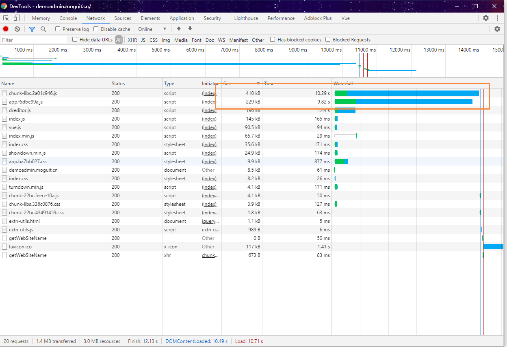
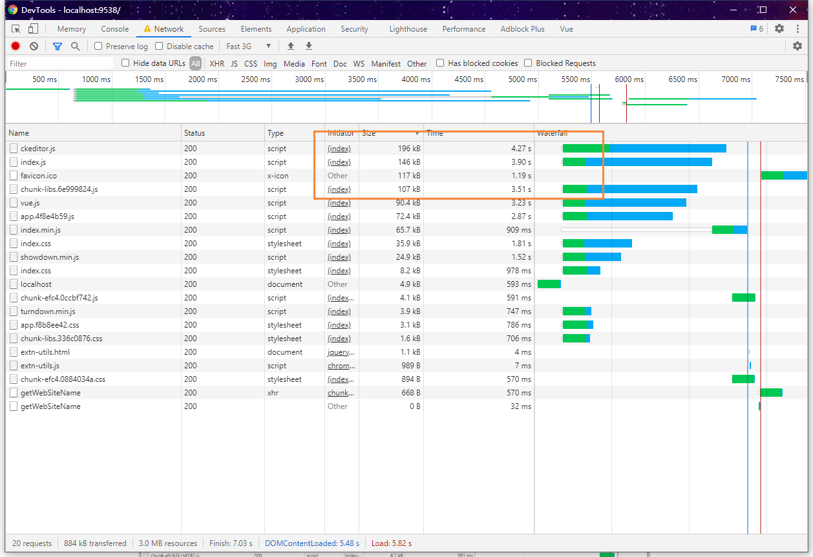

# 解决Vue项目打包后js文件过大的问题

## 前言

这阵子因为白嫖了一台阿里云的服务器，配置是 2核4G1M，但是因为带宽太低了，每次在首屏加载的时候，时间过于缓慢，通过Chrome的F12性能调试，发现主要原因是因为加载的 **js** 过大而引起的。因为之前已经提到了将我们一些组件改成CDN方式引入，例如 Vue、ElementUi、ECharts等。但是还是存在一些打包后的内部 js 文件，他们的大小也过于庞大，因此本文将主要讲解如何解决Vue项目打包后js文件过大的问题。

## 引入插件

我们可以通过引入 **compression-webpack-plugin** 插件，然后开启 **gzip** 来解决本问题

首先安装插件依赖

```bash
npm i compression-webpack-plugin@5.0.1
```

然后修改  **config/index.js** 文件，把 **productionGzip** 改为：**true**

```bash
productionGzip: true,
productionGzipExtensions: ['js', 'css'],
```

然后在修改 **build/webpack.prod.conf.js** 文件，修改如下内容

```bash
// 判断配置文件是否开启了gzip加速
if (config.build.productionGzip) {
  // 引入压缩文件的组件，该插件会对生成的文件进行压缩，生成一个.gz文件
  const CompressionWebpackPlugin = require('compression-webpack-plugin')
  webpackConfig.plugins.push(
    new CompressionWebpackPlugin({
      filename: '[path].gz[query]', // 目标文件名
      algorithm: 'gzip',  // 使用gzip压缩
      test: new RegExp( // 满足正则表达式的文件会被压缩
        '\\.(' + config.build.productionGzipExtensions.join('|') + ')$'
      ),
      threshold: 10240, // 资源大于10240=10KB时会被压缩
      minRatio: 0.8,
      deleteOriginalAssets: false, // 是否删除原资源
    })
  )
}
```

## 打包

修改完成后，我们打包项目

```bash
npm run build
```

打包完成后，我们查看 dist目录，能够发现很多 **js** 文件已经被压缩了


我们看到这里，说明已经成功将js压缩了

## 修改Nginx配置

因为我们 **Vue** 项目打包后，部署的是静态文件，因此我们还需要在 **nginx** 处开启 **gzip**， 找到 **nginx.conf**

```bash
# on为启用，off为关闭
gzip on;
# Nginx的动态压缩是对每个请求先压缩再输出，这样造成虚拟机浪费了很多cpu，解决这个问题可以利用nginx模块Gzip Precompression，这个模块的作用是对于需要压缩的文件，直接读取已经压缩好的文件(文件名为加.gz)，而不是动态压缩，对于不支持gzip的请求则读取原文件
gzip_static on;
# 设置允许压缩的页面最小字节数，页面字节数从header头中的Content-Length中进行获取。默认值是0，不管页面多大都压缩。建议设置成大于1k的字节数，小于1k可能会越压越大。
gzip_min_length 1k;
# 获取多少内存用于缓存压缩结果，‘4 16k’表示以16k*4为单位获得
gzip_buffers 4 32k;
# 识别http协议的版本,早起浏览器可能不支持gzip自解压,用户会看到乱码
gzip_http_version 1.1;
# gzip压缩比（1~9），越小压缩效果越差，但是越大处理越慢，所以一般取中间值;
gzip_comp_level 2;
# 对特定的MIME类型生效,其中'text/html’被系统强制启用
gzip_types text/plain application/x-javascript text/css application/xml;
# 启用应答头"Vary: Accept-Encoding"
gzip_vary on;
# IE5.5和IE6 SP1使用msie6参数来禁止gzip压缩 )指定哪些不需要gzip压缩的浏览器(将和User-Agents进行匹配),依赖于PCRE库
gzip_disable "MSIE [1-6].";
```

设置完成后，我们重启 **nginx**

## 测试

下面我们开始进行测试，首先开未压缩前的，我们可以看到打包后的 **js** 大小为 **410KB** 和 **229KB**



然后在看压缩后的效果，我们发现文件的大小已经被大幅度的压缩，同时响应时间也得到了提升



到这里为止，我们的响应时间过于缓慢的问题也得到了解决