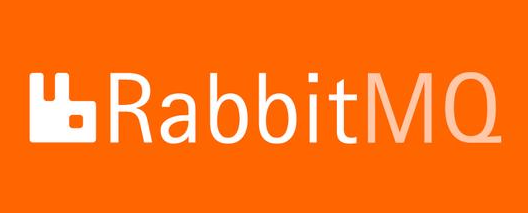

## 前言

大家好，我是**陌溪**

最近群里很有小伙伴问我有没有**蘑菇博客**的入门指南，因为蘑菇博客经过了两年的技术迭代，已经包含了非常多的知识点了，从**SpringBoot** 到 **SpringCloud**，从**Solr** 到 **ElasticStack** ... 。里面的内容错综复杂，难免会让刚刚入门的 **Java小萌新** 束手无策，所以我就打算梳理一下博客中的知识点，**方便萌新小伙伴入门** ~。

经过我这两天的整理，下面把我学习 **Java** 的路线指南总结了一下，希望对小伙伴们有所帮助~

下面我的内容主要以**视频教程**为主，因为我觉得**通过视频**来学习是**一条非常适合新手入门的路**。千万不要觉得看视频会显得自己学习能力不够强，因为编程本身是一个**实践性特别强**的科目，需要我们跟着老师的思路进行编码训练，从而加强自己的编码能力。因此我建议在观看视频的过程中，小伙伴们能够 **做好笔记**，**跟着老师一块写代码**。

本文主要针对**萌新入门指南**，如果是**老司机可以结合视频和书籍进行学习**，请**萌新小伙伴**坐稳扶好，我们发车~。

## 工欲善其事，必先利其器

在我们开工前，我们肯定要选择一款好的 **IDE** 编辑器，这样能让我们的编码达到**事半功倍**的效果。

其实我是用过很多编辑器的，如 **Eclipse** 、**MyEclipse**、**STS**、**VSCode**、**Intellij IDEA**

首先 **Eclipse** 、**MyEclipse**、**STS** 其实都是比较类似的，**Eclipse** 被称为 **Java** 集成开发环境，并且是开源免费。MyEclipse在Eclipse基础增加了一些插件，而 **STS** 则是专用于 **Spring** 开发。

**VSCode** 是由微软开发的一款跨平台编辑器，目前支持几乎所有的主流编程语言，不仅仅是开发 **Java**

**Intellij IDEA** 是目前业界公认最好的 **Java** 开发工具，尤其是在智能代码助手、代码提示、版本控制等方面表示突出，并且**GUI**设计也非常符合审美规范，我从Eclipse 被小伙伴安利到了 **Intellij IDEA**，特意花了几周适应快捷键

目前我已经从 **Eclipse** 系 平稳过度到了**Jetbrains** 全家桶，同时 J**etbrains** 全家桶对**学生免费开放**，并且如果你拥有**开源项目**的话，也可以申请到一份免费的开源 **License** 。陌溪就是通过蘑菇博客申请到了两份 **License** ，用于两台电脑的 **IDEA** 登录。

小伙伴如果第一次接触 Java，我推荐你直接上车 **Intellij IDEA** 。同时我强烈建议你**花上几个小时**的时间，学习一下 **IDEA** 的基础用法，这将会让你在后面的**编码阶段健步如飞**。

> Bilibili 宋红康老师 尚硅谷IDEA教程：
>
> https://www.bilibili.com/video/BV1PW411X75p

## JavaSE

**JavaSE**是 **Java** 的核心和基础，我最早接触 **JavaSE**  是在 **2014年10月** ，那会刚刚上**大二**，学校刚刚开设 **Java** 课程。那会的老师在给我们讲解 **JavaGui** 编程的时候，我突然发现原来通过代码写出来的东西，不仅仅只是在黑框框上运行，也是有可视化的界面，从这一刻我突然对 **Java** 有了浓厚的兴趣。

> 为啥学 C++ 的时候没有这感觉？因为觉得C++只能写出黑框框程序，还有就是指针& * ... 

后面又通过网上冲浪，我发现了传智播客的视频教程，从此就开启了 **Java** 入门之旅。

我最先接触的是传智播客毕向东老师的 **Java基础视频教程** ，毕老师诙谐幽默的语言，然后丝毫感受不到学习的枯燥。在 **Java** 基础课程中，会学习到 Java环境的搭建、进制的转换、运算符、条件语句、数组、**面向对象**、多线程、**集合类**、**IO流**  等内容。在基础部分是最花费时间的，我当初在大二的时候，学习基础就花费了两三个月才看完...。同时我也希望刚刚入门的小伙伴们，能够**打好基础**，这样才能**走的更远**。

> Bilibili 毕向东老师Java基础：
>
>  https://www.bilibili.com/video/BV1Rt411f7F5

毕老师的 **Java** 基础视频，算的上是经典之作。不过视频课程诞生较早，在加上里面有些内容，例如 **JavaGui** ，其实在现在已经被淘汰了，同时那会比较主流的 **JDK** 版本还是基于 **Java 1.6** 。 而现在基本都已经升级到 **JDK 1.8** 了

这里我推荐尚硅谷宋红康老师的 **Java** 零基础教程，本套视频在毕老师视频的基础上，摒弃了很多已经淘汰的技术，同时为了方便萌新入门，对计算机的发展史都做了讲解，同时还对 **Java** 的发展史都做了全局的概览，让我们在学习Java的时候，能够非常清楚的知道以后 **Java** 能用来做什么，最后对 **JDK 8**  ~ **JDK 11** 等多个版本的新特性都做了讲解。

>Bilibili 宋红康老师 尚硅谷 Java零基础教程：
>
>https://www.bilibili.com/video/BV1Kb411W75N

在 **JavaSE** 阶段，小伙伴们需要掌握一下几个重点部分

>  面向对象、集合类、IO流、反射、泛型、异常处理

## MySQL

在学习完 **JavaEE** 的课程后，我们就可以开始 **MySQL** 数据库的学习了。这门课程可能很多小伙伴在本科大二或者大三的时候会开设，如果已经学过的小伙伴，那么这个小节就可以直接跳过。

在这里，我们将学习数据库和表的常用操作、约束、视图、存储过程和函数、流程控制结构以及综合运用各种命令实现数据的增删改查操作。

> Bilibili尚硅谷 MySQL入门：
>
> https://www.bilibili.com/video/BV12b411K7Zu

## JDBC

**JDBC** 的全称是 **Java Data Base Connectivity** ，即 **Java** 数据库连接。目的是为了简化和统一对数据库的操作，定义的一套 **Java** 操作数据库的规范。

**JDBC** 的开发步骤主要分为一下四步：加载驱动、获得连接、基本操作、释放资源

在后面我们将会学习一些 **ORM** 框架，比如 **Hibernate**、**MyBatis**、**MyBatis Plus** ，他们将会屏蔽很多技术实现细节，让我们更加专注于业务的编码，但是如果我们提升内功，进行**MySQL调优**，这个时候就需要查看内部实现细节，就可能需要用到 **JDBC** 了。

因此，本章节如果对于想要快速入门的小伙伴，可以直接跳过。

> Bilibili尚硅谷JDBC核心技术：
>
> https://www.bilibili.com/video/BV1eJ411c7rf

## JavaWeb

在学习完 **Java** 基础和如何使用 **Java** 操作 **MySQL** 数据库，就进入到了 **JavaWeb** 的阶段，在这里我们将学习一些前端的技术，用来开发页面(不要说，这是前端做的，有的时候去了小公司的话，可能你就是全栈开发了...)。

前端技术我们主要会学习：HTML、CSS、JavaScript、JQuery等。

关于后端技术，我们主要学习Servlet程序、Filter过滤器、Listener监听器、JSP页面、EL表达式、JSTL标签库、jQuery框架、Cookie技术、Session会话、JSON使用、Ajax请求等大量Web开发核心技术点。

同时最后将会结合目前学习到的技术，完成一个**书城项目**。JavaWeb的课程主要是让我们奠定扎实的基础，为以后框架学习做好技术准备。

> Bilibili 尚硅谷 王振国老师 JavaWeb全套教程：
>
> https://www.bilibili.com/video/BV1Y7411K7zz

ps：最近讨论比较激烈的话题就是，2020年了，我们还需要学习 **JSP** 么，下面是我在知乎搜索 **JSP** 时出现的讨论

其实 **JSP**  在后面是有很多被替代的**模板引擎**，比如：**Freemark**、**Thymeleaf** ，但是他们因为都是**模板引擎**，所以基本上用法和 **JSP** 都差不多，就是通过自己的**标签语法**将后台的数据渲染出来，因此为了后面能够非常平稳的过度，还是建议小伙伴们能够了解一下，掌握基本的用法即可，毕竟还有非常多的**旧项目**还在使用 **JSP**进行维护和开发。

## JavaEE

**JavaEE** 又被称为 **J2EE**，主要是用于开发 **Java** 企业应用。在这里我们主要将会学习 **Java** 企业开发框架 **SSM**，即 **Spring**、**SpringMVC**、**MyBatis** 。

**Spring框架**：是一个轻量级 **Java** 开发框架，主要是为了解决企业应用开发的复杂性而创建的。

**SpringMVC框架**：SpringMVC 分离了 控制器、模型对象、分派器，让我们更容易进行开发定制

**MyBatis框架**：是一个 **Java** 持久层框架，用于操作数据库，消除了几乎所有的 **JDBC** 代码，使用简单的 XML 或 注解即可完成数据库操作。

> SSH框架，即 Struts2、Spring、Hibernate 框架。现在Structs2 和 Hibernate相对用的较少，因此这里就暂时不推荐现在去了解。

### Maven

**Maven** 是目前流行的自动化构建工具，也是一款在大型项目开发过程中不可或缺的重要工具。

陌溪在本科时期，老师教我们用 **JDBC** 连接数据库时，那会就还没有用到 **Maven** 进行依赖管理，当初开发是非常痛苦的，需要我们自己去找相关的 j**ar** 包，例如：commons-dbcp、commons-pool、mysql-connector-jar。而且非常容易出现版本冲突，直到后面学习了 **Maven** ，终于摆脱了自己寻找 **jar** 包的痛苦了，因为都通过统一的中央仓库来管理依赖，我们只需要通过定义基本坐标，就可以将依赖引入到项目中。

在本节中，我们将会学习：**Maven** 的作用、常用的命令、如何配置依赖、依赖的范围、依赖的传递性、依赖的排除、生命周期等

> Bilibili尚硅谷Maven视频教程：
>
> https://www.bilibili.com/video/BV1TW411g7hP

### Spring

Spring5框架是一个轻量级开源的JavaEE框架，为了解决企业应用开发的复杂性而出现，它提供了功能强大IOC、AOP及Web MVC等功能。Spring框架可以单独构建应用程序，也可以和其他框架组合使用。Spring框架凭借其强大的功能以及优良的性能，在企业开发中被广泛应用。

在这里，我们主要从 **Spring5** 框架的基础开始学习，然后需要学习的技术包括：**Spring5基础知识**、**IOC容器**、**AOP**、**JdbcTemplate**、**事务**、Spring5新功能等。

其中，**IOC容器** 、**AOP** 和 **事务** 这几个部分是非常重要的点，在以后面试中，主要问到 **Spring** 框架，那么它们就是必问的考点，因此在这节需要小伙伴们能够好好的学习。**Spring** 框架将奠定我们整个 **Java** 编码的基石，毫不夸张的说，**学习Java就是学习Spring开发** 。

> Bilibili尚硅谷Spring5框架：
>
> https://www.bilibili.com/video/BV1Vf4y127N5

### SpringMVC

**SpringMVC**框架采取了松耦合可插拔组件结构，比其它MVC框架更加具有扩展性和灵活性，在这里我们将学习到 RequestMapping、RequestParam 等注解的使用，以及 拦截器、过滤器、国际化、文件上传和异常处理等方面的内容。同时将会学习到 REST风格的URL请求，这将会让使我们未来在完成前后端分离项目时，如虎添翼。

> Bilibili 尚硅谷 SpringMVC：
>
> https://www.bilibili.com/video/BV1PE411W7BW

### Mybatis

**MyBatis** 是一款优秀的持久层框架，它支持自定义 **SQL**、存储过程以及高级映射。**MyBatis** 免除了几乎所有的 **JDBC** 代码以及设置参数和获取结果集的工作。**MyBatis** 可以通过简单的 XML 或注解来配置和映射原始类型、接口和 **Java POJO**（Plain Old Java Objects，普通老式 Java 对象）为数据库中的记录。

在这节，我们将学习如何编写 **Mybatis** 配置文件、配置动态 **SQL**、**缓存机制**、整合 **SSM** 以及 **Mybatis逆向工程**

想当初陌溪在开发**蘑菇博客**第一版本的时候，就是使用的**SSM**框架。那会在整合SSM框架的时候，足足花费了 **2** 周的时间，那会视频教程没有这么多，我在遇到问题只能通过**百度**和 **Google**来检索，还好最后终于成功了~

同时通过学习 **Mybatis逆向工程**，可以自动生成基础的代码，让我们更加专注于业务的开发。

> Bilibili尚硅谷MyBatis实战教程：
>
> https://www.bilibili.com/video/BV1mW411M737

### MybatisPlus

MyBatisPlus是一款非常强大的MyBatis增强工具包，**只做增强不做改变**。

陌溪最早接触 **Mybatis-Plus** 的时候，是在逛**码云**的时候看到的，那会它已经是年度最受欢迎的开源项目了，然后我为了学习 **Mybatis-Plus** 的使用，在蘑菇博客技术选型的时候，就把 **Mybatis-Plus** 作为了蘑菇博客的ORM框架。

> Mybatis-Plus开源地址：
>
> https://gitee.com/baomidou/mybatis-plus

**Mybatis-Plus** 在不用编写任何 **SQL语句** 的情况下即可以方便的实现单一、批量、分页等操作。

在这节，我们将学习，如何集成 **MyBatisPlus**、通用 **CRUD**、**EntityWrapper** 条件构造器、**ActiveRecord** 等基本操作，更有**代码生成器**、**插件扩展**、**自定义全局操作**、**公共字段填充**、**Idea** 快速开发插件等高阶技术.。

同时会涉及到 **MyBatis** 框架相关的原理，需要我们提前对 **Mybatis** 有一定的了解。

> Bilibili尚硅谷Mybatis-Plus教程：
>
> https://www.bilibili.com/video/BV1Ds411E76Y

## Git

我们把上面的内容学习完之后，其实就已经可以开始上手写项目了。

但是以后工作肯定不会是一个人**单打独斗**，而是需要和大家一块**协同开发**，但是协同开发不可避免的就会遇到**代码冲突**，就是两个人同时修改某一块区域，最终以谁的代码为准？

这个时候 **Git** 就出现了，**Git** 一个最重要的功能就是 **版本控制**，让我们在开发过程中管理我们对文件、目录或工程等内容的修改历史。方便我们查看更改历史记录和备份，以便恢复以前的版本。

本节主要讲解：Git安装过程，本地库基本操作、远程基本操作、码云的注册和使用、IDEA中集成Git操作以及GIt分支管理

> Bilibili狂神说 Git最新教程通俗易懂：
>
> https://www.bilibili.com/video/BV1FE411P7B3

## SpringBoot

其实谈到 **SpringBoot** 的时候，我们不得不说它和 **SpringMVC** 的关系。**SpringMVC** 相当于一辆自动挡的汽车，而 **SpringBoot** 相当于把手动挡变成了自动挡，同时加入了无人驾驶等功能，让你开车更加省心。但是车的主体功能还是不变的，你还是需要使用到 **SpringMVC**。

**SpringBoot** 因为遵循**约定大于配置**，大量减少了配置文件的使用，让开发人员不需要定义样板化的配置。从而使得开发变得更加简便，提高了我们的编码效率。

**SpringBoot** 本身并不提供 **Spring** 框架的核心特性以及扩展功能，只是用于快速、敏捷地开发新一代基于 **Spring**框架的应用程序。同时 **SpringBoot** 并不能替代 **SpringMVC**，它只是简化了 **SpringMVC** 相关配置。

虽然说，小伙伴们直接上手 **SpringBoot** 也未尝不可，但是如果在不了解 **SpringMVC** 原理的情况下就使用其进行开发，这叫知其然不知所以然，不是正确的学习方式。

在本节，将介绍 SpringBoot的使用和内部原理，其中包括 微服务概念、配置文件、日志框架的使用、Web开发、Thymeleaf模板引擎、Docker容器技术教程等。

> Bilibili尚硅谷雷丰阳老师2021最新版SpringBoot2全套完整版：
>
> https://www.bilibili.com/video/BV19K4y1L7MT

## Linux

在我们学习完 **SpringBoot** 后，其实就可以打包成 **Jar** 包然后部署到Linux服务器上了，虽然说在服务器上部署可能就是一条指令：**java -jar** 。但是以后我们难免需要在上面进行调试和错误定位。因此，为了以后能够了解运维相关的内容，所以我们也有必要去系统学习一波 **Linux** 的使用。

本章节，主要从Linux历史、基本命令、项目实战发布上线、等方面来讲解，告诉我们一个项目是如何打包并且部署在阿里云服务器中的。

> Bilibili秦疆老师Linux最通俗易懂的教程阿里云真实环境学习：
>
> https://www.bilibili.com/video/BV1Sv411r7vd

## Docker

**Docker** 是一个开源的应用容器引擎，可以让开发者打包他们的应用以及依赖包到一个轻量级、可移植的容器中，然后发布到任何流行的 **Linux** 机器上。同时容器是完全使用沙箱机制，相互之间不会有任何接口(类似于 iphone的 app )，更重要的是容器的性能开销非常低。

蘑菇博客也是使用了Docker进行部署的，最开始的时候，是通过拉取一个 **CentOS** 的镜像，然后制作成容器，最后在上面安装博客所需的环境：Nginx、Redis、Rabbitmq、MySQL 等。最后将容器再次打包成镜像，发布到 **DockerHub** 上，其它小伙伴只需要拉取该镜像，即可快速完成环境的搭建。

本章节中，将从 Docker概念、镜像、容器、部署、Portainer可视化、容器数据卷、DockerFile、Docker网络 等方面镜像讲解。

> Bilibili狂神说 Docker最新超详细版教程：
>
> https://www.bilibili.com/video/BV1og4y1q7M4

## Docker Compose

**Docker Compose** 属于 **Docker** 的高阶部分。在我们之前使用 **Docker** 的时候，需要定义 **DockerFile** 文件，然后使用 docker build 、 docker run 等命令操作容器。然而微服务架构的应用系统一般包含若干个微服务，每个微服务一般都会部署多个实例，如果每个微服务都要手动开启和关闭，那么效率是非常低的，耗费运维的成本。

这个时候 **Docker Compose** 就运营而生，它可以非常轻松、高效的管理容器，同时它也是一个用于定义和运行多个容器的 **Docker** 管理工具。

在本章节中，主要讲解 Docker Compose概念、Compose配置编写规则、使用Docker Compose一键部署 WordPress博客、编写微服务实战、Swarm集群搭建、Raft一致性协议。

>Bilibili 秦疆老师 Docker进阶篇超详细版教程通俗易懂：
>
>https://www.bilibili.com/video/BV1kv411q7Qc

## Redis

我们都知道大量查询 **MySQL** 是比较耗时的，目前蘑菇博客其实有很多场景都使用到了 **Redis** 作为缓存数据库。例如：首页内容的显示，热门的文章，数据字典，用户的令牌信息 等等，都是存储在 **Redis** 中的，就目前企业级开发来说， **Redis** 也是使用的非常多，一些需要通过计算得到的数据，并且未来将会再次使用，都可以将其存储在 **Redis** 中，来加快接口访问的效率。

在本章节，将从 **NoSQL**谈起，深入讲解 **Redis** 的基本数据类型、扩展特殊类型、**Java** 操作 **Redis**、SpringBoot集成 Redis、Redis的事务、配置文件的详解。同时在原理层面，将讲解 Redis的发布订阅模型、持久化机制、主从复制、哨兵模式、缓存穿透 和 缓存雪崩的处理。

> Bilibili狂神说 Redis最新超详细版教程：
>
> https://www.bilibili.com/video/BV1S54y1R7SB

## RabbitMQ

MQ(Message Queue)，即消息队列。谈到队列我们都知道，就是一个 **先进先出**的数据结构。而消息队列，就是将消息存储在队列里，先存入的队列就将会提前被消费。**MQ** 引入到系统中，就是有三个目的：**异步**、**削峰**、**解耦**

目前主流的消息队列主要有：**Kafka**、**ActiveMQ**、**RabbitMQ**、**RocketMQ**，关于各自的特点，请看下图

**RabbitMQ** 只是目前消息队列中的一种，因为最开始我被**小兔子**(RabbitMQ) 的控制面板吸引，所以在搭建蘑菇博客的时候，选择了 **RabbitMQ**。当然，小伙伴们在学习的时候，也可以结合自己喜欢的 **MQ**。

蘑菇博客使用 **RabbitMQ** 的场景，主要是在 更新 **Solr** 和 **ElasticSearch** 索引(**用于全文检索**)，以及发送邮件和短信。因为这些过程都是可以异步执行的，所以就使用了 **RabbitMQ** 的异步特性。

在本节，主要讲解：MQ的概念、主流的MQ、RabbitMQ的安装及配置、RabbitMQ的工作模式、队列和交换机、SpringBoot项目整合RabbitMQ。

> Bilibili最适合小白入门的RabbitMQ教程：
>
> https://www.bilibili.com/video/BV14A411q7pF

## ElasticStack

如果你没有听说过 **Elastic Stack**，那你一定听说过 **ELK** ，实际上 **ELK** 是三款软件的简称

**ELK** = **ElasticSearch** + **Logstash** + **Kibana**

随着 **Beats** 的加入，原来的 **ELK** 体系变成了 **ElasticStack** ，即

**ElasticStack** = **ElasticSearch** + **Logstash** + **Kibana** + **Beats**

在本章节，我们将学习到 **ElasticStack** 技术栈，主要包括如下内容：

**Elasticsearch** 基于 **Java**，是个开源分布式搜索引擎，它的特点有：分布式，零配置，自动发现，索引自动分片，索引副本机制，**Restful** 风格接口，多数据源，自动搜索负载等。

**Logstash** 基于 **Java**，是一个开源的用于收集,分析和存储日志的工具。

**Kibana** 基于**nodejs**，也是一个开源和免费的工具，**Kibana** 可以为 **Logstash** 和 **ElasticSearch** 提供的日志分析友好的 **Web** 界面，可以汇总、分析和搜索重要数据日志。

**Beats** 是 **Elastic** 公司开源的一款采集系统监控数据的代理 **agent**，是在被监控服务器上以客户端形式运行的数据收集器的统称，可以直接把数据发送给 **Elasticsearch** 或者通过 **Logstash** 发送给 **Elasticsearch**，然后进行后续的数据分析活动。

如果细心观察的小伙伴，可以看到蘑菇博客的架构图中，日志收集模块，其实就是使用 **ElasticStack** 实现的，同时全文检索也使用到了 **ElasticSearch**

> Bilibili 黑马程序员 Elastic Stack（ELK）从入门到实践：
>
> https://www.bilibili.com/video/BV1iJ411c7Az

## SpringCloud

**微服务** 是一种用于构建应用程序的架构方案。微服务架构与传统架构的区别在于，微服务可以将应用拆分成多个核心功能。每个功能都被称为一项服务，可以单独部署，这也意味着各项微服务在工作(出现故障时，不会相互影响)，关于微服务的更多理解，可以参考 **martinfowler** 的论文

> https://martinfowler.com/articles/microservices.html

蘑菇博客最开始的架构是基于 **SpringCloud** 进行搭建，但是后面随着 **SpringCloud** 各种组件停止更新，进入维护阶段，后续技术组件的升级和替换策略方案选型，最终将 **SpringCloud** 升级为 现在的 **SpringCloud Alibaba** 架构。

在本章节中，学习 **SpringCloud** 各个组件，例如：Eureka、Feign、Hystrix、Ribbo、Config、Zuul、Zipkin 等。同时顺应时代变化，加入了 **SpringCloud Alibaba** 相关组件的，例如：Nacos、Sentinel、Seata 等技术。同时对微服务中的服务降级、服务熔断、服务限流、hotkey控制、分布式统一配置管理、分布式全局事务控制、RabbitMQ与Stream整合、Nacos和Nginx配置高可用集群等技术进行学习。

> Bilibili尚硅谷2020最新版SpringCloud教程：
>
> https://www.bilibili.com/video/BV18E411x7eT

## 实战演练

在我们把上面这些技术都学习完成后，我们就可以开始进行项目的训练了，这里我推荐尚硅谷的**谷粒商城项目**。

谷粒商城是一个完整大型分布式架构电商平台，技术涵盖：微服务架构、分布式、全栈、集群、部署、自动化运维、可视化CICD。

项目由业务集群系统+后台管理系统构成，打通了分布式开发及全栈开发技能，包含前后分离全栈开发、Restful接口、数据校验、网关、注册发现、配置中心、熔断、限流、降级、链路追踪、性能监控、压力测试、系统预警、集群部署、持续集成、持续部署等等。

同时视频教程也分为了三部分：分布式基础（全栈开发篇）、分布式高级（微服务架构篇）、高可用集群（架构师提升篇。小伙伴们可以由浅入深，逐步了解到一个大型的分布式项目是如何进行开发的，再本视频教程中，我们将会将前面学习到的所有知识点都进行实践，保证小伙伴们做到学以致用。

> Bilibili尚硅谷全网最强电商教程《谷粒商城》：
>
> https://www.bilibili.com/video/BV1np4y1C7Yf

## 结语

俗话说，**师傅领进门，修行看个人**。在看完上面这些老师的视频后，我们对 **Java** 的学习将会上升到新的高度，但是编码技术的功底也并非一下就能突飞猛进，还需要我们**多多练习**。在编码中遇到问题，并且解决问题，不断的提升自己问题解决能力。其实我在群里经常会遇到一些小伙伴的提问，有些问题可能只需要**百度一下就能马上解决**。因此在未来的自学过程中，我们肯定也会遇到各种各种的问题，我们遇到问题的时候，**首先自己先尝试着解决，同时做好笔记的习惯，防止自己再次掉坑**。

以上就是我的 **Java** 学习路线图，学完这些基本上找一份工作是没有问题的了，但是如果想要找一份比较好的工作的话，可能还需要**在面试这块好好下功夫**了，后面我将会写一份 **Java** 面试相关的学习指南，专门针对于**面试的自学之路**，那我们下期再见咯 ~ 

**陌溪**是一个从三本院校一路摸滚翻爬上来的互联网大厂程序员。独立做过几个开源项目，其中**蘑菇博客**在码云上有 **2K Star** 了。目前就职于**字节跳动的Data广告部门**，是字节跳动全线产品的商业变现研发团队。同时本公众号将会持续性的输出很多原创小知识以及学习资源。欢迎各位小伙伴关注陌溪，让我们一起成长~

## 参考

**Bilibili 宋红康老师 尚硅谷IDEA教程**：

https://www.bilibili.com/video/BV1PW411X75p

**Bilibili 毕向东老师Java基础**：

https://www.bilibili.com/video/BV1Rt411f7F5

**Bilibili 宋红康老师 尚硅谷 Java零基础教程**：

https://www.bilibili.com/video/BV1Kb411W75N

**Bilibili尚硅谷 MySQL入门**：

https://www.bilibili.com/video/BV12b411K7Zu

**Bilibili尚硅谷JDBC核心技术**：

https://www.bilibili.com/video/BV1eJ411c7rf

**Bilibili 尚硅谷 王振国老师 JavaWeb全套教程**：

https://www.bilibili.com/video/BV1Y7411K7zz

**Bilibili尚硅谷Maven视频教程**：

https://www.bilibili.com/video/BV1TW411g7hP

**Bilibili尚硅谷Spring5框架**：

https://www.bilibili.com/video/BV1Vf4y127N5

**Bilibili 尚硅谷 SpringMVC**：

https://www.bilibili.com/video/BV1PE411W7BW

**Bilibili尚硅谷MyBatis实战教程**：

https://www.bilibili.com/video/BV1mW411M737

**Mybatis-Plus开源地址**：

https://gitee.com/baomidou/mybatis-plus

**Bilibili尚硅谷Mybatis-Plus教程**：

https://www.bilibili.com/video/BV1Ds411E76Y

**Bilibili狂神说 Git最新教程通俗易懂**：

https://www.bilibili.com/video/BV1FE411P7B3

**Bilibili尚硅谷雷丰阳老师2021最新版SpringBoot2全套完整版**：

https://www.bilibili.com/video/BV19K4y1L7MT

**Bilibili秦疆老师Linux最通俗易懂的教程阿里云真实环境学习**：

https://www.bilibili.com/video/BV1Sv411r7vd

**Bilibili狂神说 Docker最新超详细版教程**：

https://www.bilibili.com/video/BV1og4y1q7M4

**Bilibili 秦疆老师 Docker进阶篇超详细版教程通俗易懂**：

https://www.bilibili.com/video/BV1kv411q7Qc

**Bilibili狂神说 Redis最新超详细版教程**：

https://www.bilibili.com/video/BV1S54y1R7SB

**Bilibili最适合小白入门的RabbitMQ教程**：

https://www.bilibili.com/video/BV14A411q7pF

**Bilibili 黑马程序员 Elastic Stack（ELK）从入门到实践**：

https://www.bilibili.com/video/BV1iJ411c7Az

**martinfowler关于微服务的论文**：

https://martinfowler.com/articles/microservices.html

**Bilibili尚硅谷2020最新版SpringCloud教程**:

https://www.bilibili.com/video/BV18E411x7eT

**Bilibili尚硅谷全网最强电商教程《谷粒商城》**：

https://www.bilibili.com/video/BV1np4y1C7Yf