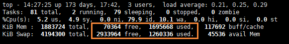

前言
--

大家好，我是**陌溪**。

最近在 **Gitee** 开源社区的留言板，小伙伴问的比较多的一个问题就是：**蘑菇博客如何在1核2G服务器部署？**


我们在来到蘑菇博客的**架构图**，可以发现目前已经有特别多的服务了，除了一些非必须启动的组件外，也还需要启动多达 **10** 多个服务，这个时候 **2G** 内存的服务器性能堪忧。


陌溪本身也是特别关心**部署成本**这一块，因为目前我的**云服务器**也是通过阿里云的学生优惠进行购买的，属于入门级的配置：**1核 2G 5M**。

因为只有 **2G** 的运行内存，所有项目在启动的时候，**占用的内存已经爆表**了，所以有的时候就会出现宕机的情况发生，并且有部分应用程序也服务正常启动。

为了解决这个问题，降低小伙伴们的**部署成本**，陌溪转辗反侧，突然想起来之前操作系统里面**虚拟内存**的概念。

虚拟内存技术
------

我们都知道，当我们运行一个 **jar** 包的时候 ( 我们称该 jar 包为一个作业)，该作业就会被装入内存，然后一直驻留在内存中，其任何部分都不会被换出，直至作业运行结束。运行中的进程，会因为等待 **I/O** 而被阻塞，可能处于长期等待状态。

许多在程序运行中不用的程序或数据，占据了大量的内存空间，而一些需要运行的作业又无法装入内存中运行，这显然浪费了宝贵的内存资源。

在提到虚拟内存的技术的思想，不得不说**局部性原理**

**时间局部性**：如果程序中的某条指令一旦执行，不久以后该指令可能再次执行；如果某数据被访问过，不久以后该数据可能再次被访问。产生时间局部性的典型原因，是由于在程序中存在着大量的循环操作。

**空间局部性**：一旦程序访问了某个存储单元，在不久之后，其附近的存储单元也将被访问，即程序在一段时间内所访问的地址，可能集中在一定的范围之内，这是因为指令通常是顺序存放、顺序执行的，数据也一般是以向量、数组、表等形式簇聚存储的。

**时间局部性**是通过将近来使用的指令和数据保存到高速缓存存储器中，并使用高速缓存的层次结构实现。**空间局部性**通常是使用较大的高速缓存，并将预取机制集成到高速缓存控制逻辑中实现。虚拟内存技术实际上就是建立了 “内存一外存”的两级存储器的结构，利用局部性原理实现髙速缓存。

基于局部性的原理，在程序装入内存时，可以先将一部分装入内存，而将其它部分留在外存，就可以启动程序执行。在程序执行过程中，当所访问的信息不再内存时，由操作系统将所需要的部分页面调入内存，然后继续执行程序。同时，操作系统将内存中暂时不使用的内容换出到外存上，从而腾出空间存放将要调入内存的信息。这样，系统好像给用户**提供了一个比实际内存大得多的存储器**，我们将其称之为**虚拟存储器**。

那么为什么叫**虚拟存储器**呢？因为这种存储器在实际上并不存在，只是由于系统提供部分装入，请求调入和置换功能后，给用户的感觉好像存在一个比实际物理内存大得多的存储器。虚拟存储器的大小由计算机的地址结构决定，并非是内存和外存的简单相加。

Linux内存机制
---------

我们都知道从物理内存读取数据的速度要远远比硬盘读写的速度要快。但是受限于内存的大小，因此就引出了物理内存和虚拟内存的概念。

物理内存就是系统硬件提供的内存大小，属于真正的内存空间。在 **Linux** 中还有一个虚拟内存的概念，它是专门为了满足物理内存不足的情况，而提出的策略，本质上就是利用磁盘空间虚拟出一块逻辑内存，而这部分用做虚拟内存的磁盘空间被称为交换空间，也就是 **Swap Space**。

作为物理内存的扩展，**Linux** 会在物理内存不足的时候，使用交换分区的虚拟内存，这样就摆脱了原来内存大小 **2G** 的限制。

CentOS创建交换内存
------------

陌溪购买的是**阿里云轻量级应用服务器**，然后使用的是 **CentOS**，因此下面将在 **CentOS** 上，讲解我是如何创建交换内存的。

### 查看内存使用情况

我们通过下面的命令，来查看内存使用情况

    free -h 

执行完命令后，能看到下面的信息


**Mem**：表示购买阿里云时候的内存，我们能够看到只有1.8G，并且已经使用了1.7G，说着说着，眼泪就流了下来

**Swap**：表示目前的**交换内存**大小，因为之前我增加了 **4G** ，所以现在 **Swap** 显示的是 **4G**，并且已经使用了 **1G**。

### 添加Swap分区

使用 **dd** 命令创建名为 **swapfile** 的 **swap** 交换文件（文件名和目录任意）:

    dd  if=/dev/zero  of=/var/swapfile  bs=1024  count=4194304 

**dev/zero** 是 **Linux** 的一种特殊字符设备(输入设备)，可以用来创建一个指定长度用于初始化的空文件，如临时交换文件。

**bs=1024**：单位数据块( **block** ) 同时读入/输出的块字节大小为 **1024** 个字节即 **1KB**，bs (即block size)。

**count = 4194304**：表示的是 **4G**，具体计算公式为：1KB \* 4194304 =1KB \*1024(k)_1024_4 = 4194304 =4G

如果小伙伴需要调整交换区的大小的话，可以自行设置其他的。执行完命令后，会进行 **4G** 读写操作，所以会有一些卡顿，小伙伴耐心等待

### 文件格式化

然后我们需要对交换文件格式化，并转换成swap分区

    mkswap /var/swapfile


### 挂载并激活分区

然后开始执行下面命令，挂载并激活分区

    swapon /var/swapfile


执行以上命令可能会出现："不安全的权限 **0644**，建议使用 0600 " 类似提示，不要紧张，实际上已经激活了，可以忽略提示，也可以听从系统的建议修改下权限：

    chmod -R 0600 /var/swapfile


### 开启自动挂载

下面我们需要修改 **fstab** 配置，设置开机自动挂载该分区

    echo  "/var/swapfile   swap  swap  defaults  0  0" >>  /etc/fstab


### 查看使用情况

下面我们通过 **top** 命令，查看内存使用情况

    top


我们能够看到，交换空间已经成功被使用


到这里为止，其实你的 **1核2G** 的服务器，已经能够成功部署蘑菇博客了。

### 更改Swap配置

一般默认的情况，当我们开启交换虚拟内存空间后，默认好像是当内存使用百分 **50** 的时候，就会开始使用交换空间，这样就会造成一个情况，就是**本身物理内存使用率不高**， 就使用虚拟内存，这样肯定会**影响我们的使用效率**，那么我们怎么避免这个情况的发生呢？

这个时候可以通过 **swappiness** 值进行管理，**swappiness** 表示系统对 **Swap** 分区的依赖程度，范围是 **0~100**，数值越大，依赖程度越高，也就是越高越会使用 **Swap** 分区。

所以，我们现在并不希望我们的机器过度依赖 **Swap** 分区，只有当我们 负载超过某个百分比的时候，才使用交换空间，所以这也决定了，我们这个值并不是非常大，一般设置 **10 ~50** 左右。

当然如果小伙伴的是 **SSD** 的话，那么这个值可以稍微大一些。

下面我们查看当前的 **swappiness** 数值：

```bash
cat /proc/sys/vm/swappiness
```


修改 **swappiness** 值，这里以 **10** 为例：

```bash
sysctl vm.swappiness=10
```


设置永久有效，重启系统后生效

```bash
echo "vm.swappiness = 10"  >>  /etc/sysctl.conf
```


我们最后再次通过 **top** 命令，能够查看到，交换空间已经被使用了，物理内存也大概占用了百分 **90** 左右



### Swap分区的删除

如果我们以后不想使用 **Swap** 分区，那么也可以进行删除，删除步骤如下所示

首先停止正在使用 **swap** 分区

```bash
swapoff  /var/swapfile
```


然后删除 **swap** 分区文件

```bash
rm -rf   /var/swapfile
```


删除或注释掉我们之前在 **fstab** 文件里追加的开机自动挂载配置内容

```bash
vim /etc/fstab

#把下面内容删除
/var/swapfile   swap  swap  defaults  0  0
```


结语
--

**陌溪**是一个从三本院校一路摸滚翻爬上来的互联网大厂程序员。独立做过几个开源项目，其中**蘑菇博客**在码云上有 **2K Star** 。目前就职于**字节跳动的Data广告部门**，是字节跳动全线产品的商业变现研发团队。本公众号将会持续性的输出很多原创小知识以及学习资源。如果你觉得本文对你有所帮助，麻烦给文章点个「赞」和「在看」。同时欢迎各位小伙伴关注陌溪，让我们一起成长~


