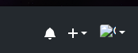
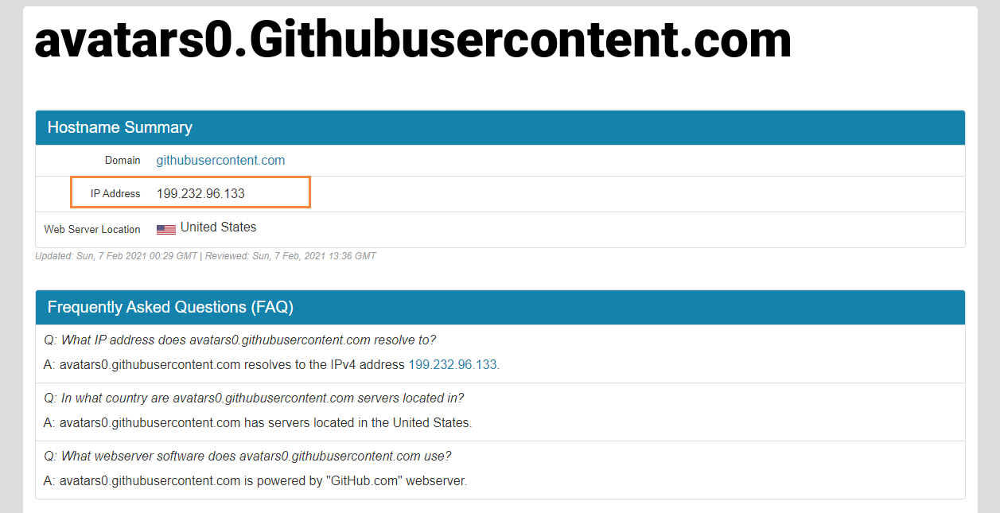
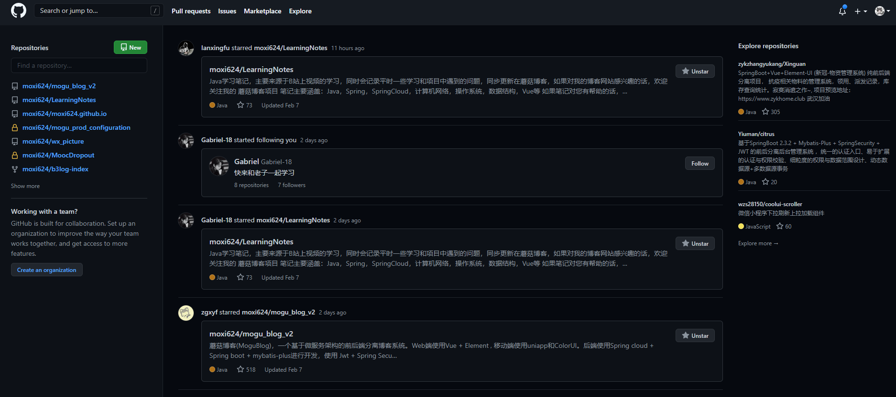

## 前言

> 大家好，我是陌溪

最近访问 **Github** 进行网上冲浪的时候，发现 **Github** 用户头像一直无法正常获取，出现**图裂**的情况



作为强迫症患者的我，很显然对这个不能忍，简直太影响冲浪体验了..


## 问题排查

首先在 **Github** 页面按 **F12** 打开调试页面，然后我们可以看到 **Console** 区域有报错，是因为图片无法获取而产生


在错误区域的最右边位置 **鼠标右键** -> **copy link address** ， 获取到 **链接地址**

```bash
https://avatars0.githubusercontent.com/u/18610136?s=40&v=4
```

然后保留地址的二级域名，即复制以下内容

```bash
https://avatars0.githubusercontent.com
```

## 解决方法

打开 **ip地址工具**

> https://www.ipaddress.com/

然后在下面位置复制我们刚刚截取的 **二级域名**，然后进行搜索


然后复制到下面获得的 **ip** 地址



按下面给的 **hosts** 模板，更换成该 **IP** 地址

```bash
199.232.96.133 avatars.githubusercontent.com
199.232.96.133 avatars0.githubusercontent.com
199.232.96.133 avatars1.githubusercontent.com
199.232.96.133 avatars2.githubusercontent.com
199.232.96.133 avatars3.githubusercontent.com
199.232.96.133 avatars4.githubusercontent.com
199.232.96.133 avatars5.githubusercontent.com
199.232.96.133 avatars6.githubusercontent.com
199.232.96.133 avatars7.githubusercontent.com
199.232.96.133 avatars8.githubusercontent.com
199.232.96.133 camo.githubusercontent.com
199.232.96.133 cloud.githubusercontent.com
199.232.96.133 gist.githubusercontent.com
199.232.96.133 raw.githubusercontent.com
151.101.228.133 assets-cdn.github.com
```

然后在修改 **host** 文件，路径在

```bash
C:\Windows\System32\drivers\etc\
```

或者也可以使用一个非常棒的修改 **Hosts** 的工具 ： **SwitchHosts**

```bash
https://oldj.github.io/SwitchHosts/
```

它可以设置多个 **hosts** 文件进行切换，修改起来非常方便


在保存后，打开 **cmd** 窗口，刷新 **DNS**

```bash
ipconfig /flushdns
```

在修改完成后，我们打开 **Github** 页面，然后刷新图片全部可以显示了~，终于可以愉快的搬砖了



## 结语

**陌溪**是一个从三本院校一路摸滚翻爬上来的互联网大厂程序员。独立做过几个开源项目，其中**蘑菇博客**在码云上有 **2K Star** 。目前就职于**字节跳动的Data广告部门**，是字节跳动全线产品的商业变现研发团队。本公众号将会持续性的输出很多原创小知识以及学习资源。如果你觉得本文对你有所帮助，麻烦给文章点个「赞」和「在看」。同时欢迎各位小伙伴关注陌溪，让我们一起成长~

