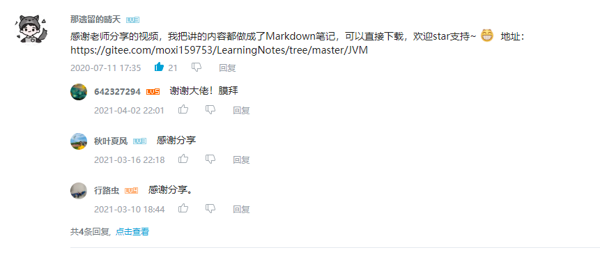
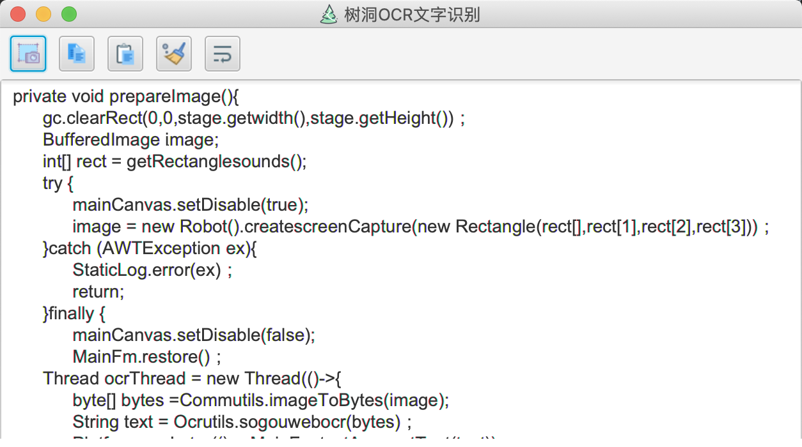
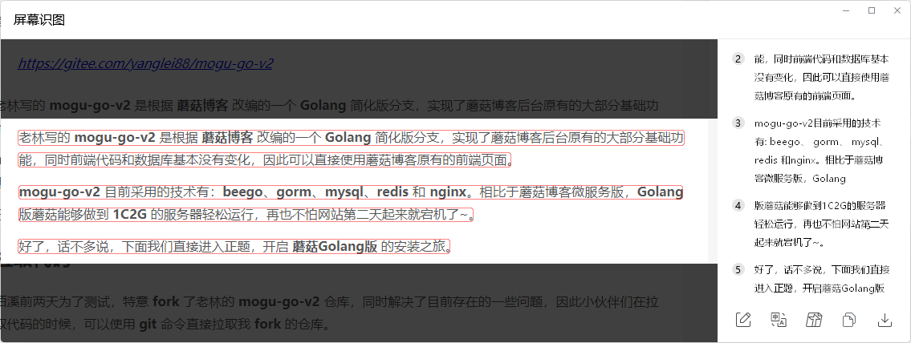
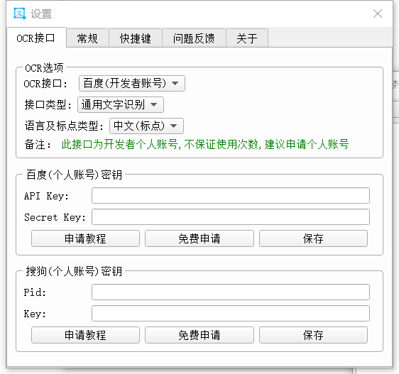
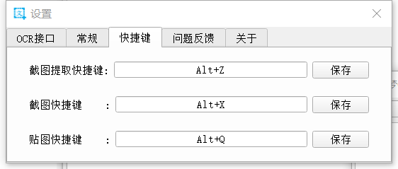
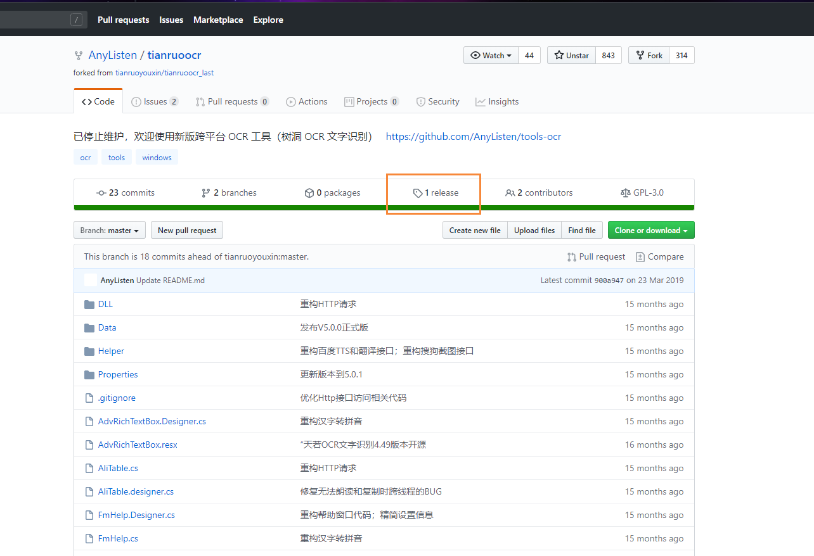

> 大家好，我是陌溪，欢迎点击下方的公众号名片，关注陌溪，让我们一起成长~

最近有读者问我平时是怎么记录视频笔记的，因为**陌溪**之前一直沉迷于**B站视频**学习，在很多热门的视频下都留下我写的视频学习笔记，也成功帮助小伙伴们节省了很多时间，这次陌溪把**压箱底**的**记笔记**操作分享给大家。

我们经常看到的**B站学习视频**大多数是不提供**课件**和 **ppt** 的，但是如果自己需要做笔记的话，要来回暂停视频，然后手动把一个个文字敲上去。虽然说。。这么一个动作可以加深一下学习记忆，但是也让陌溪**苦不堪言**，仿佛回到了高中时候：老师在黑板上写，我在下面抄写的情景，最后老师讲的啥也没听到，只看到满满的一本子笔记就感觉自己学会了。。

为了避免这类事情的再次重演，我决定寻找了几款 **ORC** 文字识别工具，帮助我提高生产力，同时花更多的时间在视频学习上。

## 树洞OCR

树洞 OCR 文字识别，是一款跨平台的 OCR 小工具，同时在Github上开源。

> 官网地址：https://github.com/AnyListen/tools-ocr

推荐等级：

树洞 **OCR** 项目是基于 **JavaFX** 开发，如果想要运行源码的话，需要安装好 **JDK1.8** 环境。

识别后的效果还是不错的，同时还能够保证原来的格式。

我最开始尝试了一些，页面比较简陋，而且功能不是特别完善，截图翻译的时候比较难受，特别是在双屏的环境下

在具体使用过程中，发现树洞 **OCR** 还有一些功能不是特别完善，比如截图翻译的时候比较难受，尤其是在双屏的环境下，不能像 **QQ** 截图那样自由切换。

## QQ截图

QQ截图在最新的版本是提供了文件识别功能，在我们截图后点击 **屏幕识图**，即可完成识别

推荐等级：

但是在具体使用的时候，用户体验不太行，首先是想要编辑的时候比较麻烦，如上图所示，感觉得到的结果有点像有道翻译，同时在截图提取的时候，接口请求耗时比较久，并且还需要自己手动点击内容才能够复制到剪切板。优点就是升级了新版 **QQ** 就能够直接使用，不需要额外下载安装。

## 雨梦OCR

**雨梦OCR文字提取** 是一款免安装，易用的文字提取软件，目前支持截图、拖拽图片、导入图片等方式来提取文字，可以极大地提高工作效率。除OCR功能外，还包括了贴图、截图、翻译等功能。

> 官网地址：http://hanxinyumeng.cn

推荐等级：

在设置中可以选择不同的 **OCR** 接口，选择需要识别的语言及标点类型。

在常规设置中，你可以对文本、字体、界面和自启动等进行设置

同时还支持默认快捷键设置

雨梦 **OCR** 比 树洞 **OCR** 操作起来就更友好了，因为我主要的用处是用于**截屏提取文字**，这个在**截屏提取文字**这块做的还可以，能满足需求，但是存在一个问题就是，雨梦 **OCR** 是收费版本的，需要 **1** 年 **19** 元。但是每天会提供**50** 次免费使用，如果平时使用 **OCR** 不是特别频繁的话，是可以使用的。

## 天若OCR

天若 **OCR** 文字识别开源版保留了雨梦 **OCR** 的大部分功能，所以在使用体验上还是很舒服。同时还是开源免费的，平时我使用最多的就是这款了。

> 官网地址：https://github.com/AnyListen/tianruoocr

推荐等级：

首先，选择天若 **OCR** 的**release**发行版，进行下载

下面里面的 **zip** 文件进行解压

然后运行里面的 **exe** 文件即可，运行后会创建一个状态栏图标，我们按 **F4** 即可截图，下面就是我识别蘑菇博客中的一篇文章，识别的准确率挺高的，并且还能自动复制到剪切板，非常方便。

同时界面还是挺美观的，而且功能也很强大，还支持自定义接口，所以目前来说天若 **OCR** 是首选~

好了，常见的 **OCR** 工具我就介绍到这里了，陌溪把自己压箱底的都拿出来了，我们下期再见~

## 往期推荐

- [蘑菇博客从0到2000Star，分享我的Java自学路线图](https://mp.weixin.qq.com/s/3u6OOYkpj4_ecMzfMqKJRw)
- [从三本院校到斩获字节跳动后端研发Offer-讲述我的故事](https://mp.weixin.qq.com/s/c4rR_aWpmNNFGn-mZBLWYg)
- [陌溪在公众号摸滚翻爬半个月，整理的入门指南](https://mp.weixin.qq.com/s/Jj1i-mD9Tw0vUEFXi5y54g)

## 结语

**陌溪**是一个从三本院校一路摸滚翻爬上来的互联网大厂程序员。独立做过几个开源项目，其中**蘑菇博客**在码云上有 **2K Star** 。目前就职于**字节跳动的Data广告部门**，是字节跳动全线产品的商业变现研发团队。本公众号将会持续性的输出很多原创小知识以及学习资源。如果你觉得本文对你有所帮助，麻烦给文章点个「赞」和「在看」。同时欢迎各位小伙伴关注陌溪，让我们一起成长~

