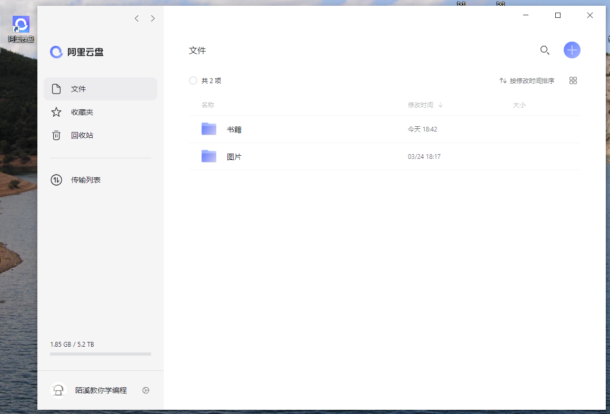
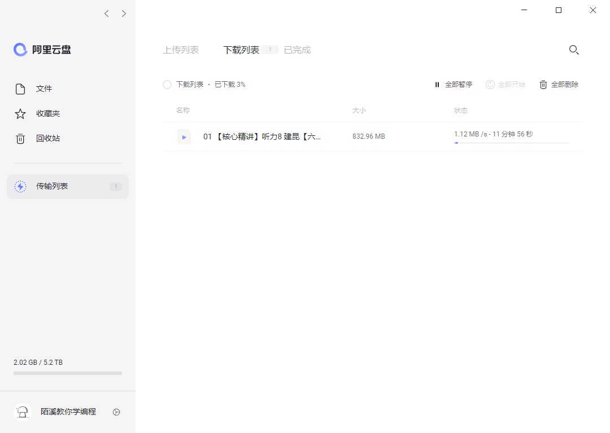
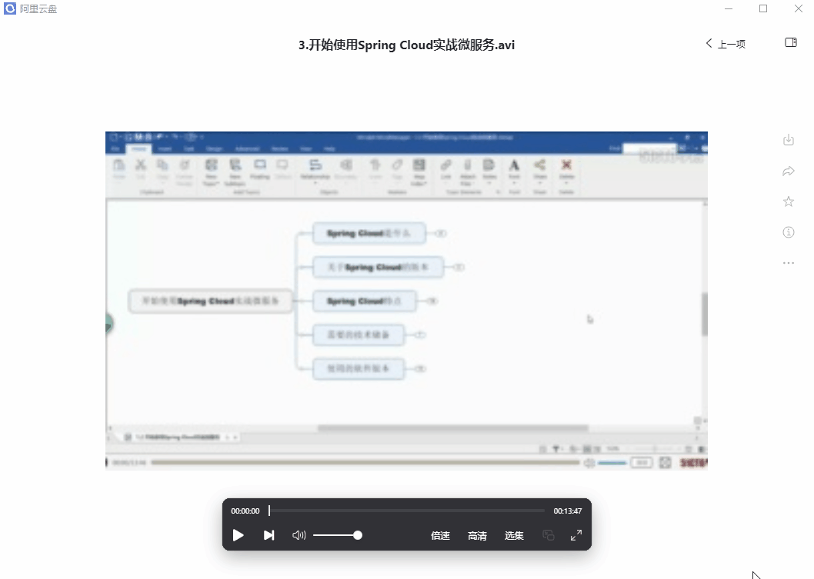

**阿里云盘**是一款速度快、不打扰、够安全、易于分享的网盘，你可以在这里存储、管理和探索内容，尽情打造丰富的数字世界。

目前通过访问阿里云盘官网，发现只提供了 **Android** 和 **iOS** 端。

PC端和Mac端一直未发布，目前通过官网无法下载。今天我带来的是一款处于内测阶段的PC端阿里云盘，陌溪使用后，整体感觉非常舒服，目前我已经下载了，正在抢先体验中。

输入账号和密码即可进行登录，页面非常的干净清爽，看着很舒服。

下面我们上传一个视频看看速度如何~，我试了试都是秒传，来不及截图了...

我们再来测试一下下载的速度，我们首先测试一下自己的下载带宽【因为我的网络很多人用，测出来只有9M带宽】，因此最大下载速度最多只有**1**M多

然后我们在下载一个 **0.8G** 的视频进行测试，能够发现下载速度稳定在 **1MB** 左右，说明已经快跑满了我的下载带宽。

我们在测试用百度网盘下载资源，嗯，果然没有让我失望 **100KB/S** ！

同时阿里网盘PC版还支持在线播放视频，能够倍速和切换高清模式

对于容量有限的小伙伴，陌溪在送上几个最新的福利码。

- 面朝大海 200G
- 春暖花开 200G
- 鸟语花香 200G
- 春意盎然 200G
- 店铺大卖 300G

福利码用法：阿里云盘新版app福利社-输入兑换码

## 获取方式

关注下方公众号：**陌溪教你学编程**，后台回复：**阿里云盘**，即可获取 **PC** 版 和 **Mac** 版的阿里云盘安装包

