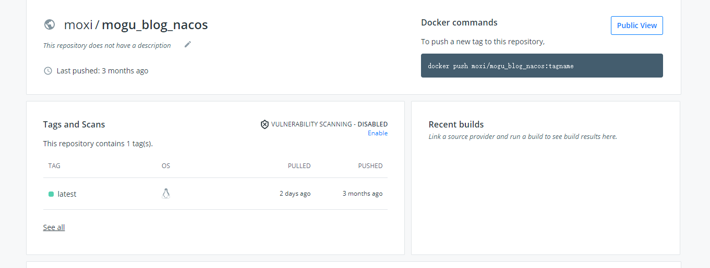
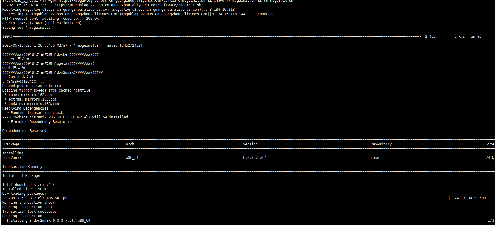
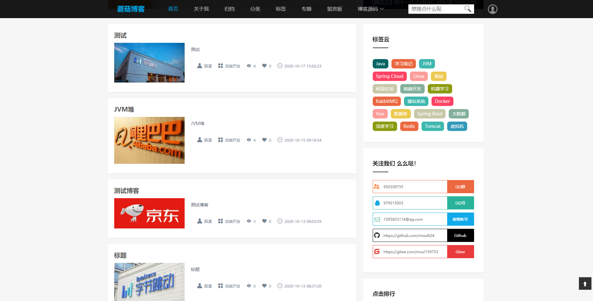
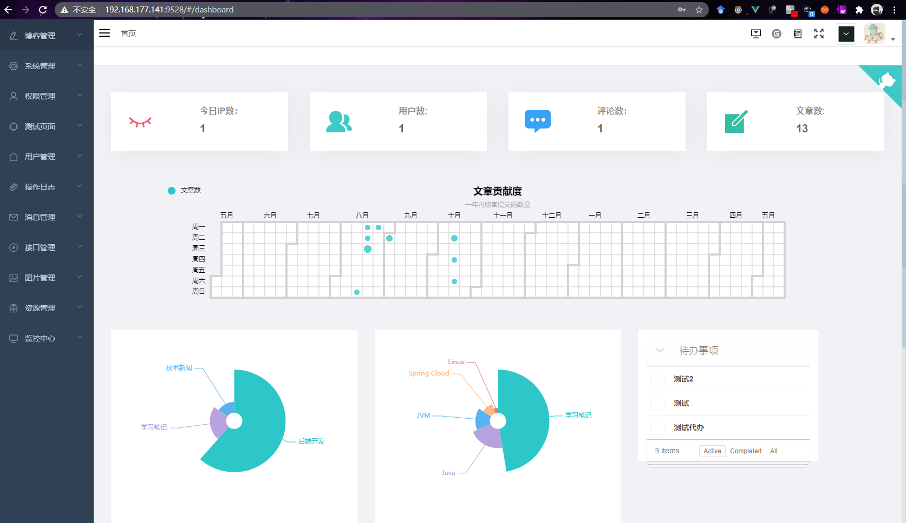

> 大家好，我是陌溪，欢迎点击下方的公众号名片，关注陌溪，让我们一起成长~

陌溪这次和小伙伴们来聊一聊蘑菇博客的**部署**，在经过项目的不断更新迭代，部署方式也是经历了多个阶段。分别是：**手动部署**，**Docker部署**，**Docker-Compose部署**。而在这两天，陌溪应小伙伴们的要求，继续简化部署流程，完成了使用 **一条命令部署蘑菇博客** 。下面，让我们一起来看看蘑菇博客**部署方式**的变化。


## 手动部署

手动部署方式，指的就是在购买的**云服务器**上，手动安装 **Nginx**，**ElasticSearch**，**Redis**，**Tomcat**，**Mysql**，**RabbitMQ** 等软件。如下图所示，就是之前为了帮助小伙伴们快速搭建环境时写的一些文章。


能够看到在部署蘑菇博客的时候，需要安装的东西还是挺多的，因此在这个阶段小伙伴们也会遇到各种的疑难杂症，同时对于小白用户的体验也不太好，因此这种方式在使用过一段时间后就被抛弃了。

## Docker部署

后面开始转向 **Docker** 方式部署，**Docker** 是一个虚拟环境容器，可以将开发环境，代码，配置文件等一并打包然后生成镜像，并发布到Docker对应的中央仓库 **DockerHub**  。**DockerHub** 有点类似于 **Github**，只不是一个是托管镜像的，另外一个是托管代码的平台。

**Docker** 部署，则是陌溪提前制作了一个具有蘑菇博客完整运行环境的 **CentOS** 镜像，也就是说我已经帮你把上面提到的 **Nginx**，**Redis** 等软件都手动安装好了，最后在做成一个完整可运行的镜像。



**Docker** 部署方式相比于**手动部署**，省去了用户在安装中间件的繁琐过程，同时也保证了运行环境的统一，小伙伴们用的环境和陌溪的是一样的，因此就算出现问题也非常容易排查。在 **Docker** 部署中，用户需要下载蘑菇博客源码，然后进行编译和打包，生成对应的 可执行 **jar** 包，然后发布到 **Docker** 容器中。同时还需要启动容器中已经安装好的软件即可。 

> 使用Docker快速搭建蘑菇博客：
>
> http://moguit.cn/#/info?blogOid=224

## Docker-Compose部署

**Docker** 部署方式是采用单个Docker镜像来进行部署的，每次拉取一个超大型的镜像【大概 **5G** 】，如果在拉取镜像的时候，遇到网络卡顿等外界影响，很容易导致拉取失败，同时因为这种部署方式不太符合微服务架构的思想。

因此，后面我们将所有的服务制作成单个的镜像，然后通过**docker compose** 进行容器编排，来协调每个容器同时对外提供服务，同时提供了 **Docker** 容器的可视化管理工具 **Portainer** 进行管理，同时达到对服务容器化的目的，也为以后使用 **K8S** 集群管理蘑菇博客做了很好的铺垫~。

在使用 **Docker-Compose** 部署后，小伙伴只需要在具备 **Docker** 和 **Docker-Compose** 环境的机器上，将部署脚本拖拽到服务器上即可。


首先我们来查看一下 **docker-compose** 的目录结构，主要包含以下内容

- bin：相关一键启动脚本的目录
  - completeStartup.sh：完整版启动脚本
  - completeShutdown.sh：完整版关闭脚本
  - kernStartup.sh：核心版启动脚本【只包含必要的组件】
  - kernShutdown.sh：核心版关闭脚本
  - update.sh：用于更新镜像【同步最新代码时使用】
- config：存放配置文件
- data：存放数据文件
- log：存放日志文件
- yaml：存放docker compose的yaml文件

在将部署脚本放到服务器上后，只需要给对应的脚本**配置权限**，然后执行 **sh kernStartup.sh** ，即可完成安装。


在 **Docker-Compose** 部署方式，陌溪已经将每个服务都单独制作成 **Docker** 镜像，同时托管在阿里容器镜像服务平台，小伙伴们在使用的时候只需要拉取镜像，然后运行即可，相比于第二种 **Docker** 部署方式，降低了源码编译和打包时消耗的时间，同时也能够更方便支持扩展。

> DockerCompose一键部署蘑菇博客：
>
> http://moguit.cn/#/info?blogOid=565

## 一条命令部署

最近有些小伙伴觉得用 **Docker-Compose** 在部署的时候还是有些麻烦。因为需要把部署脚本**拷贝到服务器**，同时还要安装 **Docker** 和 **Docker-Compose**，以及在内存不够的时候，**配置虚拟内存**。这些能不能在精简一些，我想用一行命令就能搞定，然后我的表情就是...


本着让小伙伴们少动手的原则，陌溪再次对脚本进行了改造，写下来一个终极部署脚本 **moguInit.sh**。

**终极部署脚本**的原理也是比较简单，就是对用户的软件环境进行检测，如果某个所需的运行环境不存在的话，就会帮我们自动安装，下面是截取的 **moguInit.sh** 中的一部分代码。

```bash
#!/usr/bin/env bash

echo "############判断是否安装了docker##############"
if ! type docker >/dev/null 2>&1; then
    echo 'docker 未安装';
	echo '开始安装Docker....';	
	yum -y install docker-ce
	echo '配置Docker开启启动';
	systemctl enable docker
	systemctl start docker	
else
    echo 'docker 已安装';
fi

echo "############判断是否安装了dos2unix##############"
if ! type dos2unix >/dev/null 2>&1; then
    echo 'dos2unix 未安装';
	echo '开始安装dos2unix....';	
	yum -y install dos2unix*
	
else
    echo 'dos2unix 已安装';
fi

echo "############判断是否安装了docker-compose##############"
if ! type docker-compose >/dev/null 2>&1; then
    echo 'docker-compose 未安装';
	echo '开始安装docker-compose....';		
	wget https://mogublog-v2.oss-cn-guangzhou.aliyuncs.com/software/docker-compose-Linux-x86_64
	mv docker-compose-Linux-x86_64  docker-compose
	chmod +x docker-compose
	mv docker-compose /usr/local/bin/
	docker-compose -v
else
    echo 'docker-compose 已安装';
fi
```

在所有的环境都安装完成后，就会拉取我们的**docker-compose 部署脚本**。对，没错，就是上面提到的那个**docker-compose** 文件夹，只不过我已经将其打包放在阿里云OSS了，然后通过 **wget** 命令进行拉取，下面的命令其实就和上面的步骤是一样了，进行一系列的初始化后，执行一键部署脚本。

```bash
echo '创建docker网络';
docker network create mogu

echo '正在拉取一键部署脚本';
wget https://mogublog-v2.oss-cn-guangzhou.aliyuncs.com/software/docker-compose.zip
unzip docker-compose.zip

# 进入目录
cd docker-compose
# 添加执行权限
chmod +x bin/kernStartup.sh
chmod +x bin/kernShutdown.sh
chmod +x bin/update.sh
chmod +x bin/wait-for-it.sh

# 进入到bin目录
cd bin
# 修改编码
echo "修改编码...."
dos2unix kernStartup.sh
dos2unix kernShutdown.sh
dos2unix update.sh
dos2unix wait-for-it.sh

# 执行脚本
python2 replaceIp.py
sh kernStartup.sh
```

同时，陌溪把**终极部署脚本**放到了阿里云 **OSS** 上，所以小伙伴在需要部署的时候，只需要在服务器执行下面这条命令即可。

```bash
wget https://mogublog-v2.oss-cn-guangzhou.aliyuncs.com/software/moguInit.sh && chmod +x moguInit.sh && sh moguInit.sh
```

该命令将自动执行陌溪写的 终极部署脚本 **moguInint.sh**，首先，开始检测运行所需的软件环境，如果不具备的话，将会安装对应的环境。然后，在下载对应的**部署脚本**，使用 **docker-compose** 进行容器编排，最后，完成博客的部署。



在所有操作都执行完成后，等待一段时间即可访问对应的服务了，如果服务器配置较低的话，可能等待时间会比较长。


同时也可以打开 **nacos** 页面，查看每个服务的启动情况。

> Nacos图形化地址：http://your_ip:8848/nacos


在所有服务都启动完成后，即可访问下面地址，完成蘑菇博客的部署





好了，到这里为止，我们使用一条命令就轻松完成了蘑菇博客的部署，我叫陌溪，我们下期再见~


## 往期推荐

- [蘑菇博客从0到2000Star，分享我的Java自学路线图](https://mp.weixin.qq.com/s/3u6OOYkpj4_ecMzfMqKJRw)
- [从三本院校到斩获字节跳动后端研发Offer-讲述我的故事](https://mp.weixin.qq.com/s/c4rR_aWpmNNFGn-mZBLWYg)
- [陌溪在公众号摸滚翻爬半个月，整理的入门指南](https://mp.weixin.qq.com/s/Jj1i-mD9Tw0vUEFXi5y54g)
- [读者问:有没有高效的记视频笔记方法？](https://mp.weixin.qq.com/s/QcQnV1yretxmDQr4ELW7_g)

## 结语

因为本公众号**申请较晚**，暂时没有开通**留言**功能，欢迎小伙伴们添加我的私人微信【备注：**加群**】，我将邀请你加入到**蘑菇博客交流群**中，欢迎小伙伴们找陌溪一块聊天唠嗑，共同学习进步，如果你觉得本文对你有所帮助，麻烦小伙伴们动动手指给文章点个「**赞**」和「**在看**」。


