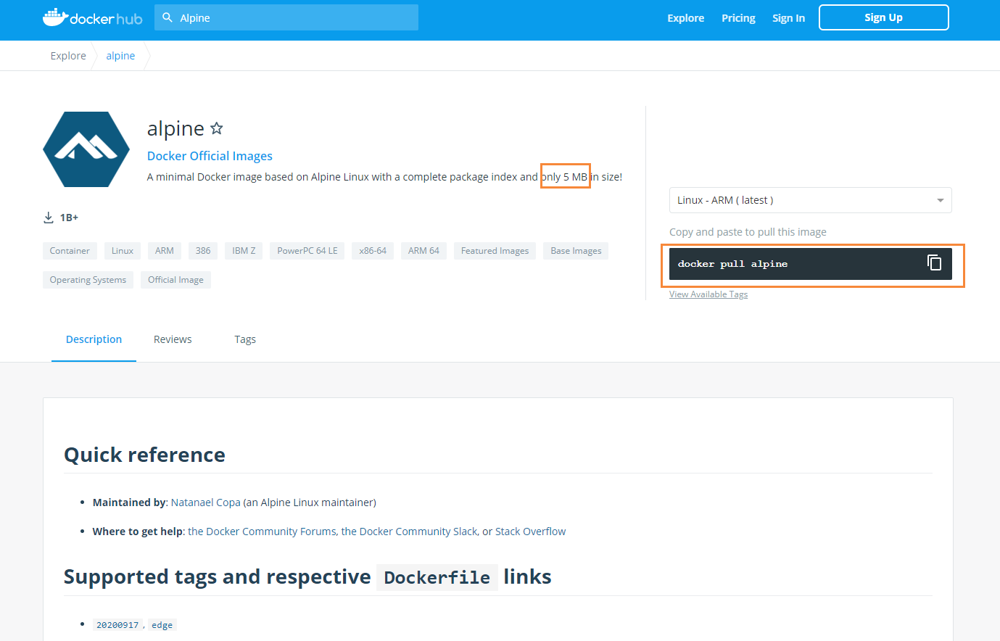
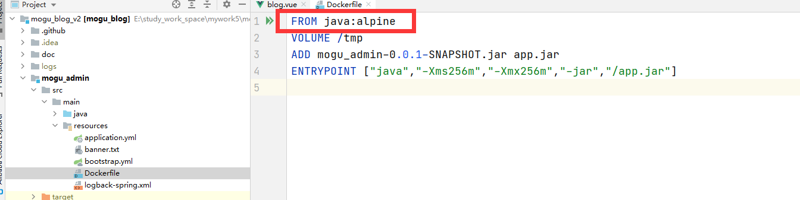

> 大家好，我是陌溪，欢迎点击下方的公众号名片，关注陌溪，让我们一起成长~


这阵子陌溪发现只要带着 **alpine** 前缀的镜像，相比于其它的镜像，体积都相对较小，例如下面这些

```bash
java:alpine
nginx:alpine
```

后面通过了解，发现了其实这些 **java** 镜像，或者 **nginx** 镜像都依赖于某个 **linux** 操作系统，我们常见的操作系统有  **ubuntu**、**centos**、**debian**。而这个 **alpine** 其实也是一个新的操作系统。但是它比其它的操作系统而言，体积更小，所以在他们的基础之上做的镜像，体积也会更小，常见的 **linux** 操作系统体积大小，如下所示

```bash
REPOSITORY          TAG           IMAGE ID          VIRTUAL SIZE
alpine              latest        4e38e38c8ce0      4.799 MB
debian              latest        4d6ce913b130      84.98 MB
ubuntu              latest        b39b81afc8ca      188.3 MB
centos              latest        8efe422e6104      210 MB
```

我们也就发现了 **alpine** 的大小远远小于 其它的操作系统，因此制作出来的镜像大小也远远小于其它的

## Alpine操作系统

**Alpine** 操作系统主要是面向安全的轻量级 **Linux** 发行版，它和其它的发行版不同之处在于，**Alpine** 采用了**musllibc** 和 **busybox** 以减少系统体积和运行时资源消耗，但功能上比 **busybox** 又完善的多 ，因此越来越得到开源社区的青睐。在保持瘦身的同时，**Alpine** 还提供了自己的包管理工具【 **CentOS** 是 **yum**，**ubuntu**是 **apt-get**】，可以通过 **Alpine包查询网站** 来进行查看，例如下图所示，搜索自己需要安装的包进行查看

> Alpine包查询网站: https://pkgs.alpinelinux.org/packages


如果想在 **Apline** 镜像中使用 **vim** 命令的话，只需要应用包管理工具 **apk** 安装即可

```bash
apk add vim
```

**Alpine Docker** 镜像也继承了 **Alpine Linux** 发行版的优势，相比于其它的 **Docker** 镜像，它的容量体积非常小，仅仅只有 **5MB**，我们通过打开 **DockerHub** 中 **Alpine** 的官网

```bash
官网：https://registry.hub.docker.com/_/alpine
```



可以发现，它提供了只有 **5MB** 的系统镜像可供我们进行下载使用

```bash
# 下载alpine镜像
docker pull alpine
```

同时，它还列举了一个例子 ，通过 **alpine** 制作一个 **mysql** 镜像


使用 **Alpine** 和 **Ubuntu** 制作出来的镜像一个是 **36.8MB**，一个是 **145MB**，相差 **4** 倍多

目前 **Docker** 官方已经开始推荐 **Alpine** 替代之前的 **Ubuntu** 作为基础镜像环境，这样所带来的好处包括：镜像下载速度更快、镜像安全性提高、主机之间的切换更方便、占用内存更少等特点。

## 使用Alpine镜像

我们通过下面命令，能够非常快的运行一个 **Alpine** 容器【本地不存在会去官方下载】，并输出 **hello alpine**

```bash
docker run alpine echo "hello alpine"
```


## 迁移至Alpine

目前，大部分 **Docke**r 官方镜像，都已经提供了 **Alpine** 版本镜像的支持，我们非常容易镜像迁移

例如，通过 **nginx** 的 官方 **DockerHub** 地址，我们可以看到，也专门有 **alpine** 稳定版本

> nginx: https://registry.hub.docker.com/_/nginx


还有其它一些官方镜像也都提供了 **alpine** 版本，我们可以在 **DockerHub** 上进行搜索即可

```bash
ubuntu/debian -> alpine
python:2.7 -> python:2.7-alpine
ruby:2.3 -> ruby:2.3-alpine
```

另外，如果我们想要在 **alpine** 的基础上进行一些软件的安装，可以使用下面的命令

```bash
apk add --no-cache <package>
```

同时如果细心看过**蘑菇博客镜**像制作过程的小伙伴，可以看到对应项目的 **Dockerfile** 文件依赖的基础镜像，其实就是带有 **alpine** 后缀的精简镜像。 

 

## 思考

上面其实我们已经提到了很多关于 **alpine** 的优势，比如体积小，并且很多官方的 **Docker** 镜像都提供了基于**alpine** 的版本。那如果 **alpine** 版本没有任何坑的话，从体积小，并且能满足使用正常使用的话，这相比于**CentOS**、**Ubuntu** 和 **Debian** 的镜像，就拥有非常大的优势了，那么以后这些发行版的进行也就没有存在的必要，真实是这样的么？

下面是针对上述问题，最后的总结

- 首先在基于 **alpine** 的操作系统上编写 **Dockerfile** 制作新镜像，并不会像其他操作系统一样方便，甚至会出现alpine中不存在的情况。
- 虽然每个单个的基于 **alpine** 的软件镜像是明显少于其他操作系统，但是如果多个镜像【包括每个镜像运行的多个容器】，使用 了同一个基础镜像，是不会花费额外的空间【归结于 **docker** 的 **Overlay** 文件系统】
- 有些软件没办法在 **Alpine** 中运行，因为 **alpine** 不像其它发行版那样使用 **CGLIBC**

## 参考

- `Alpine` 官网：http://alpinelinux.org/
- `Alpine` 官方仓库：https://github.com/alpinelinux
- `Alpine` 官方镜像：https://hub.docker.com/_/alpine/
- `Alpine` 官方镜像仓库：https://github.com/gliderlabs/docker-alpine

## 往期推荐

- [蘑菇博客从0到2000Star，分享我的Java自学路线图](https://mp.weixin.qq.com/s/3u6OOYkpj4_ecMzfMqKJRw)
- [从三本院校到斩获字节跳动后端研发Offer-讲述我的故事](https://mp.weixin.qq.com/s/c4rR_aWpmNNFGn-mZBLWYg)
- [陌溪在公众号摸滚翻爬半个月，整理的入门指南](https://mp.weixin.qq.com/s/Jj1i-mD9Tw0vUEFXi5y54g)
- [读者问:有没有高效的记视频笔记方法？](https://mp.weixin.qq.com/s/QcQnV1yretxmDQr4ELW7_g)
- [万字长文带你学习ElasticSearch](https://mp.weixin.qq.com/s/9eh6rK2aZHRiBpf5bRae9g)
- [如何使用一条命令完成蘑菇博客的部署？](https://mp.weixin.qq.com/s/LgRIqdPAGzN1tCPMi0Y8RQ)

## 结语

因为本公众号**申请较晚**，暂时没有开通**留言**功能，欢迎小伙伴们添加我的私人微信【备注：**加群**】，我将邀请你加入到**蘑菇博客交流群**中，欢迎小伙伴们找陌溪一块聊天唠嗑，共同学习进步，如果你觉得本文对你有所帮助，麻烦小伙伴们动动手指给文章点个「**赞**」和「**在看**」。

