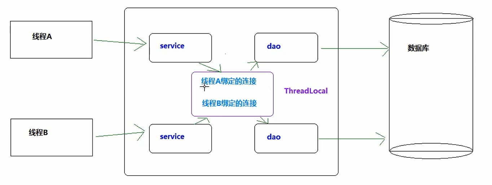
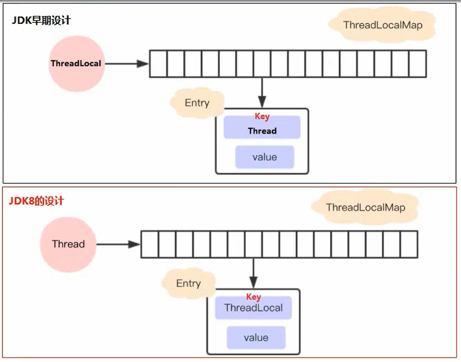
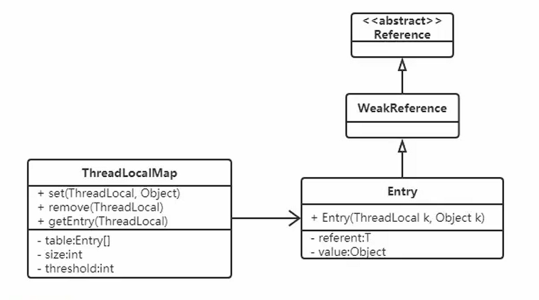
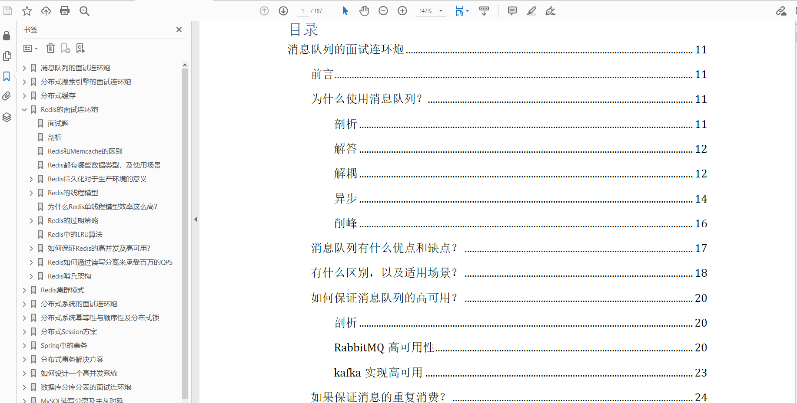

> 大家好，我是陌溪，欢迎点击下方的公众号名片，关注陌溪，让我们一起成长~

**ThreadLocal** 作为 **Java** 面试的高频题，陌溪在之前面试的时候也遇到过，所以后面专门针对 **ThreadLocal** 写了一份笔记，让我们一起来看看~

## 什么是ThreadLocal？

从 **Java** 官方文档中的描述：**ThreadLocal** 类用来提供线程内部的局部变量。这种变量在多线程环境下访问（通过**get** 和 **set** 方法访问）时能保证各个线程的变量相对独立于其他线程内的变量。ThreadLocal实例通常来说都是**private static** 类型的，用于关联线程和线程上下文。

我们可以得知 **ThreadLocal** 的作用是：提供线程内的局部变量，不同的线程之间不会相互干扰，这种变量在线程的生命周期内起作用，减少同一个线程内多个函数或组件之间一些公共变量传递的复杂度。

- 线程并发：在多线程并发的场景下
- 传递数据：我们可以通过 **ThreadLocal** 在同一线程，不同组件之间传递公共变量（有点类似于 **Session**？）
- 线程隔离：每个线程的变量都是独立的，不会互相影响

## 基本使用

在介绍 **ThreadLocal** 使用之前，我们首先认识几个 **ThreadLocal** 的常见方法

| 方法声明                 | 描述                       |
| ------------------------ | -------------------------- |
| ThreadLocal()            | 创建ThreadLocal对象        |
| public void set(T value) | 设置当前线程绑定的局部变量 |
| public T get()           | 获取当前线程绑定的局部变量 |
| public void remove()     | 移除当前线程绑定的局部变量 |

## 使用案例

我们来看下面这个案例，感受一下 **ThreadLocal** 线程隔离的特点。

```java
/**
 * 需求：线程隔离
 * 在多线程并发的场景下，每个线程中的变量都是相互独立的
 * 线程A：设置变量1，获取变量2
 * 线程B：设置变量2，获取变量2
 * @author: 陌溪
 */
public class MyDemo01 {
    // 变量
    private String content;

    public String getContent() {
        return content;
    }

    public void setContent(String content) {
        this.content = content;
    }

    public static void main(String[] args) {
        MyDemo01 myDemo01 = new MyDemo01();
        for (int i = 0; i < 5; i++) {
            new Thread(() -> {
                myDemo01.setContent(Thread.currentThread().getName() + "的数据");
                System.out.println("-----------------------------------------");
                System.out.println(Thread.currentThread().getName() + "\t  " + myDemo01.getContent());
            }, String.valueOf(i)).start();
        }
    }
}
```

运行后的效果

```bash
-----------------------------------------
-----------------------------------------
-----------------------------------------
3	  4的数据
-----------------------------------------
2	  4的数据
-----------------------------------------
1	  4的数据
4	  4的数据
0	  4的数据
```

从上面我们可以看到，出现了线程不隔离的问题，也就是线程1取出了线程4的内，那么如何解决呢？

这个时候就可以用到 **ThreadLocal** 了，我们通过 **set** 将变量绑定到当前线程中，然后 **get** 获取当前线程绑定的变量

```java
/**
 * 需求：线程隔离
 * 在多线程并发的场景下，每个线程中的变量都是相互独立的
 * 线程A：设置变量1，获取变量2
 * 线程B：设置变量2，获取变量2
 * @author: 陌溪
 */
public class MyDemo01 {
    // 变量
    private String content;

    public String getContent() {
        return content;
    }

    public void setContent(String content) {
        this.content = content;
    }

    public static void main(String[] args) {
        MyDemo01 myDemo01 = new MyDemo01();
        ThreadLocal<String> threadLocal = new ThreadLocal<>();
        for (int i = 0; i < 5; i++) {
            new Thread(() -> {
                threadLocal.set(Thread.currentThread().getName() + "的数据");
                System.out.println("-----------------------------------------");
                System.out.println(Thread.currentThread().getName() + "\t  " + threadLocal.get());
            }, String.valueOf(i)).start();
        }
    }
}
```

我们引入 **ThreadLocal** 后，查看运行结果如下：

```
-----------------------------------------
-----------------------------------------
4	  4的数据
-----------------------------------------
3	  3的数据
-----------------------------------------
2	  2的数据
-----------------------------------------
1	  1的数据
0	  0的数据
```

我们发现不会出现上面的情况了，也就是当前线程只能获取线程线程存储的对象

## ThreadLocal类和Synchronized关键字

### Synchronized同步方式

对于上述的例子，我们完全可以通过加锁的方式来实现这个功能，我们来看一下用 **Synchronized** 代码块实现的效果：

```java
    public static void main(String[] args) {
        MyDemo03 myDemo01 = new MyDemo03();
        for (int i = 0; i < 5; i++) {
            new Thread(() -> {
                synchronized (MyDemo03.class) {
                    myDemo01.setContent(Thread.currentThread().getName() + "的数据");
                    System.out.println("-----------------------------------------");
                    System.out.println(Thread.currentThread().getName() + "\t  " + myDemo01.getContent());
                }
            }, String.valueOf(i)).start();
        }
    }
```

运行结果如下所示，我们发现我们可以看到同样实现了功能，但是并发性降低了

```
-----------------------------------------
0	  0的数据
-----------------------------------------
4	  4的数据
-----------------------------------------
3	  3的数据
-----------------------------------------
2	  2的数据
-----------------------------------------
1	  1的数据
```

### ThreadLocal与Synchronized的区别

虽然 **ThreadLocal** 模式与 **Synchronized** 关键字都用于处理多线程并发访问变量的问题，不过两者处理问题的角度和思路不同。

|        | Synchronized                                                 | ThreadLocal                                                  |
| ------ | ------------------------------------------------------------ | ------------------------------------------------------------ |
| 原理   | 同步机制采用以时间换空间的方式，只提供了一份变量，让不同的线程排队访问 | ThreadLocal采用以空间换时间的概念，为每个线程都提供一份变量副本，从而实现同时访问而互不干扰 |
| 侧重点 | 多个线程之间访问资源的同步                                   | 多线程中让每个线程之间的数据相互隔离                         |

总结：在刚刚的案例中，虽然使用 **ThreadLocal** 和 **Synchronized** 都能解决问题，但是使用 **ThreadLocal** 更为合适，因为这样可以使程序拥有更高的并发性。

## 运用场景

通过以上的介绍，我们已经基本了解 **ThreadLocal** 的特点，但是它具体是运用在什么场景中的呢？接下来让我们看一个案例：事务操作

### 转账案例

这里们先构建一个简单的转账场景：有一个数据表 **account** ，里面有两个用户 **jack** 和 **Rose**，用户 **Jack** 给用户**Rose** 转账。案例的实现主要是用 **mysql** 数据库，**JDBC** 和 **C3P0** 框架，以下是详细代码


### 引入事务

案例中转账涉及两个 **DML** 操作：一个转出，一个转入。这些操作是需要具备原子性的，不可分割。不然有可能出现数据修改异常情况。

```java
public class AccountService {
    public boolean transfer(String outUser, String isUser, int money) {
        AccountDao ad = new AccountDao();
        try {
            // 转出
            ad.out(outUser, money);
            // 模拟转账过程中的异常
            int i = 1/0;
            // 转入
            ad.in(inUser, money);
        } catch(Exception e) {
            e.printStackTrace();
            return false;
        }
        return true;
    }
}
```

所以这里就需要操作事务，来保证转入和转出具备原子性，要么成功，要么失败。

**JDBC** 中关于事务操作的 **API**

| Connection接口的方法      | 作用                             |
| ------------------------- | -------------------------------- |
| void setAutoCommit(false) | 禁用事务自动提交（改为手动提交） |
| void commit()             | 提交事务                         |
| void rollbakc()           | 回滚事务                         |

开启事务的注意点

- 为了保证所有操作在一个事务中，案例中使用的连接必须是同一个；

- **service** 层开启事务的 **connection** 需要跟 **dao** 层访问数据库的 **connection** 保持一致

- 线程并发情况下，每个线程只能操作各自的 **connection**，也就是线程隔离

### 常规解决方法

基于上面给出的前提，大家通常想到的解决方法

- 从 **service** 层将 **connection** 对象向 **dao** 层传递
- 加锁

### 常规解决方法的弊端

- 提高代码的耦合度（因为我们需要从 **service** 层 传入 **connection** 参数）
- 降低程序的性能（加了同步代码块，失去了并发性）

这个时候就可以通过 **ThreadLocal** 和当前线程进行绑定，来降低代码之间的耦合



### 使用ThreadLocal解决

针对上面出现的情况，我们需要对原来的JDBC连接池对象进行更改

- 将原来从连接池中获取对象，改成直接获取当前线程绑定的连接对象
- 如果连接对象是空的
  - 再去连接池中获取连接
  - 将此连接对象跟当前线程进行绑定

```java
ThreadLocal<Connection> tl = new ThreadLocal();
public static Connection getConnection() {
    Connection conn = tl.get();
    if(conn == null) {
        conn = ds.getConnection();
        tl.set(conn);
    }
    return conn;
}
```

### ThreadLocal实现的好处

从上述的案例中我们可以看到，在一些特定场景下，ThreadLocal方案有两个突出的优势：

- 传递数据：保存每个线程绑定的数据，在需要的地方可以直接获取，避免参数直接传递带来的代码耦合问题
- 线程隔离：各线程之间的数据相互隔离却又具备并发性，避免同步方式带来的性能损失

## ThreadLocal的内部结构

通过以上的学习，我们对 **ThreadLocal** 的作用有了一定的认识。现在我们一起来看一下 **ThreadLocal** 的内部结构，探究它能够实现线程数据隔离的原理。

### 常见误解

如果我们不去看源代码的话，可能会猜测 **ThreadLocal** 是这样子设计的：每个 **ThreadLocal** 都创建一个 **Map**，然后用线程作为 **Map** 的 **key**，要存储的局部变量作为 **Map** 的 **value**，这样就能达到各个线程的局部变量隔离的效果。这是最简单的设计方法，JDK最早期的 **ThreadLocal** 确实是这样设计的，但现在早已不是了。


### 现在的设计

但是，**JDK** 后面优化了设计方案，在 **JDK8** 中 **ThreadLocal** 的设计是：每个 **Thread** 维护一个**ThreadLocalMap**，这个 **Map** 的 **key** 是 **ThreadLocal** 实例本身，**value** 才是真正要存储的值 **object**。具体的过程是这样的：

- 每个 **Thread** 线程内部都有一个 **Map**（**ThreadLocalMap**）
- **Map** 里面存储 **ThreadLocal** 对象**key** 和线程的变量副本 **value**
- **Thread** 内部的 **Map** 是由 **ThreadLocal** 维护的，由 **ThreadLocal** 负责向 **map** 获取和设置线程的变量值。
- 对于不同的线程，每次获取副本值时，别的线程并不能获取到当前线程的副本值，形成了副本的隔离，互不干扰。


### 对比



从上面变成 **JDK8** 的设计有什么好处？

- 每个 **Map** 存储的 **Entry** 数量变少，因为原来的 **Entry** 数量是由 **Thread** 决定，而现在是由 **ThreadLocal** 决定的。真实开发中，**Thread** 的数量远远大于 **ThreadLocal** 的数量
- 当 **Thread** 销毁的时候，**ThreadLocalMap** 也会随之销毁，因为 **ThreadLocal** 是存放在 **Thread** 中的，随着 **Thread** 销毁而消失，能降低开销。

## ThreadLocalMap源码分析

在分析 **ThreadLocal** 方法的时候，我们了解到 **ThreadLocal** 的操作实际上是围绕 **ThreadLocalMap** 展开的。
**ThreadLocalMap** 的源码相对比较复杂，我们从以下三个方面进行讨论。

### 基本结构

**ThreadLocalMap** 是 **ThreadLocal** 的内部类，没有实现 **Map** 接口，用独立的方式实现了 **Map** 的功能，其内部的 **Entry** 也是独立实现。



#### 成员变量

```java
/**
* 初始容量 - 必须是2的整次幂
**/
private static final int INITIAL_CAPACITY = 16;

/**
*存放数据的table ，Entry类的定义在下面分析，同样，数组的长度必须是2的整次幂
**/
private Entry[] table;

/**
*数组里面entrys的个数，可以用于判断table当前使用量是否超过阈值
**/
private int size = 0;

/**
*进行扩容的阈值，表使用量大于它的时候进行扩容
**/
private int threshold; // Default to 0
```

跟 **HashMap** 类似，**INITIAL_CAPACITY** 代表这个 **Map** 的初始容量；**table** 是一个 **Entry** 类型的数组，用于存储数据；**size** 代表表中的存储数目；**threshold** 代表需要扩容时对应的 **size** 的阈值。

### 存储结构 - Entry

```java
/*
*Entry继承WeakRefefence，并且用ThreadLocal作为key.
如果key为nu11（entry.get（）==nu11），意味着key不再被引用，
*因此这时候entry也可以从table中清除。
*/
static class Entry extends weakReference<ThreadLocal<?>>{

object value；Entry（ThreadLocal<？>k，object v）{
    super(k);
    value = v;
}}
```

在 **ThreadLocalMap** 中，也是用 **Entry** 来保存 **K-V** 结构数据的。不过 **Entry** 中的 **key** 只能是 **ThreadLocal** 对象，这点在构造方法中已经限定死了。

另外，**Entry** 继承 **WeakReference**，也就是 **key（ThreadLocal）**是弱引用，其目的是将 **ThreadLocal** 对象的生命周期和线程生命周期解绑。

## 弱引用和内存泄漏

有些程序员在使用 **ThreadLocal** 的过程中会发现有内存泄漏的情况发生，就猜测这个内存泄漏跟Entry中使用了弱引用的 **key** 有关系。这个理解其实是不对的。

我们先来回顾这个问题中涉及的几个名词概念，再来分析问题。

### 内存泄漏相关概念

**Memory overflow**：内存溢出，没有足够的内存提供申请者使用。

**Memory leak**：内存泄漏是指程序中己动态分配的堆内存由于某种原因程序未释放或无法释放，造成系统内存的浪费，导致程序运行速度减慢甚至系统溃等严重后果。I内存泄漏的堆积终将导致内存溢出。

### 弱引用相关概念

Java中的引用有4种类型：强、软、弱、虚。当前这个问题主要涉及到强引用和弱引用：

**强引用**：就是我们最常见的普通对象引用，只要还有强引用指向一个对象，就能表明对象还“活着”，垃圾回收器就不会回收这种对象。

**弱引用**：垃圾回收器一旦发现了只具有弱引用的对象，不管当前内存空间足够与否，都会回收它的内存。

### 如果key使用强引用，那么会出现内存泄漏？

假设 **ThreadLocalMap** 中的 **key** 使用了强引用，那么会出现内存泄漏吗？

此时 **ThreadLocal** 的内存图（实线表示强引用）如下：


- 假设在业务代码中使用完 **ThreadLocal**，**threadLocal Ref**被回收了
- 但是因为 **threadLocalMap** 的 **Entry** 强引用了 **threadLocal**，造成 **threadLocal** 无法被回收。
- 在没有手动删除这个 **Entry** 以及 **CurrentThread** 依然运行的前提下，始终有强引用链 **threadRef->currentThread->threadLocalMap->entry**，**Entry** 就不会被回收（ **Entry** 中包括了ThreadLocal实例和value），导致Entry内存泄漏。

也就是说，**ThreadLocalMap** 中的 **key** 使用了强引用，是无法完全避免内存泄漏的。

### 如果key使用弱引用，那么会出现内存泄漏？


- 同样假设在业务代码中使用完 **ThreadLocal** ，**threadLocal Ref** 被回收了。
- 由于 **ThreadLocalMap** 只持有 **ThreadLocal** 的弱引用，没有任何强引用指向 **threadlocal** 实例，所以**threadlocal** 就可以顺利被 **gc** 回收，此时 **Entry** 中的 **key=null** 。
- 但是在没有手动删除这个 **Entry** 以及 **CurrentThread** 依然运行的前提下，也存在有强引用链 **threadRef->currentThread->threadLocalMap->entry-> value**，**value** 不会被回收，而这块 **value** 永远不会被访问到了，导致 **value** 内存泄漏。

也就是说，**ThreadLocalMap** 中的 **key** 使用了弱引用，也有可能内存泄漏。

### 出现内存泄漏的真实原因

比较以上两种情况，我们就会发现，内存泄漏的发生跟 **ThreadLocalMap** 中的 **key** 是否使用弱引用是没有关系的。那么内存泄漏的的真正原因是什么呢？

细心的同学会发现，在以上两种内存泄漏的情况中，都有两个前提：

- 没有手动删除这个 **Entry**
- **CurrentThread** 依然运行

第一点很好理解，只要在使用完 **ThreadLocal**，调用其 **remove** 方法删除对应的 **Entry**，就能避免内存泄漏。

第二点稍微复杂一点，由于 **ThreadLocalMap** 是 **Thread** 的一个属性，被当前线程所引用，所以它的生命周期跟 **Thread** 一样长。那么在使用完 **ThreadLocal** 的使用，如果当前 **Thread** 也随之执行结束，**ThreadLocalMap** 自然也会被 **gc** 回收，从根源上避免了内存泄漏。

综上，**ThreadLocal** 内存泄漏的根源是：由于 **ThreadLocalMap** 的生命周期跟 **Thread** 一样长，如果没有手动删除对应 **key** 就会导致内存泄漏。

### 为什么要使用弱引用？

根据刚才的分析，我们知道了：无论 **ThreadLocalMap** 中的 **key** 使用哪种类型引用都无法完全避免内存泄漏，跟使用弱引用没有关系。

要避免内存泄漏有两种方式：

- 使用完 **ThreadLocal**，调用其 **remove** 方法删除对应的 **Entry**
- 使用完 **ThreadLocal**，当前 **Thread** 也随之运行结束

相对第一种方式，第二种方式显然更不好控制，特别是使用线程池的时候，线程结束是不会销毁的，而是接着放入了线程池中。

也就是说，只要记得在使用完 **ThreadLocal** 及时的调用 **remove**，无论 **key** 是强引用还是弱引用都不会有问题。
那么为什么 **key** 要用弱引用呢？

事实上，在 **ThreadLocalMap** 中的 **set / getEntry** 方法中，会对 **key** 为 **null**（也即是 **ThreadLocal** 为**null**）进行判断，如果为 **null** 的话，那么是会对 **value** 置为 **null** 的。

这就意味着使用完 **ThreadLocal**，**CurrentThread** 依然运行的前提下，就算忘记调用 **remove** 方法，弱引用比强引用可以多一层保障：弱引用 的**ThreadLocal 会**被回收，对应的 **value** 在下一次 **ThreadLocalMap** 调用**set，get，remove** 中的任一方法的时候会被清除，从而避免内存泄漏。

## 往期推荐

- [蘑菇博客从0到2000Star，分享我的Java自学路线图](https://mp.weixin.qq.com/s/3u6OOYkpj4_ecMzfMqKJRw)
- [从三本院校到斩获字节跳动后端研发Offer-讲述我的故事](https://mp.weixin.qq.com/s/c4rR_aWpmNNFGn-mZBLWYg)
- [陌溪在公众号摸滚翻爬半个月，整理的入门指南](https://mp.weixin.qq.com/s/Jj1i-mD9Tw0vUEFXi5y54g)
- [读者问:有没有高效的记视频笔记方法？](https://mp.weixin.qq.com/s/QcQnV1yretxmDQr4ELW7_g)
- [万字长文带你学习ElasticSearch](https://mp.weixin.qq.com/s/9eh6rK2aZHRiBpf5bRae9g)

## 结语

应各位小伙伴们的需求，陌溪已经把 **学习笔记** 已经整理成 **PDF** 版本啦，方便大家在手机或者电脑上阅读。以下笔记仓库的部分 **PDF** 文件 ~





如果有需要离线阅读的小伙伴可以到公众号回复 **PDF** ，即可获取下载地址~


同时本公众号**申请较晚**，暂时没有开通**留言**功能，欢迎小伙伴们添加我的私人微信【备注：**加群**】，我将邀请你加入到**蘑菇博客交流群**中，欢迎小伙伴们找陌溪一块聊天唠嗑，共同学习进步，如果你觉得本文对你有所帮助，麻烦小伙伴们动动手指给文章点个「**赞**」和「**在看**」。

