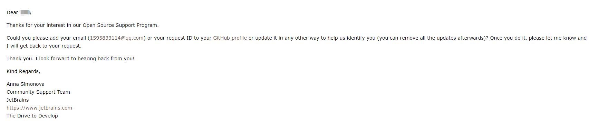
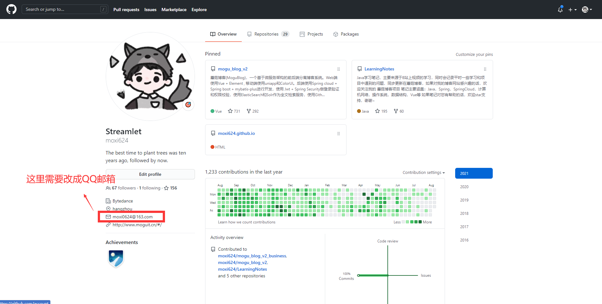
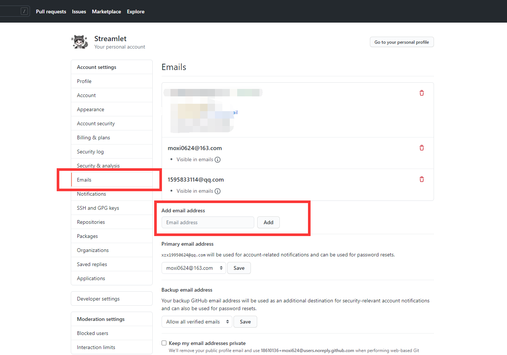
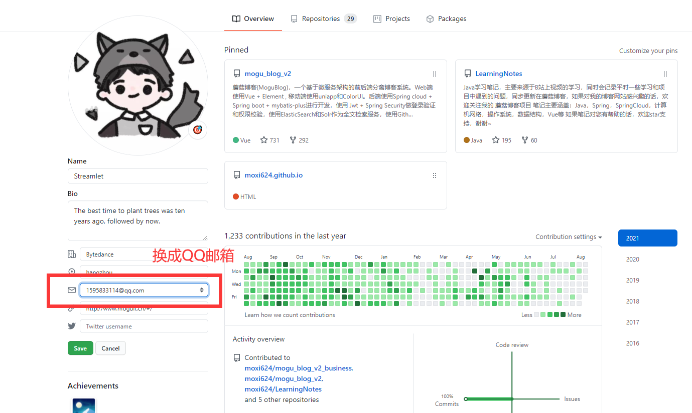
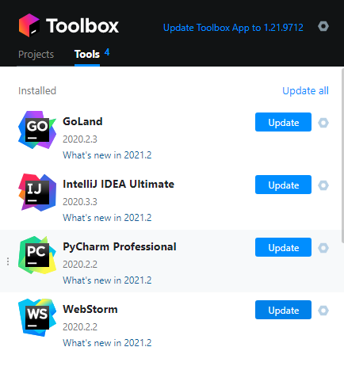

​                                                                                                                                                                           作者：陌溪

​                                                                                                                         陌溪的学习笔记：http://note.moguit.cn

大家好，我是 **陌溪**。

不知道现在还有多少小伙伴还在用 **Eclipse**。陌溪自从前两年被小伙伴安利 **Intellij IDEA**，毅然抛弃使用了三四年的 **Eclipse**，拥抱 **IDEA** 全家桶，经过长达半个月的使用后，终于健步如飞~

**IntelliJ IDEA** 是由位于东欧的 **JetBrains** 公司开发的 **Java** 集成开发环境，也是目前在业界被公认的最好用的 **Java** 开发工具，在智能代码助手，代码自动提示，重构，Git版本管理以及单元测试等方面发挥超常。

**Jetbrains** 的 **IDE** 一般分为  **Ultimate** (企业付费版) 和 **Community** (社区免费版) 两个版本。针对 **免费版**的 **IDEA** 来说，只支持 **Java** 和 **Kotlin** 等少数语言，而 **企业付费版** 还支持 **HTML**、**CSS**、**MySQL**、**Vue** 等。

所以大多数小伙伴还是更希望使用功能更强大的 **企业付费版** 来进行开发，但 **企业付费版** 的正版价格是 **499$** ，约等于人民币 **3000** 元，还是非常昂贵的价格， 因此就会寻找和谐破解版本的 **IDEA** 来进行开发。

后面陌溪通过开源社区了解到 **JetBrains** 公司为了表达对开源社区的支持 ，使用满足条件的 **开源项目** 就可以去申请正版的 **JetBrains** 全家桶 **1** 年使用权限，同时如果版本到期了，并且你还在继续参与开源项目的贡献，那么还可以继续申请。

目前关于 **开源项目** 的要求如下：

- 项目在 **Github** 上开源

- 你必须是项目的创建人，或者是活跃的贡献者
- 你的项目需要积极开发 **3** 个月以上
- 定期发布新版本
- 符合开源的定义，不能包含有关商业性质的内容

陌溪对比了一下上面的条件，发现 **蘑菇博客** 项目都满足，因此就拿着 **蘑菇** 进行申请了~

> 蘑菇博客Github地址：
>
> https://github.com/moxi624/mogu_blog_v2

## 开始申请

通过 **JetBrains** 提供的申请地址，提交对应的表单

> 申请地址：
>
> https://www.jetbrains.com/shop/eform/opensource

把信息填写完成后提交即可，然后就会收到来自 **JetBrains** 的官方邮件

大概的意思就是他们将在接下来的1到2周内评估我的项目，并将通过电子邮件通知是否发放开源的 **License**。

然后没过几天，就收到邮件了，我还以为是 **激活码** 已经发放下来了，点开邮件一看。。

原来是我的邮箱填错了，我在 **Github** 写的是**163** 邮箱，但是在申请的时候用的是 **QQ** 邮箱，所以让我在 **Github**上添加 **QQ** 邮箱

下面只需要在 **Setting** 添加一下我们的 QQ 邮箱即可

然后在切换到首页，把邮箱换成我们新添加的 **QQ** 邮箱

然后在用 **蹩脚 ** 英文水平，在配合 **Google** 翻译的强大加持，回复了一下邮件

大概意思就是，我已经按照修改好啦，速速发码~

然后没过多久，就回复了一封邮件，同时携带了对应的 **License**，点击下载对应的 **PDF** 文件

下载完成后，即可看到一些 **License** 信息，因为蘑菇之前的活跃用户贡献者有两个，所以就申请了两份 **License**

> 欢迎小伙伴来参与蘑菇贡献，以后给你也申请一个正版的~

然后点击链接，完成激活

打开页面后，会进入到 **Jetbrains** 官网，同时需要登录账号，因为每一份 **License** 是和账号绑定的

完成激活后，下次使用对应的账号登录，即可体验正版的  **IDEA** 了~ 

同时对于 **JetBrains** 全家桶的软件，都可以免费使用啦，陌溪平时写 **Go** 用的就是 **Goland**，写 **Python** 用的 **Pycharm**，写前端用的就是 **WebStorm** 。

好啦，本期就到这里，我是陌溪，我们下期再见~

## 往期推荐

- [蘑菇博客从0到2000Star，分享我的Java自学路线图](https://mp.weixin.qq.com/s/3u6OOYkpj4_ecMzfMqKJRw)
- [从三本院校到斩获字节跳动后端研发Offer-讲述我的故事](https://mp.weixin.qq.com/s/c4rR_aWpmNNFGn-mZBLWYg)
- [万字长文带你学习ElasticSearch](https://mp.weixin.qq.com/s/9eh6rK2aZHRiBpf5bRae9g)
- [双非本科，折戟成沙铁未销，九面字节终上岸！](https://mp.weixin.qq.com/s/SRf2f8wFFyjz2BUUXD_pmg)
- [如何使用一条命令完成蘑菇博客的部署？](https://mp.weixin.qq.com/s/LgRIqdPAGzN1tCPMi0Y8RQ)
- [为什么你们制作镜像只有5MB，而我却200MB？](https://mp.weixin.qq.com/s/iWpivtTAKMPKT6gq_3nwaA)

## 结语

应各位小伙伴们的需求，陌溪已经把 **大厂校招笔记** 已经整理成 **PDF** 版本啦，方便大家在手机或者电脑上阅读。以下笔记仓库的部分 **PDF** 文件 。如果有需要离线阅读的小伙伴可以到公众号回复 **PDF** ，即可获取下载地址~

同时本公众号**申请较晚**，暂时没有开通**留言**功能，欢迎小伙伴们添加我的私人微信【备注：**加群**】，我将邀请你加入到**蘑菇博客交流群**中，欢迎小伙伴们找陌溪一块聊天唠嗑，共同学习进步。最后，如果你觉得本文对你有所帮助，麻烦小伙伴们动动手指给文章点个「**赞**」和「**在看**」，非常感谢大家的支持。

