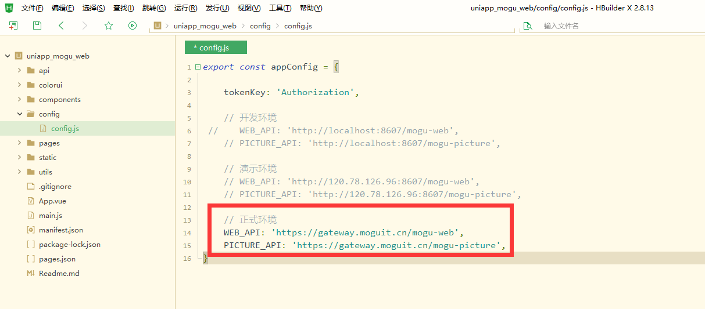
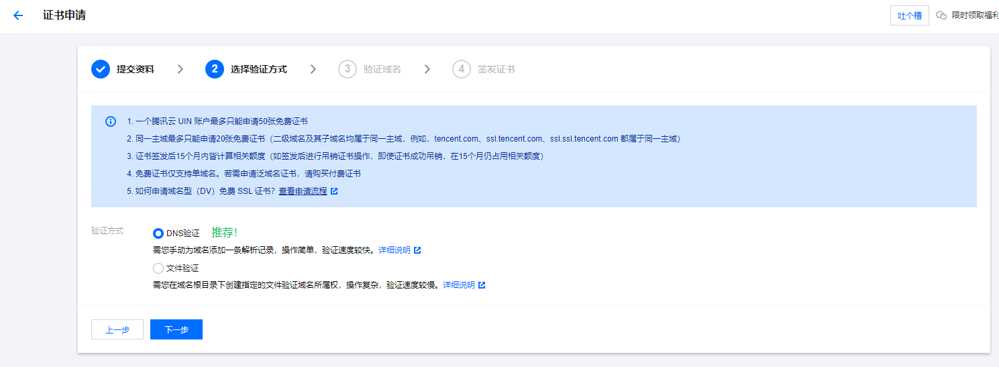
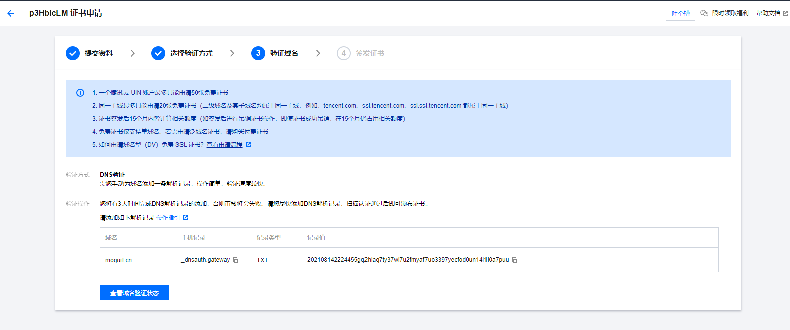
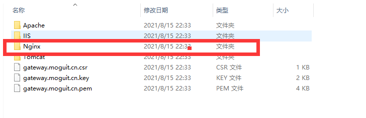
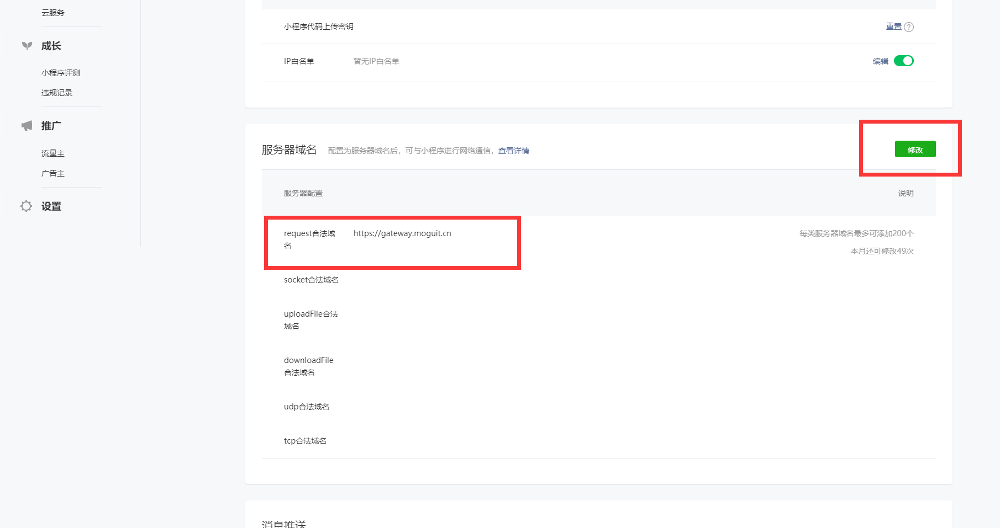
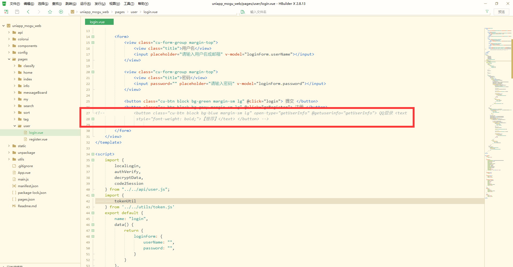
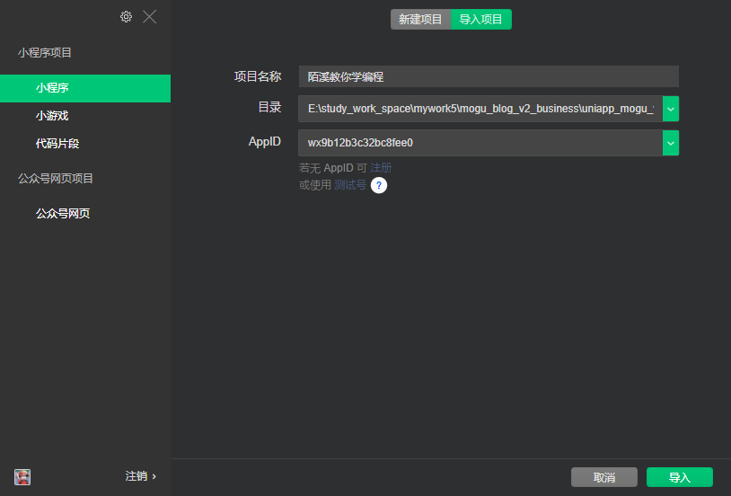
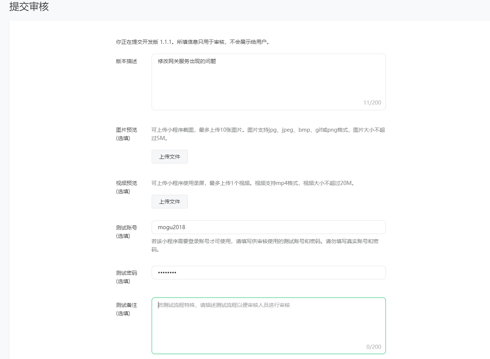

​                                                                                                                                                                           作者：陌溪

​                                                                                                                         陌溪的学习笔记：http://note.moguit.cn

大家好，我是 **陌溪**。

最近小伙伴一直叫我出一份 **蘑菇博客微信小程序** 的部署文章，这阵子刚好我小程序的证书也到期了，借此机会刚好就可以带着各位小伙伴一块完成微信小程序部署了，大家坐稳扶好，陌溪准备发车啦~

## 前置条件

在部署小程序之前，首先需要完成蘑菇博客的部署。如果还没有部署的小伙伴，可以参考陌溪周末录制的一键部署视频，快速完成博客的搭建。

> https://www.bilibili.com/video/BV13y4y1V7Us/

## 下载Hbuild

目前，微信小程序使用的 **uniapp**  进行开发的，**uniapp** 是使用 **vue.js** 开发的前端应用框架，可以做到开发一套代码，可发布到 **iOS**、**Android**、**H5**、以及各种小程序（微信/支付宝/百度/头条/QQ/钉钉/淘宝）、快应用等多个平台。下面，我们来演示一下，博客小程序搭建完成的样子。


同时，开发 **uniapp** 需要专门的编辑器 **HBuildX** ，需要点击下面的链接完成下载

> HBuild下载：https://www.dcloud.io/hbuilderx.html

## 导入小程序项目

首先到码云上下载蘑菇博客的源码

> 蘑菇博客：https://gitee.com/moxi159753/mogu_blog_v2

下载完成后，找到源码中的 **uniapp_mogu_web** 项目


导入到刚刚下载的 **HbuildX** 编辑器中，然后修改 **config.js** 文件，将其修改成蘑菇博客网关的域名。



## 配置https

因为小程序必须使用 **https** 才能够进行访问，因此需要给网关配置对应的 **SSL** 证书。

证书一般都需要到对应的云服务厂商进行购买，当然也可以自己生成证书，但是自己生成的证书也会出现不安全的提示，所以推荐还是通过云服务厂商购买免费的 **SSL** 证书。

陌溪本着能不花钱就不花钱的态度，来到了 腾讯云 **SSL** 证书的地址

> SSL证书：https://cloud.tencent.com/product/ssl


然后选择 **域名免费版**，点击 **免费快速申请**

  

然后填写刚刚的网关地址，点击下一步


选择验证方式为：**DNS** 验证



然后需要到阿里云的域名解析页，添加下面的解析记录



添加一条 **TXT** 的解析记录，等待几分钟后，完成部署


等待一会后，点击 **查看域名验证状态**，即可跳转到证书下载页


然后点击下载，得到一个 **zip** 的压缩包，解压后，可以看到各种版本的证书，例如：**Apache**，**IIS**，**Nginx**，**Tomcat** 等等，因为我们使用的是 **Nginx** 进行证书配置，所以选择 **Nginx** 版本的证书即可。



拷贝 **Nginx** 目录中的内容，到部署蘑菇博客服务器的目录下

```bash
cd /root/docker-compose/data/mogu_data/ssl/uniapp
```

拷贝完成后的效果，如下所示


然后到 **nginx** 的配置文件页面

```bash
# 切换到配置文件目录
cd /root/docker-compose/config
# 编辑nginx配置
vim mogu_data.conf
```

然后给 **gateway.moguit.cn** 添加上 **SSL** 证书配置

```bash
    server {
        listen       443 ssl;
        server_name  gateway.moguit.cn;
        ssl on;

        ssl_certificate  /home/mogu_blog/mogu_data/ssl/uniapp/1_gateway.moguit.cn_bundle.crt;
        ssl_certificate_key /home/mogu_blog/mogu_data/ssl/uniapp/2_gateway.moguit.cn.key;

        ssl_session_timeout  5m;
        ssl_ciphers ECDHE-RSA-AES128-GCM-SHA256:ECDHE:ECDH:AES:HIGH:!NULL:!aNULL:!MD5:!ADH:!RC4;

        ssl_protocols TLSv1 TLSv1.1 TLSv1.2;
        ssl_prefer_server_ciphers  on;
        location / {
           proxy_pass   http://101.132.194.128:8607/;
        }

    }

```

记录添加完成后，重启对应的 **nginx**

```bash
# 切换目录
cd /root/docker-compose-bussiness
# 重启
docker-compose -f yaml/mogu_data.yml restart
```

输入下面的网址进行测试

```bash
https://gateway.moguit.cn/doc.html
```

若能够打开页面，说明配置完成


完成 **https** 域名的配置后，需要到微信开放平台

> 微信开放平台：https://mp.weixin.qq.com/

获取到 小程序的 **APPID**


然后移动到下方，找到服务器域名，添加刚刚的蘑菇网关域名



## 发布到微信开发者工具

需要下载微信开发者工具，进行微信小程序的打包

> 微信开发者工具：
>
> https://developers.weixin.qq.com/miniprogram/dev/devtools/download.html

下载完微信开发者工具后，手动完成安装即可。

然后，点击 **HBuildX** 中的 **uniapp** 项目，找到 **pages/user/login.vue** 页面，然后注释掉 **QQ** 登录【微信小程序不支持QQ登录，同时微信登录需要付费，目前暂未集成】



最后在打开 **pages/home/home.vue** 文件 【 **home.vue** 是启动页，每次需要先打开这个页面进行运行】


点击上方的发行按钮，选择 **小程序-微信**


然后需要填写对应的小程序名称，以及刚刚在微信开放平台查看到的 **AppID**


填写完毕后，点击发布，**HBuildX** 会自动将 **uniapp** 代码转换成微信小程序代码


同时会自动打开刚刚下载好的微信，找到刚刚生成的 **微信小程序** 的代码进行导入



导入后，发现项目出现了问题


通过排查发现，需要点击右上角的详情，选择 **2.14.0** 的调试库


刷新页面即可看到项目成功运行起来了。点击上传代码，填写版本号信息


上传成功后，到微信开放平台的版本管理


填写对应的审核信息，然后点击提交审核



提交后，等待审核结果即可，一般的话，可能1到2天就会有审核的通知，当然如果初次提交的话，审核较为严格。


没过多久，就通过审核了，这里不得不说一波微信小程序的审核效率，比QQ小程序快多了~


在审核通过后，点击提交发布，然后选择全量发布。


在发布完成后，就可以在微信小程序搜索界面进行搜索了


点击第一个 **陌溪教你学编程** 小程序，即可打开进行体验了


同时如果小伙伴，想要打造一个属于自己的个人博客小程序，欢迎扫码体验~


好啦，本期就到这里，我是陌溪，我们下期再见~

## 往期推荐

- [蘑菇博客从0到2000Star，分享我的Java自学路线图](https://mp.weixin.qq.com/s/3u6OOYkpj4_ecMzfMqKJRw)
- [从三本院校到斩获字节跳动后端研发Offer-讲述我的故事](https://mp.weixin.qq.com/s/c4rR_aWpmNNFGn-mZBLWYg)
- [万字长文带你学习ElasticSearch](https://mp.weixin.qq.com/s/9eh6rK2aZHRiBpf5bRae9g)
- [双非本科，折戟成沙铁未销，九面字节终上岸！](https://mp.weixin.qq.com/s/SRf2f8wFFyjz2BUUXD_pmg)
- [如何使用一条命令完成蘑菇博客的部署？](https://mp.weixin.qq.com/s/LgRIqdPAGzN1tCPMi0Y8RQ)
- [为什么你们制作镜像只有5MB，而我却200MB？](https://mp.weixin.qq.com/s/iWpivtTAKMPKT6gq_3nwaA)
- [字节二面：蘑菇博客是怎么解决缓存穿透的?](https://mp.weixin.qq.com/s/JNnL6sTySXL9ta5p0rjjXg)
- [还在用破解IDEA？陌溪手把手教如何申请正版](https://mp.weixin.qq.com/s/mZjoSjk0QqeKFxPbFySomg)

## 结语

应各位小伙伴们的需求，陌溪已经把 **大厂校招笔记** 已经整理成 **PDF** 版本啦，方便大家在手机或者电脑上阅读。以下笔记仓库的部分 **PDF** 文件 。如果有需要离线阅读的小伙伴可以到公众号回复 **PDF** ，即可获取下载地址~


同时本公众号**申请较晚**，暂时没有开通**留言**功能，欢迎小伙伴们添加我的私人微信【备注：**加群**】，我将邀请你加入到**蘑菇博客交流群**中，欢迎小伙伴们找陌溪一块聊天唠嗑，共同学习进步。最后，如果你觉得本文对你有所帮助，麻烦小伙伴们动动手指给文章点个「**赞**」和「**在看**」，非常感谢大家的支持。


