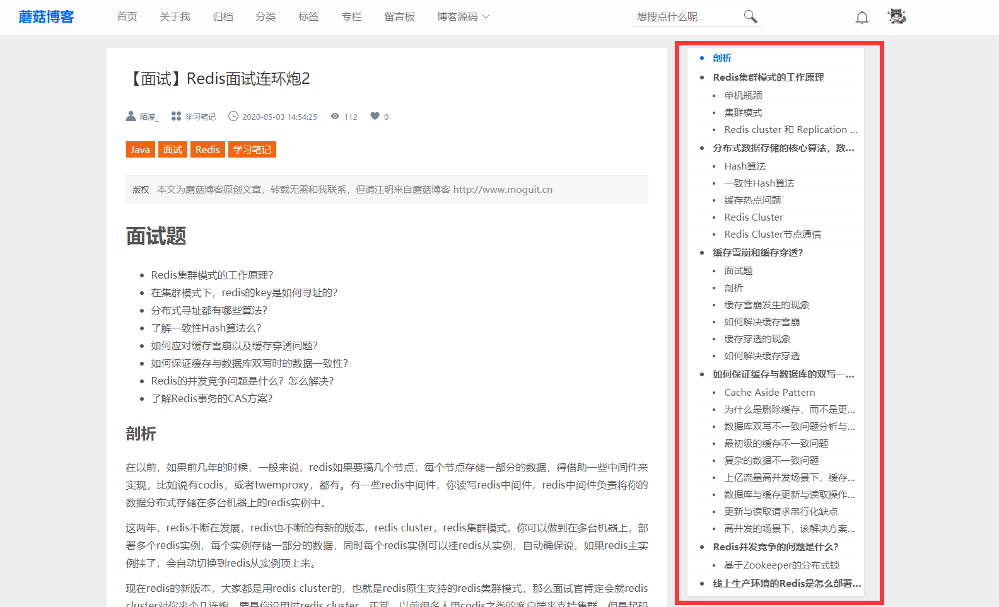
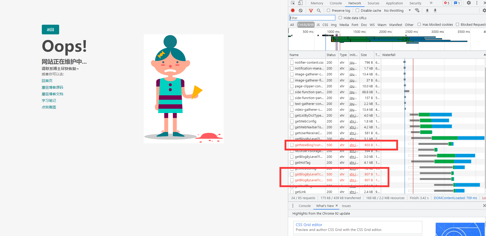
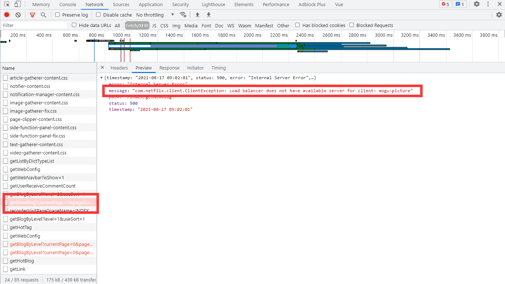
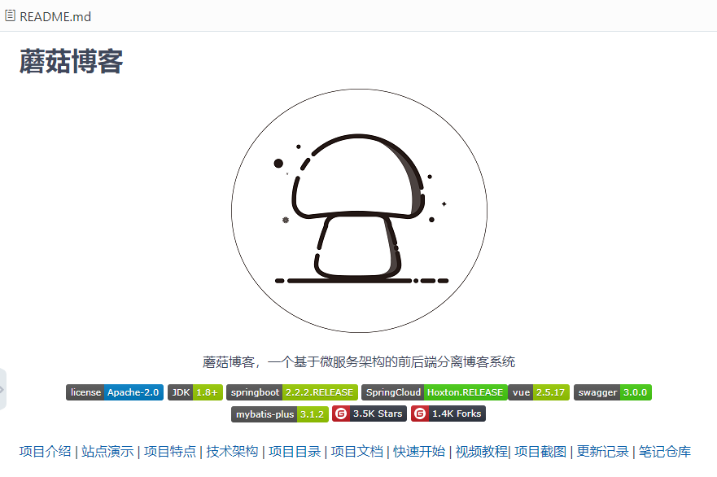
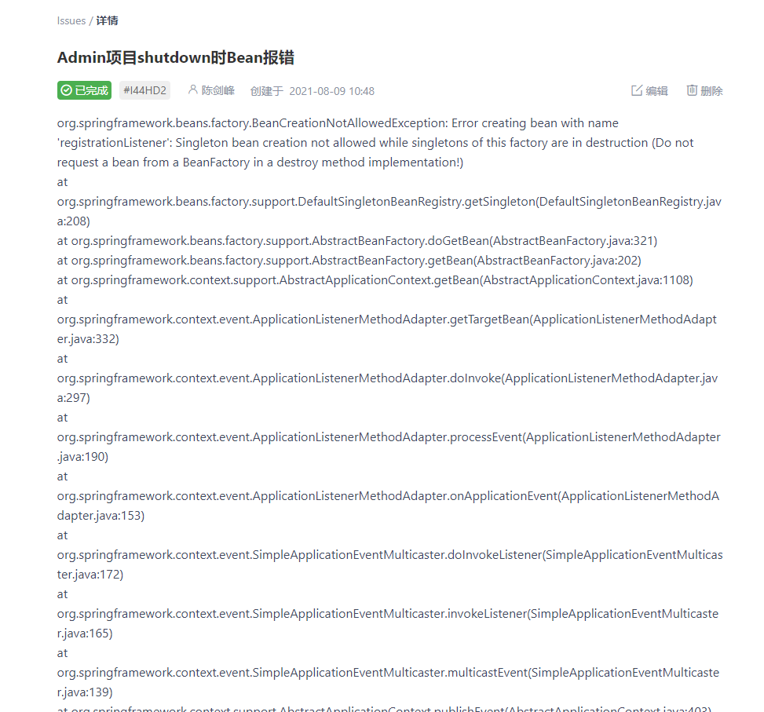

大家好，我是 **陌溪**。

首先问大家一个问题，不知道有多少小伙伴们，**是否有向开源社区提问过的经历**？

使用软件产品，或多或少都会遇到问题。对于商业产品，我们可以咨询客服寻求帮助。对于公司自己研发的产品，我们可以直接请教专家同事。但对于开源软件，在遇到问题时，如何才能及时有效地寻求帮助呢？

陌溪先来说，这是我之前在做蘑菇博客侧边栏的时候，向 **vue-side-catalog** 开源项目作者提出的一个 **BUG**，就是当页面的标题过多的时候，侧边栏无法展示全部内容的 **BUG**，同时还在 **Codesanbox** 复现了代码


同时也贴上了但是蘑菇博客出现 **BUG** 的那篇文章



作者很快就对问题做出来回应，修复了这个问题，所以对我来说这就是一次很不错的提问经历，同时也帮助作者完善了自己做的开源项目。

陌溪作为一个开源项目的作者，也非常欢迎大家像 **蘑菇博客** 反馈 **BUG**，同时也希望大家在提问的时候，同时附带上解决问题的思考，以及目前做了那些工作。

陌溪遇到最多的问题就是，蘑菇博客启动后，出现 **500** 错误，然后跳转到这个 **500** 页面。然后问：**为啥启动不了**？


其实看到这个页面，就应该知道肯定是 **500** 错误，为啥呢？因为页面都被重定向到 **500** 页面了 


所以第一步肯定是通过 **F12** 看 **Network**，然后看接口的请求情况



发现有三个接口出现了问题，那就点击启动一个，查看情况



看到这里，其实就明白了，是 **mogu-picture** 项目启动，需要自行重启即可，到后台执行

```bash
docker-compose -f yaml/mogu_picture.yml up -d 
```

重启完成后，在刷新页面，其实这个问题就已经解决了


从发现问题，到解决问题，其实也没用多少时间。所以希望各位小伙伴们，在对开源项目提问前，能够有一些自己的工作，而不是单纯的依靠他人。

提问前
---

遇到问题时，大家心里肯定非常着急，想着非常快的解决自己的问题，所以就直接把错误代码一贴，然后像开源作者进行提问，最后可能作者也并没有回复你。

因此，在决定向开源社区提交问题前，最好先完成以下几条：

### 开源项目README阅读一遍

开源项目的 **README**，往往就是开源项目的导航目录，在这里能够快速的了解到很多信息。



举个例子，陌溪被问的最多的一个问题就是：**项目账号和密码是啥**？**什么样的配置的服务器可以运行本项目**？

其实，如果你把项目的 **README** 看完后...


那这个问题就是游刃而解了

### 善于利用搜索引擎

对于任何项目中遇到的问题，你遇到的问题，很可能别人也遇到过。这个时候，你只需要把错误信息拷贝，然后复制到百度搜索，可以帮你快速定位并解决问题。


> 永远记住，地球上的你并不孤单，包括你遇到的问题。

### 翻看开源项目的issue

开源软件一般都会有自己的 **Bug** 管理方案，比如 **Github** 的 **issue**，在遇到问题的时候，都可以去哪里搜索一下，没准你的问题别人也已经提过了，并且在 **issue** 上也给出了解答。


例如，之前陌溪在安装 **vue** 项目的时候，一直出现 **node-sass** 下载失败的问题，通过百度也没有解决这个问题，后面陌溪通过搜索项目仓库的 **issue**，找到了解决方法。


对于活跃社区来说，这一招经常很管用，一个运作良好的开源项目，你可以在 **Issues** 中找到很多信息，同时也能发现巨大的宝藏，小伙伴们没事的时候，可以去别人的 **issue** 下学习~

记得上次，**Nacos 1.4** 以下版本出现的重大安全事故，差点让蘑菇博客被删库。陌溪和群里小伙伴们，就是在 **Nacos** 的 **issue** 进行围观了一波，同时也紧急的修复了 **BUG**。


当时 **BUG** 的缘由就是：用户发现通过设置请求头：**User-Agent: Nacos-Server**，就可以绕过 **Nacos** 的权限校验，而直接获取到项目的所有配置文件信息，建议 **Nacos** 官方立即对这个问题进行修复。

后 **Nacos** 项目的开发者认为，这不是一个 **安全漏洞**，并且认为通过设置 **User-Agent** 就相当于开启了白名单，那么就可以忽略鉴权。


开发人员的答复马上就获得了 **300** 多人的反对意见。认为开发者将 **Nacos** 默认密码和本次**安全漏洞**说成是一个问题。


最后社区小伙伴们，踊跃的提出了自己的修改意见，后面开发者决定通过增加自定义 **Key Value** 键值对对来解决，只有通过设置**正确的键值**对才能**获取配置**。


想要围观那次事故的小伙伴，可以移步到陌溪之前写过的一篇文章：[Nacos出现重大安全漏洞,开源项目险遭脱库](https://mp.weixin.qq.com/s/8DtVEtJZU47Ugr802l9ZWg)

### 求助身边的伙伴

如果你身边的小伙伴，也使用过这个开源项目，那么就大胆的抱着电脑，走到他身边，或者直接点开他的微信头像，来一次 **one on one**。时刻记住，真挚诚恳的探讨不会遭遇拒绝，而会增进友谊。

>  不要犹豫，你的内心渴望面对面交流，你的朋友也是。

同时，开源项目也会有自己的社区群，里面也有很多已经使用过该开源项目的小伙伴。所以遇到问题时，也可以在群里提问，这样群里小伙伴也可以协助你解决问题。

如果以上 **4** 步都无法解决你遇到的问题，也别犹豫，立马向开源社区提交问题就好。

提问时
---

提问方式有很多种，如果你认识开源作者，直接面对面请教就行。下面，我们讨论的是，如何通过互联网手段，向热门的开源社区提问。

### 保持平和对等的态度

**Github** 上很多优秀的开源软件都是遵循 **Apache**、**MIT** 等开源协议的，也就是说，它们都会开源免费的。同时，**开源作者** 往往只有一个人，而他们基本上都是利用自己的**业余时间**，并且出于兴趣对开源项目进行维护。所以，作者没有 **义务** 回答社区提出的任何问题。

因此，再提问时，不要把自己摆在 **顾客** 的位置，比如

> 项目马上就要上线啦，请务必帮忙解决问题， 这是我的个人邮箱 xxx@qq.com，请及时联系我。

另外，也不要把自己摆在 **乞食者** 的位置，比如

> 冰天雪地跪求解答，要被祭天了啊，救命啊，我的网站挂了

在开源社区里面，大家都是好朋友。无论对方是 **Linux** 内核的作者，还是 **Github** 某个**不知名** 项目的作者。你们和开源作者都会平等的，而你的提问是在帮助开源软件完善。

> 平和对等的心态，可以让你的问题赢得更多人的阅读和思考

### 通过正确的途径提交

如果遇到问题的开源软件有专门的 **Bug** 管理系统，请最好到这些指定系统中提交，一般是 **Github** 的 **issue**，或者开源项目指定的 **问答社区**。最不好的途径是：

*   **QQ** 、阿里旺旺、微信等群组。这些群组主要是用来工作或日常吹水的。对开源项目来说，在这些地方提问，作者一般不会关注，并且问题可能会很快就被其它消息覆盖了，所以效率非常低。
*   微博、**朋友圈** 等社交网络。不少人在微博上通过 **@** 或私信询问，这些作者是经常看不到。看到了，也不情愿回复。微博是扯淡、交流情感的地方，一般是写代码写累了，才去逛逛，很少会有在社交网络上回答技术问题的心情。

通过正确的途径提交问题，一般可以让你的问题得到及时准确的回复。

### 使用明确、有意义的标题

抱着平和对等的心态，找到合适的途径后，就得静下心来将遇到的问题写成文字。书写文字不是一件简单的事情，我们可以从遵循一些简单的规则开始。

首先是标题要简洁清晰，要言之有物。比如

> 我遇到了一个 Ajax 问题 SeaJS 在我的浏览器上运行不了

上面的标题很糟糕，光看标题作者无法知道发生了什么事。当开源社区的问题很多时，上面这类标题，经常会让作者直接忽视或将优先级降到很低。更妥当的标题是

> **Ajax** 请求未返回正确的  responseXML SeaJS 2.0 在 **IE6** 上运行时抛错

明确、有意义的标题，可以帮助作者确定问题具体是什么类型、预估需要多少时间解决、是否现在马上解决等。一个好的标题，也有利于社区知识的沉淀和后期搜索。标题有如一个人的颜面衣着，虽然不是关键，但在嘈杂的信息社区中，这很重要。

### 遵循良好的模板

如果社区提供了问题模板，一定要仔细看下。当你创建一个问题时，会自动提供以下模板

    1.问题描述
    
    
    2.问题出现的环境背景及自己尝试过哪些方法
    
    
    3.相关代码
    
    
    4.你期待的结果是什么？实际看到的错误信息又是什么？


遵循这个模板去描述问题，经常能省很多事，如果社区没有提供模板，也可以自己遵循以上模板来提交。作者一般也非常欢迎通过模板提交的问题。

下面针对问题内容，具体说说一些需要注意的点。

### 语法正确、格式清晰

虽然我们不是作家，但正确的语法、清晰的格式，可以让读者赏心悦目，也就更有心情帮你一起思考解决问题。

对于很多需要代码来描述的问题，要尤其注意格式，比如

    seajs.use('jquery',function($){$(document).ready(function() { /* ... */ })});


可读性不如下面的代码

    seajs.use('jquery', function($) {
      $(document).ready(function() {
        // ...
      });
    });

使用 **Markdown** 语法进行代码排版、同时对于重点的区域，使用语法高亮等。这能让你的内容看起来很专业，社区也就更有意愿会去帮助你，否则糟糕的排版，经常带来的是发帖之后的石沉大海。

反例：就是下面这个，直接复制报错的信息，也没有任何错误描述，也没有进行代码排版。



### 描述事实、而不是猜测

事实是指，依次进行了哪些操作、产生了怎样的结果。比如

> 我在 Windows XP 下用 IE6 打开 [seajs.org](http://seajs.org/) 后，点击“5 分钟上手 SeaJS”，这时浏览器弹出脚本错误提示，例子显示不正确。

上面是一段比较好的事实描述，如果能够提供错误的提示，或者截图就更棒了~

切记，不要像下面这样猜测，一上来就怀疑开源作者的代码有问题....

> SeaJS 在 IE6 下运行不正常，我怀疑是源码第 213 行有问题。

上面的描述，会让作者一头雾水、甚至很恼火。尽量避免猜测性描述，除非你能先描述事实，在事实描述清楚之后，再给出合理的猜测是欢迎的。

对于前端项目来说，如果能提供可重现错误的在线可访问代码，那是最好不过的，常见的平台如  **Codesanbox**。一旦你这么用心去做了，作者往往也会很用心地立马帮你解决。

### 提问要有具体场景

无论在开源社区，还是微博、知乎等平台上，有一种非常常见的问题：

> 如何维护 JavaScript 代码？ 如何使用 SeaJS 进行模块化开发？

这类问题还有很多，每每遇到，只能笑笑，然后悄悄地忽略掉。因此这类问题很难回答，就如下面这些问题一样：

> 如何才能让生命有意义？ 如何打败淘宝？

这类提问者，一般比较浮躁，经常对问题本身也没有经过思考。

踏实的提问者，不会让问题浮在空中无法回答，而会在具体场景中让问题落地，比如下面这种提问方式：

> 我的项目有 20 多个 JS 文件，接下来还会急剧增加。目前遇到以下问题……（省略五百字）…… 请问如何维护？

### 仔细检查、确保准确

在书写完问题后，先不要着急提交，看看自己写的问题语法是否正确，保证问题自己从头到尾都通读了一遍，把文章出现的错误，错别字，标点符号以及排版问题都好好的核查一下。

> 快节奏的互联网环境下, 人人都会犯错。做到这些，不光是尊重别人，也是尊重自己。

提问后
---

提交问题后，建议通过邮件等方式订阅回复。互联网上最有效的沟通方式是 **异步沟通** ，等待作者的回调即可。

同时，也不要期待作者马上回复，也不要心烦意乱着急地等待。出去看看天，数数云朵，你会逐步明白什么是风轻云淡。

### 尽可能补充信息

在接收到回复时，仔细阅读。最经常的情况是，社区回复的，经常不是你想要的。比如

> 根据你的描述，问题无法重现。能否提供具体使用环境和重现步骤？

这时要淡定。仔细看看自己提交的问题描述是否足够清晰，如果有可补充的信息，尽量补充，以帮助作者能尽快定位问题。比如

> 很抱歉，我前面有一步描述不正确，实际情况是我是在 IETester 中运行的……

谦和淡定的交流，不光能帮助你解决问题，还有助于你结交更多朋友。

### 适当的总结

当问题终于解决时，建议对问题进行总结。可以编辑原帖，也可以通过博客等方式总结。你的总结，会让遇到同样问题的朋友们受益，并且对自己的技能也是一种提高。无论国内还是国外，有很多牛人之所以成为牛人，很大程度上都是因为有总结思考的好习惯。

### 不要忘记感谢

最后，记得感谢。很多开源软件的作者，都是利用业余时间在创作代码。你的感谢，汇集许许多多大家的感谢，会让开源社区充满爱与力量。同时，如果开源项目提供了赞赏的入口，也不妨请作者恰一杯奶茶，感谢作者辛勤的付出~。

好啦，本期分享就到这里，我是陌溪，我们下期再见~

往期推荐
----

*   [蘑菇博客从0到2000Star，分享我的Java自学路线图](https://mp.weixin.qq.com/s/3u6OOYkpj4_ecMzfMqKJRw)
*   [从三本院校到斩获字节跳动后端研发Offer-讲述我的故事](https://mp.weixin.qq.com/s/c4rR_aWpmNNFGn-mZBLWYg)
*   [万字长文带你学习ElasticSearch](https://mp.weixin.qq.com/s/9eh6rK2aZHRiBpf5bRae9g)
*   [双非本科，折戟成沙铁未销，九面字节终上岸！](https://mp.weixin.qq.com/s/SRf2f8wFFyjz2BUUXD_pmg)
*   [如何使用一条命令完成蘑菇博客的部署？](https://mp.weixin.qq.com/s/LgRIqdPAGzN1tCPMi0Y8RQ)
*   [为什么你们制作镜像只有5MB，而我却200MB？](https://mp.weixin.qq.com/s/iWpivtTAKMPKT6gq_3nwaA)
*   [字节二面：蘑菇博客是怎么解决缓存穿透的?](https://mp.weixin.qq.com/s/JNnL6sTySXL9ta5p0rjjXg)
*   [还在用破解IDEA？陌溪手把手教如何申请正版](https://mp.weixin.qq.com/s/mZjoSjk0QqeKFxPbFySomg)

结语
--

应各位小伙伴们的需求，陌溪已经把 **大厂校招笔记** 已经整理成 **PDF** 版本啦，方便大家在手机或者电脑上阅读。以下笔记仓库的部分 **PDF** 文件 。如果有需要离线阅读的小伙伴可以到公众号回复 **PDF** ，即可获取下载地址~


同时本公众号**申请较晚**，暂时没有开通**留言**功能，欢迎小伙伴们添加我的私人微信【备注：**加群**】，我将邀请你加入到**蘑菇博客交流群**中，欢迎小伙伴们找陌溪一块聊天唠嗑，共同学习进步。最后，如果你觉得本文对你有所帮助，麻烦小伙伴们动动手指给文章点个「**赞**」和「**在看**」，非常感谢大家的支持。

