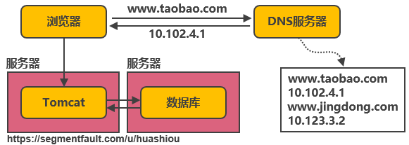
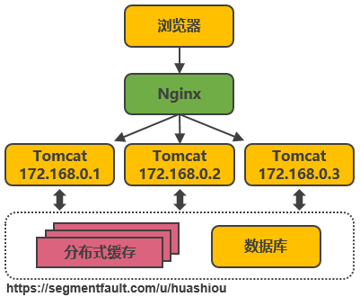
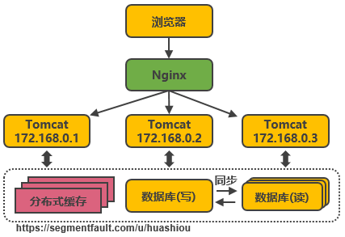
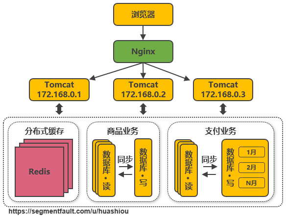
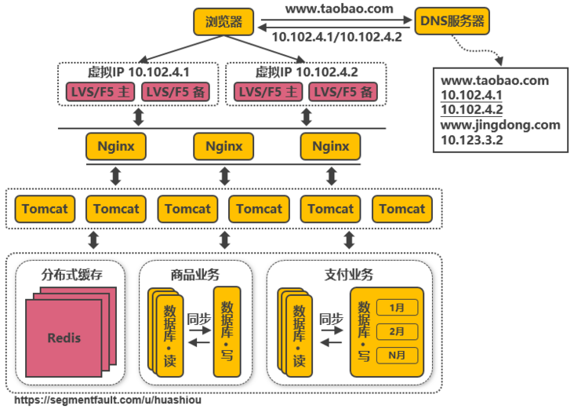
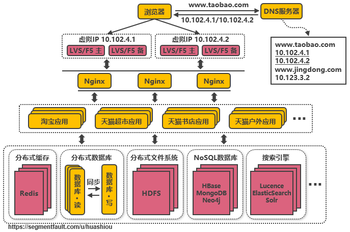
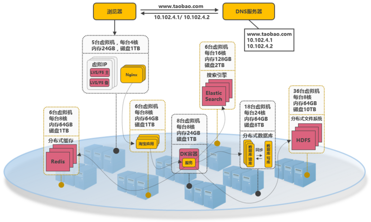

# 1. 概述

本文以淘宝作为例子，介绍从一百个到千万级并发情况下服务端的架构的演进过程，同时列举出每个演进阶段会遇到的相关技术，让大家对架构的演进有一个整体的认知，文章最后汇总了一些架构设计的原则。

> **特别说明：本文以淘宝为例仅仅是为了便于说明演进过程可能遇到的问题，并非是淘宝真正的技术演进路径**

# 2. 基本概念

在介绍架构之前，为了避免部分读者对架构设计中的一些概念不了解，下面对几个最基础的概念进行介绍：

- **分布式**
  系统中的多个模块在不同服务器上部署，即可称为分布式系统，如Tomcat和数据库分别部署在不同的服务器上，或两个相同功能的Tomcat分别部署在不同服务器上
- **高可用**
  系统中部分节点失效时，其他节点能够接替它继续提供服务，则可认为系统具有高可用性
- **集群**
  一个特定领域的软件部署在多台服务器上并作为一个整体提供一类服务，这个整体称为集群。如Zookeeper中的Master和Slave分别部署在多台服务器上，共同组成一个整体提供集中配置服务。在常见的集群中，客户端往往能够连接任意一个节点获得服务，并且当集群中一个节点掉线时，其他节点往往能够自动的接替它继续提供服务，这时候说明集群具有高可用性
- **负载均衡**
  请求发送到系统时，通过某些方式把请求均匀分发到多个节点上，使系统中每个节点能够均匀的处理请求负载，则可认为系统是负载均衡的
- **正向代理和反向代理**
  系统内部要访问外部网络时，统一通过一个代理服务器把请求转发出去，在外部网络看来就是代理服务器发起的访问，此时代理服务器实现的是正向代理；当外部请求进入系统时，代理服务器把该请求转发到系统中的某台服务器上，对外部请求来说，与之交互的只有代理服务器，此时代理服务器实现的是反向代理。简单来说，正向代理是代理服务器代替系统内部来访问外部网络的过程，反向代理是外部请求访问系统时通过代理服务器转发到内部服务器的过程。

# 3. 架构演进

## 3.1 单机架构

以淘宝作为例子。在网站最初时，应用数量与用户数都较少，可以把Tomcat和数据库部署在同一台服务器上。浏览器往www.taobao.com发起请求时，首先经过DNS服务器（域名系统）把域名转换为实际IP地址10.102.4.1，浏览器转而访问该IP对应的Tomcat。

> **随着用户数的增长，Tomcat和数据库之间竞争资源，单机性能不足以支撑业务**

## 3.2 第一次演进：Tomcat与数据库分开部署

Tomcat和数据库分别独占服务器资源，显著提高两者各自性能。

> **随着用户数的增长，并发读写数据库成为瓶颈**

## 3.3 第二次演进：引入本地缓存和分布式缓存

在Tomcat同服务器上或同JVM中增加本地缓存，并在外部增加分布式缓存，缓存热门商品信息或热门商品的html页面等。通过缓存能把绝大多数请求在读写数据库前拦截掉，大大降低数据库压力。其中涉及的技术包括：使用memcached作为本地缓存，使用Redis作为分布式缓存，还会涉及缓存一致性、缓存穿透/击穿、缓存雪崩、热点数据集中失效等问题。

> **缓存抗住了大部分的访问请求，随着用户数的增长，并发压力主要落在单机的Tomcat上，响应逐渐变慢**

## 3.4 第三次演进：引入反向代理实现负载均衡

在多台服务器上分别部署Tomcat，使用反向代理软件（Nginx）把请求均匀分发到每个Tomcat中。此处假设Tomcat最多支持100个并发，Nginx最多支持50000个并发，那么理论上Nginx把请求分发到500个Tomcat上，就能抗住50000个并发。其中涉及的技术包括：Nginx、HAProxy，两者都是工作在网络第七层的反向代理软件，主要支持http协议，还会涉及session共享、文件上传下载的问题。

> **反向代理使应用服务器可支持的并发量大大增加，但并发量的增长也意味着更多请求穿透到数据库，单机的数据库最终成为瓶颈**

## 3.5 第四次演进：数据库读写分离

把数据库划分为读库和写库，读库可以有多个，通过同步机制把写库的数据同步到读库，对于需要查询最新写入数据场景，可通过在缓存中多写一份，通过缓存获得最新数据。其中涉及的技术包括：Mycat，它是数据库中间件，可通过它来组织数据库的分离读写和分库分表，客户端通过它来访问下层数据库，还会涉及数据同步，数据一致性的问题。

> **业务逐渐变多，不同业务之间的访问量差距较大，不同业务直接竞争数据库，相互影响性能**

## 3.6 第五次演进：数据库按业务分库

把不同业务的数据保存到不同的数据库中，使业务之间的资源竞争降低，对于访问量大的业务，可以部署更多的服务器来支撑。这样同时导致跨业务的表无法直接做关联分析，需要通过其他途径来解决，但这不是本文讨论的重点，有兴趣的可以自行搜索解决方案。

> **随着用户数的增长，单机的写库会逐渐会达到性能瓶颈**

## 3.7 第六次演进：把大表拆分为小表

比如针对评论数据，可按照商品ID进行hash，路由到对应的表中存储；针对支付记录，可按照小时创建表，每个小时表继续拆分为小表，使用用户ID或记录编号来路由数据。只要实时操作的表数据量足够小，请求能够足够均匀的分发到多台服务器上的小表，那数据库就能通过水平扩展的方式来提高性能。其中前面提到的Mycat也支持在大表拆分为小表情况下的访问控制。

这种做法显著的增加了数据库运维的难度，对DBA的要求较高。数据库设计到这种结构时，已经可以称为分布式数据库，但是这只是一个逻辑的数据库整体，数据库里不同的组成部分是由不同的组件单独来实现的，如分库分表的管理和请求分发，由Mycat实现，SQL的解析由单机的数据库实现，读写分离可能由网关和消息队列来实现，查询结果的汇总可能由数据库接口层来实现等等，这种架构其实是MPP（大规模并行处理）架构的一类实现。

目前开源和商用都已经有不少MPP数据库，开源中比较流行的有Greenplum、TiDB、Postgresql XC、HAWQ等，商用的如南大通用的GBase、睿帆科技的雪球DB、华为的LibrA等等，不同的MPP数据库的侧重点也不一样，如TiDB更侧重于分布式OLTP场景，Greenplum更侧重于分布式OLAP场景，这些MPP数据库基本都提供了类似Postgresql、Oracle、MySQL那样的SQL标准支持能力，能把一个查询解析为分布式的执行计划分发到每台机器上并行执行，最终由数据库本身汇总数据进行返回，也提供了诸如权限管理、分库分表、事务、数据副本等能力，并且大多能够支持100个节点以上的集群，大大降低了数据库运维的成本，并且使数据库也能够实现水平扩展。

> **数据库和Tomcat都能够水平扩展，可支撑的并发大幅提高，随着用户数的增长，最终单机的Nginx会成为瓶颈**

## 3.8 第七次演进：使用LVS或F5来使多个Nginx负载均衡

由于瓶颈在Nginx，因此无法通过两层的Nginx来实现多个Nginx的负载均衡。图中的LVS和F5是工作在网络第四层的负载均衡解决方案，其中LVS是软件，运行在操作系统内核态，可对TCP请求或更高层级的网络协议进行转发，因此支持的协议更丰富，并且性能也远高于Nginx，可假设单机的LVS可支持几十万个并发的请求转发；F5是一种负载均衡硬件，与LVS提供的能力类似，性能比LVS更高，但价格昂贵。由于LVS是单机版的软件，若LVS所在服务器宕机则会导致整个后端系统都无法访问，因此需要有备用节点。可使用keepalived软件模拟出虚拟IP，然后把虚拟IP绑定到多台LVS服务器上，浏览器访问虚拟IP时，会被路由器重定向到真实的LVS服务器，当主LVS服务器宕机时，keepalived软件会自动更新路由器中的路由表，把虚拟IP重定向到另外一台正常的LVS服务器，从而达到LVS服务器高可用的效果。

此处需要注意的是，上图中从Nginx层到Tomcat层这样画并不代表全部Nginx都转发请求到全部的Tomcat，在实际使用时，可能会是几个Nginx下面接一部分的Tomcat，这些Nginx之间通过keepalived实现高可用，其他的Nginx接另外的Tomcat，这样可接入的Tomcat数量就能成倍的增加。

> **由于LVS也是单机的，随着并发数增长到几十万时，LVS服务器最终会达到瓶颈，此时用户数达到千万甚至上亿级别，用户分布在不同的地区，与服务器机房距离不同，导致了访问的延迟会明显不同**

## 3.9 第八次演进：通过DNS轮询实现机房间的负载均衡

在DNS服务器中可配置一个域名对应多个IP地址，每个IP地址对应到不同的机房里的虚拟IP。当用户访问www.taobao.com时，DNS服务器会使用轮询策略或其他策略，来选择某个IP供用户访问。此方式能实现机房间的负载均衡，至此，系统可做到机房级别的水平扩展，千万级到亿级的并发量都可通过增加机房来解决，系统入口处的请求并发量不再是问题。

> **随着数据的丰富程度和业务的发展，检索、分析等需求越来越丰富，单单依靠数据库无法解决如此丰富的需求**

## 3.10 第九次演进：引入NoSQL数据库和搜索引擎等技术

当数据库中的数据多到一定规模时，数据库就不适用于复杂的查询了，往往只能满足普通查询的场景。对于统计报表场景，在数据量大时不一定能跑出结果，而且在跑复杂查询时会导致其他查询变慢，对于全文检索、可变数据结构等场景，数据库天生不适用。因此需要针对特定的场景，引入合适的解决方案。如对于海量文件存储，可通过分布式文件系统HDFS解决，对于key value类型的数据，可通过HBase和Redis等方案解决，对于全文检索场景，可通过搜索引擎如ElasticSearch解决，对于多维分析场景，可通过Kylin或Druid等方案解决。

当然，引入更多组件同时会提高系统的复杂度，不同的组件保存的数据需要同步，需要考虑一致性的问题，需要有更多的运维手段来管理这些组件等。

> **引入更多组件解决了丰富的需求，业务维度能够极大扩充，随之而来的是一个应用中包含了太多的业务代码，业务的升级迭代变得困难**

## 3.11 第十次演进：大应用拆分为小应用

按照业务板块来划分应用代码，使单个应用的职责更清晰，相互之间可以做到独立升级迭代。这时候应用之间可能会涉及到一些公共配置，可以通过分布式配置中心Zookeeper来解决。

> **不同应用之间存在共用的模块，由应用单独管理会导致相同代码存在多份，导致公共功能升级时全部应用代码都要跟着升级**

## 3.12 第十一次演进：复用的功能抽离成微服务

如用户管理、订单、支付、鉴权等功能在多个应用中都存在，那么可以把这些功能的代码单独抽取出来形成一个单独的服务来管理，这样的服务就是所谓的微服务，应用和服务之间通过HTTP、TCP或RPC请求等多种方式来访问公共服务，每个单独的服务都可以由单独的团队来管理。此外，可以通过Dubbo、SpringCloud等框架实现服务治理、限流、熔断、降级等功能，提高服务的稳定性和可用性。

> **不同服务的接口访问方式不同，应用代码需要适配多种访问方式才能使用服务，此外，应用访问服务，服务之间也可能相互访问，调用链将会变得非常复杂，逻辑变得混乱**

## 3.13 第十二次演进：引入企业服务总线ESB屏蔽服务接口的访问差异

通过ESB统一进行访问协议转换，应用统一通过ESB来访问后端服务，服务与服务之间也通过ESB来相互调用，以此降低系统的耦合程度。这种单个应用拆分为多个应用，公共服务单独抽取出来来管理，并使用企业消息总线来解除服务之间耦合问题的架构，就是所谓的SOA（面向服务）架构，这种架构与微服务架构容易混淆，因为表现形式十分相似。个人理解，微服务架构更多是指把系统里的公共服务抽取出来单独运维管理的思想，而SOA架构则是指一种拆分服务并使服务接口访问变得统一的架构思想，SOA架构中包含了微服务的思想。

> **业务不断发展，应用和服务都会不断变多，应用和服务的部署变得复杂，同一台服务器上部署多个服务还要解决运行环境冲突的问题，此外，对于如大促这类需要动态扩缩容的场景，需要水平扩展服务的性能，就需要在新增的服务上准备运行环境，部署服务等，运维将变得十分困难**

## 3.14 第十三次演进：引入容器化技术实现运行环境隔离与动态服务管理

目前最流行的容器化技术是Docker，最流行的容器管理服务是Kubernetes(K8S)，应用/服务可以打包为Docker镜像，通过K8S来动态分发和部署镜像。Docker镜像可理解为一个能运行你的应用/服务的最小的操作系统，里面放着应用/服务的运行代码，运行环境根据实际的需要设置好。把整个“操作系统”打包为一个镜像后，就可以分发到需要部署相关服务的机器上，直接启动Docker镜像就可以把服务起起来，使服务的部署和运维变得简单。

在大促的之前，可以在现有的机器集群上划分出服务器来启动Docker镜像，增强服务的性能，大促过后就可以关闭镜像，对机器上的其他服务不造成影响（在3.14节之前，服务运行在新增机器上需要修改系统配置来适配服务，这会导致机器上其他服务需要的运行环境被破坏）。

> **使用容器化技术后服务动态扩缩容问题得以解决，但是机器还是需要公司自身来管理，在非大促的时候，还是需要闲置着大量的机器资源来应对大促，机器自身成本和运维成本都极高，资源利用率低**

## 3.15 第十四次演进：以云平台承载系统

系统可部署到公有云上，利用公有云的海量机器资源，解决动态硬件资源的问题，在大促的时间段里，在云平台中临时申请更多的资源，结合Docker和K8S来快速部署服务，在大促结束后释放资源，真正做到按需付费，资源利用率大大提高，同时大大降低了运维成本。

所谓的云平台，就是把海量机器资源，通过统一的资源管理，抽象为一个资源整体，在之上可按需动态申请硬件资源（如CPU、内存、网络等），并且之上提供通用的操作系统，提供常用的技术组件（如Hadoop技术栈，MPP数据库等）供用户使用，甚至提供开发好的应用，用户不需要关系应用内部使用了什么技术，就能够解决需求（如音视频转码服务、邮件服务、个人博客等）。在云平台中会涉及如下几个概念：

- **IaaS：**基础设施即服务。对应于上面所说的机器资源统一为资源整体，可动态申请硬件资源的层面；
- **PaaS：**平台即服务。对应于上面所说的提供常用的技术组件方便系统的开发和维护；
- **SaaS：**软件即服务。对应于上面所说的提供开发好的应用或服务，按功能或性能要求付费。

> **至此，以上所提到的从高并发访问问题，到服务的架构和系统实施的层面都有了各自的解决方案，但同时也应该意识到，在上面的介绍中，其实是有意忽略了诸如跨机房数据同步、分布式事务实现等等的实际问题，这些问题以后有机会再拿出来单独讨论**

# 4. 架构设计总结

- **架构的调整是否必须按照上述演变路径进行？**
  不是的，以上所说的架构演变顺序只是针对某个侧面进行单独的改进，在实际场景中，可能同一时间会有几个问题需要解决，或者可能先达到瓶颈的是另外的方面，这时候就应该按照实际问题实际解决。如在政府类的并发量可能不大，但业务可能很丰富的场景，高并发就不是重点解决的问题，此时优先需要的可能会是丰富需求的解决方案。
- **对于将要实施的系统，架构应该设计到什么程度？**
  对于单次实施并且性能指标明确的系统，架构设计到能够支持系统的性能指标要求就足够了，但要留有扩展架构的接口以便不备之需。对于不断发展的系统，如电商平台，应设计到能满足下一阶段用户量和性能指标要求的程度，并根据业务的增长不断的迭代升级架构，以支持更高的并发和更丰富的业务。
- **服务端架构和大数据架构有什么区别？**
  所谓的“大数据”其实是海量数据采集清洗转换、数据存储、数据分析、数据服务等场景解决方案的一个统称，在每一个场景都包含了多种可选的技术，如数据采集有Flume、Sqoop、Kettle等，数据存储有分布式文件系统HDFS、FastDFS，NoSQL数据库HBase、MongoDB等，数据分析有Spark技术栈、机器学习算法等。总的来说大数据架构就是根据业务的需求，整合各种大数据组件组合而成的架构，一般会提供分布式存储、分布式计算、多维分析、数据仓库、机器学习算法等能力。而服务端架构更多指的是应用组织层面的架构，底层能力往往是由大数据架构来提供。
- **有没有一些架构设计的原则？**
  - N+1设计。系统中的每个组件都应做到没有单点故障；
  - 回滚设计。确保系统可以向前兼容，在系统升级时应能有办法回滚版本；
  - 禁用设计。应该提供控制具体功能是否可用的配置，在系统出现故障时能够快速下线功能；
  - 监控设计。在设计阶段就要考虑监控的手段；
  - 多活数据中心设计。若系统需要极高的高可用，应考虑在多地实施数据中心进行多活，至少在一个机房断电的情况下系统依然可用；
  - 采用成熟的技术。刚开发的或开源的技术往往存在很多隐藏的bug，出了问题没有商业支持可能会是一个灾难；
  - 资源隔离设计。应避免单一业务占用全部资源；
  - 架构应能水平扩展。系统只有做到能水平扩展，才能有效避免瓶颈问题；
  - 非核心则购买。非核心功能若需要占用大量的研发资源才能解决，则考虑购买成熟的产品；
  - 使用商用硬件。商用硬件能有效降低硬件故障的机率；
  - 快速迭代。系统应该快速开发小功能模块，尽快上线进行验证，早日发现问题大大降低系统交付的风险；
  - 无状态设计。服务接口应该做成无状态的，当前接口的访问不依赖于接口上次访问的状态。