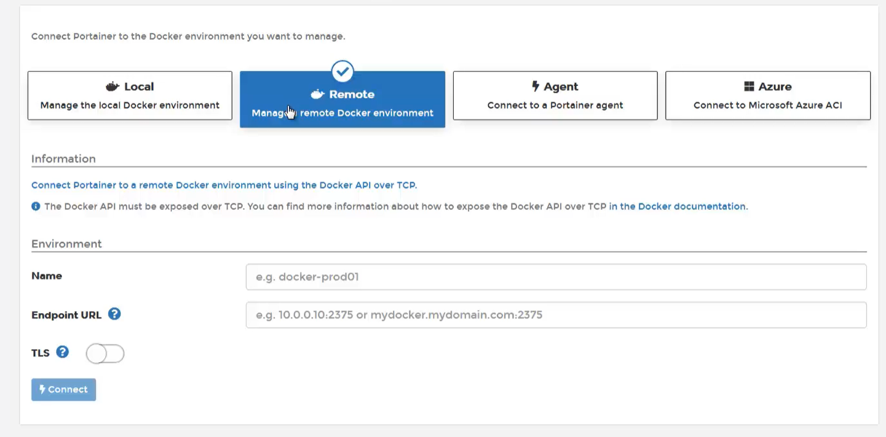
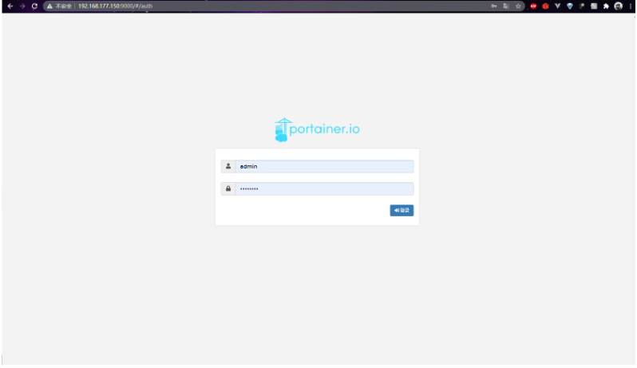
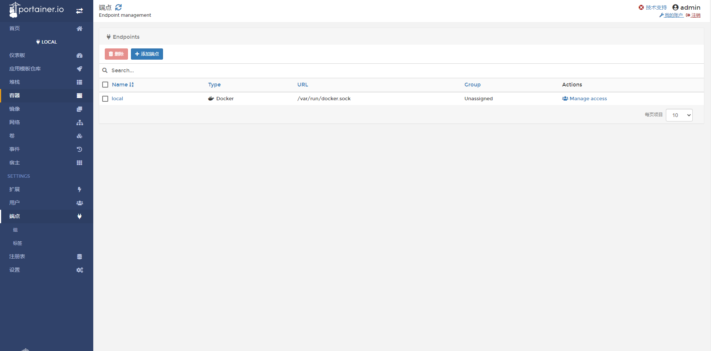
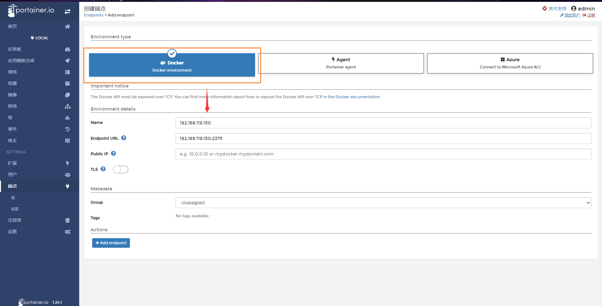
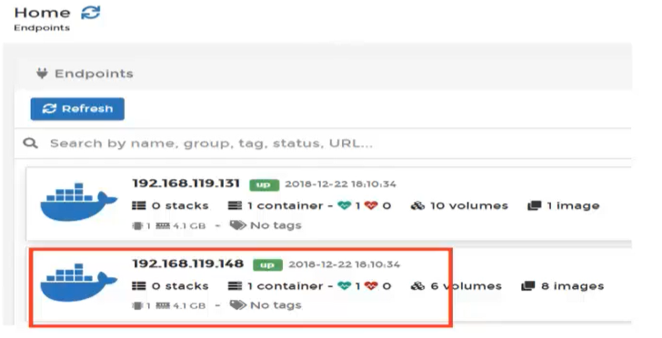
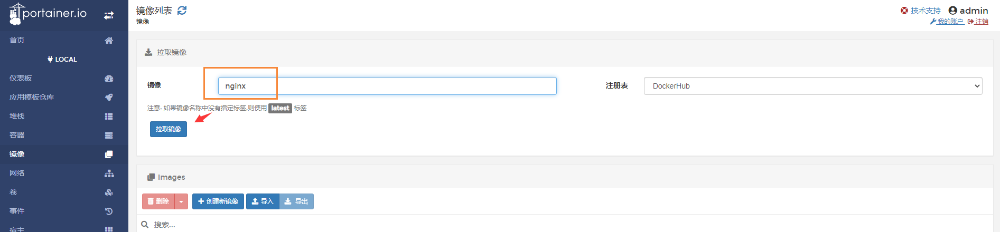
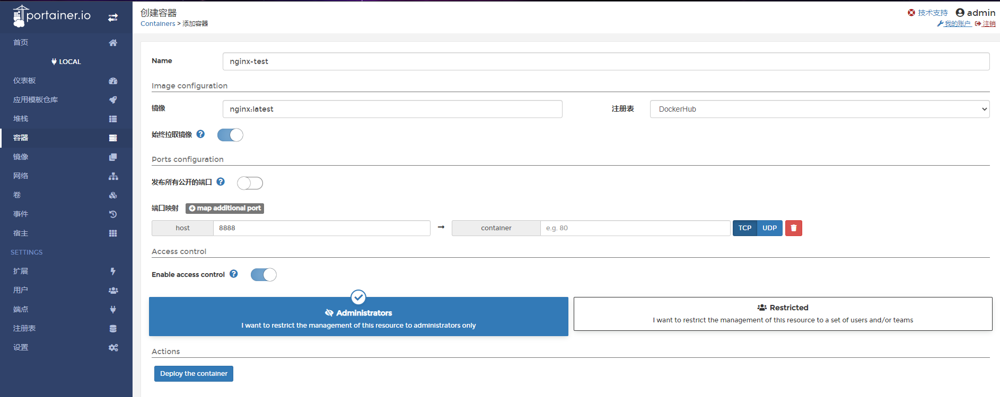

​                                                                                                                                                                           作者：陌溪

​                                                                                                                         陌溪的学习笔记：http://note.moguit.cn大家好，我是 **陌溪** 

今天给大家带来的是蘑菇博客中管理微服务组件，一款 **Docker** 可视化工具 **Portainer**。


**Portainer** 是一款轻量级的图形化管理工具，通过它我们可以轻松管理不同的 **Docker** 环境。**Portainer** 部署和使用都非常简单，它提供一个可以运行在任何 **Docker** 引擎上的容器组成。**Portainer** 提供管理 **Docker** 的**container**、**images**、**volumes**、**networks** 等等。它兼容独立的 **Docker** 环境和 **swarm** 集群模式。基本满足中小型单位对 **Docker** 容器的管理工作。

官方提供的 **Demo** 演示环境：

- 地址：http://demo.portainer.io
- 用户名：admin
- 密码：tryportainer


## Docker方式安装

我们可以直接使用 **Docker** 的方式来安装

首先创建数据卷，实现数据持久化

```bash
docker volume create portainer_db
```

启动 **Partainer** 容器

```bash
docker run -d -p 9000:9000 -name portainer -restart always -v /var/run/docker/sock:/var/run/docker.sock -v portainer_db:/data portainer/portainer
```

运行成功后，然后通过 9000端口访问即可

```bash
http://ip:9000
```

然后我们输入自定义的密码，进入下面页面，选择 **Local** 管理本地 **Docker** 镜像



这里是选择我们通过 **Portainer** 管理哪里的 **Docker**

- **Local**：本地的
- **Remote**：远程的
- **Agent**：
- **Azure**：云服务

## Docker Compose 方式安装

**Docker Compose** 是用来定义和运行多个 **Docker** 应用程序的工具。通过 **Compose**，可以使用 **YAML** 文件来配置应用程序需要的所有服务，然后使用一个命令即可从 **YML** 文件配置中创建并启动所有服务。

> 下载地址：https://wwe.lanzoui.com/iTHoIiuilvi

把下载到的文件使用 **Xftp** 工具，拷贝到 `/usr/local/bin/` 目录下

```bash
# 重命名
mv docker-compose-Linux-x86_64  docker-compose
# 加入执行权限
sudo chmod +x /usr/local/bin/docker-compose
# 查看docker-compose版本
docker-compose -v
```

安装完 **docker compose** 后，就可以进行开始安装 **Portainer** 了，首先创建  **mogu_portainer.yml** 文件

```BASH
vim mogu_portainer.yml
```

然后添加如下内容

```bash
version: '3.1'
services:
  portainer:
    image: portainer/portainer
    container_name: portainer
    ports:
      - 9000:9000
      - 8000:8000
    volumes:
      - /var/run/docker.sock:/var/run/docker.sock
      - ./data:/data
      - ./public:/public
```

如果需要进行汉化的话，需要下载汉化包

```bash
# 下载汉化包
wget https://dl.quchao.net/Soft/Portainer-CN.zip
# 解压缩
unzip Portainer-CN.zip -d public
```

运行下面命令，开始安装 **portainer**

```bash
docker-compose -f mogu_portainer.yml up -d
```

构建 **portainer** 容器后，我们访问下面页面

```bash
http://ip:9000
```

即可看到我们的图形化页面了【首次登录需要填写默认密码】



登录后，即可看到我们的容器信息


## 使用Portainer管理其它主机

刚刚演示的是使用 **Portainer** 管理本地安装的 **Docker** 主机，如果我们要使用 **portainer** 管理其它地方的主机。我们就需要单独启动一台主机，然后在上面运行 **Docker** ，需要注意：我们还需要开启Docker中的 2375端口号

首先我们编辑 daemon.json

```bash
vim /etc/docker/daemon.json
```

然后加入以下内容即可【注意 **2375** 端口号要慎开，不然可能被当肉鸡挖矿】

```bash
{
	"hosts": ["tcp://192.168.119.150:2375", "unix:///var/run/docker.sock"]
}
```

然后选择 **端点** 的 **添加端点**



然后选择Docker环境



最后添加端点完后，就能看到我们刚刚添加的节点了


我们回到首页，即可看到我们的两台Docker服务了


## 使用Portainer部署Nginx服务

下面我们就可以使用 **Portainer** 来部署我们的 **nginx** 服务，到指定的 **Docker** 环境中，由于我们目前有多台**Docker** 环境，因此我们就首先需要选择不同的主机来进行部署

首先，我们选择 **192.168.119.148** 这台主机



然后选择镜像，输入 **nginx**，点击拉取镜像



然后就会去拉取到我们的 **nginx** 镜像了，下面我们就可以使用这个拉取的镜像来创建容器

输入一些基本信息后，点击创建



完成后，即可看到 **nginx** 的端口号已经对外发布


我们输入下面的地址

```bash
http://ip:32768
```

即可看到，**nginx** 已经成功安装

