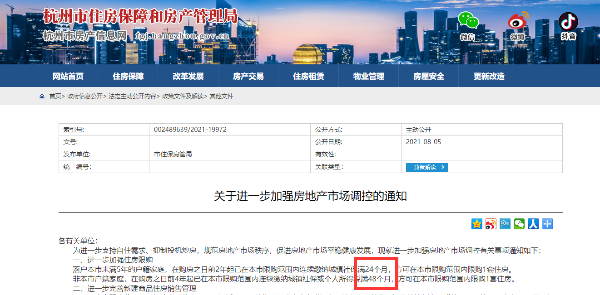
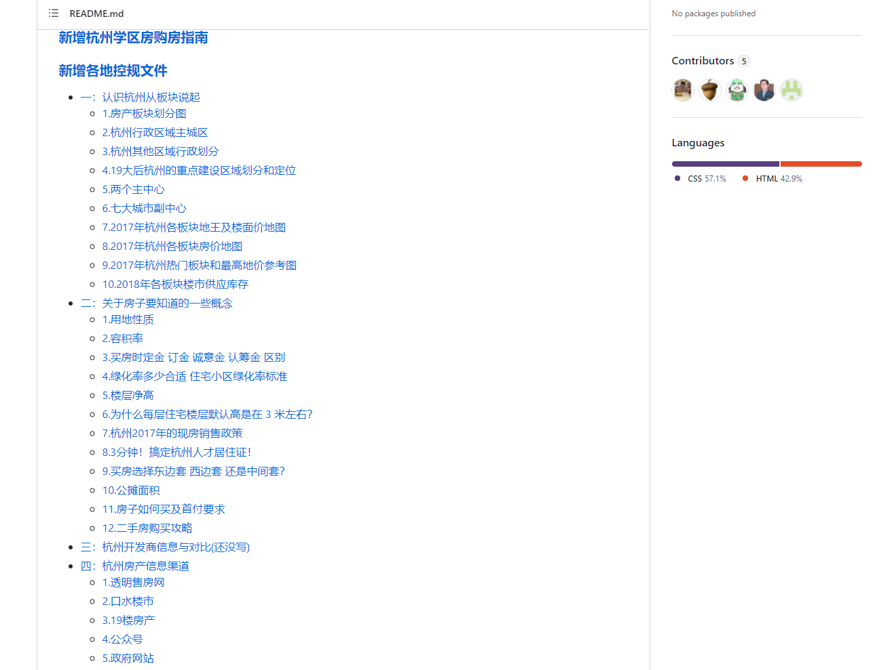
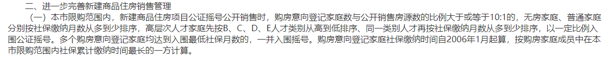
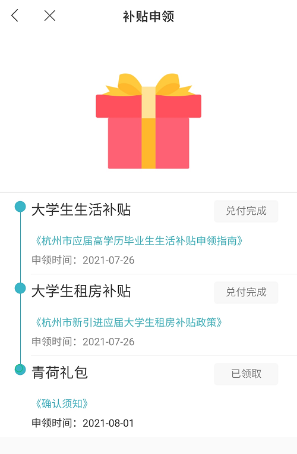
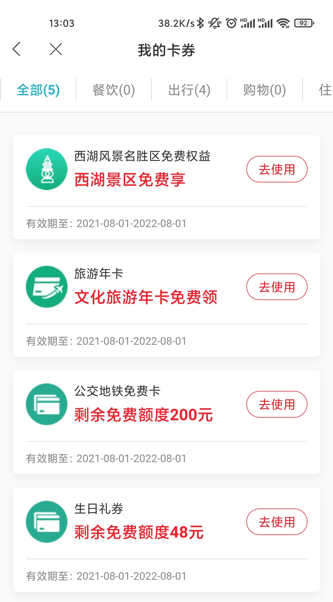
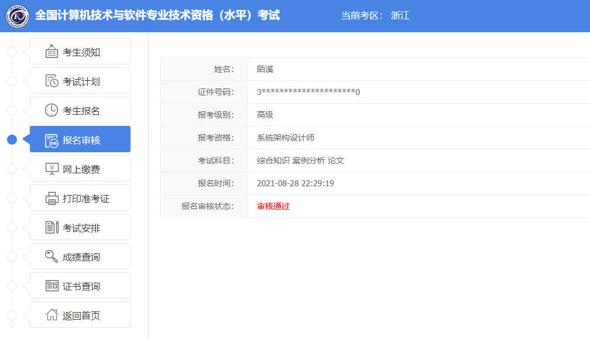
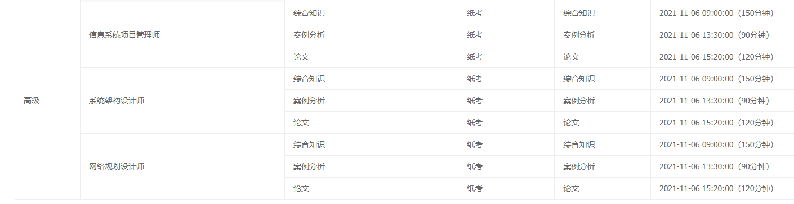
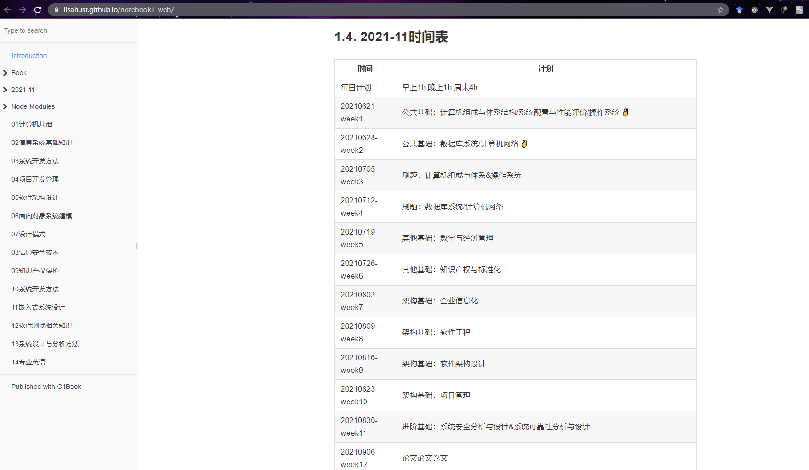
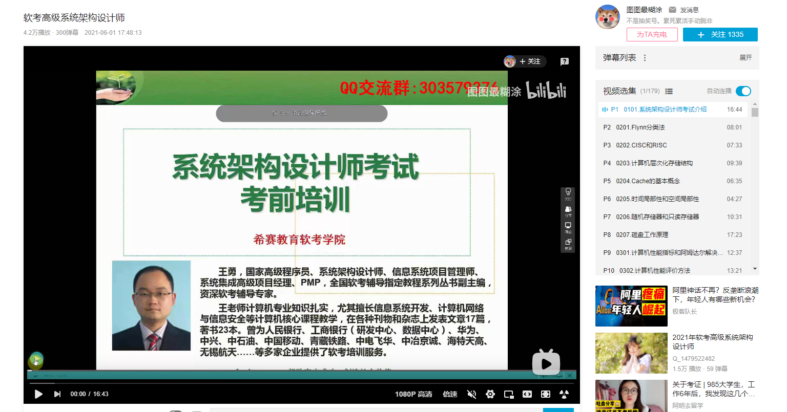
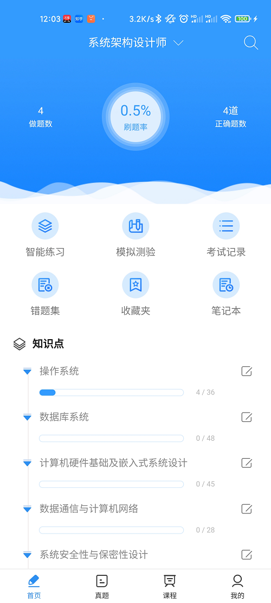

大家好，我是 **陌溪**

陌溪刚来杭州没多久，最近杭州的购房政策风起云涌，在 **8** 月 **5** 号颁布了杭州史上最强的限购令，大致的内容如下。

- 如果是本市户口，需要连续缴纳 **24** 个月社保，才可以参与摇号。
- 如果不是本市户口，需要连续缴纳 **48** 个月社保，才可以参与摇号。

而在之前购房政策是：杭州是只要落户了，就可以参与摇号了；如果没有落户，只需要缴纳两年社保即可。这一次变动，直接将时间拉长了两年，导致很多家庭无法参与楼盘的摇号了。

不过，就算现在让陌溪去买房也没钱付首付，所以政策出来还有点 **利好陌溪** ，一方面可能可以遏制下杭州的房价增速，另外还能搬砖几年攒攒首付。

对啦，如果有打算在杭州买房的小伙伴，陌溪在 **Github** 上发现了一个宝藏项目：

> https://github.com/houshanren/hangzhou_house_knowledge

现在该仓库已经有 **25K** 的 **star** 了，这也间接说明了在杭州，程序员是购房的主力军~

在这个仓库里，能够对杭州房产知识进行扫盲学习，比如认识一下杭州的板块划分、杭州地铁规划以及购房时的一些注意事项，都可以一网打尽。

好啦，说了这么多买房的知识，好像和陌溪也没啥关系~

只是最近陌溪想起了在北京搬砖的日志，那时候地铁都挤不上去，只能反向坐一站才能上车，长达 **1.5** 小时的通勤时间，来回 **3**  小时，每天累的够呛。

来了杭州后，通勤时间缩减成 **5** 分钟，距公司就 **300** 米的路程，幸福指数顿时上升了。之前也咨询过其它小伙伴，他们在北京如果要租公司附近的房子的话，平均下来大概要 **4500** 块。而杭州在公司附近的，平均下来需要**1800** 块。并且目前杭州也算一线城市，因此薪资水平是同一个级别的，所以对比下来就会发现，杭州的幸福指数比北京要好一些（仅代表陌溪个人观点~）。

所以，陌溪就萌生了以后打算在杭州买房的想法。但是目前既没有摇号资格，也没有钱，那能怎么办呢？

那就只能多搬砖赚米，然后再给自己创造条件。陌溪通过解读政策发现，杭州的人才政策在对楼盘摇号的时候，是有 **BUFF** 加成的，也就是说，如果你登记了杭州高层次人才的话，更容易摇中想要的楼盘~

目前杭州高层次人才分为 **ABCDE** 五大类，陌溪刚去杭州也被评为了人才呢！属于哪一类呢：**ABCDE** ... **Q**类..  

> 其实这里的Q类，指的是青(Q)荷人才码的意思，和杭州人才并不是同一个评价指标，所以小伙伴也不要过于惊讶~

关于杭州市的 **Q** 类人才有哪些福利呢？首先是可以一键领取杭州政府补贴，主要包含了大学生生活补贴，大学生租房补贴以及青荷礼包。

大学生生活补贴是根据不同的学校以及学历来进行不同金额的补助的，大致补助标准如下：

（1）应届全日制硕士研究生按每人最高 **6** 万元标准发放生活安家补贴。

（2）应届全日制大学本科毕业生按每人最高 **4** 万元标准发放生活安家补贴。毕业院校划分有重叠的就高享受补贴。

大学生租房补贴则是对在杭州市无房且未享受公共租赁住房、人才租赁房等住房优惠政策，市、区县（市）各单位新引进的应届全日制本科（含）以上大学毕业生发放租房补贴。**每户每年发放1万元，可发放三年**，**期满后收入低于城镇居民人均可支配收入的，可继续享受，最长不超过三年**。

至于**青荷礼包**的话，就是赠送的各种券，比如去西湖和杭州周边的一些景区可以免门票，以及增加了 **200** 元的地铁免费卡。

下面回答一下小伙伴们比较关心的一个问题：陌溪作为刚来杭州的应届双非硕士研究生，在杭州可以领（**bai**）取（**piao**）多少钱呢？

首先是大学生生活补助：普通院校一共可以领取 **5W** ，首次可以领取 **3W**，剩下三年分别领取 **5K**、**5K**、**1W**。如果小伙伴是 **C9** 高校毕业的研究生的话，一共可以领取 **6W**，剩下三年分别可以领取 **1W**、**1W**、**1W**。

然后租房补贴，一共可以领取 **3W**，每年各可以领取 **1W**。

所以综上所述，陌溪如果在杭州搬砖的话，一共可以领取到 **8W** 补助的。其中， **4W** 是一次性打到银行卡的，剩下的 **4W** 是需要分 **3** 年打款的。

杭州高层次人才分为 **ABCDE** 五大类，大部分标准要求非常高，在收入，级别，公司，学历等有较高的门槛。

但是有一种相对简单的的方式可以申请 **E** 类人才，就是通过 副高级职称（**高级证书**）+ **专业技术成果**，就可以获得E类人才申请资格。

- 高级证书：参加计算机软件考试

高级证书考试有很多，比如一级建造师，高级经济师，高级会计师，但是大部分考试都有报考门槛的要求，其中最为简单的是计算机软件考试。计算机软件考试是由国家工信部和人力资源社会保障部组织的考试，报名条件不设学历与资历条件、年龄以及专业等限制；

即任何人都可以报考计算机软件高级，不需要从初级开始考试，考试通过，即可获得证书。

- 专业技术成果：软著；专利；中文核心期刊；

如果你获得了 高级软考证书，那么你就具备了 评选 **副高级职称** 的资格，这个时候还需要专业技能成功，才能够评为 **E** 类人才，陌溪之前写了两篇软著，但是以学校的名义作为发表的，所以不能作为评选资格。而论文因为发的是 **EI** 检索的论文，而这里要求是 中文核心期刊，所以也不能用啦。

所以，只能自己在开发个软件，然后在申请对应的软著了。因为之前也申请过两个，所以对于流程也较为熟悉，如果有对申请流程感兴趣的小伙伴，到时候可能在写一篇文章，讲讲如何申请一个软件著作权。

所以，陌溪先迈出第一步，报考软考中的 **高级系统架构师** 试试水，看能不能一举拿下高级证书。

陌溪在刚开始报名的时候，犹豫是选择 **信息系统项目管理师**，还是**系统架构师**，这两者对我来说，都是各有利弊。首先 信息系统项目管理师一年是可以考两次的，也就是这次没通过，再过半年又可以继续参加，而系统架构师一年只能考一次， 这次没通过就只能等到明年了。

但是陌溪看了一下信息系统管理师的课程大纲，发现里面都是些没学习过的，如果要考高项，相当于重学！果断就放弃了。但是如果打算以后从事项目管理相关的工作话，这也是一个非常容易拿证的了，因为考试的机会越多，通过的概率也就越大了。

而系统架构设计师的话，我们来看看考试大纲的要求：

- 掌握计算机硬软件与网络的基础知识
- 熟悉信息系统开发过程、理解信息系统开发标准、常用信息技术标准
- 熟悉主流的中间件和应用服务器平台
- 掌握软件系统建模、系统架构设计基本技术
- 熟练掌握信息安全技术、安全策略、安全管理知识
- 了解信息化、信息技术有关法律、法规的基础知识
- 了解用户的行业特点，并根据行业特点架构合适的系统设计
- 掌握应用数学基础知识
- 熟练阅读和正确理解相关领域的英文文献

这里面提到的很多知识，比如网络基础知识、中间件等知识都已经学习过了，再次学习的成本也是相对较低的，所以陌溪就打算冲 **系统架构设计师** 了。

工欲善其事必先利其器，陌溪整理的一些资料，准备在后面复习的时候用上。

首先是一个大佬整理的 **软考笔记**。里面也包含了每个时间点做啥事情，以及需要学习的知识。

> 笔记：https://lisahust.github.io/notebook1_web/

**B** 站上关于高级系统架构师的视频，针对重点问题，在配合例题进行讲解，可以使用倍速快速的过一遍。

> 视频：https://www.bilibili.com/video/BV1fv411V7dH

然后就是软考学习类**APP**，比较安利  **软考通** 这个软件，里面比较清爽没有广告，也不需要付费，可以利用一些碎片化的时间来刷题~

| 主页                                    | 刷题                                    |
| --------------------------------------- | --------------------------------------- |
|  |  |

最后就是陌溪收集的历年架构师考试真题，到时候可以在平板上进行一波学习。

同时，陌溪也把上面提到的资料都已经打包放在网盘啦，在公众号回复【**软考**】，就可以下载资料和陌溪一起考证吧~

我是陌溪，我们下期再见~

往期推荐
----

*   [蘑菇博客从0到2000Star，分享我的Java自学路线图](https://mp.weixin.qq.com/s/3u6OOYkpj4_ecMzfMqKJRw)
*   [从三本院校到斩获字节跳动后端研发Offer-讲述我的故事](https://mp.weixin.qq.com/s/c4rR_aWpmNNFGn-mZBLWYg)
*   [万字长文带你学习ElasticSearch](https://mp.weixin.qq.com/s/9eh6rK2aZHRiBpf5bRae9g)
*   [双非本科，折戟成沙铁未销，九面字节终上岸！](https://mp.weixin.qq.com/s/SRf2f8wFFyjz2BUUXD_pmg)
*   [如何使用一条命令完成蘑菇博客的部署？](https://mp.weixin.qq.com/s/LgRIqdPAGzN1tCPMi0Y8RQ)
*   [为什么你们制作镜像只有5MB，而我却200MB？](https://mp.weixin.qq.com/s/iWpivtTAKMPKT6gq_3nwaA)
*   [字节二面：蘑菇博客是怎么解决缓存穿透的?](https://mp.weixin.qq.com/s/JNnL6sTySXL9ta5p0rjjXg)
*   [还在用破解IDEA？陌溪手把手教如何申请正版](https://mp.weixin.qq.com/s/mZjoSjk0QqeKFxPbFySomg)

结语
--

应各位小伙伴们的需求，陌溪已经把 **大厂校招笔记** 已经整理成 **PDF** 版本啦，方便大家在手机或者电脑上阅读。以下笔记仓库的部分 **PDF** 文件 。如果有需要离线阅读的小伙伴可以到公众号回复 **PDF** ，即可获取下载地址~

同时本公众号**申请较晚**，暂时没有开通**留言**功能，欢迎小伙伴们添加我的私人微信【备注：**加群**】，我将邀请你加入到**蘑菇博客交流群**中，欢迎小伙伴们找陌溪一块聊天唠嗑，共同学习进步。最后，如果你觉得本文对你有所帮助，麻烦小伙伴们动动手指给文章点个「**赞**」和「**在看**」，非常感谢大家的支持。

