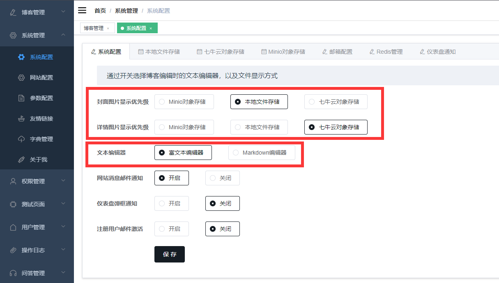
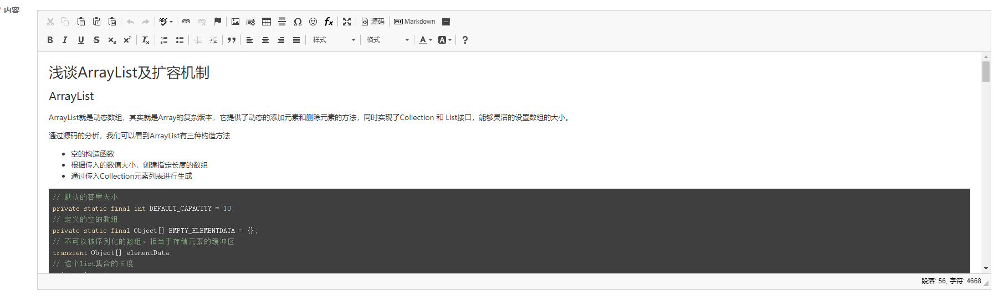
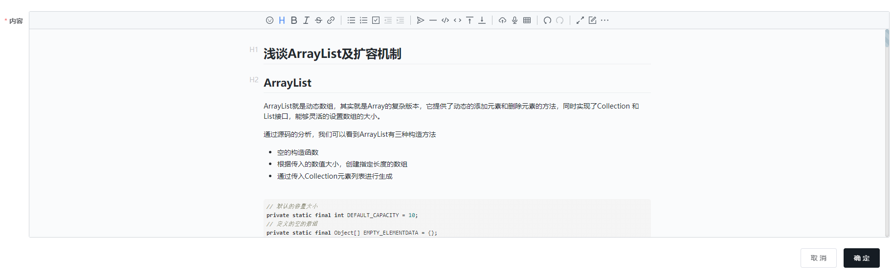
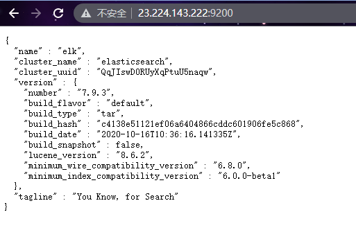
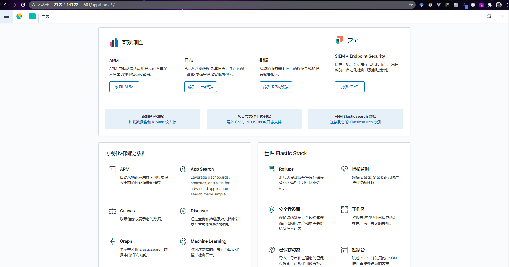
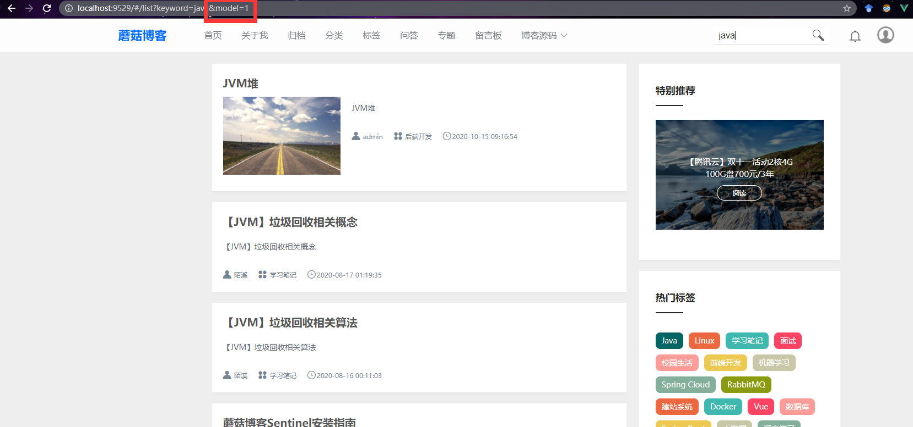
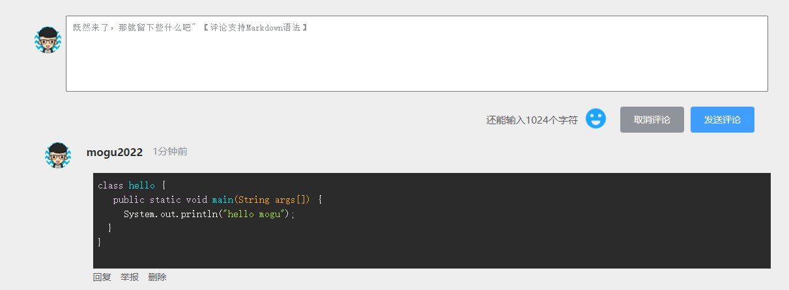

大家好，我是 **陌溪**

最近看了看蘑菇博客的版本更新，发现还停留在6个月前，也就是还在学校期间更新的版本。后面因为毕业答辩的事情，项目迭代的频率就下降了，想着这阵子也修复了很多 **BUG**，终于可以发行一个 **V6.2** 的稳定版本啦~


首先非常感谢踊跃提交 **PR** 完善蘑菇博客的小伙伴 @[allworldg](https://gitee.com/allworldg)、@[苍山如海丶残阳如血](https://gitee.com/iq120609)、@[阿灿](https://gitee.com/join20190901)、 @[遇见c。](https://gitee.com/zjq_6688) 。


下面，让我们一起来看看，这次蘑菇博客的版本更新中，解决了哪些问题吧，

- **fix**: 暂时移除导航栏白名单功能，解决网站出现 **401** 的问题
-  **feat:** 增加是否开启注册邮件激活功能，开启后需要通过邮箱验证才能完成注册
- **fix**: 解决博客本地上传时存在图片无法正常显示的问题
- **fix**: 解决导航栏加载出现警告的问题
- **fix**: 优化推荐文章显示
- **fix**: 解决**Markdown**编辑器无法上传图片和数据回显的问题
- **fix**: 修复 **nacos** 连接数据库配置 解决 **admin** 账号权限时的问题
- **fix**：解决点击点赞按钮后，更新的点赞数量会从子组件试图更新父组件，导致显示错误，感谢小伙伴 @[allworldg](https://gitee.com/allworldg) 的 **PR** 。
- **fix**: 修复 **Firefox** 和 **Chrome** 浏览器下搜索框样式显示异常的问题。
- **fix**: 图片选择器变更为懒加载，提升访问速度。
-  **feat**: 完善博客备份功能，编辑博客时也支持实时备份
- **feat**: 删除文章时，同步删除该文章下所有的评论
-  **fix**: 点赞博客增加文章信息展示
- **fix**: 解决 **Sentinel** 出现的异常，优化 **Markdown** 编辑器下博客备份功能
- **fix**:  修复转载博客版权读取错误，感谢群里小伙伴 @[苍山如海丶残阳如血](https://gitee.com/iq120609) 的 **PR**。
- **feat**: 专题图片增加兜底显示。
-  **fix**: 解决后台管理使用手机登录失败的情况。
- **fix**: 修复网盘管理文件夹为空的问题。
- **feat**: 网站新增友链申请模板
- **fix**：采用静态代码块，减少在根据ip地址获取地理信息时的资源消耗，感谢小伙伴 @[阿灿](https://gitee.com/join20190901) 的 **PR**。
- **fix**:  采用线程池，完成异步存储日志逻辑实现，感谢小伙伴 @[阿灿](https://gitee.com/join20190901)的 **PR**。
- **feat**：解决执行异步线程收集日志时出现的空指针情况。
- **fix**：退出登录时候，清空Security中的用户信息。整个生命周期可能同时有多个用户在使用。这时候应用需要保存多个 **SecurityContext**（安全上下文），需要利用 **ThreadLocal** 进行保存，每个线程都可以利用**ThreadLocal** 获取其自己的 **SecurityContext**，及安全上下文。用户退出时清除其在**SecurityContextHolder** 中的上下文信息，感谢群里小伙伴 @[遇见](https://gitee.com/zjq_6688) 的PR。
- **fix**: 修复表情弹出框出现的异常。
- **fix**: 修改爬虫模块图片爬取的地址，优化图片截取正则表达式。
- **fix**: 修复后台管理登录失败时的登录限制时长
- **fix**: 解决后台管理搜索时出现的 **BUG**
-  **fix**：解决 **Banner** 出现边框的问题，解决反馈无法删除的问题
- **feat**: 更新文档，新增一条命令部署蘑菇博客。
- **feat**：优化网站布局样式，评论支持 **Markdown**
- **fix**：修复mogu_sms 启动时的问题
- **fix**：修正备案跳转问题
- **feat**：增加搜索模式开关控制；支持一键切换 **SQL** 搜索、**ES**搜索、**Solr**搜索

感兴趣的小伙伴，可以去到 **Gitee** 查看本次版本更新的信息

> https://gitee.com/moxi159753/mogu_blog_v2/releases/v6.2

下面就说说最近小伙伴提到的一些需求，也欢迎各位小伙伴在使用蘑菇的时候，能够提出自己的宝贵意见~

## 搜索模式支持开关控制

最近群里的小伙伴 **@泪梦红尘** 在群里咨询关于蘑菇全文检索 **ES** 和 **MySQL** 切换开关放在哪里...


熟悉蘑菇博客的小伙伴是可以发现，陌溪是把很多的功能封装成了开关，比较常见的开关功能有：

图片的存储方式：支持本地存储、**minio** 存储、七牛云存储



然后就是文本编辑器切换，目前支持 **富文本编辑器** 以及 **Markdown** 编辑器。富文本编辑器用的是 **ckeditor**，也是陌溪比较喜欢用的一款，特别简洁~。



如果小伙伴喜欢用 **Markdown** 编辑器的话，直接开关选择即可，这个时候切换到 **Vditor**。Vditor是我用过能达到 **Typora** 体验效果的编辑器了，支持**及时渲染**，**所见即所得**等模式。



同时网站的登录方式，也可以通过开关进行控制，比如目前蘑菇博客就开放了 **码云**、**Github** 和 **QQ** 登录。


而这次作为赞助 **蘑菇服务器** 的大佬提的需求，支持搜索模式开关控制，陌溪当然要第一时间就响应。

起初蘑菇博客使用的 **Solr** 作为全文检索的，然后在代码开源后，发现留言区有些小伙伴更偏向于使用**ElasticSearch** 作为检索工具，因此特意将蘑菇博客改成支持 **ElasticSearch** 检索的，但是有些小伙伴又还是想保留原来的 **Solr**，后面我就想了个方法，也就是将同时支持多种搜索模式，**Solr**、**ElasticSearch**、**SQL** 语句，小伙伴可以根据自己的喜好或者服务器的配置，选择相应的搜索模块即可。

因为大家都是使用入门服务器 **1C2G** 部署蘑菇的，所以默认是使用的都是 **SQL** 方式进行搜索，也就是下面这样的

```SQL
select * from t_blog where title like "%搜索内容%";
```

但如果要切换其它的搜索方式的话，应该怎么办呢？

这个时候必须去修改源码，然后打包镜像进行发布，过程会比较繁琐，也容易出错。但是因为大家切换的频率不是很高，所以也一直没有听到有小伙伴有提到。

本次更新，在蘑菇后台系统配置新增了文章搜索模式开关：支持 **Solr** 搜索、**ES** 搜索、**SQL** 搜索


目前，支持小伙伴们进行一键切换啦~。不过由于 **Solr** 使用的人数不多，因此暂时只适配了 **ES** 搜索和 **SQL** 搜索两种方式进行切换。

关于源码的变动，感兴趣的小伙伴可以查看我上次的提交。

> https://gitee.com/moxi159753/mogu_blog_v2/commits/Nacos

下面来说说如何切换到 **ES** 搜索，首先执行陌溪写的一键部署脚本，完成蘑菇博客环境的搭建。

```bash
wget http://oss.moguit.cn/script/moguInit.sh && chmod +x moguInit.sh && sh moguInit.sh
```

也可以参考陌溪录制的视频教程完成博客初始环境的搭建


因为一键部署脚本只支持核心板启动，而切换 **ES** 搜索需要用到 **mogu-search** 和 **elk**。因此，在完成博客的初始环境搭建后，进入到 **docker-compose** 文件夹

```bash
# 给文件夹增加权限
chown -R 1000:1000 data/elasticsearch_data
chown -R 1000:1000 log/elk
```

然后执行下面的脚本，安装 **elk**，**elk** 由 **ElasticSearch** 、**Logstash**、**Kibana** 组成

```bash
docker-compose -f yaml/elk.yml up -d 
```

同时在启动后，也可以使用下列命令通过查看启动日志

```BASH
docker logs -f -t elk
```

关于如何验证启动是否成功，可以输入：**ip + 9200**，如果出现下面的标识，标识已经启动成功了 



同时安装的 **elk**  也包含了 **kibana**，可以输入：**域名 + 5601** 访问图形化界面，在这里面可以搭建一些**日志**看板。




在 **ELK** 启动成功后，就可以接着启动 **mogu-search** 项目。如果看过**搜索模块**源码的小伙伴，是可以发现目前 **mogu-search** 是通过注释的方式来进行切换的，因为 **ES** 用的比较多，所以默认是把 **solr** 相关的代码注释了起来的，未来的话陌溪可能会考虑制作两个镜像，一个是 **mogu-search-es**，另外一个是 **mogu-search-solr**，然后通过运行不同的镜像，使用不同的全文检索工具。

在启动前需要先配置一下 **ElasticSearch** 的地址，到 **nacos** 页面，找到 **mogu-search-prod.yml**

> nacos地址：http://ip:8848/nacos


将里面的 **ip** 替换成自己的就OK啦

```bash
  data:
    elasticsearch:
      cluster-name: elasticsearch
      cluster-nodes: 38.84.74.140:9300
  elasticsearch:
    rest:
      uris: ["http://38.84.74.140:9200"]
```

修改完成后，回到服务器中，执行下面命令，启动 **mogu-search**

```BASH
docker-compose -f yaml/search.yml up -d 
```

启动完成后，就可以在后台进行初始化 **ElasticSearch** 索引了，到 **监控中心** -> **ElasticSearch**，点击初始化 **ES** 索引，系统将会对我们所有的文章建立索引，以便后续进行分词检索。


最后到门户页面，输入关键字 **java** 进行搜索，若地址栏中包含了 **model=1**，表示已经开启了 **ES** 搜索，并且能搜索到内容，说明已经成功完成搭建。



 若 **model=0** 或者没有 **model** 字段，那么需要到系统配置处，看开关是否勾选到了 **ES** 搜索，若还存在问题，记得清空 **redis** 缓存后在试试。

 

## 评论支持Markdown

最近发现有有一些小伙伴会在留言区贴一些错误代码，为了方便小伙伴同时增加代码的可读性，目前支持 **markdown** 进行评论啦。



好啦，本次蘑菇版本更新就到这里啦。我是陌溪，我们下期再见~

往期推荐
----

*   [蘑菇博客从0到2000Star，分享我的Java自学路线图](https://mp.weixin.qq.com/s/3u6OOYkpj4_ecMzfMqKJRw)
*   [从三本院校到斩获字节跳动后端研发Offer-讲述我的故事](https://mp.weixin.qq.com/s/c4rR_aWpmNNFGn-mZBLWYg)
*   [万字长文带你学习ElasticSearch](https://mp.weixin.qq.com/s/9eh6rK2aZHRiBpf5bRae9g)
*   [双非本科，折戟成沙铁未销，九面字节终上岸！](https://mp.weixin.qq.com/s/SRf2f8wFFyjz2BUUXD_pmg)
*   [如何使用一条命令完成蘑菇博客的部署？](https://mp.weixin.qq.com/s/LgRIqdPAGzN1tCPMi0Y8RQ)
*   [为什么你们制作镜像只有5MB，而我却200MB？](https://mp.weixin.qq.com/s/iWpivtTAKMPKT6gq_3nwaA)
*   [字节二面：蘑菇博客是怎么解决缓存穿透的?](https://mp.weixin.qq.com/s/JNnL6sTySXL9ta5p0rjjXg)
*   [还在用破解IDEA？陌溪手把手教如何申请正版](https://mp.weixin.qq.com/s/mZjoSjk0QqeKFxPbFySomg)
*   [32图，教你部署一个博客小程序](https://mp.weixin.qq.com/s/hFfsDPBdBpaLjXV8Bm5Ycg)

结语
--

博主就职于字节跳动商业化部门，一直在维护校招笔记仓库 **LearningNote**「在Gitee上已有 **3.9k+ star**，仓库地址：https://gitee.com/moxi159753/LearningNotes」，公众号上的文章也会在此同步更新，欢迎各位小伙伴一起交流学习，回复 「**PDF**」获取PDF笔记，点击查看原文可以**在线阅读**。

同时，想要丰富项目经验的小伙伴，可以参考我维护的开源微服务博客项目： **蘑菇博客**「 **Gitee** 官方推荐项目，博客类搜索排名**第一**，在 **Gitee** 已有 **3.6K** star，仓库地址：https://gitee.com/moxi159753/mogu_blog_v2 」。

本公众号**申请较晚**，暂时没有开通**留言**功能，欢迎小伙伴们添加我的私人微信 **coder_moxi**【备注：**加群**】，我将邀请你加入到**蘑菇博客交流群**中，欢迎小伙伴们找陌溪一块聊天唠嗑，共同学习进步。最后，如果你觉得本文对你有所帮助，麻烦小伙伴们动动手指给文章点个「**赞**」和「**在看**」，非常感谢大家的支持。

