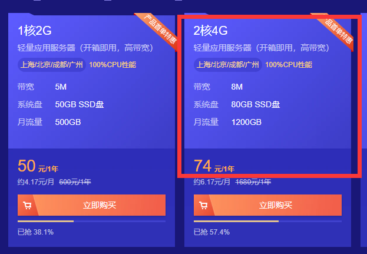
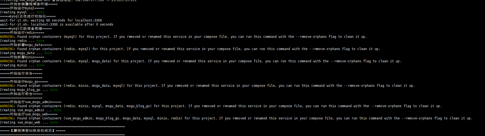
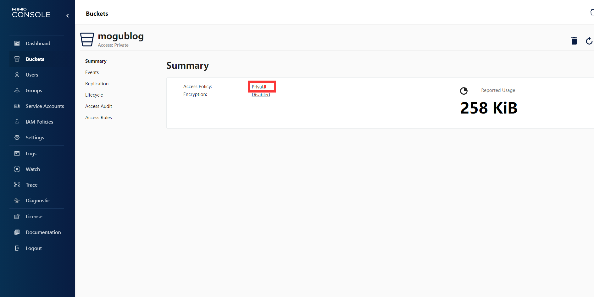

​                                                                                                                                                                           作者：陌溪

​                                                                                                                         陌溪的学习笔记：http://note.moguit.cn大家好，我是 **陌溪**。

这阵子很多小伙伴向陌溪吐槽，说蘑菇博客微服务太吃内存了，**1C2G** 的入门服务器根本无法玩转蘑菇。

这阵子陌溪把重心迁移到了蘑菇博客**Go** 版本，同时重新制作了蘑菇博客 **Go** 版本一键部署脚本，让小伙伴们能够快速通过入门服务器 **1C2G** 搭建好蘑菇博客。


蘑菇博客 **Go** 版本，是蘑菇博客微服务版的一个**Golang** 简化版分支，我和**老林**实现了大部分基础功能，并且后续陌溪也会对蘑菇博客微服务版进行适配，做到前端能够共用一套代码。

前端后数据库基本上没有改动，可以直接使用蘑菇博客原版的前端页面。基本框架才用简单易用的 **beego**，**ORM** 框架采用国内广泛采用的 **Gorm**。

> 蘑菇博客Go版本：https://gitee.com/moxi159753/mogu_blog_go

学习用 **Java微服务版**，部署用 **Go** 版本，非常完美~

## 一键部署

首先，需要购买一台云服务器，然后选择好镜像 **CentOS 7.X**，最近腾讯云的活动非常大，**2C4G8M**的服务器仅需要 **74** 元 ，陌溪已经忍不住冲了一台了~

> 地址：https://curl.qcloud.com/zry6xub9



选择好 **Centos 7.X** 的版本，然后配置好对应的安全组，陌溪为了测试方便，直接是全部端口都放行的


在配置完成后，通过 **xshell** 远程连接对应的服务器，然后执行下面的命令，开始一键部署蘑菇博客 **Go** 版本

```bash
wget http://oss.moguit.cn/script/moguGoInit.sh && chmod +x moguGoInit.sh && sh moguGoInit.sh
```

执行后，并会开始进行 **Go** 版所需的环境安装，比如 **校验版本**；判断是否安装 **docker**；判断是否安装 **docker-compose** 等等。


在所有环境都准备，就会开始拉取镜像，然后进行启动。因为蘑菇 **Go** 版依赖较少，主要会启动以下几个镜像

- **vue_mogu_web**：门户镜像
- **vue_mogu_admin**：后台镜像
- **mogu_blog_go**：后端接口镜像
- **minio**：图片存储
- **nginx**：静态资源映射和域名转发
- **redis**：缓存
- **mysql**：数据库



## 修改配置

启动完成后，访问 **http://your_ip:9527**  即可进入到门户页面


此时会发现图片还无法显示，这个时候需要登录到 **Minio** 进行配置，打开  **http://your_ip:9001**，输入账号密码

> 账号：mogu2018  mogu2018

登录成功后，点击 **Buckets**，找到 **mogublog**，然后在点击 **Manage** 进行设置。


修改对应的桶的访问权限 



由 **private** ->  **public**，这样就可以允许访问了。


## 访问后台

修改完配置后，打开  **http://your_ip:9528 ** 后台管理地址，输入账号和密码进行登录。

> 账号：admin   mogu2018

登录系统后，找到 **系统配置**，然后选择 **Minio对象存储** ，将上述的 **ip** 地址，修改为自己云服务器的。


配置完成后，再到 **图片管理**，上传图片即可


最后回到博客管理，给文章添加对应的标题图即可正常显示了~


好了，本期蘑菇 **Go** 版的快速部署教程就到这里了

我是陌溪，我们下期再见~