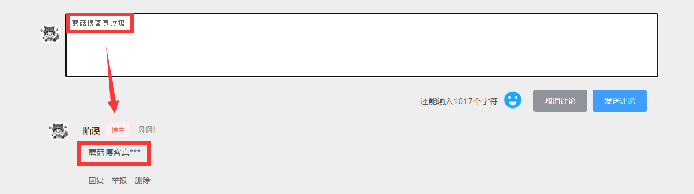

大家好，我是**陌溪**

最近一直没有登录蘑菇博客后台去看留言，没想到竟然有人在蘑菇博客留言区 **口吐芬芳** ？


一个开源系统是不可能没有 **BUG**，重点是小伙伴们能在 **issue** 把 **BUG** 提出来，然后去不断的迭代解决 **BUG**，当然开源项目的维护，也离不开各位小伙伴们的鼓励呢~


虽然针对这种一时口嗨的留言，陌溪可以直接到蘑菇博客后台评论管理直接删除，但是这种做法治标不治本。只要下次还有头铁的小伙伴过来的话，照样可以继续留言一些敏感评论，而陌溪也不可能一直盯着评论来看。


后面通过查阅资料发现，可以通过字典树来过滤文本中的敏感词汇。同时，这里还要感谢 **小牛肉** 的 **Echo** 博客系统你那个，为我提供了很大的思路。

> Echo博客系统：https://gitee.com/veal98/Echo

净化网络环境，从你我做起！

## 字典树

字典树（ **Trie** 树），通过它的名字也能看出，主要是用来存储字符串的。字典树的优点是：利用字符串的公共前缀来减少查询时间，最大限度地减少无谓的字符串比较。因此通过字典树来查找元素的效率会更高，目前字典树的应用主要在以下几个方面：

- 字符串的检索
- 词频统计
- 字符串的排序

关于字典树的特性如下：

- 根节点不包含字符，除根节点外每一个节点都只包含一个字符
- 从根节点到某一节点，路径上经过的字符连接起来，为该节点对应的字符串
- 每个节点的所有子节点包含的字符都不相同。

在面对大量文本和大量敏感词，利用字典树过滤敏感词是明智而有效的，可以大量的减少重复的抖动，从而降低时间复杂度。

## 字典树的构建

通过把敏感词放到配置文件中，然后读入的一个个敏感词来构造字典树

字节树的构建分为以下几步：

- 首先创建字典树的
  - 我们可以定义一个 **boolean** 类型的成员变量 **isKeywordEnd** 来标识当前结点是否是敏感词的结尾字，即该节点连上其上面的结点可以构成一个敏感词。
  - 定义一个 **Map** 成员变量来存储当前结点的**所有子节点（一层）**（根节点不包含字符）
  - 对外提供一些方法如：**添加节点 addSubNode**、**获得结点 getSubNode**，以方便构造字典树

对应的代码如下所示：

```java
/**
 * 定义前缀树
 */
private class TrieNode {
    // 关键词结束标识（叶子节点）
    private boolean isKeywordEnd = false;
    // 子节点(key:子节点字符, value:子节点类型)
    private Map<Character, TrieNode> subNodes = new HashMap<>();

    public boolean isKeywordEnd() {
        return isKeywordEnd;
    }

    public void setKeywordEnd(boolean keywordEnd) {
        isKeywordEnd = keywordEnd;
    }

    // 添加子节点
    public void addSubNode(Character c, TrieNode node) {
        subNodes.put(c, node);
    }

    // 获取子节点
    public TrieNode getSubNode(Character c) {
        return subNodes.get(c);
    }
}
```

好比假设有 **b**，**abc**，**abd**，**bcd**，**abcd**，**efg**，**hii** 这6个单词,那我们创建字典树就得到如下


### 初始化前缀树

初始化前缀树需要读取敏感词文件 **SensitiveWords.txt** 文件，将其存储在 **resource** 文件夹中


里面的内容就可以写一些常见的敏感词，例如陌溪在这里列举了几个

```txt
辣鸡
垃圾
```

然后项目运行的时候，读取对应的敏感词插入到前缀树中

```java
/**
 * 初始化前缀树
 */
@PostConstruct
public void init() {
    try (
            InputStream is = this.getClass().getClassLoader().getResourceAsStream("SensitiveWords.txt");
            BufferedReader reader = new BufferedReader(new InputStreamReader(is));
    ) {
        String keyword;
        while ((keyword = reader.readLine()) != null) {
            // 添加到前缀树
            this.addKeyword(keyword);
        }
    } catch (IOException e) {
        log.error("加载敏感词文件失败" + e.getMessage());
    }
}
```

上面的 **@PostConstruct**  很多人可能会以为是 **Spring** 提供的注解，但其实它是 **Java** 提供的注解。

通过 **@PostConstruct** 该注解被用来修饰一个非静态的 **void()** 方法。被 **@PostConstruct** 修饰的方法会在服务器加载 **Servlet** 的时候运行，并且只会被服务器执行一次。**PostConstruct** 在构造函数之后执行，**init()** 方法之前执行。

## 敏感词加载到前缀树

当有敏感词过来时，首先将单词切割成一个个字符，然后开始填充到前缀树中。

```JAVA
/**
 * 将一个敏感词添加进前缀树中
 *
 * @param keyword
 */
private void addKeyword(String keyword) {
    TrieNode tempNode = rootNode;
    for (int i = 0; i < keyword.length(); i++) {
        char c = keyword.charAt(i);
        // 首先判断是否存在相同子节点
        TrieNode subNode = tempNode.getSubNode(c);
        if (subNode == null) {
            // 初始化子节点
            subNode = new TrieNode();
            // 添加子节点
            tempNode.addSubNode(c, subNode);
        }
        // 指向子节点，进入下一层循环
        tempNode = subNode;

        // 设置结束标识（叶子节点），表示这个字符是该敏感词的最后一个字符
        if (i == keyword.length() - 1) {
            tempNode.setKeywordEnd(true);
        }
    }
}
```

## 过滤算法

定义三个指针

- **tempNode**： 指向前缀树的工作指针

- **begin**：当前比较的位置，开始下标 0

- **end**： **end** 总是不断向前，**begin** 匹配失败的时候，需要回滚。开始下标为 0。

然后对写入的敏感词进行循环判断，首先判断是否是特殊符号，如 **☆辣☆鸡** ，如果是那么直接跳过。

```JAVA
// 指针 1：前缀树的工作指针
TrieNode tempNode = rootNode;
// 指针 2：指向文本中某个敏感词的第一位
int begin = 0;
// 指针 3；指向文本中某个敏感词的最后一位
int end = 0;
int count = 0;
while (end < text.length()) {
    char c = text.charAt(end);
	// 跳过符号（防止敏感词混合符号，比如 ☆辣☆鸡）
    if (isSymbol(c)) {
        // 若指针 1 处于根节点，则将此符号计入结果（直接忽略），让指针 2 向下走一步
        if (tempNode == rootNode) {
            sb.append(c);
            begin++;
        }
        // 无论符号在开头还是在中间，指针 3 都会向下走一步
        end++;
        continue;
    }
}
```

**end** 所在位置的字符，若前缀树的根节点的所有子节点中没有该字符，则说明该字符不可能构成敏感词，因此**begin**、**end** 均可前进一位，同时 **tempNode** 回溯到根节点。

```java
// 检查子节点
char c = text.charAt(end);
tempNode = tempNode.getSubNode(c);
if (tempNode == null) {
    // 以指针 begin 开头的字符串不是敏感词
    sb.append(text.charAt(begin));
    // 进入下一位的判断
    begin++;
    end = begin;
    // 指针 1 重新指向根节点
    tempNode = rootNode;
}
```

**end** 向前不断移动，并且和字典树中的敏感词一一对应，最终到 **tempNode** 指向 **isKeywordEnd()** 为 **true** 的结点时匹配成功，需要替换敏感词【变成*】。并且 **end** 需要前进一位，**begin** 移动到和 **end** 相同的位置

```java
else if (tempNode.isKeywordEnd()) {
    // 发现敏感词，将 begin~end 的字符串替换掉
    sb.append(REPLACEMENT);
    // 计算加1
    count++;
    // 进入下一位的判断
    end++;
    begin = end;
    // 指针 1 重新指向根节点
    tempNode = rootNode;
}
```

完整的过滤算法如下所示：

```JAVA
    /**
     * 过滤敏感词
     *
     * @param text 待过滤的文本
     * @return 过滤后的文本（即用 *** 替代敏感词） 和敏感词出现次数
     */
    public Map<String, String> filter(String text) {
        if (StringUtils.isBlank(text)) {
            return null;
        }

        // 指针 1：前缀树的工作指针
        TrieNode tempNode = rootNode;
        // 指针 2：指向文本中某个敏感词的第一位
        int begin = 0;
        // 指针 3；指向文本中某个敏感词的最后一位
        int end = 0;
        int count = 0;

        // 记录过滤后的文本（结果）
        StringBuilder sb = new StringBuilder();

        while (end < text.length()) {
            char c = text.charAt(end);
            // 跳过符号（防止敏感词混合符号，比如 ☆垃☆圾）
            if (isSymbol(c)) {
                // 若指针 1 处于根节点，则将此符号计入结果（直接忽略），让指针 2 向下走一步
                if (tempNode == rootNode) {
                    sb.append(c);
                    begin++;
                }
                // 无论符号在开头还是在中间，指针 3 都会向下走一步
                end++;
                continue;
            }

            // 检查子节点
            tempNode = tempNode.getSubNode(c);
            if (tempNode == null) {
                // 以指针 begin 开头的字符串不是敏感词
                sb.append(text.charAt(begin));
                // 进入下一位的判断
                begin++;
                end = begin;
                // 指针 1 重新指向根节点
                tempNode = rootNode;
            } else if (tempNode.isKeywordEnd()) {
                // 发现敏感词，将 begin~end 的字符串替换掉
                sb.append(REPLACEMENT);
                // 计算加1
                count++;
                // 进入下一位的判断
                end++;
                begin = end;
                // 指针 1 重新指向根节点
                tempNode = rootNode;
            } else {
                // 检查下一个字符
                end++;
            }
        }

        // 将最后一批字符计入结果（如果最后一次循环的字符串不是敏感词，上述的循环逻辑不会将其加入最终结果）
        sb.append(text.substring(begin));
        Map<String, String> result = new HashMap<>(Constants.NUM_TWO);
        result.put(SysConf.CONTENT, sb.toString());
        result.put(SysConf.COUNT, Integer.toString(count));
        return result;
    }

```

## 部署上线

在上面的步骤都完成后，我们将其封装成一个工具类：**SensitiveUtils**，只需要调用 **filter** 方法即可完成过滤，最终返回敏感词命中次数以及过滤后的内容

```
Map<String, String> sensitiveMap = this.sensitiveUtils.filter(content);
String count = sensitiveMap.get("count"); // 敏感词汇命中次数
String content = sensitiveMap.get("content"); // 过滤后的内容
```

项目上线后，我们实际运行代码，即可看到敏感词汇也被成功替换了 * 号



最后，如果小伙伴想要把敏感词过滤集成到自己项目中，可以在公众号下回复【**过滤算法**】获取完整的源代码

好了，本期内容就到这里啦，我是陌溪，我们下期再见~

## 巨人的肩膀

https://blog.csdn.net/weixin_41927235/article/details/102975797

https://www.jianshu.com/p/52709faef79c