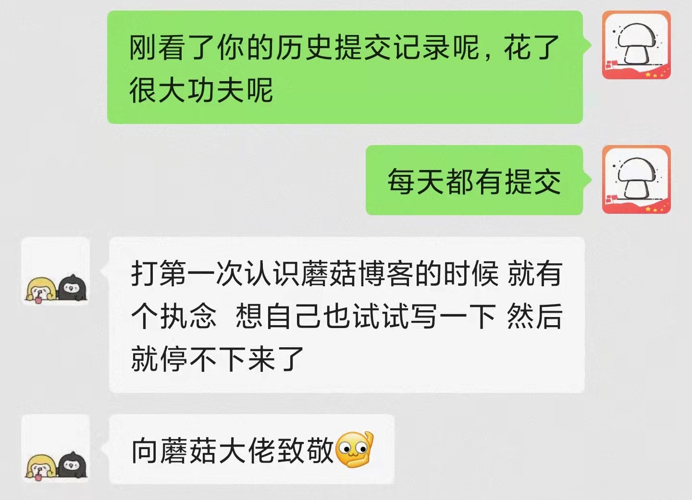
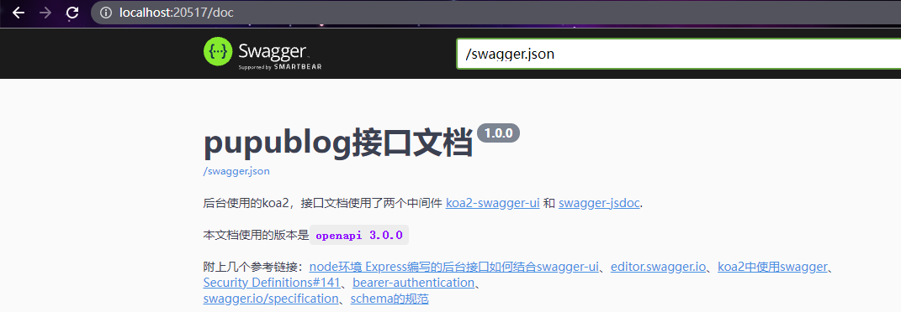
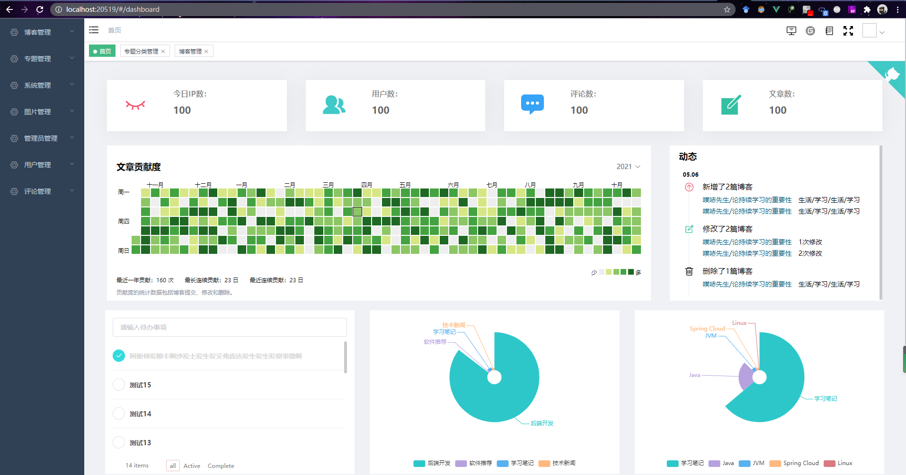

大家好，我是 **陌溪**。

这两天在蘑菇群里，有个前端小伙伴发来一个关于蘑菇博客的重构项目，发现重构的很不错呢，解决了蘑菇目前存在的一些痛点问题，例如评论层级过长无法回复，专题侧边显示不友好等等。

同时，在小陈深入沟通得知，他是从今年三月份就开始重写蘑菇博客的后台的，中间也遇到过一些难题，差点想放弃，但是因为内心的执念，想不断的挑战自己，经历了半年的时间，终于把蘑菇的基础模块都完成了，并且能成功运行起来了。



陌溪也跑到小陈的 **Gitee** 主页上，能看到从今年的 **3** 月 **1** 号开始，一直到现在 **10** 月底，一直在保持对蘑菇的重构，直到前两天完善了博客的搭建文档，终于把它公布于众。


> 小陈的主页：https://gitee.com/hrbust_cheny
>
> pupu_blog：https://gitee.com/hrbust_cheny/pupu_blog

看到现在的小陈，就想起了曾今的自己。蘑菇博客项目最开始的搭建蘑菇博客的初心是为了巩固和学习 **Java** 开发的一些知识，因此项目的技术选型都是当时比较新颖的技术，可能这些技术并不一定适用于博客系统，但是我也想着能尽可能把更多的技术融合进来，毕竟通过自己手把手的操作一遍，才能够加深对技术的理解。

愿每一份努力都不会被辜负,每一分坚持都将会有收获，让我们一起来看看**小陈**在这半年时间里的付出吧~。

> 下面第一人称是我们的主人公：小陈

## 为什么要自己重写一个博客

一直想拥有一个属于自己的博客网站，用来总结自己的学习心得，因为发现自己记性不好，知识学完就忘，并且学到的知识不成体系，东一块西一块，这样就导致了，当每次间隔一段时间不用某个技术时，都需要重学一遍（其实学习就是个重复的过程，这种现象也很正常）。

但是肯定会有很多人有疑问了，为什么要自己去搭博客网站，直接用现成网站记笔记（比如，[掘金](https://juejin.cn/)、[知乎](https://www.zhihu.com/)、[思否](https://segmentfault.com/)、[简书](https://www.jianshu.com/)、[CSDN](https://www.csdn.net/)、[博客园](https://www.cnblogs.com/) 等等），再不然直接用一些现成的技术搭网站（比如，[docsify](https://docsify.js.org/#/)、[vuepress](https://vuepress.vuejs.org/zh/)、[WordPress](https://cn.wordpress.org/) 等等），它不香吗？

怎么说呢，很香，确实香，但是当了解过这些方式，并尝试过其中的一些后，最终决定还是自己开发一个，究其原因，是出于下面几点考虑的（存是个人想法）

- 直接在现成的网站上记笔记，是有必要的，并且是需要长期坚持的，但是总感觉写完的笔记知识点太散，没有成系统，虽然可以加标签，加专题，进行一个归类，但是我个人感觉操作起来还是不方便，差点意思，我想要归的更细（比较喜欢这个网站的风格，主要喜欢这种归类，[现代 JavaScript 教程](https://zh.javascript.info/)）

- 如果直接用现成的技术搭博客，总觉得没有灵魂。既然是自己的网站了，写代码还得遵循别人的风格，就很别扭。所以我更建议用上面提到的技术（[docsify](https://docsify.js.org/#/)、[vuepress](https://vuepress.vuejs.org/zh/)等）去写一些手册、说明书之类的。并且，既然搭博客网站的初衷是为了学习，而学习的方法是一个技术一个技术去尝试、去复现、去思考。如果直接用现成的技术很快的搭建起了自己的网站，虽然节省了很多时间，但是这其中少了很多学习技术的机会。比如，网页怎么布局的，前后端怎么交互的，浏览器怎么加载的，代码怎么打包的，网站怎么部署的，等等等等。

> tip：其实选择怎样的学习方式，全都取决于自己。只要坚持下来就一定会有收获。经验都是在不断的尝试之后总结出来的，最重要的就是行动起来。

所以，结合上面的几点考虑，确定了下面几个大目标

- 自己从零开发一个博客网站，用来记录日后的学习笔记，不管开发需要花费多少时间，坚持下来。

- 功能设计方面，遵循自己的想法来，除了博客应有的功能外，需要有一个专题功能，可以将日后学习到的知识详细归类，形成体系。

- 别人看网站的时候可以和我有交互，有反馈。

- 把项目开源出来。

于是针对于上面的几点大目标，我开始在 **Github** 和 **Gitee** 里搜索相关的项目，当我看到 [蘑菇博客](http://www.moguit.cn/#/) 的时候，顿时眼前一亮，发现所有的想法，都在这个项目上不谋而合了。

不过项目的后台陌溪大佬（蘑菇博客的作者）是用 **Java** 写的，这对于我一个小前端来说**学习成本太大**，所以就想着能不能把后台改成 **node** 版本的。心动不如行动，于是就开始了我的重写之路，最终历经小半年，终于把大概功能重写完成，还有很多功能日后有时间慢慢完善。

在这期间我一共做了下面几件事

- 重写蘑菇博客的前台和后台静态页面

- 重写留言和评论组件（[仿Gitee](https://gitee.com/hrbust_cheny/pupu_blog)）

- 重写专题组件（专题列表仿照 [KuangStudy](https://www.kuangstudy.com/course)，专题详情仿照  [现代JavaScript 教程](https://zh.javascript.info/) ）

- 重写文章目录组件 （仿[Gitee的Readme目录](https://gitee.com/hrbust_cheny/pupu_blog)）

- 重写登录组件 （仿 [掘金登录](https://juejin.cn/) ）

- 重写个人中心 （仿 [掘金个人中心](https://juejin.cn/)）

- 重写后台服务 （结合自己业务模块，自己搭了一套 **koa2** 后台架子）

- 为了提高接口和后台页面开发效率，自定义代码生成器 （基于导出的 **sql** 文件，根据对应字段和字段注释，一键生成接口和后台代码）

## 我是如何仿写的

可能会有很多人（也包括之前的我 ┑(￣Д ￣)┍ ），总是会将想法只停留在想法上，一直拖着，不付诸于行动。就拿开发博客来说，早在上大学的时候就有这种想法，但是一直拖着就是不做，这都工作一年了才刚刚开始，想想自己虚度的那些光阴，真是太可惜了，不过学习什么时候都不算晚，坚持下来就会有收获。种一棵树最好的时间是十年前，其次就是现在嘛😄

关于如何仿写，诀窍就是一句话：耐下心，沉住气，一点点推进自己的计划（后来发现做任何事都是这样子的~）。比如决定仿写蘑菇博客时，首先就是将这个项目拉下来，在本地运行起来，把项目跑跑看（好的项目文档也不会差，蘑菇博客太 **nice** 了，再次致敬陌溪大佬）。

按照博客的文档步骤，一步一步将环境都安装下来，遇到问题的时候也不要慌，先定位问题，然后尝试自己解决问题，先百度或者 **Google** 去搜索看看，还是没有就去 **issue** 里找找，如果还是没有就去作者往期的文档里找找，应该也会有，所有的都尝试一个遍时，还是没有解决，这时候就可以去交流群里问一下大佬。

描述问题的时候应该注意一点，把问题的场景，代码、报错、以及自己尝试的解决方式最好都描述一下，再带上清晰完整的截图，基本上懂得人都会帮你解答了（发现搞技术的人都很存粹，越厉害的大佬越有耐心，如果不给你解答，多半是问问题的方式不对，或者大佬确实太忙 😂 ）。

剩下做的就是见招拆招，面向百度编程、面向文档编程，把功能一步一步的实现，只要坚持下来，你会发现自己竟然也能这么厉害 🤭

不过当你回顾自己做出来的东西时，会有一个大大的疑惑——这玩意我是怎么做出来的 😳 ？这就是我为什么一直想要做一个自己的博客网站的原因，我太容易忘了！

而当我有自己的网站时，我可以每次把自己学到的知识记录下来，每次再回过头想要了解自己的知识体系时，可以有一个对应的文章可循。

博客网站可以把自己学的知识量化，可以把它们分成体系，技术类的、生活类的、娱乐类的、工具类的、常识类的等等等。相信日后如果能一直坚持下来，定会惊叹自己的知识量吧😄，加油加油💪

## 我重构了哪些地方？

在重写蘑菇博客时，我也根据自己的喜好做了一些调整，下面做一个简单的汇总。

### 布局上做了细微调整

设计页面时，我设计了一个宽  **1200px** 的版心，所有的内容都在版心里，目前并没有做移动端适配，以后可能会单独写一套移动端的页面。


### 将时间、分类、标签 三种归档方式移动至一个页面中

当时觉得这三种归档方式都算是归档，索性就移动到了一起，点击不同的tab就可以进行切换了，节省了导航栏很多空间。


### 重写了专题详情的样式

蘑菇博客采用的是侧边栏弹窗的方式，每一个专题下面的文章以列表的形式展示。因为我想要分的更细，所以就单独写了一个专题详情页面，页面 **UI** 参考的是 [现代 JavaScript 教程](https://zh.javascript.info/)。比较喜欢这个网站的布局风格，所以就仿写了一下，效果如下：


### 重写专题列表样式

设计博客最初的想法是以后可以把方方面面学到的知识都记录下来（总感觉自己记性不好，那以后就干脆都记下来吧，┑(￣Д ￣)┍）。所以我希望专题的分类可以有多种类型，不限于技术类的，也可能是生活类的、摄影类的等等等等。毕竟活到老学到老嘛。所以就借鉴了 [KuangStudy](https://www.kuangstudy.com/course) 课程分类的 **UI**，效果如下：


### 重写了评论组件

自己今年访问最多的网站应属 [Gitee](https://gitee.com/hrbust_cheny/pupu_blog)了，毕竟几乎大部分时间都在上面提交代码（ **Gihub** 国内访问太揪心了( ╯□╰ )）。看了很多网站的评论模块，感觉都没有 **Gitee** 的评论做的清晰（单独指的 **PC** 端），就比如刷微博、逛知乎的时候，有时候我就看不太懂是谁回复的谁，还得稍微思考一下，可能自己习惯 **Gitee** 这种直接罗列出来的风格，然后也比较喜欢 **Gitee** 评论的留言相互点赞功能，所以就高仿 **Gitee** 的评论模块，自己也单独实现了一下，效果如下：


### 重写了文章贡献度模块

> （功能尚未完成，只有静态页面）

蘑菇博客使用 **Echarts** 实现的文章贡献度展示，根据每天发布文章的多少来显示对应的小点，每天更新越多小点覆盖面积就越大。我也挺喜欢这个功能的，毕竟这个功能也能激励自己持续学习嘛。

每当看到一页绿油油的小点时，都会有一种成就感，原来自己不知不觉坚持了那么久呢。将仿写进行到底，因为习惯了 **Gitee**，所以继续仿写。

**Gitee** 这块实现的比较巧妙，所有的方格实际都是一个个小块 **div** ，使用 **flex** 布局和定位实现的。相较于 **Github** 用的 **canvas** 简单不少，并且也符合我的审美，实现效果如下：


### 重写了登录弹窗组件，支持QQ登录、Gitee登录

登录直接采用的第三方登录，当前只支持 **Gitee** 和 **QQ** 登录，如果想了解这个第三方登录是怎么实现的，初次最好接入 **Gitee** 的第三方登录。

**Gitee** 限制是最少的，直接可以在本地申请应用，并且回调接口直接可以填写本地 **localhost**，非常方便。而 **QQ**和微博是很麻烦的，接入他们的功能必须有一个备案好的域名，并且需要审核，很麻烦（微博到现在都没有审核通过( ╯□╰ ) ）。接入第三方登录整体流程大概如下（交互方式仿掘金）：

- 点击登录后会弹出一个请求第三方应用 **code** 的新窗口

- 然后第三方会用这个 **code** 去调用你申请应用时填写的回调接口

- 在自己回调接口这儿，通过拿到的 **code** 和申请的密钥，向第三方服务器发送请求，拿到 **access_code**

- 通过 **access_code** 和密钥再去请求第三方接口，去拿到对应平台的用户信息

- 把用户信息存储到自己数据库中，返回给前台一个 **token**

- 弹出的窗口会接收到这个 **token**，通过跨窗口通信的方式将 **token** 传递给自己的主页

- 前台保存 **token**，刷新页面，通过 **token** 向后台拿到用户信息，这样就完成了第三方登录功能

> tip：整体的流程大致是上面几步，略微会有些差异，不过影响不大。
>
> 登录模块的UI风格模仿的[掘金](https://juejin.cn/)登录框，只不过把手机登录给去掉了，没办法，要钱( ╯□╰ )。


### 重写个人中心

> （功能尚未完成，当前只是静态页面）

整体页面UI也是仿照的[掘金](https://juejin.cn/)的个人中心，不过感觉现在没人会用，就先放一放了，效果如下：


### 后台管理端重写专题分组样式

因为专题的逻辑更改，所以后台重写一了专题的添加方式，效果如下：


### 后台管理端重写图片管理样式

上传图片按照时间呈列表状排列，效果如下：


### 评论增加了后台审核

因为有交互，所以最好还是将留言审核一下再发布出来，未审核的留言只能发布人自己看到。目前审核的方式是人工审核，比较麻烦。后期有时间会改为自动审核，并且留言现在没有增加邮件通知，都是自己随缘上去看，很不方便，邮件通知后期有时间也会加上。整体效果如下：


### 重构推荐拖拽组件

在蘑菇博客的设计中，总共设计了四个推荐板块：一级推荐（首页轮播图）、二级推荐（轮播图的右侧的两篇文章）、三级推荐（主页右侧的特别推荐专栏）、四级推荐（主页右侧的推荐文章专栏）。

在改变推荐等级排列顺序的功能里，对原本的功能做了一个简单的优化。博客原本的交互方式就特别好，使用拖拽组件[vuedraggable](https://github.com/SortableJS/Vue.Draggable) 包裹的，同一级别的博客可以拖动着修改排列顺序，但是目前不支持跨级别拖动。然后我研究了一下这个拖拽组件，改为了可以跨级别拖动，实现效果如下：


### 重构关注我们

联系方式单独做成了一个管理，这样就可以自定义的扩展不同的联系的方式，并且颜色和图标可以高度自定义。


实现后的效果如下，在蘑菇原来的基础上添加了掘金和B站，与之前对比毫无违和感。


## 开发中遇到了哪些困难，有没有想过放弃

不知不觉，小半年已经过去了，想想整体的开发流程还是比较顺利的，但是也有一些困难（可能有挺多困难，我给忘了😂），有一回也差点放弃了，这里简单回顾一下。

说起最艰难的岁月，莫过于刚开始（果然是万事开头难😫）。因为自己也是在学习阶段，很多都是摸黑瞎弄，想完全重构蘑菇博客，谈何容易。那么就不想那么多，一个功能一个功能去实现，该写页面写页面，该写接口写接口，逢山开路、见招拆招，闷着头干就完事。

从零开始写，首先就需要构建项目脚手架，蘑菇博客用的是 **vue2** 带 **webpack** 目录版本的脚手架（其实我想学的就是这版本，顺带还能学学 **webpack** ），所以就去[官网](https://cn.vuejs.org/)看了一下怎么构建老版本的脚手架，果然找到了

全局安装个桥接工具 **@vue/cli-init** ，然后使用 **vue init xxx* 就可以初始化一个带 **webpack** 目录的脚手架，但是下载下来的项目 **webpack** 的版本是 **3**，而蘑菇博客的版本是 **4**，然后就网上各种找帖子，升级 **webpack**，最后好在是成功了。

然后就是写页面，这个过程就比较顺手，因为有了蘑菇博客做参照，不用纠结颜色布局之类的，特意修改的布局也是参照别的网站，剩下的就是写页面、封组件，不会的语法查 [vue官网文档](https://cn.vuejs.org/v2/guide/)，[element-ui](https://element.eleme.cn/#/zh-CN/component/installation)上能复用的组件直接拿来用。但是仿写的 **评论组件**、**贡献度组件**，前前后后也花了很多时间。

最想放弃的时候是写业务接口，增删改查逻辑。代码都是重复的，每建一个新表，都需要写一套增删改查逻辑，并在后台管理端写一套对应的页面，配一遍路由，很是麻烦。

这里面除了重复性的粘贴工作外，最头疼的是替换变量参数。数据库里的字段我使用的是下划线的格式，比如表名使用  **t_blog** ，里面的字段为 **blog_title** 等等这样的形式。然后写接口时，参数我是以小驼峰的格式接收的，比如 **blogTitle**。

然后还有接口的命名方式 **saveBlog** 、 **queryBlog** 、 **updateBlog** 、 **deleteBlog**，等等这些需要替换的地方真是太多了，稍微不注意就少了那块多了那块。当我写完两个模块的时候，就想放弃了，简直是不要太麻烦了┑(￣Д ￣)┍

后来想了一想，其实重复性的工作，是完全可以用代码解决的。

所有的业务接口都是在操作数据库表，业务代码实则都是对数据库表中字段执行增删改查操作。那么我只要在建表时，遵循一定规范，然后根据规范去生成代码不就好了嘛，别的就是文件读取正则替换的事了，所以难点就是制定规则和解析 **sql** 文件。后来观察了一下导出的sql文件，其实也是有规律的，只要有规律，那么就都不复杂，说干就干，首先制定建表规则：

- 所有表都需要有`uid`，`sort`、`create_time`、`update_time`字段，即主键、排列方式、创建时间、修改时间

- 所有需要后端接口校验的字段，都设置为必填

- 所有有默认值的字段，都可以作为条件查询时的筛选条件

- 所有字段都必须有注释，并且注释的方式以`xxx：xxxxx`的格式，冒号是中文冒号，注释里只有一个中文冒号，冒号前注释就是字段的中文注释，这样在生成后台管理端代码时，也可以直接把中文注释给生成出来，比如，input框里的placeholder，直接可以生成`请输入xxx`

基于上面的建表规则，每次只需将表创建好，把导出的 **sql** 文件逐行解析成 **json** 对象，提前定义好代码模板和占位符，最后读取模板，替换占位符为相应的字段名，最后将替换后的文件写入对应的目录下，这不就成了嘛，分析好思路后其实也不难。执行起来大概分为下面几步：

- 按照自定义的规则建立数据表

- 导出数据库为sql文件

- 解析sql文件，将建表语句转换为 **json** 对象，如

```js
[
   {
       name: 't_blog',
       comment: 'string',
       columns: [
           {
               label: 'string',
               comment: 'string',
               type: 'string',
               isRequire: true|false,
               defaultValue: '',
           },
       ],
   },
]
```

- 定义模板代码，需要替换的地方提前定义好占位符

- 读取模板代码，通过解析好的数据表的 **json** 对象，逐个替换占位符为对应结果

```js
//小驼峰格式占位符
const smallHumpPlaceholder = /\$VAR_SMALL_HUMP\$/g
//大驼峰格式占位符
const bigHumpPlaceholder = /\$VAR_BIG_HUMP\$/g
//连字符格式占位符
const hyphenPlaceholder = /\$VAR_HYPHEN\$/g
//常量格式占位符
const constantPlaceholder = /\$VAR_CONSTANT\$/g
//表名占位符
const sqlTableNamePlaceholder = /\$MY_SQL_TABLE_NAME\$/g
//类名占位符
const classNamePlaceholder = /\$VAR_CLASS_NAME\$/g
```

- 将替换好的代码写入对应目录下

当实现了自定义的代码生成器后，第一次生成一个模块的代码时，满满的都是成就感😊

## 如何运行项目

首先先克隆仓库 **pupu_blog** 项目

```bash
git clone https://gitee.com/hrbust_cheny/pupu_blog.git
```

新建数据库 **pupublog** ，然后在本地导入数据库 **pupublog2.sql**，脚本位于 **/koa-blog-service/** 目录下，执行下面的`sql`语句，新建管理员用户： 创建了一个账号为admin的用户，密码是123123

```BASH
delete from t_admin_user where uid = '-1';
insert into t_admin_user( uid, user_name, user_password, order_num, create_time, update_time ) values ('-1','admin','$2a$10$2veC0JLAmmOavUlyyDN25.3vRix0nyH9Vf5lAcI8DRyQgKGnQBKVG',-1,localtime(),localtime());
```

### 运行后端项目

然后开始给node 项目  **koa-blog-service** 目录下，安装依赖

```
## 进入到 koa-blog-service 目录下，安装依赖 /pupublog/koa-blog-service
npm install --registry=https://registry.npm.taobao.org
## 全局安装 supervisor，文件变更会自动重启node服务
npm install -g supervisor
```

安装完依赖后，打开项目，找到 **koa-blog-service/src/constant/config.js** 文件，然后修改如下配置

```JS
// /koa-blog-service/src/constant/config.js
// mysql配置
const database = {
    host: 'localhost', // 连接的服务器
    port: 3306, // mysql服务运行的端口
    database: 'pupublog', // 连接的数据库
    user: 'root', // 你数据库的用户名
    password: 'root' //数据库密码
}
/**
 * 1、如果是本地运行
 *  http://localhost:20517
 * 2、如果是部署到服务器，正式生产环境
 *  http://你的ip:20517 或者是你的域名
 * 
 */
const baseUrl = 'http://localhost:20517'
/**
 * Gitee第三方登录的相关参数
 */
const giteeLogin = {
    client_id: '你自己申请的客户id',
    client_secret: '你自己申请的密钥',
    expires: 3600, // token默认过期时间，单位是秒 3600s就是一小时
}
```

修改完成后，执行 **npm run dev** 运行项目

执行成功后，会显示运行的端口号，表示 **node** 后端服务已经运行成功


如果想检验的话，可以复制打开，看能否出现对应的 **Swagger** 接口文档



### 运行前端项目

首先运行管理端  **vue-blog-admin**，到目录 **pupu_blog\vue-blog-admin** 下执行下面命令

```bash
## 安装依赖
npm install --registry=https://registry.npm.taobao.org
## 启动管理端项目
npm run dev
```

运行成功后的，会自动打开 http://localhost:20519/ 



然后再运行管理端  **vue-blog-web**，到目录 **pupu_blog\vue-blog-admin** 下执行下面命令

```bash
## 安装依赖
npm install --registry=https://registry.npm.taobao.org
## 启动管理端项目
npm run dev
```

运行成功后，会打开  http://localhost:20518/


## 最后

前几天在蘑菇博客交流群里给大家看了一下实现的效果，得到了陌溪大佬的肯定，还是很开心的。

生活还在继续，短暂的停歇一下，继续向着自己的目标迈进吧，加油加油💪

本人是一年开发经验的小前端，项目是在空闲时间完成的，后期还会慢慢完善，目前先暂停一阵，备战面试~

另外附上项目地址，感兴趣的小伙伴可以帮忙点个star关注一下🙏，也欢迎大家提 **issue** 和留言，如哪里有错误的地方，欢迎指正，让我们共同进步💪

> 项目线上地址：
>
> http://bnbiye.cn
>
> 项目仓库地址：
>
> https://gitee.com/hrbust_cheny/pupu_blog


