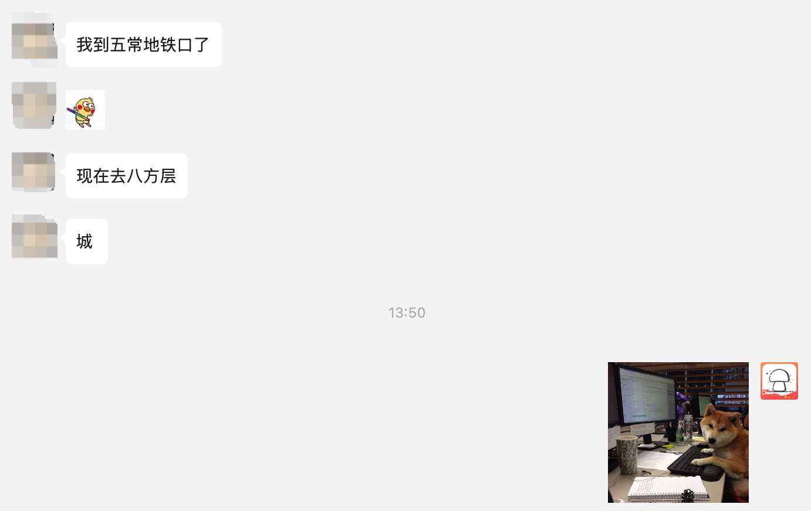
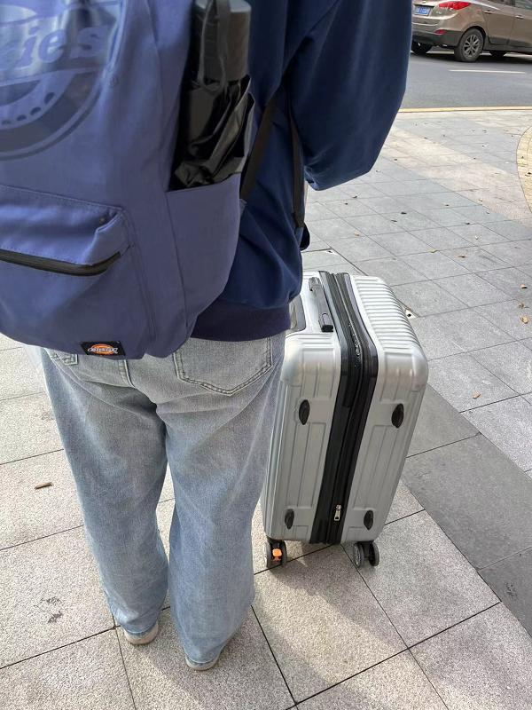
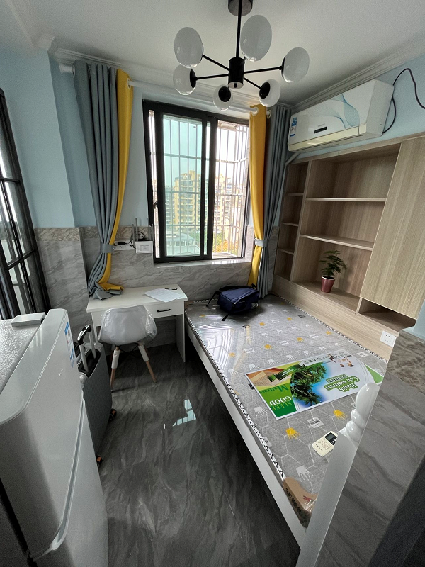
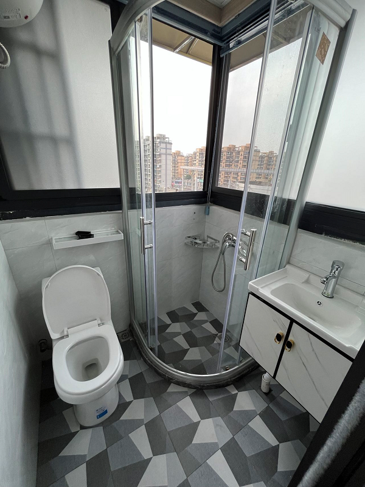
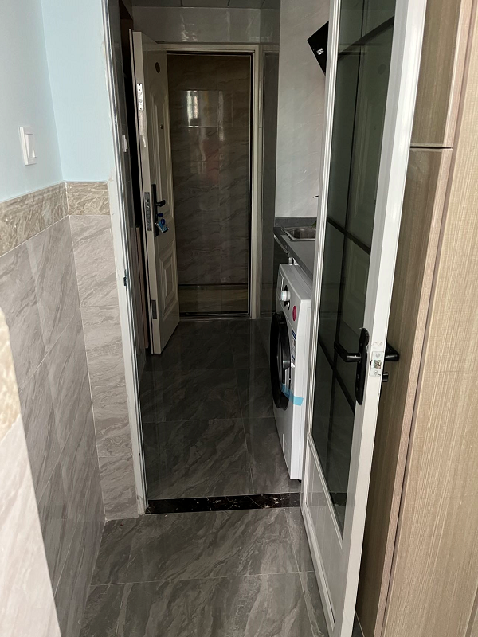
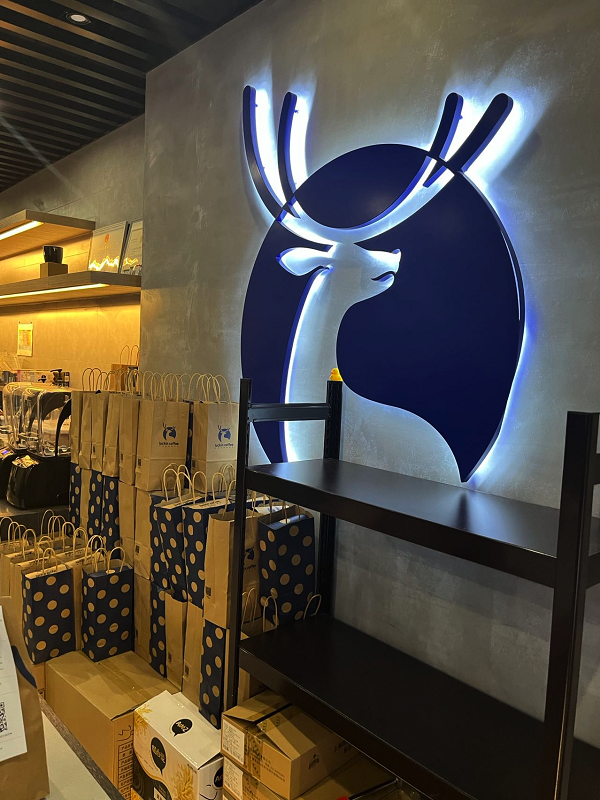
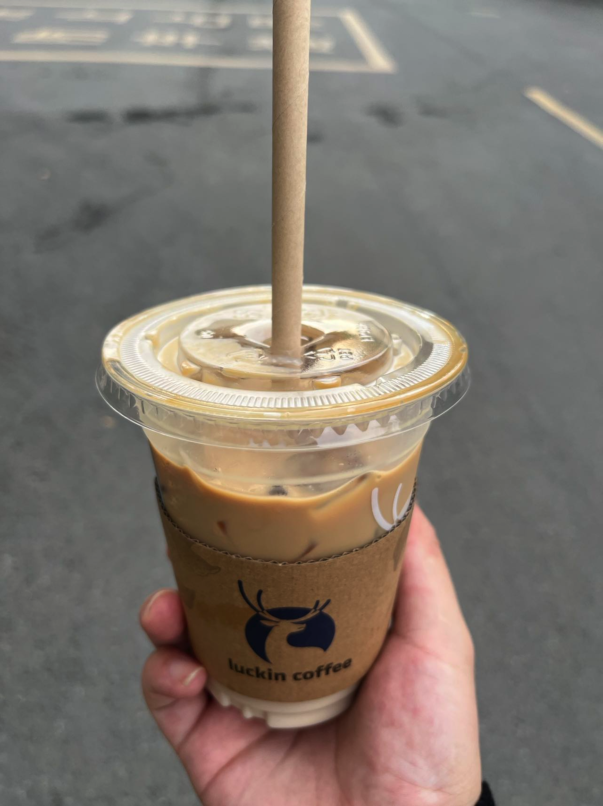
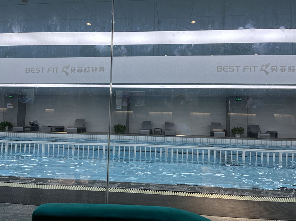
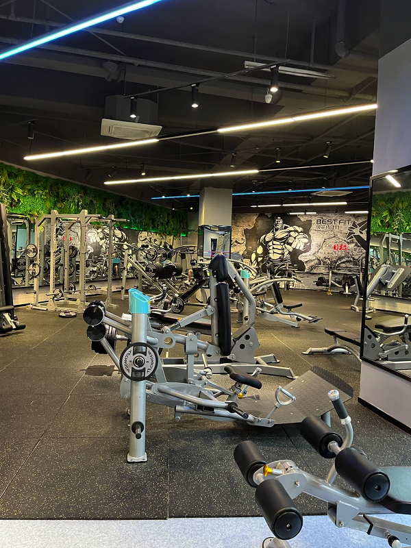
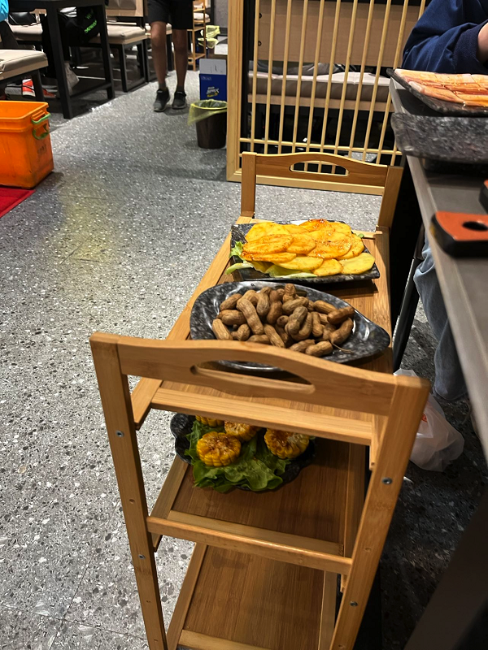

大家好，我是**陌溪**。

今天，蘑菇交流群的 **小w** 要来杭州字节实习了 （**小w** 是文章 [恭喜这位学弟！民办二本九面字节终上岸](https://mp.weixin.qq.com/s/mE8AjQdQP8cgsWPVUbLBHA) 的主人公），因为 **小w** 选择的 **base** 也是杭州都属于广告部门，所以办公地点也是和陌溪在一个地方。

听说签了三方来实习的，是拥有正式工资的百分**80**。快把陌溪羡慕坏了，想想之前我刚去实习的时候，一个月才 **3000** 多，除去租房和饮食的开销，陌溪之前实习的这点工资简直差点在北京活不下去了。

**小w** 作为蘑菇群的老员工，以及未来的字节同事。陌溪当然尽地主之谊，打算带着他熟悉一下子节周边的环境，把 **小w** 今天的日程给安排上。

因为下了地铁站后，需要经过公司楼下，所以和 **小w** 约定好公司楼下碰面。

陌溪到了公司楼下后，找了半天没有找到 **小w**，还以为他走错地方了。直到发过来一张图才知道，原来他跟着导航跑到了公司的后面，真是找了半天才找到。

因为之前有帮 **小w** 修改过简历，所以对于 **小w** 的模样还是有些印象的，不过剃了个寸头，还是让我差点没认出来，**社会小w，人狠话不多**。

作为打工人初到杭州，第一步当然是先把住房问题给落实。之前提前和 **小w** 有讲过附近的一些租房情况，并且在公司附近有很多安置房，都是房东直租，不收取中介费，所以在来之前就联系上了一位租房的阿姨。

在交谈中了解到，这位阿姨家原来是拆迁户，在拆迁后分配到了好几套房，并且目前看的这套房就是装修好的。

在挑选了几套后，最后就找到下面这套最合适，里面洗衣机、独立卫浴、厨房、空调都 **OK**，并且采光条件都还可以，空间一个月居住的话也不算小，主要是靠近内侧，晚上睡觉比较安静。

然后罗列了一些租房的常见问题，并向房东咨询：

- 水电费是这么收的？有峰电谷电么？
  - 水费是4块1顿、电费是1元1度（不考虑峰电谷电，电费相对贵一些，陌溪那的是0.7元）

- 拍打一下墙体，确定是否是隔断房，因为隔断房的隔音效果不太理想。
  - 确定了一下，是实体墙，关上门的隔音还算可以（比陌溪的这里强，因为我那还在修地铁。。）
- 边上的租户分别是什么人，作息时间怎么样？
  - 边上都是在附近工作的，作息时间也比较规律，不过关上门应该问题不大。
- 能否支持4个月短租？
  - 因为**小w** 是来这边提前实习的，所以干4个月就得回去准备毕业的事情的。
- 中介费和物业费是否需要缴纳？
  - 在这边都是房东互相介绍房源的，也不需要中介费。同时，物业费也是由房东缴纳的。
- 使用的设备出现问题了，比如洗衣机/空调/油烟机，怎么办？
  - 设备如果不是人为故意损坏，房东都会叫师傅来免费帮忙维修。并且设备都还是新的，很少会出现问题。

在了解了一些情况后，因为现在租房也是淡季，所以最终房东给我们的价格是 **1300** 元/月，并且是 **压一付一**，一共需要支付 **2600** 元。

> 想到陌溪的房子，需要押一付三，并且还有半个月的中介费，花了快1w了，差点让我吃土了。

这个价格是在远远低于预期的，原来 **小w** 预算是 **3000** 块能租下一室一厅，现在是直接省下了 **1700** 元，群友们直呼便宜。

在租房的问题都OK后，就开始了租房合同的签署，和 **小w** 一块确定了合同的内容后，愉快的完成了本次租房之旅。

完成了租房后，拿到钥匙后，就带着 **小w** 到公司的附近进行参观。顺便来两杯国产之光的 **瑞幸咖啡** 解解渴。

生椰拿铁，YYDS

房子租好、公司楼下参观完，当然就是去超市安排一波采购日常用品了，赶快快马加鞭的赶到了附近最大的购物超市

推着购物车，带着 **小w** 把日常需要用的日用品看了一遍，在看到被子时候，被价格劝退了，果断在京东下单

> 这里也推荐小伙伴可以提前在网上购买好一些被褥物品，可以先放在朋友那边，等定好了后，再过去拿也OK的。不然线下买可能价格会超出你的预算。

超市逛完后，刚好公司的健身房也在边上，就顺带着去参观了，希望 **小w** 后面能够多多来锻炼，不然可能被字节伙食养胖了～

从健身房出来后，天已经快黑了，前阵子刚好看到附近开了一家烤肉店，当然是给安排上～

这家的牛肉和五花肉都不错，吃起来也很香～

最后，恭喜 **小w** 加入杭州打工人行列～

好了，与蘑菇群友的面基之旅就到这里了，陌溪得回去继续搬砖了～

最后到家，看看今天走过的步数，运动达标，充实的一天~

我是陌溪，我们下期再见～