大家好，我是**陌溪**。

最近，有很多小伙伴反馈，说在部署蘑菇博客后，发现没有办法修改网站的 **meta** 信息，也就是浏览器上的 **icon**图标和标题信息，没有办法自定义。

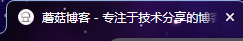

这个就会导致一个问题，就是自己部署的博客在百度收录的时候，还是收录的蘑菇博客的 **title** 信息，所以就出现了下面这个尴尬的情况：陌溪在百度搜索 **蘑菇博客** 的时候，出来了很多其它网站的信息


然后点进去就会发现，其实小伙伴的博客叫 **大伟博客**，但是上面的 **title** 和 **icon** 却还是蘑菇博客的。

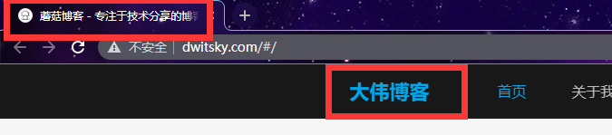 

之前的一个解决方法是，**clone** 蘑菇博客源码，然后手动制作一份 **Docker** 镜像，然后重新打包运行在我们的服务器上，但是这个方法比较的繁琐，并且小白很容易暴露 **2375** 端口号，导致自己的机器被挖矿。

另外提供的一个方法，就是将运行的容器中的内容拷贝出来进行修改，修改完之后，我们在重新打包成一份镜像。这种方法相对简单，同时也不容易出错。在这里，陌溪特意写了两个脚本 **copy.sh** 和  **replace.sh** 

> 公众号回复：**替换脚本**，即可获取到下载链接

-  **copy.sh**：就是将容器中的 **icon** 和 **index.html** 拷贝出来
- **replace.sh**：将修改后的内容进行替换。

脚本解压完之后，是下面这样的

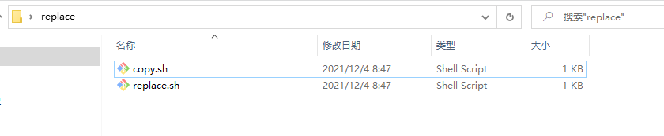

我们把 **replace** 文件夹，拷贝到我们的服务器中的任意位置，陌溪是直接放在一键脚本的同级目录下


然后进入目录下，给两个脚本赋予 **执行权限**

```bash
# 进入脚本
cd replace
# 赋予权限
chmod +x copy.sh
chmod +x replace.sh
```


首先，我们执行 **copy.sh** ，将容器内需要替换的内容拷贝出来

```bash
# 拷贝内容
./copy.sh
```

执行成功后，会发现这里出现了两个文件 **vue_mogu_admin_index.html** 和 **vue_mogu_web_index.html**

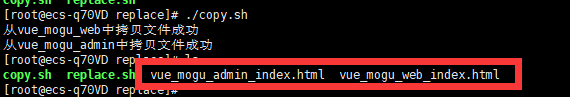

然后我们将这两个文件拷贝到电脑上，打开下面的 **html** 在线格式化的网站

> https://tool.oschina.net/codeformat/html/

将刚刚两个文件的内容导入到页面中，进行格式化，然后修改里面的 **meta** 信息，把蘑菇博客相关的，都改成自己网站对应的内容即可。如下所示，我把蘑菇博客，改成了遇见博客


最后，两个文件都修改完成后，复制修改后的内容，写入到  **vue_mogu_admin_index.html** 和 **vue_mogu_web_index.html** 中。

同时，如果还需要修改网站的 **icon** 的话，可以选择一个**icon**，注意 **icon** 名称必须叫  **favicon.ico**，蘑菇找来了一个暗黑模式的蘑菇


然后将这些文件在复制到刚刚的 **replace** 文件夹，最后在我们的 replace 文件夹里，一定包含下面几个文件的

- 修改后的： **vue_mogu_admin_index.html**
- 修改后的： **vue_mogu_web_index.html**
- 需要替换的icon：**favicon.ico**

如下图所示

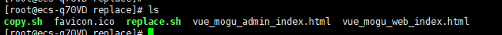

在准备好所有的材料后，执行 **replace.sh**

```bash
# 执行替换脚本
./replace.sh
```

系统将会自动对容器中的内容进行替换


替换完成后，我们可以看到网站的 **icon** 和 标题 都已经完成了替换

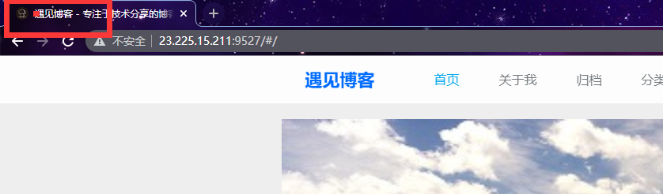

同时通过 **F12 **检查网页的 **meta** 信息，也都已经 **OK** 了

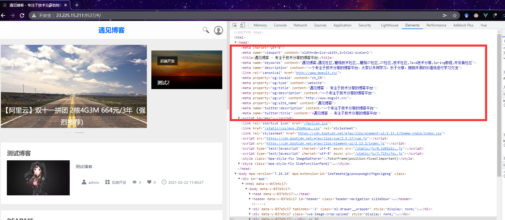

但是，因为我们采用的是替换容器内容的方式，这就会导致如果 **Docker** 容器后，里面的内容可能就不存在了。

因此，我们在替换完里面的信息后，还需要再修改将替换后的容器，制作成一个新的 **docker** 镜像

首先，查看当前正在运行的容器

```bash
docker ps -a 
```

找到 **vue_mogu_web** 和 **vue_mogu_admin**，然后复制 **容器 ID**


使用下面命令，将对应的容器，打包成镜像

```bash
# 制作vue_mogu_admin镜像，需要将容器id，替换成自己的
docker commit -m "vue_mogu_admin" d8c621e95c31 registry.cn-shenzhen.aliyuncs.com/mogublog/vue_mogu_admin:latest
# 制作vue_mogu_web 镜像，需要将容器id，替换成自己的
docker commit -m "vue_mogu_web" 18409d75add4  registry.cn-shenzhen.aliyuncs.com/mogublog/vue_mogu_web:latest
```

执行代码后的操作，如下所示

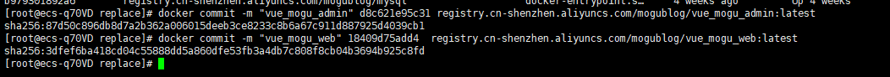

然后执行 docker ps  -a  命令，查看目前的镜像，即可看到已经生成了两个新的镜像了。以后系统在启动的时候，也会从新镜像进行启动。

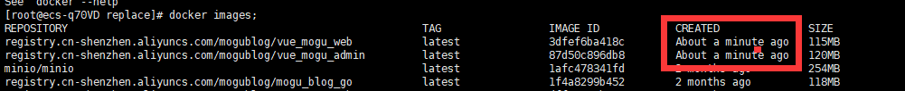

**使用 vue-meta**

上述的修改方式还是有些麻烦，更多的小伙伴们想要在后台进行配置

为了帮小伙伴解决这个痛点问题，陌溪在 **Github** 调研了一下，发现有个组件可以解决上述的问题。

> https://github.com/nuxt/vue-meta

**Vue-meta** ，可以在 **Vue.js** 组件中管理支持 **SSR** 的 **HTML** 元数据 ，这里的 **SSR** 指的是服务器端渲染，**Vue** 搭建的单页面应用，存在最大的问题就是没有办法很好的支持 **SEO** 优化，也就是说没办法让我们的百度爬虫爬取到，这样也不会收录我们的网站。

当然，为了支持 **SEO** 优化，出现了 **Nuxt.js** 框架，该框架和Vue本质的区别就是，在我们的服务器上又跑了一个 **node.js** 程序，然后每次有请求过来的时候，会在该 **node** 层拼接好页面需要的全部信息，然后在完整的返回给客户端，这么做的好处是，可以让爬虫能爬取到完整的页面信息。但是也带来了一些问题，就是网站的打开速度会变的更慢。

通过 **Vue-meta** 虽然不能解决 **Vue** 存在的 **SEO** 的不足，但是至少能让我们首页可以收录。

同时 **Vue-meta** 在深度嵌套组件上设置这些属性时，会巧妙地覆盖它们的父组件的 **metaInfo**，从而为每个顶级视图启用自定义信息，以及将元数据直接耦合到深度嵌套子组件，以实现更易于维护的代码。

## 安装 vue-meta

首先安装 **vue-meta** 依赖，将其安装至我们的项目中

```bash
npm i vue-meta
```

安装完成后，在 **main.js** 中引入并使用

```bash
import VueMeta from 'vue-meta'
Vue.use(VueMeta)
```

然后就可以在 home.vue 页面，添加对应的元信息了

```bash
    metaInfo() {
      return {
        title: this.info.title,
        link: [
          { rel: 'icon', href: this.info.logoPhoto }
        ],
        meta: [
          {
            name: "keywords",
            content: this.info.keyword,
          },
          {
            name: "content",
            content: this.info.summary,
          },
          {
            name: "description",
            content: this.info.summary,
          },
          {
            property: "site_name",
            content: this.info.name,
          },
        ],
      };
    },
```

然后为了防止使用默认图标，我们需要修改引用 **favicon.ico** 的地方，分别是 **webpack.dev.conf.js** 和 **webpack.prod.conf.js** 。


解决后，我们就可以在蘑菇的后台配置 **logo** 和标题信息了

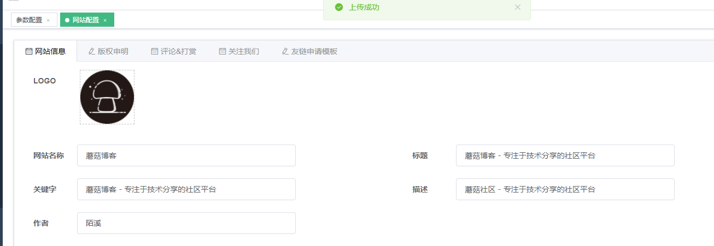

到首页刷新后，即可看到 **icon** 已经修改成我们配置的小图标了~


同时，打开 **F12**，观察 **html** 的 **meta** 信息，这样就可以通过后台，直接修改我们的 **title** 以及 **icon** 信息了~

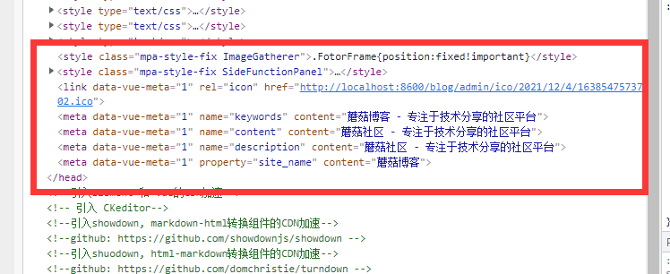

好了，本期的分享就到这里啦

我是陌溪，我们下期再见~