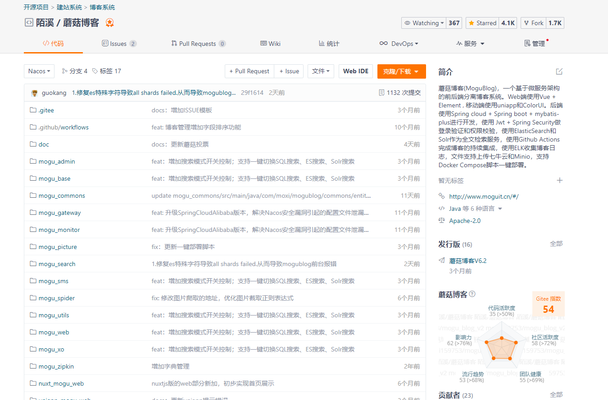
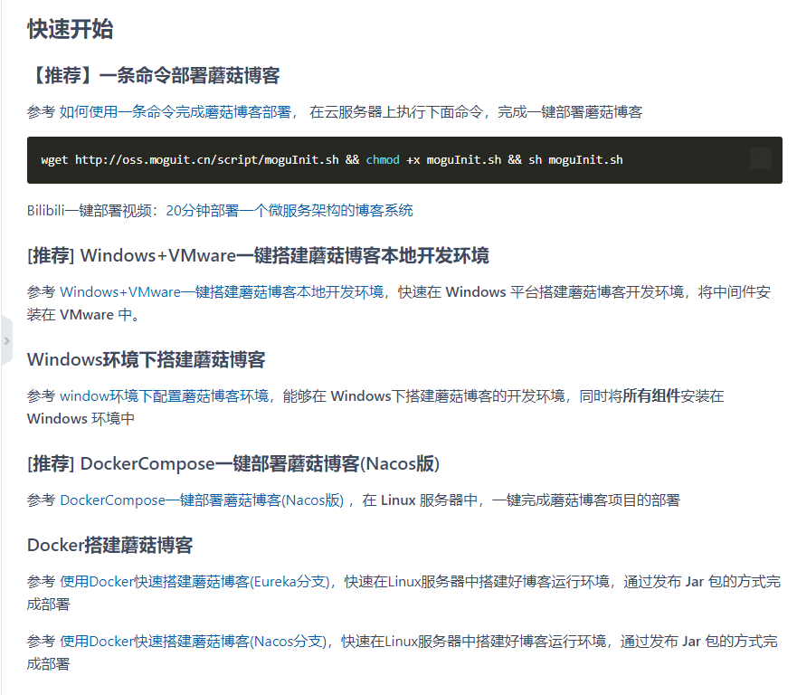
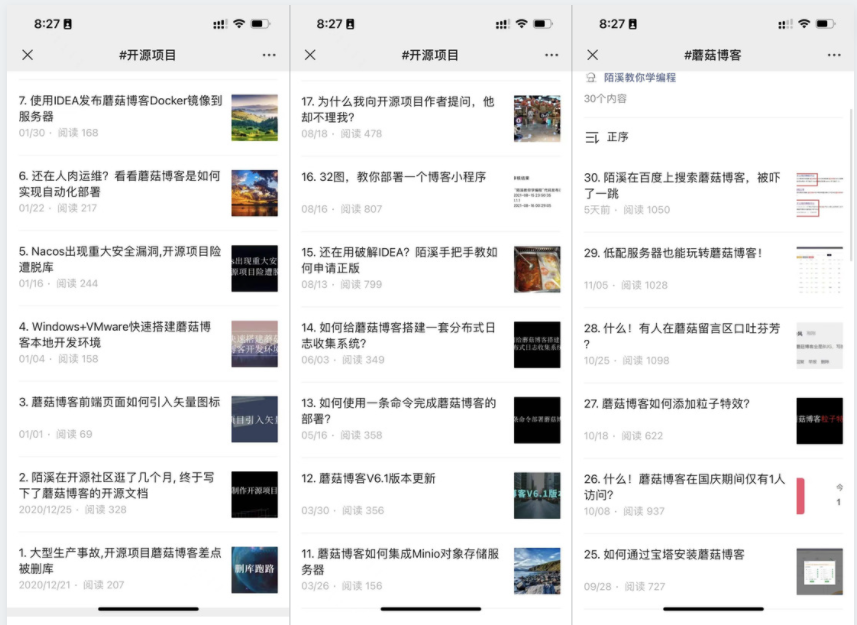
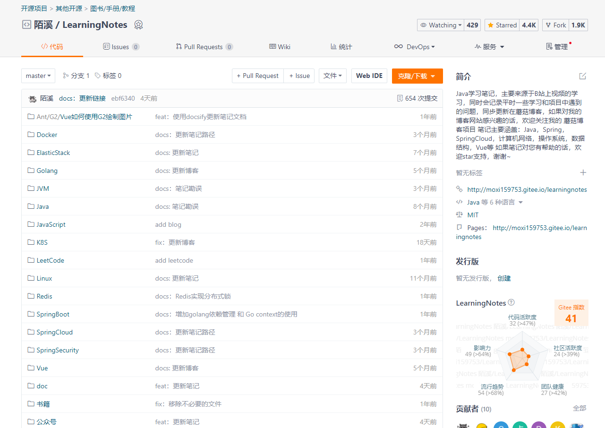
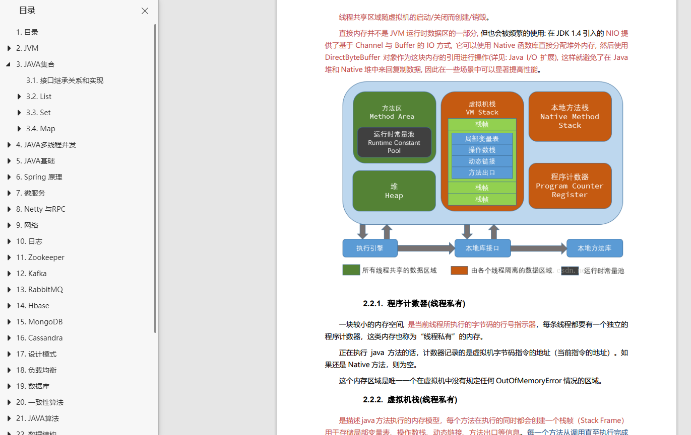
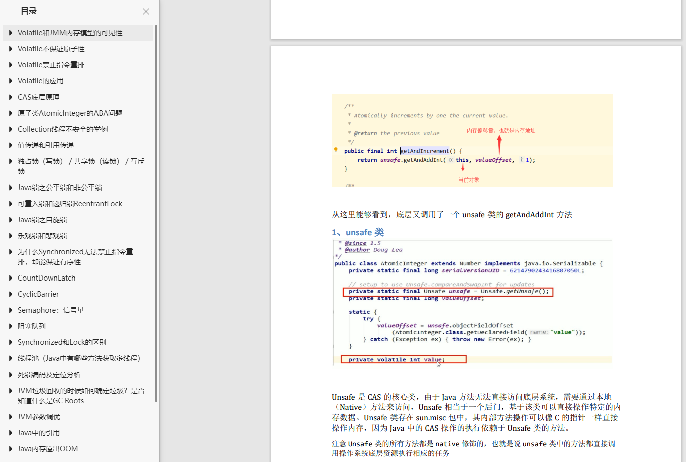
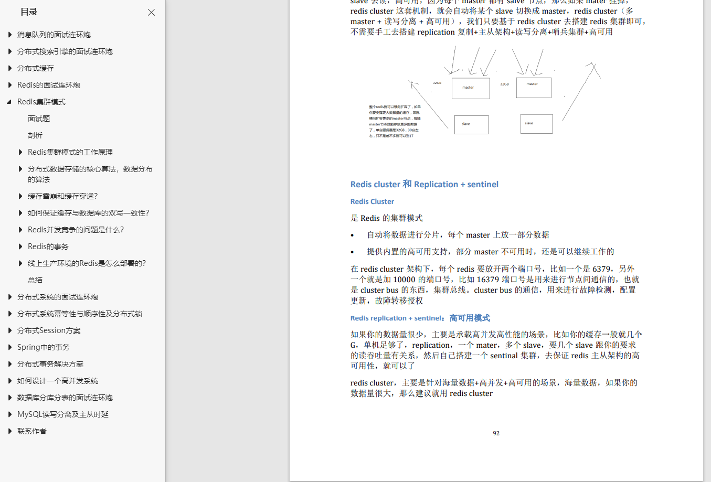

大家好，今天我也给大家推荐一位好朋友：**陌溪**

陌溪，三本出身，本科毕业后花了 **3** 个月备考时间，考上计算机研究生，目前就职于**字节跳动**商业化广告部门。他的经历： [从三本院校到斩获字节跳动后端研发Offer-讲述我的故事](https://mp.weixin.qq.com/s/c4rR_aWpmNNFGn-mZBLWYg) 。

在研究生期间，自学 **Java** 编程技术，每天花费大量的时间投入到 **开源项目** 的建设中，下面几张图是他在码云上的代码提交贡献图，同时还有他的 **Java** 自学路线图：[做开源项目从0到4000Star，分享我的Java自学路线图](https://mp.weixin.qq.com/s/c4rR_aWpmNNFGn-mZBLWYg)

开源的两个项目，也让他获得了码云的两个奖杯

陌溪是一个全栈工程师，拥有技术栈 **Java**、**Vue**、**Golang**、**Python** 。目前全网累积原创 **400+** 文章的知识博主。码云上的热门推荐项目  **蘑菇博客** 就是在研究生期间独立开发的，目前已有 **4.1K** **Star**。

同时，**蘑菇博客**在码云上作为 **博客** 类搜索排名第一，也帮助很多小伙伴提供毕设的思路~

蘑菇博客采用微服务和前后端分离技术栈，包括 **SpringBoot**、**SpringCloud Alibaba**、**Mybatis-plus**、**ElasticSearch**、**Docker** 、**Github Actions**，下面是它的系统架构图。

同时博客的配套文档齐全，还能支持一键部署，让小白朋友也能快速的搭建起来，是一个非常适合新手学习的项目。

同时，在陌溪的公众号中，也介绍蘑菇博客技术上的一些实现细节。

欢迎大家关注陌溪的公众号进行学习~

同时，陌溪为了准备大厂的秋招，还把自己的学习笔记给开源出来，收获了 **4.4K** **Star**。

为了方便小伙伴们在手机上阅读，陌溪把这份开源学习笔记以及收集的面试题，都整理成了 **PDF** 文件，下面是笔记和面试题的一部分预览图。

包括了 **Java** 基础、**JUC**、**JVM**、**Redis**、微服务、分布式事务等，面试常考的题目。

如果是想刷题找工作的小伙伴，一定不要错过！点击下方关注陌溪的公众号，回复关键字【**PDF**】，就能获取到他精心整理的 **PDF** 学习笔记。

陌溪也帮助了很多双非的小伙伴提供大厂面试指导意见和修改简历，帮助他们收获自己满意的 **Offer**，成功进入到字节跳动。

- [双非本科，折戟成沙铁未销，九面字节终上岸！](https://mp.weixin.qq.com/s/SRf2f8wFFyjz2BUUXD_pmg)
- [恭喜这位学弟！民办二本九面字节终上岸](https://mp.weixin.qq.com/s/mE8AjQdQP8cgsWPVUbLBHA)

最后，陌溪还经常活跃在自己维护的技术群中，每天都会给粉丝解答各种项目上的问题，大家如果想找他唠嗑，或者想加入学习交流群，欢迎添加他的好友。

