大家好，我是**陌溪**

最近有些小伙伴咨询我，为什么要做 **蘑菇博客** 这个开源项目，那么今天就来聊一聊做开源的这些事。

首先，为啥会叫 **蘑菇** 呢？为啥不叫 **青菜**、**土豆**、**番茄** 呢？

熟悉我的小伙伴可能会发现，其实我之前做过的很多东西，都是以 **蘑菇** 为命名的，比如 **蘑菇音乐**、**蘑菇小说**、**蘑菇博客** 。

**蘑菇音乐** 是大学刚学 **Html CSS** 的时候做的，那会和三个小伙伴一起分工合作，我负责前端、另外两个小伙伴负责后端 以及 对应的播放器部分。那会每天琢磨炫酷的**特效**，一行一行的敲着 **Html**、**CSS** 和 **JS** 代码，每天乐此不疲。**切换皮肤**、**音乐播放器**、**社区聊天** 等等功能都给安排了上去。

不过有点遗憾的事，那会并不知道协同开发，所以也没用到 **Git** 和 **SVN** 这样的工具，每次修改代码的时候，都会先备份一下文件夹，生怕一下就改错了回不来。

现在的小伙伴们，推荐首选学习 **Git** 的基本操作，然后把自己的代码提交到 **Gitee** 或者 **Github**，把文档写详细一些，或许不久的将来，也会是一款出色的开源项目呢~

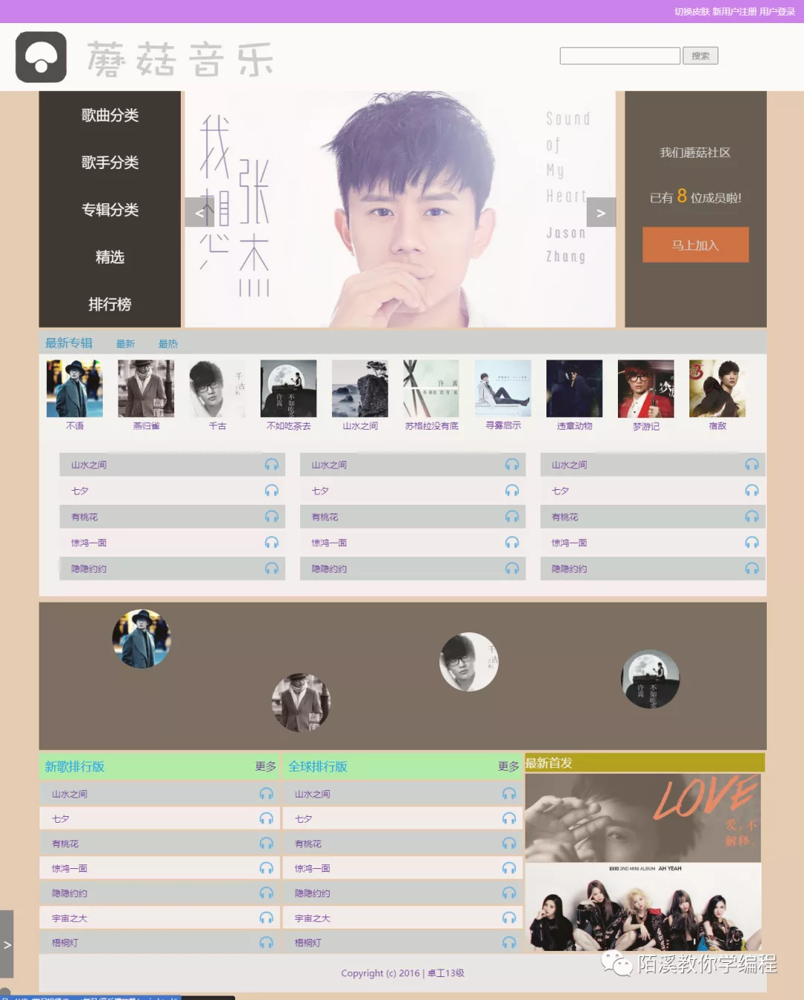

蘑菇小说，也是本科那会，学习完 **Android** 开发后制作的，里面也集成了很多东西，比如 **机器人聊天**、**自动翻页**、**听书**、**机器人客服聊天**的功能。那会还拿着去参加比赛，获得了一个不错的成绩~

回到正题，为什么会叫 **蘑菇** 呢？

因为我觉得， **蘑菇** 生长在照不到阳光的角落，没有人会在意它，但是它却依旧默默无闻、顽强的生长着。我也希望 **蘑菇博客** 也能向 **蘑菇** 一样，顽强的生长下去。

在现在的开源的 **蘑菇博客** 之前，其实还有一个版本，就是蘑菇博客的初始版本，那会是在 **2017** 年 **9** 月在维护的，使用的是 **Spring**、**SpringMVC**、**MyBatis** 和 **EasyUi** 框架，同时使用了 **Solr** 作为全文检索的工具

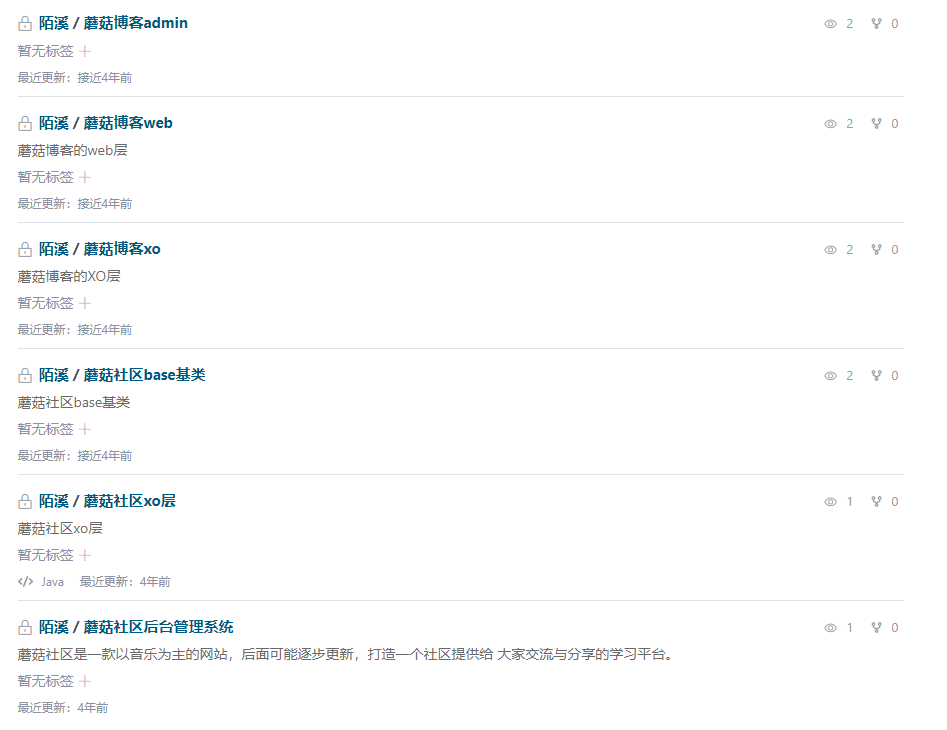

记得那会学校需要申请软著，我就找到了它，改了改拿去申请软著了~，大概的样子应该是下面这样的

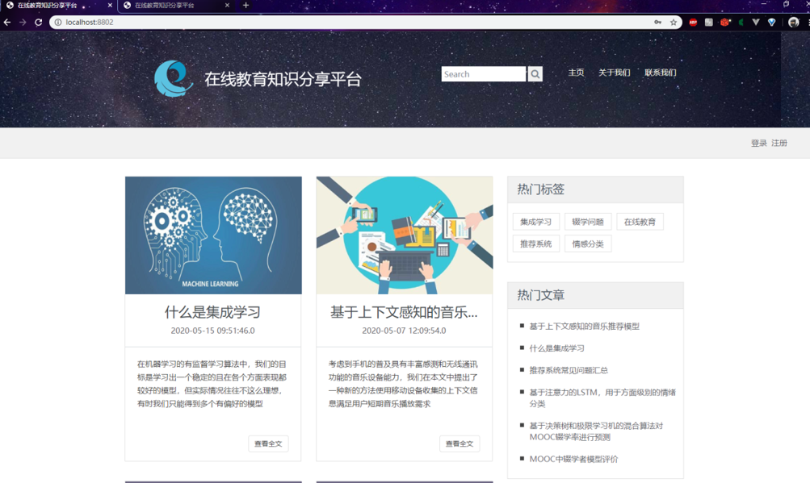

后台用的 **EasyUI** 写的，在现在被 **ElementUI** 和 **Antd** 的冲击下，看着似乎不这么好看了。

后面因为打算去准备考研的事情了，所以也就没有在维护了

**2017** 年 **10** 月 ~ **2017**年 **12** 月，开始封闭式的考研复习中。。。

考完研后，又去了北京找工作，在新的公司，组长让我们学习了 **微信小程序**、**Vue**、**ElementUI**、**SpringBoot** 这些新的技术，对我的帮助也很大。

所以，在读研后的第一天，就创建了开源项目 **蘑菇博客**，细心的小伙伴可能会发现，蘑菇博客的项目名是 **mogu_blog_v2**，其实就是为了纪念上面那个不曾被大家了解过的初代蘑菇。

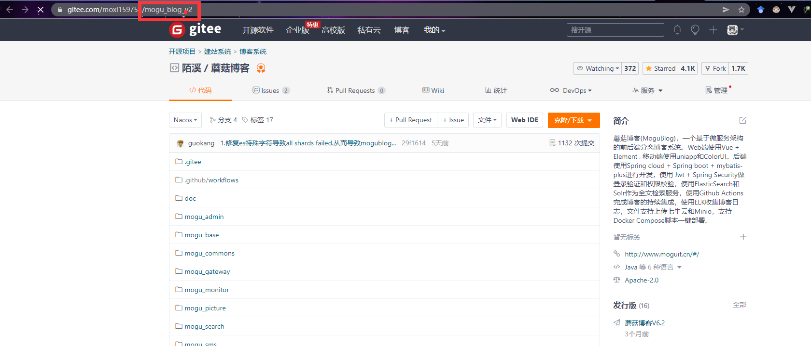

在 **2018** 年的时候，通过 **码云** 和 **Github** 搜索发现，现在挺多是 **SSM** 或者 **SSH** 的博客管理系统，最开始的搭建 **蘑菇博客** 的初心是为了巩固和学习 **Java** 开发的一些知识，因此项目的技术选型都是比较新颖的技术。

所以采用 **SpringBoot** + **SpringCloud** + **Vue** 的微服务架构进行尝试项目的构建。后面，学习到的技术越来越多，蘑菇的架构图就变成了下面这样了~

> 一个基于微服务架构的前后端分离博客系统。Web端使用Vue + Element , 移动端使用uniapp和ColorUI。后端使用Spring cloud + Spring boot + mybatis-plus进行开发，使用 Jwt + Spring Security做登录验证和权限校验，使用ElasticSearch和Solr作为全文检索服务，使用Github Actions完成博客的持续集成，使用ELK收集博客日志，文件支持上传七牛云和Minio，支持Docker Compose脚本一键部署

当然，里面很多功能可能只是**为了满足自己的学习需求**而引入的，大家可以**根据自己服务器配置来选择启动的服务**，因此蘑菇博客最开始的定位，就是一个非常好的 **SpringBoot**、**SpringCloud**以及 **Vue** 技术的入门学习项目。

可能这些技术并不一定适用于**博客**系统，但是我也想着能尽可能把更多的技术融合进来，毕竟通过自己手把手的操作一遍，也能够算是入门了。同时在陌溪的个人公众号中，也介绍蘑菇博客技术上的很多实现细节，来帮助各位小伙伴们，能够从蘑菇中受益。

当然，我这么做也被很多小伙伴喷过

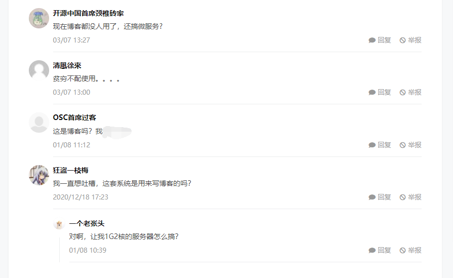

也被很多小伙伴称赞过

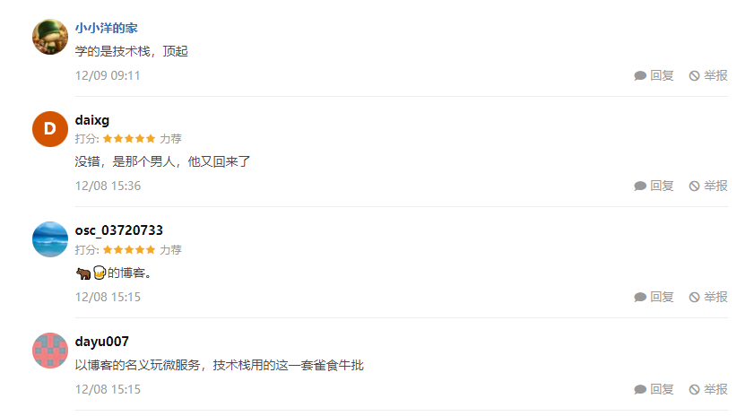

我也很庆幸我成功将自己的项目开源出来了，并且坚持下来，蘑菇博客起源是 **2018** 年9月，到想在也已经度过了 **3** 年岁月的岁月。

刚开始觉得往 **Gitee** 上提交一些自己写的代码，点亮小绿点是很酷酷的事情，所以每天即使在忙也会花上一些些时间去处理蘑菇里的问题，收获了星星点点的 **Star** 觉得很开心。

回顾在校的这几年，每天也会在项目中，花费一些时间去提交代码，可能有的时候是增加了新功能，有的时候是解决一个 **BUG**，到现在已经成为了一个习惯了。因此博客项目中也添加了比较多的有趣的功能，比如这个文章贡献度。

哈哈哈，其实它和码云上的代码贡献度是一样的，每次发表一篇博客，就会标记出个点，点越大说明该天发表博客越多，可能是因为自己有些强迫症的原因，不过我也希望能够借此来激励自己养成每天写博客的习惯，通过分享自己学习到的东西，来和各位 **IT** 的前辈们共同进步。

起初，蘑菇博客开源在 **Gitee** 上，和众多的开源项目一样，并没有多少人关注，但我也并不是太在意。

每天自己也是坚持做自己的喜欢的事，有的时候是看看论文，有的时候敲敲代码，在 **2019** 年 **12** 月 **14** 日，蘑菇博客被码云推荐了，上了首页，后面陆续有一些小伙伴关注了项目，并且参与到开发中，也提供了很多 **issue**，在这里我也学习到了很多规范和功能的实现。

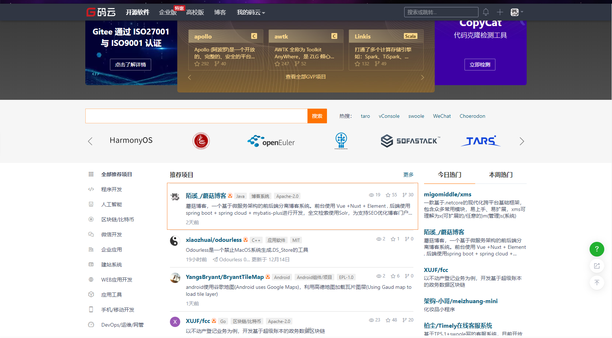

一波热榜过后，**蘑菇博客** 已经有 **300** **Stars**了，很高兴大家对蘑菇博客项目的认可

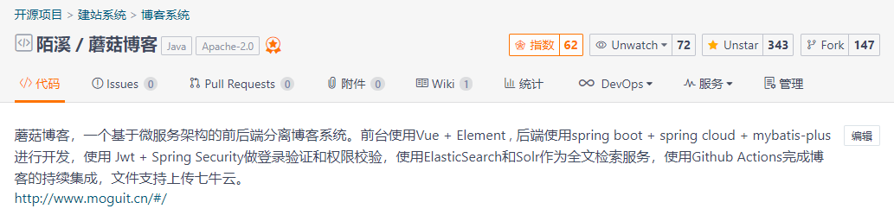

然后项目的关注度就开始上升了，有些小伙伴就开始关注项目的运行和部署了，所以陌溪在那会，也花费了一些时间，整理了博客的开发、运行、部署的文档，希望每个小伙伴都能够通过本项目一起学习。

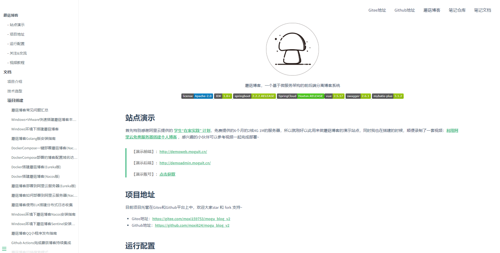

可能是因为更新比较勤快，项目也在 **2020** 年 **2** 月，成为码云 **博客**  关键字搜索的第一个。不过未来要走得路还很长，我也希望能够认识更多志同道合的小伙伴，然后一起学习和交流。

**2020** 年 **4** 月 **1** 日，愚人节，很高兴蘑菇博客已经 **500** **Stars** 了，也非常感谢群里的小伙伴，以及码云里大家提的建议，同时我也很感谢那些帮我指出项目中出现的问题并帮忙修复和改正的小伙伴，正是大家的支持才能够让我有动力把这个项目完善下去

**2020** 年 **7** 月 **28** 日，蘑菇博客成功达到 **1000** **Stars**，也完成了我之前定下的一个小目标，当然期间也非常感谢小伙伴能够提出问题，以及帮忙解决问题~，不过这也是一个新的起点，后面我还需要更加努力

截止到今天 **2021**年 **12** 月，蘑菇博客也已经有 **4.1K** **的** **Stars** 了

最后，也非常感谢各位小伙伴们对蘑菇博客所做的贡献~

在 **2021**年 **1** 月的时候，为了准备大厂的校招，开始在 **B** 站进行学习，然后把平时的学习笔记整理出来，就有了开源的 **LearningNotes项目** (学习笔记，记录平时的博客)，到现在也收获了 **4.5K** **Star**

为了方便小伙伴们在手机和电脑上阅读，陌溪把这份开源学习笔记以及收集的面试题，都整理成了 **PDF** 文件，下面是笔记和面试题的一部分预览图。

包括了 **Java** 基础、**JUC**、**JVM**、**Redis**、微服务、分布式事务等，面试常考的题目。

面试宝典

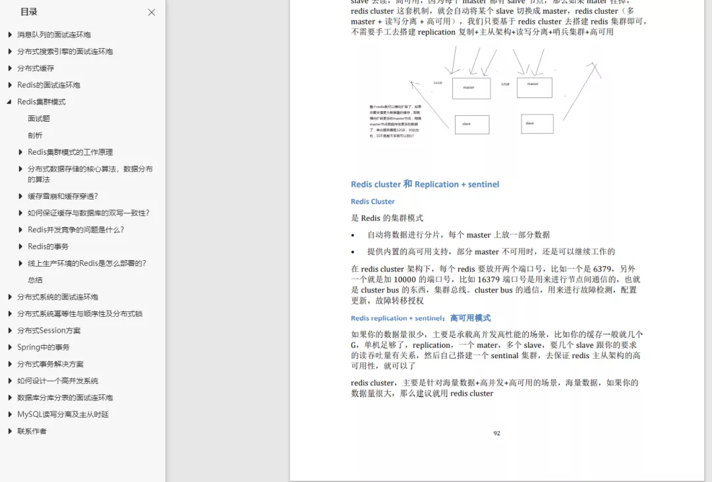如果是想刷题找工作的小伙伴，一定不要错过！点击下方关注陌溪的公众号，回复关键字【**PDF**】，就能获取到陌溪精心整理的 **PDF** 学习笔记。

同时，开源的两个项目，也让我获得了码云的两个奖杯

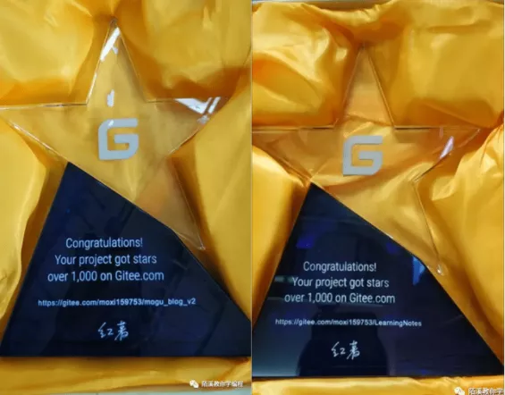

至于蘑菇的 **Logo**，是怎么来的，也有很多小伙伴问到我。

其实是之前一位老学长帮忙做的，当初学长找上我，让我能不能帮他做一个 **恋爱养成** 小程序，大概的一些 **UI** 原型图就是这样的

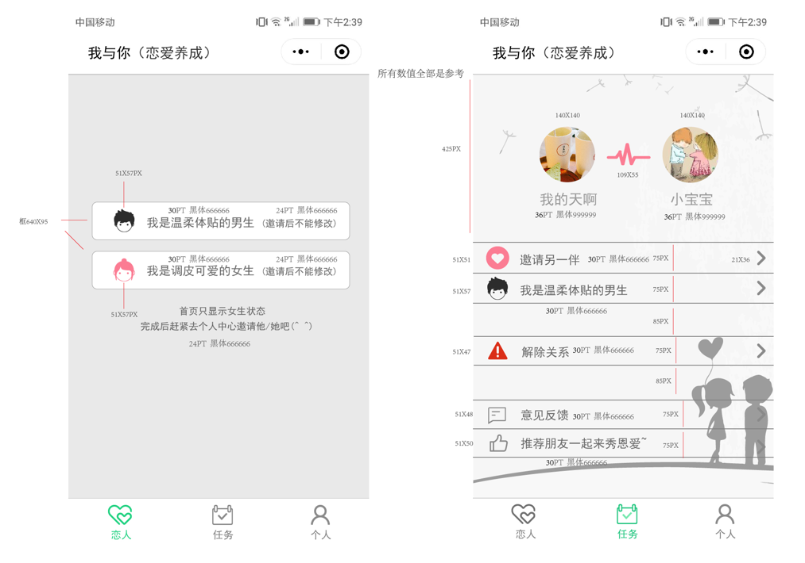

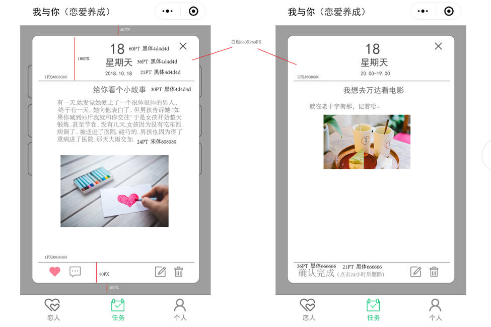

陌溪主要是负责小程序的开发，然后另外一个小伙伴做的是后台

> 为啥陌溪一直做前台？因为其它人都不会。。，

最后，陌溪叫老学长帮忙，给蘑菇设计了两个 **Logo**，也就是现在大家熟悉的两个了。

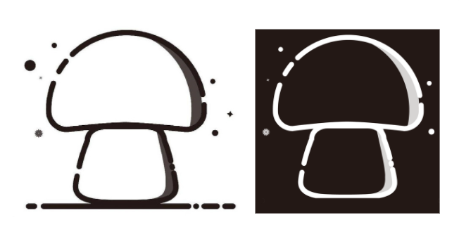

最近，蘑菇博客也在参与了 **Gitee** 组织的开源项目的评选，小伙伴们快动动手指，给 **蘑菇博客**（搜索：MoguBlog ）投上自己宝贵的一票～

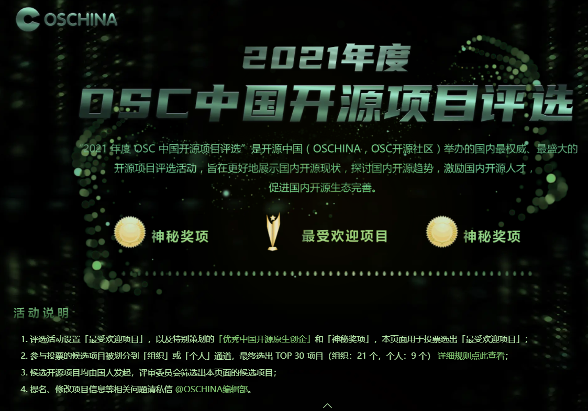

投票地址如下，欢迎小伙伴们扫码给蘑菇投上宝贵的一票~，【ps：要是出现二维码，欢迎截图分享给陌溪，这样蘑菇就可以再得一票】

> 在线投票地址：https://www.oschina.net/project/top_cn_2021/?id=618

本期就到这里啦，感谢各位小伙伴的支持~

我是陌溪，我们下期再见~