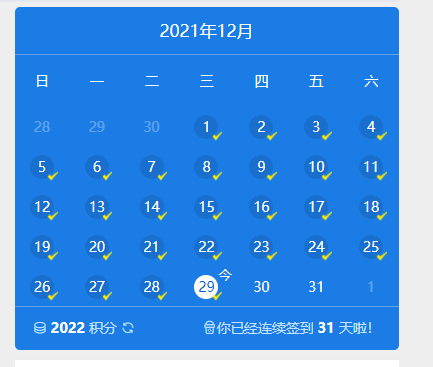
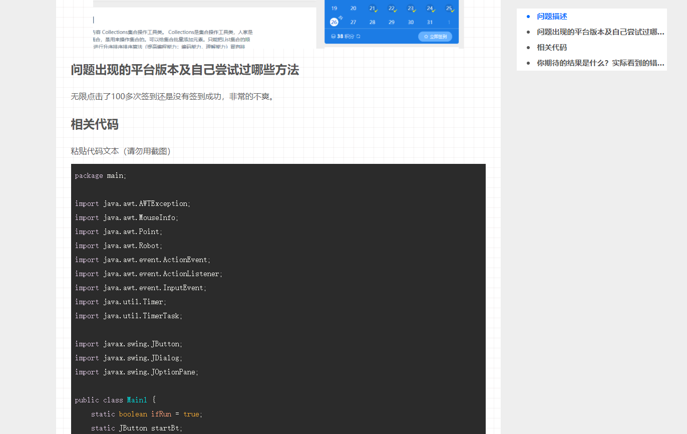

大家好，我是**陌溪**

最近，我和遇见在蘑菇上线了签到模块，让各位小伙们一起打卡参与社区的建设~



但是，在 **2021** 年 **12**月 **26** 日，蘑菇群里的小伙伴反馈签到成功，但是当日显示未签到，签到积分也正常发放了。


在蘑菇问答，也有小伙伴发帖求助


甚至还写了连续签到脚本，暴力签到 **100** 次（现在已经加了一个防表单重复提交的校验了~），但都是出现这个问题。



看到这里心里一咯噔。于是去用户签到表中查询了 当前签到日期为 **'2021-12-26'**  的记录，一条都没有。 完犊子了，没签到成功，积分也给了。这群小伙伴补偿他们积分没事，扣积分还得了！

## 问题查找

于是也去签到（试试趁着 **BUG** 多蹭积分），发现第一次签到会提示签到成功，就如上图所看到的那样，但是立即签到按钮没有变灰，用户还可以继续点击签到。

第二次签到会报数据库唯一索引异常，这里唯一索引是：使用  **用户uid** 与 **签到天** 组合的唯一索引，在记录上隔绝了**一天多签**。把出现的错误信息，复制到文本上。

```lua
### Error updating database. Cause: java.sql.SQLIntegrityConstraintViolationException: Duplicate entry '8fdd1507815ddbe47319a2eaae9f2d43-2022-12-26' for key 't_sign_in_record.user_uid&sign_date' ### The error may exist in com/moxi/mogublog/xo/mapper/SignInRecordMapper.java (best guess) ### The error may involve com.moxi.mogublog.xo.mapper.SignInRecordMapper.insert-Inline ### The error occurred while setting parameters ### SQL: INSERT INTO t_sign_in_record ( uid, user_uid, sign_date, sign_type, status, create_time, update_time ) VALUES ( ?, ?, ?, ?, ?, ?, ? ) ### Cause: java.sql.SQLIntegrityConstraintViolationException: Duplicate entry '8fdd1507815ddbe47319a2eaae9f2d43-2022-12-26' for key 't_sign_in_record.user_uid&sign_date' ; Duplicate entry '8fdd1507815ddbe47319a2eaae9f2d43-2022-12-26' for key 't_sign_in_record.user_uid&sign_date'; nested exception is java.sql.SQLIntegrityConstraintViolationException: Duplicate entry '8fdd1507815ddbe47319a2eaae9f2d43-2022-12-26' for key 't_sign_in_record.user_uid&sign_date'
```

我仔细看了下数据，首先映入我眼帘，是  **'2022-12-26'** 这一串数字  

嗯？？？ 咋肥事！！为什么时间会多 **1** 年，明明小伙伴都是在 **'2021-12-26'** 签到的，为啥到了今天就变成了 **'2022-12-26'** 呢，这块的签到逻辑代码之前一直都是稳定运行的。

然后，又去查找 **2022-12-26** 签到记录。好家伙，小伙伴们的签到记录都在 **2022** 年了。实现了提前一年的签到任务。


既然是时间问题。那么翻查下代码，看到了如下代码，感觉毫无违和感。

```java
  public String today(){
        SimpleDateFormat simpleDateFormat = new SimpleDateFormat("YYYY-MM-dd");
        Calendar now = Calendar.getInstance();
        return simpleDateFormat.format(now.getTime());
    }

    public String yesterday(){
        SimpleDateFormat simpleDateFormat = new SimpleDateFormat("YYYY-MM-dd");
        Calendar now = Calendar.getInstance();
        now.add(Calendar.DAY_OF_MONTH, -1);
        return simpleDateFormat.format(now.getTime());
    }
```

于是通过 **main** 函数运行了一下代码，时间居然返回的是 **today** 居然是 **2022-12-26**！！

## 问题修复

至此，找到了签到不显示已签到且重复签到报错的问题。

将 **"YYYY-MM-dd"** 改为 **"yyyy-MM-dd"** ，运行恢复正常，输出为  **2021-12-26**

同时，编写SQL，将用户 **'2022-12-26'** 签到日期，批量更新为  **'2021-12-26'** 即可。

```sql
update t_sign_in_record set sign_date = '2021-12-26' where sign_date = '2022-12-26'
```

## 问题讨论

那么问题来啦，为啥 **2021** 年 **12** 月 **26** 号签到，就会出现问题呢？？

查阅了一下官方的 **JDK** 的 **SimpleDateFormat** 格式化方法 ，自 **JDK7** 以后 新增了格式  **Y**

文档：https://tool.oschina.net/apidocs/apidoc?api=jdk_7u4

| Letter | Date or Time Component | Presentation | Examples |
| ------ | ---------------------- | ------------ | -------- |
| y      | Year                   | Year         | 1996; 96 |
| Y      | Week year              | Year         | 2009; 09 |

但是文档中并没有给与 **Y** 的实际用法，所以我做了以下一些测试

```java
   public static void main(String[] args) {
        SimpleDateFormat sdf1 = new SimpleDateFormat("yyyy-MM-dd");
        System.out.println(sdf1.format(new Date()));
        SimpleDateFormat sdf2 = new SimpleDateFormat("YYYY-MM-dd");
        System.out.println(sdf2.format(new Date()));

        Calendar calendar2= Calendar.getInstance();
        //2021-12-25
        calendar2.set(2021, Calendar.DECEMBER, 25);
        Date strDate2 = calendar2.getTime();
        Calendar calendar1 = Calendar.getInstance();
        //2021-12-26
        calendar1.set(2021, Calendar.DECEMBER, 26);
        Date strDate1 = calendar1.getTime();
        Calendar calendar3 = Calendar.getInstance();
        //2021-12-31
        calendar3.set(2021, Calendar.DECEMBER, 31);
        Date strDate3 = calendar3.getTime();

        Calendar calendar4 = Calendar.getInstance();
        //2021-12-31
        calendar4.set(2022, Calendar.JANUARY, 1);
        Date strDate4 = calendar4.getTime();

        System.out.println(sdf2.format(strDate2));
        System.out.println(sdf2.format(strDate1));
        System.out.println(sdf2.format(strDate3));
        System.out.println(sdf2.format(strDate4));
    }
2021-12-26
2022-12-26
2021-12-25
2022-12-26
2022-12-31
2022-01-01
```

上述测试中返回的 **2022** 年的日期均是在**跨年周**。也就是说 **2021** 年 **12** 月 **26** 号刚好是周日，属于跨年周的第一天。那么到明年的第一天之前这些天的时间，如果使用 **YYYY-MM-dd** 时间都会显示为明年。

**YYYY**，**week-based year** 是 **ISO 8601** 规定的。**2021-12 -26** 号这一天，按周算年份已经属于 **2022** 年了，格式化之后就变成 **2022** 年，后面的月份日期不变。

## 总结

**YYYY-MM-dd** 和 **yyyy-MM-dd** 的区别目前出现只在跨年周才会有问题。很有可能是 **YYYY** 的用法不应该在这种格式化场景。所以如果正常开发，后端还是使用 **yyyy-MM-dd**。**YYYY** 的业务场景到现在我也没想到，如果有了解的小伙伴也欢迎一起来探讨~

