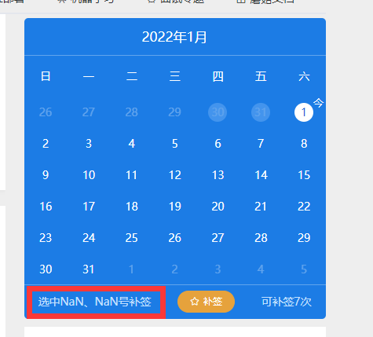
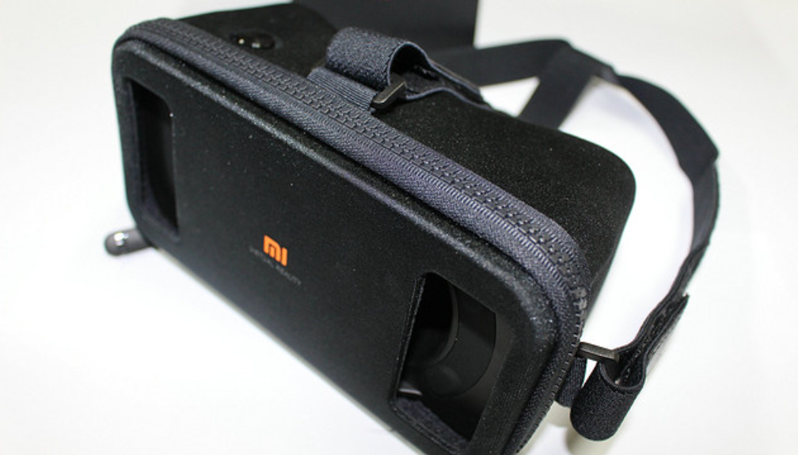
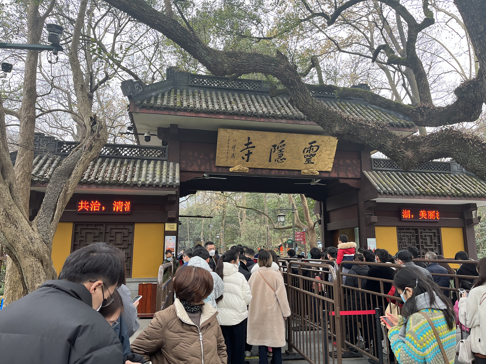
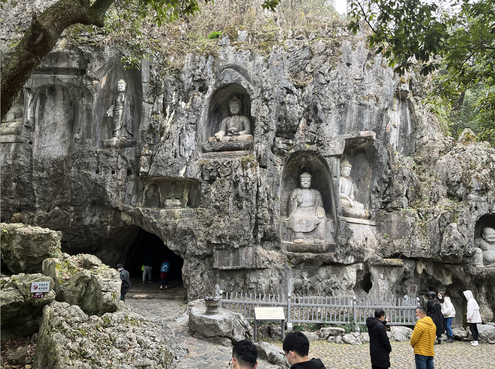
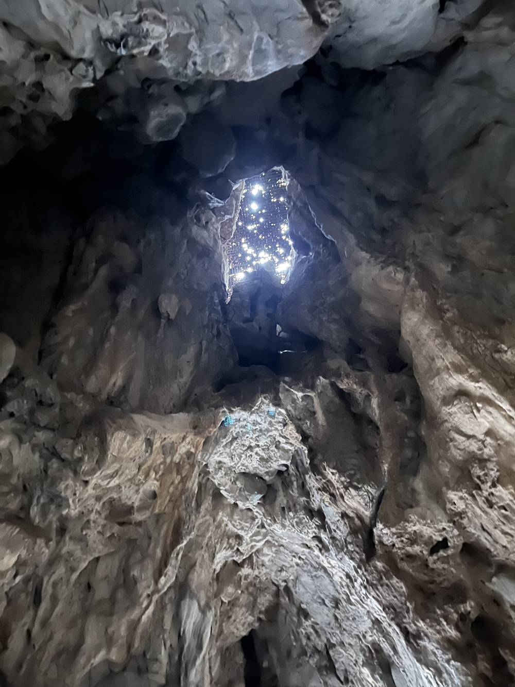
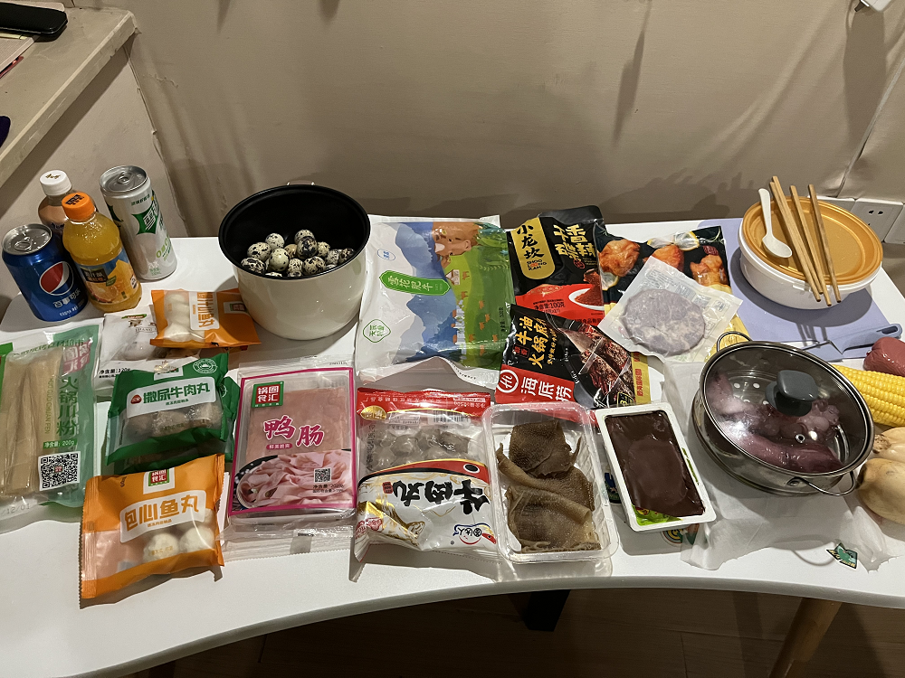

大家好，我是**陌溪**

在 **2022** 新的一年里，陌溪祝福大家都升职加薪，少写 **BUG** ~

虽然，今天群里的小伙伴，反馈到蘑菇签到，又又又出问题啦！（别骂了，下次我也一定会少写 **BUG** 的。。）

这个问题是前端没有限制补签而造成的，小伙伴别催了，明天一定改~

**2021 **年的跨年，不知道各位小伙伴们是怎么过的呢~ 

陌溪是和女朋友一起出去压马路的

回来的时候，刚好是零点多，参与了一波字节商城的 **Pico** 半价内购活动，买了一台 **Pico Neo VR** 设备~

说起 **Pico** 可能大家还不是不太清楚，它是国内一家专注移动虚拟现实技术与产品研发的科技公司，致力于打造全球领先的移动 **VR**（虚拟现实）硬件及内容平台，目前在国内的基本上已经是一家 头部的 **VR** 厂商。

**2021** 年 **8** 月，字节跳动收购了 **Pico** ，将被并入字节 **VR** 相关业务线，准备进军 **元宇宙** ~

本次，**Pico** 在 **2022** 年在字节商城开启半价内购活动。凡是在字节商城购买 **Pico Neo3先锋版**，即可享受半价优惠，每人限购两台。

- 原价 **2699** 元的 **Pico Neo3 6+128** 版本，内购价是 **1350** 元

- 原价 2999 元的 **Pico Neo3 6+128** 版本，内购价是 **1499** 元

想想买来锻炼还是挺香的（希望不会头晕），就直接买了一套顶配的 **256G** 版本

记得原来 **16** 年的时候，就买过一个小米 **VR** 眼镜玩具版，那会觉得挺新奇的，放上自己的手机，就能看一些 **VR** 的电影（不过那会画质不行，玩法单一，玩了没多久就丢一旁了，主要是晕到不行~）

而 **Pico** 是对标国外的 **VR** 装备的，记得陌溪原来看过 **HTC** 有过一个拖着线，还得部署幕布的 **VR** 装置，感觉还差点意思，那会还特意搜索了一下价格，得好几万。。

希望这次 **Pico** 能给我带来一次不错的 **VR** 体验~（真是，字节赚钱字节花，一分也别想带回家）

等回头到手后开箱体验一波，在给大家讲讲感受吧~

来杭州这么久，感觉除了西湖，其它景点就没怎么去过

今天来到了灵隐寺游玩，灵隐景区位于浙江省杭州西湖风景名胜区西部的山峰之间，是比较著名的佛教胜地~

不过，不得不吐槽今天的交通了，坐上公交车，在路上堵了一个多小时，最后半路下车，直接走路爬上去的 

灵隐寺其实是由两个景区组成的，分别是 **飞来峰** 和 **灵隐寺**，飞来峰的门票价格是 **45** 元，灵隐寺是 **30** 元的香火券。

因为灵隐寺是在飞来峰景区里，所以如果想要去灵隐寺里的话，需要花 **45 + 30**  = **75** 元。

陌溪之前因为刚来杭州，领取了这边的青年大礼包，所以里面包含了一张**公园年卡**，里面就包含了 **灵隐飞来峰**，所以直接扫码就可以景区（白嫖真舒服~）

> 如果刚毕业来杭州的小伙伴，还不知道这个福利的，快快看 [这篇文章](https://mp.weixin.qq.com/s/yhlZKqnc1ihdWg2W5YnGcw) 哟

飞来峰龙泓洞口有理公塔，是杭州现存唯一的明塔，用石块砌成，六面六层

在玉乳洞深处有一石径可通往龙泓洞，又名通天洞，洞口上面就是石刻造像

洞内壁上有一尊天冠观音，是观音造像中难得见到的一尊

在通天洞内，举首可在石隙中见到一线天光（估计因为风化的关系，这一线天感觉已经变得这么大了。。23333）

从一线天出来后，就到了冷泉，里面游着挺多的观赏鲤鱼，在对面也是一尊尊佛像，据说在飞来峰拥有 **335** 尊保留比较完整的。

在众多的佛像中，找到最熟悉的一个 **弥勒佛**，希望大家在 **2022** 年，也能笑口常开~

太久没有爬山锻炼了，爬上飞来峰山顶都要累得不行了~

爬完山后，就准备回家了，经历过上午坐车的痛苦，下午骑行了1个多小时到家

辛苦了一天，当然少不了一顿火锅来犒劳自己（一天运动白锻炼了~）

好了，本期就到这里啦，大家新年快乐哟~

我是陌溪，我们下期再见~

