大家好，我是**陌溪**

最近，**BootCDN** 可谓是问题多多，这不这两天加载 **CSS**、**JS** 文件就需要花费 **20** 秒

直接导致蘑菇打开缓慢，导致群友无法愉快的进行网上冲浪，疯狂在蘑菇圈进行吐槽~

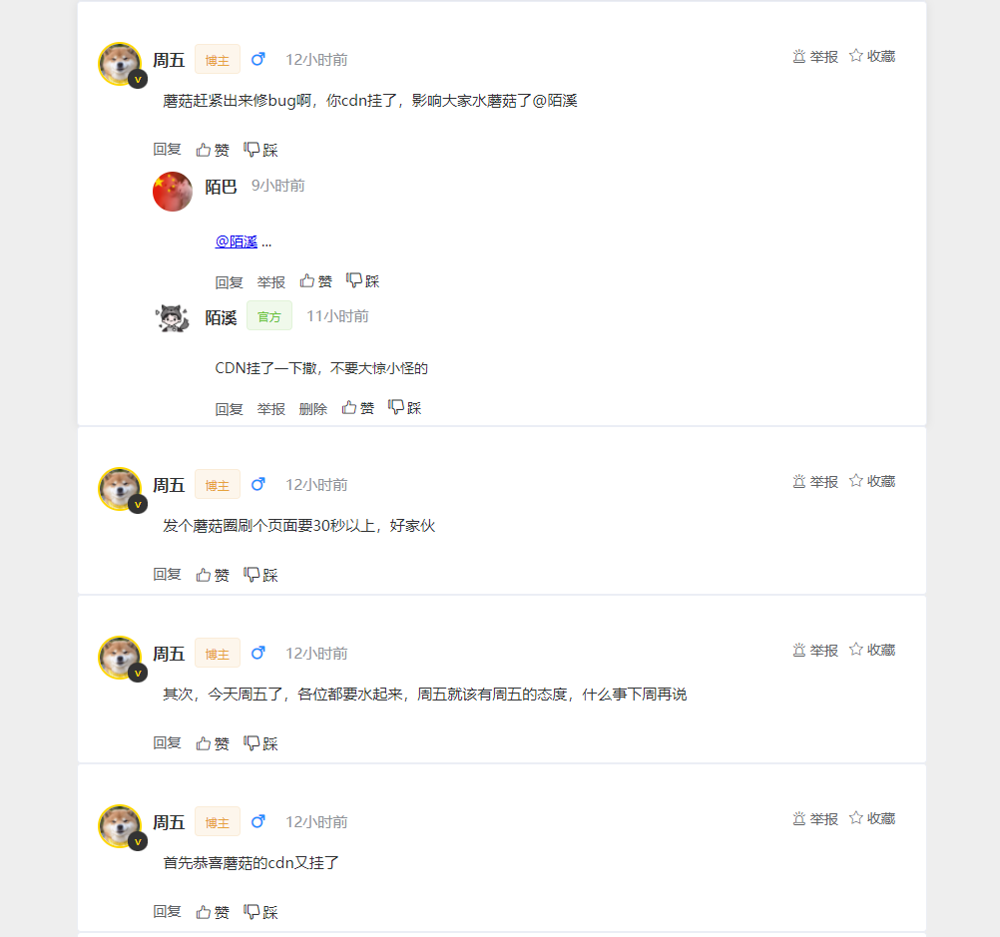

目前陌溪想到了两种解决方法

## 本地CDN

虽然上次 [刚过了个年蘑菇就崩了](https://mp.weixin.qq.com/s/Hz-gkwhv21QDu160IvRfnA) 已经对 **CDN** 进行了一些改造，不过改的不彻底，这次打算把所有的 **CSS** 和 **JS** 都拉到本地


首先，分别找出 **index.html** 下的 **CDN** 域名

```bash
https://cdn.bootcdn.net/ajax/libs/element-ui/2.15.6/theme-chalk/index.css
https://cdn.bootcdn.net/ajax/libs/vue/2.5.17/vue.js
https://cdn.bootcdn.net/ajax/libs/element-ui/2.15.6/index.js
https://cdn.bootcdn.net/ajax/libs/ckeditor/4.15.1/ckeditor.js
https://cdn.bootcdn.net/ajax/libs/showdown/1.9.1/showdown.min.js
https://cdn.bootcdn.net/ajax/libs/turndown/6.0.0/turndown.min.js
https://cdn.jsdelivr.net/npm/vditor/dist/index.css
https://cdn.jsdelivr.net/npm/vditor/dist/index.min.js
https://cdn.bootcdn.net/ajax/libs/social-share.js/1.0.9/css/share.min.css
https://cdn.bootcdn.net/ajax/libs/highlight.js/11.0.0-alpha1/styles/a11y-dark.min.css
https://cdn.bootcdn.net/ajax/libs/highlight.js/11.0.0-alpha1/highlight.min.js
...
```

然后在浏览器中打开，复制其内容

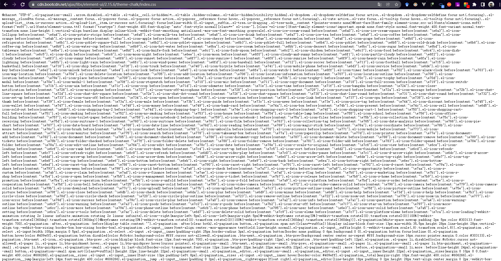

在 **static** 文件夹中，创建 **cdn** 文件夹，然后把每个 **CDN** 文件内容，分别保存到该文件夹中

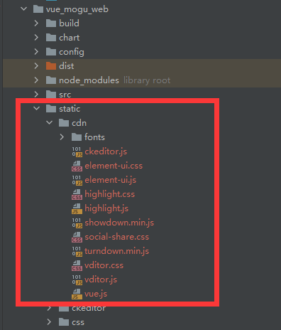

同时由于 **element ui** 的 **css** 文件，还会引入两个相对目录的文件


如果没有引入的话，会无法正常显示图标库

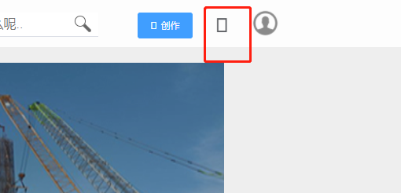

这个两个文件在那里可以找到呢？这个时候就可以打开 **element ui** 的 **Github** 地址了

```bash
https://github.com/ElementUI/theme-chalk
```

然后进入到 **theme-chalk/lib/fonts** 目录下，下载下面两个文件


然后在 **static/cdn** 中，创建 **fonts** 文件夹，把两个文件拷贝进行即可

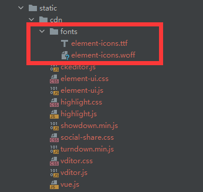

在所有操作完成后，然后替换成相对路径即可~

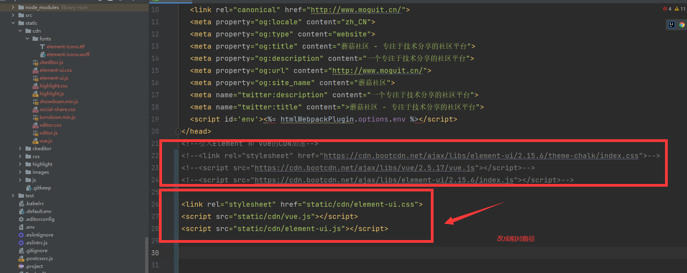

这个时候，网站就会应用本地的 **CSS** 和 **JS** 文件了，再也不怕网站宕机打不开了


## 七牛云搭建CDN

上面的方法，虽然解决了 **CDN** 宕机导致网站打不开的问题，但是因为样式文件存储在自己的服务器上，而且这几个文件就有 **2M** 了

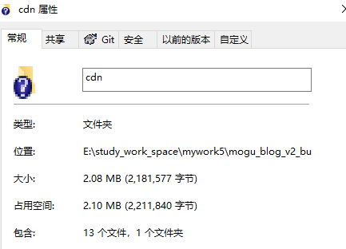

有不少的蘑菇小伙伴的带宽只有 **1M** 的话，那么可能光下载这几个文件就要花费近 **20** 秒了！

那这样的话，我们这次改造就没有什么意义了？

本着白嫖的原则，让小伙伴们少花钱的方式，陌溪想到了通过白嫖七牛云的免费 **10G** 存储空间，来搭建蘑菇的 **CDN**

> 七牛云地址：https://s.qiniu.com/Q7fma2


注册完成后，应该需要进行实名认证，通过后就可以开始使用免费的存储空间了~

首先需要选择对象存储，然后选择空间管理

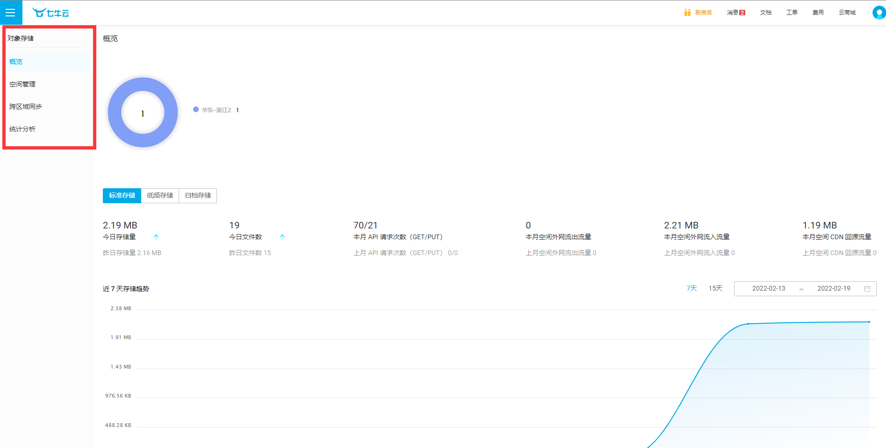

创建一个属于自己的空间，填写空间名称、存储区域 和 访问控制（记得选公开）


填写完成后，就可以开始上传文件了。在上传文件前，如果有备案的域名的话，也可以绑定自定义的域名


然后选择绑定域名，然后填写自己的二级域名，比如蘑菇的是：**cdn.moguit.cn**，然后点击创建


创建成功后，我们需要去配置域名解析，首先需要复制这个 **CNAME** 的值


然后到阿里云的域名，新增一条解析记录

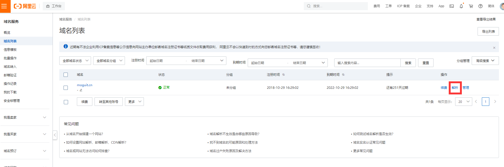

选择类型为 **CNAME**，即指向另外一个域名

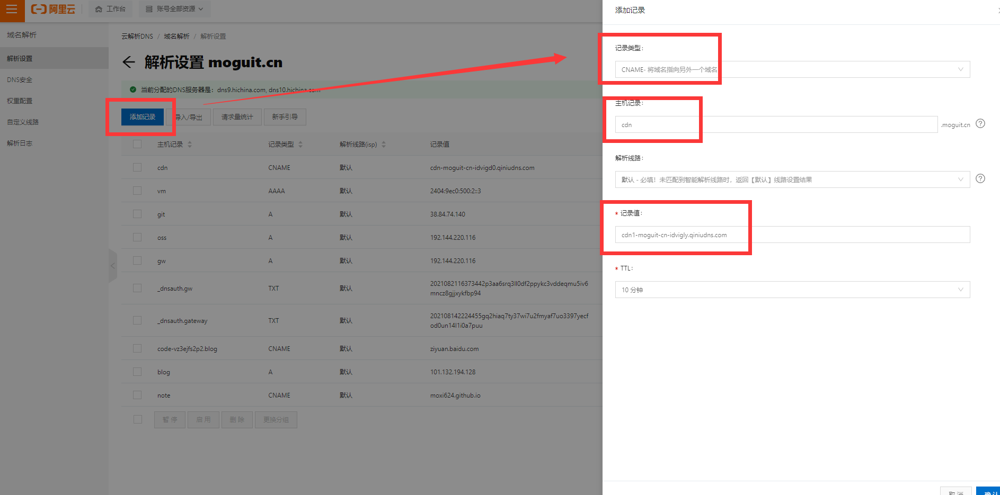

创建成功后，回到七牛云，等待一段时间后，如果显示成功，即表示域名配置成功


然后在下方的外链域名，就会显示自己刚刚绑定的域名了

当然如果没有域名的话，也可以使用下方默认的域名，不过默认的域名只有一个月的有效期，失效后需要进行修改，这个会有些麻烦


上述操作都完成后，我们可以创建 **cdn** 文件夹，然后把刚刚的 **static/cdn** 文件都上传到 **cdn** 文件夹里


文件文件上传完成后，点击查看详情页，就可以看到我们在七牛云下的地址了，复制到这个文件

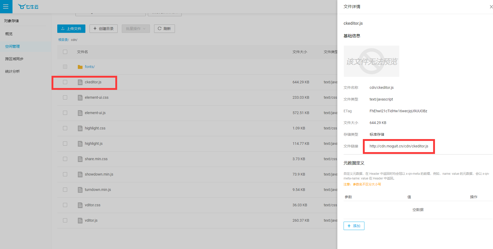

最后把原来路径，替换成 **cdn.moguit.cn** 即可，自建的蘑菇 **cdn** 大功告成~

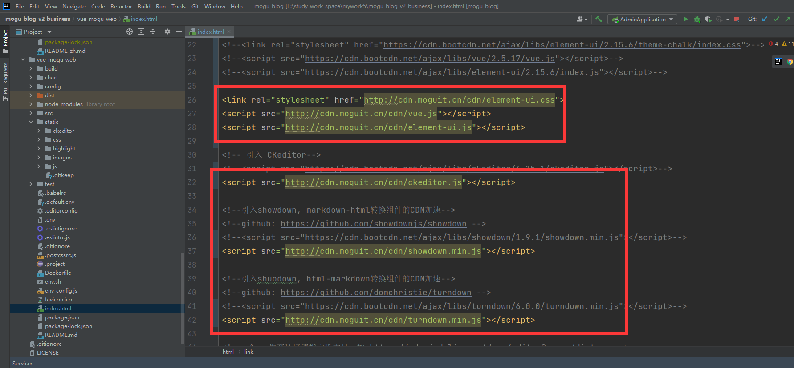

最后重启，完美运行 **prefect** ~

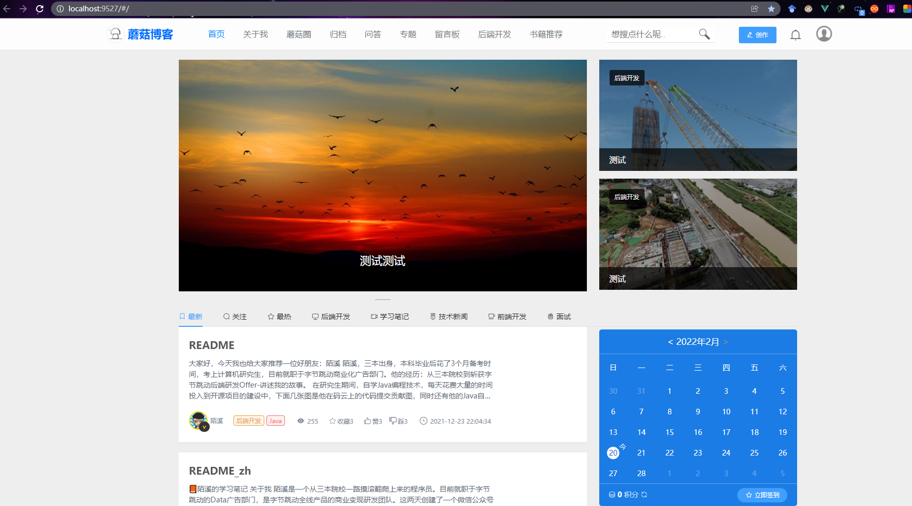

最后部署上线，通过 F12再看看每个 **js** 文件加载的速度，只用 **20 ms** 就加载完成一个，打开速度很快~

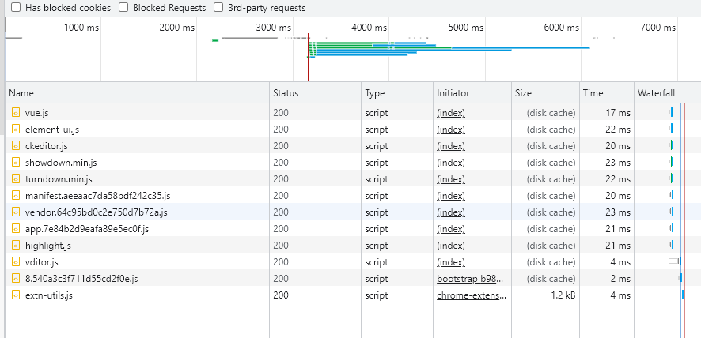

 好了，本期的蘑菇 **CDN** 改造就到这里了

我是陌溪，我们下期再见~