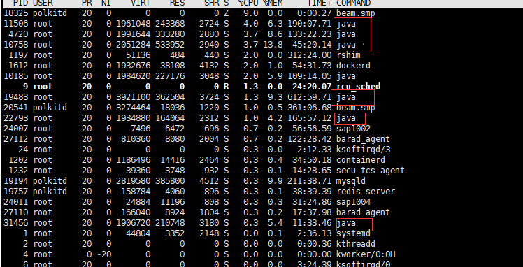
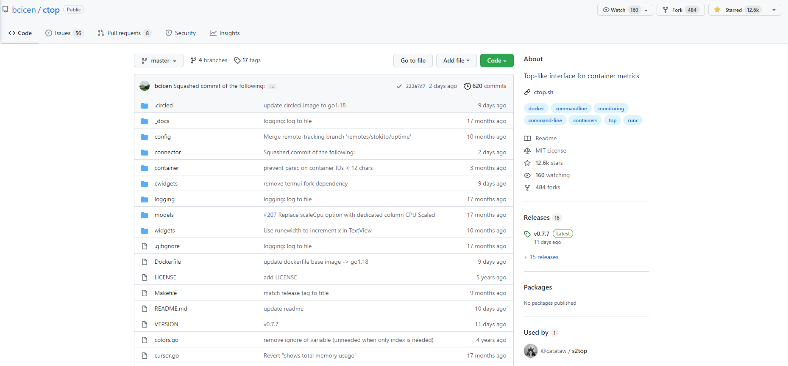
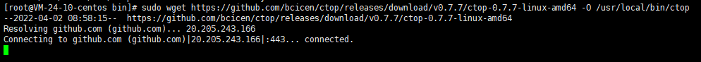
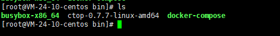
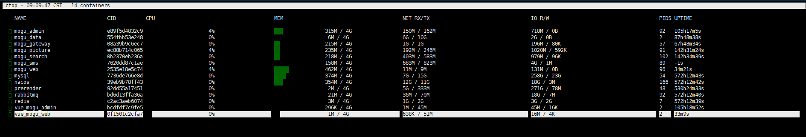
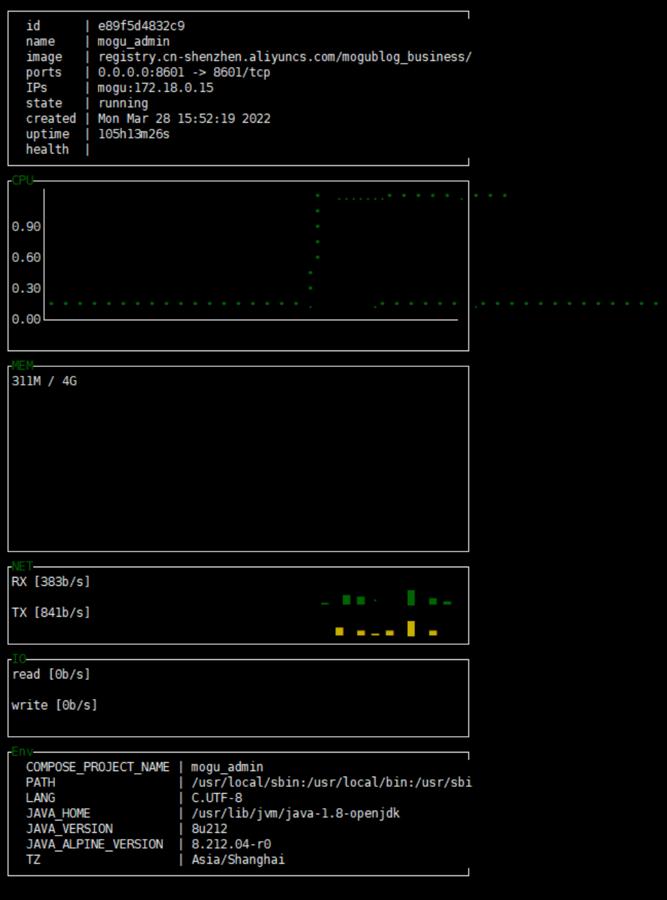
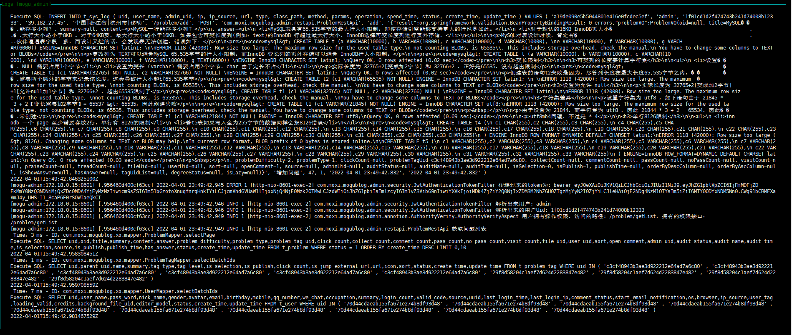
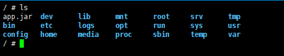

大家好，我是 **陌溪**

最近，蘑菇被一群热心的群友关照，导致网站出现卡顿，宕机的情况，为了查看具体原因，需要使用命令进行排查

我们都知道，在 **Linux** 系统下，可以通过 **top** 命令进行性能分析，能够实时显示各个进程下资源的占有状况，类似于 **Windows** 的任务管理器。


但是，蘑菇博客都是部署在 **Docker** 容器里的，每个微服务服务都是一个 **Java** 程序



所以，用 **top** 命令没有办法到底是哪个服务了，因为每个服务都叫 **Java**


为了解决这个困惑，陌溪在网上冲浪的时候，发现了一款容器监视器 **ctop**，


**ctop** 用于提供系统中运行的容器的实时指标的简明概述，`ctop` 内置对 **Docker** 和 **runC** 的支持；其他容器和集群系统的连接器计划在未来发布。

> Github：https://github.com/bcicen/ctop



下面我们从官网上的示例，看看 **ctop** 命令运行后的效果


## 安装 ctop

**ctop** 提供了多种平台上的安装方式，因为蘑菇是部署在 **CentOS 7.6** 的系统上的，因此这里就使用 **Linux** 的安装方式，更多安装方式可以去官网查看~

首先，需要把官方打包的 **ctop** 最新的 **release** 发行版进行下载，放到 **/usr/local/bin** 目录下，然后分配执行权限

```bash
sudo wget https://github.com/bcicen/ctop/releases/download/v0.7.7/ctop-0.7.7-linux-amd64 -O /usr/local/bin/ctop
sudo chmod +x /usr/local/bin/ctop
```

如果，你的网速也和陌溪家里的一样，在这里卡了半天了，没动静（或许重新执行一次又行了）



那么，也可以自己去 **release** 页面，下载对应版本的包

> 发行页：https://github.com/bcicen/ctop/releases/tag/v0.7.7


然后再给把下载的文件通过 **xftp** 丢到 **/user/local/bin** 目录下



最后改个名，加个权限即可

```BASH
 mv ctop-0.7.7-linux-amd64  ctop
 sudo chmod +x /usr/local/bin/ctop
```

然后直接运行 **ctop** 命令即可，可以看到每个容器运行占用的 **CPU**、**内存**、**网卡流量**、**磁盘IO** 都一目了了



同时，我们可以移动到你想查看的容器上，按下**回车键**


这个时候，就左上角就会出现容器菜单，我们可以分别查看一下这几个命令的用法

- **Single View**：容器的单视图页面，能够详细的看到容器运行的**镜像**、**端口**、**容器环境**，以及实时的 **CPU**、**内存**、**网络**、**磁盘** 等信息



- **log view**：日志视图，通过这个命令就可以非常方便的看到容器内部的运行日志了，按回车键可退出

> 其实就是 docker logs 命令



- **stop**、**pause**、**restart**：分别对应的是关闭、暂停、重启容器，这里就不演示了

- **exec shell**：这个命令是进入容器的内部，在里面可以查看容器内的一些信息，通过 **exit** 命令退出

> 相当于docker 的  exec 命令



当然除了上述提到的通过图形化的方式来选择对应的功能，**ctop** 还提供了快捷键，如下所示：

| a    | 切换显示所有(运行和非运行)容器          |
| ---- | --------------------------------------- |
| f    | 筛选显示的容器                          |
| H    | 切换ctop头                              |
| h    | 打开帮助对话框                          |
| s    | 选择容器排序字段                        |
| r    | 反向容器排序顺序                        |
| o    | 打开单一视图                            |
| l    | 查看容器日志(' t '用于打开时切换时间戳) |
| e    | 进入容器内部                            |
| c    | 配置列                                  |
| S    | 将当前配置保存到文件                    |
| q    | 退出 ctop                               |

好了，本期的软件推荐就到这里了

我是陌溪，我们下期再见~