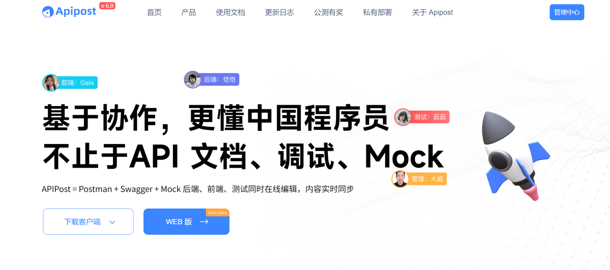
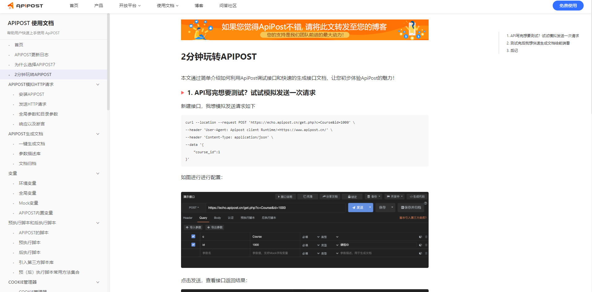
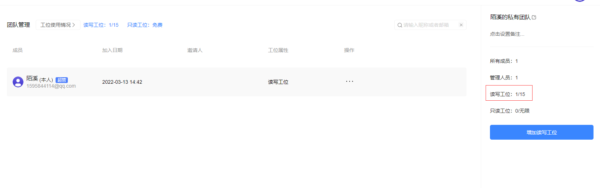

大家好，我是陌溪

记得之前为了安利小伙伴们，写过一篇关于 **ApiPost** 接口工具使用的文章：[再见Postman！一款更适合国人的接口管理工具](https://mp.weixin.qq.com/s/dcnZyVbewq7-9BCv3HiKjA)

有不少小伙伴都在自己电脑上安装上了 **ApiPost** 这款更懂国人的接口平台，然后让 **Postman** 在自己电脑吃灰了~ 

对比国外推出的 **Postman** ， **ApiPost** 有如下优点：

- 学习成本更低
- 适合国人习惯
- 快捷文档分享
- 多人实时协作

最近，**Apipost** 也进行了重磅的更新推出 **v6.0** 版本，其中最劲爆的更新，就是推出的 **WEB** 版本

> 官网：https://www.apipost.cn

陌溪在第一时间就进行了体验，**WEB** 版本的页面如下所示，可以看到页面上的功能，不说和客户端版本是差不多吧，只能说是长的一模一样~

> WEB版地址：https://beta.apipost.cn/apis?vx/mnfs

如果习惯了使用客户端版本，也可以继续下载客户端 **v6.0** 的 **beat** 版本进行体验（为了小伙伴方便对比，陌溪特意把客户端版本改成浅色模式了~）

目前，**Apipost** 客户端版本，支持在 **Windows**、**Mac** 、**Linux** 多种终端系统上进行下载使用

> 客户端下载：https://www.apipost.cn/download.html?vx/mnfs

陌溪更新后，发现整体 **UI** 界面都做了改版，比原来看起来更舒服了（ps：附上一张旧版本的图）

同时，**Apipost** 还提供了非常详细的使用文档，可以帮助小伙伴们快速的切换到 **Apipost** 的使用队伍中~

> 文档地址：https://wiki.apipost.cn/document/00091641-1e36-490d-9caf-3e47cd38bcde

下面，咱们就来一起盘一盘 **Apipost6.0** 有哪些重磅的更新吧~

首先是重磅更新，支持了 **Web** 版，在浏览器中就可以随时随地打开 **Apipost**，即用即走无需安装~

<video src="../../../支持web版.mp4"></video>

同时支持导入和导出 **Api** 接口的 **Json** 文件，你 **Postman** 中将之前写的接口进行导入，快速切换到 **Apipost** 平台上，**so easy**~

<video src="../../../导入项目.mp4"></video>

同时对返回结果支持了分屏功能，可以进行上下和左右切换~

原来只支持上下屏，因为要兼顾参数和返回，所以看起来有些难受，改版后请求和返回一目了然~

<video src="../../../左右屏幕-动图.mp4"></video>

## 项目管理

顶部的功能菜单，可以支持自定义的折叠和编辑，根据自己的需要，打造一款适合自己的趁手工具~

<video src="../../../功能收起1.mp4"></video>

同时，**Apipost** 一如既往的向个人、**15** 人以下团队、高校和培训机构完全免费试用，没有任何功能的限制

记得原来的时候，免费的读写工位比较少，只有 **2** 个，如果有好几个伙伴使用的话，可能就不方便了

而现在再次打开后，发现免费工位直接提升到了 **15** 个，也就是 **15** 人以下的小团队可以完全白嫖全部功能了，这个超级赞~

同时，本次也对协同方面做了较大的变更，能够直接邀请小伙伴参加到项目中

<video src="../../../工作台-邀请.mp4"></video>

同时，新增了项目的私有和公开，支持直接创建私有和共有项目，协同开发更加便捷~

<video src="../../../项目公开私有.mp4"></video>

同时，对于多用户协作的场景，原来当数据保存有冲突的时候，无法进行追溯

本次加入了冲突机制，可以对冲突进行查看，同时还能回溯，再也不怕协作时接口冲突了~

增加了协作日志，小伙伴们改了那些地方都一目了然~

## 接口修改

原来接口在修改后，一个个保存可能比较麻烦，本次新增了全部保存的功能，能够一键保存所有的变更接口

<video src="../../../一键保存.mp4"></video>

同时本次更新，分享的文章支持加密了，通过输入密码才能够访问到对应的文档，保证了分享文档的安全性~

<video src="../../../自动生成密码.mp4"></video>

更多的功能，欢迎小伙伴们更新最新的 **Apipost6.0** 进行体验吧 ~

最后，强烈建议开发人员，包括后端、前端、测试朋友们都试试 Apipost，尤其是对后端开发朋友来说，这款工具实在太香了！