大家好，我是 **陌溪**

最近，最近，蘑菇社区也更新了很多功能了，加入了很多社区的元素，有不少小伙伴已经不知道如何打开蘑菇了~

下面就让小伙伴们随着陌溪的步伐，一起来盘一盘蘑菇社区都更新了那些功能吧~

> 蘑菇社区:  https://www.moguit.cn

## 签到模块

首先，当然是大家熟知的 **蘑菇签到**，支持用户签到、补签、补签卡发放、连续签到 等功能

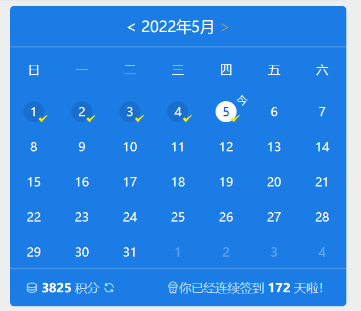

同时，**签到模块** 也是出问题最多的功能了

[群友不讲武德，编写命令来获取蘑菇积分?](https://mp.weixin.qq.com/s/W7QaVtJ4MeOEVdoF2khy3g)  热心群友为了获取连续签到，不讲码德，使用脚本来定时签到。

[官方JDK的BUG？蘑菇签到又出问题啦！](https://mp.weixin.qq.com/s/piuL_DPUn6eH9aVoK0SA2A)因为使用官方日期 **JDK** 而导致的 **BUG**，将 **"yyyy-MM-dd"** 改为  **"YYYY-MM-dd"**，从而在跨年周的时候，出现问题，导致用户直接签到在一年后。

这不，今天蘑菇签到又出问题了，因为接入了微信公众号签到，通过回调调用签到接口时，因为只能获取到 **OpenId** 来获取到用户信息，而原来的代码里会从 **HttpServletRequest** 中获取到 **UserUid**，因此无法获取用户的连续签到时间，从而导致只能获取到基础的积分

然后，就是积分排行模块，通过用户获取的积分来进行排序，目前支持显示 **Top30**

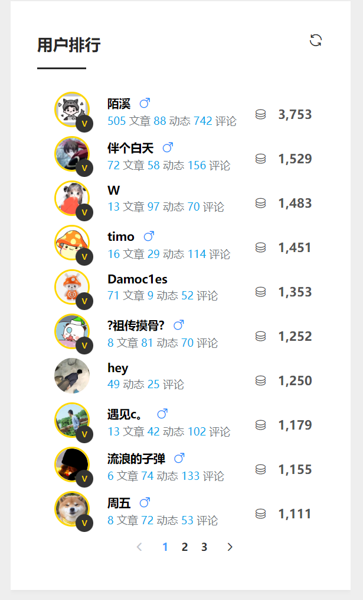

目前蘑菇排行榜主要是通过积分来进行排序的，为了鼓励大家多多参与蘑菇贡献学习，分享更多的知识到蘑菇中，同时提高蘑菇社区的活跃度，制定了下面的一些积分获取规则~

- 发表 **1** 篇博客，获得 **5** 积分，上限 **15** 积分
- 发表 **1** 条动态，获得 **2** 积分，上限 **10** 积分
- 发表 **1** 条问答，获得 **2** 积分，上限 **10** 积分
- 发表 **1** 条面经，获得 **2** 积分，上限 **10** 积分
- 发表 **1** 条评论，获得 **1** 积分，上限 **10** 积分
- 完成 **1** 次签到，获得 **5** 积分，连续签到达到 **10**、**30**、**50**、**100** 天，分别可以获取 **6**、**7**、**8**、**10** 积分

同时处于用户排行榜的用户，每周一凌晨0点，会发放补签卡，对未签到的日期可以使用补签卡进行补签，目前 **TOP10** 的同学，每周会发放 **2** 张补签卡，**Top10 ~ Top30** 的同学每周会发放 **1** 张签到卡。

最近，也有不少小伙伴在吐槽蘑菇的用户排行不太合理，说这容易导致 **强者恒强，弱者恒弱** ，也就是说有先发优势的一批人，通过原始积累的积分，从而不断的获取奖励，而造成后面入场的小伙伴永远不可能追上前面的同学了。

为了针对这个情况，陌溪也准备对用户排行榜进行改造，不再以总积分来进行奖励的发放，而是通过每周、每月活跃排行来进行排序，这样用户只需要在一段时间内进行活跃，就可以获取到奖励了~

## 课程模块

另外，也特别感谢 **ruoyi-media** 开源项目的作者：**小辉**，给蘑菇社区整合了课程模块，支持播放本地上传的视频，**B**站的视频进行播放。

>  **ruoyi-media**：https://gitee.com/tanhuihuang/ruoyi-media

目前课程模块具备的功能有：课程管理、老师管理、课程分类、课程标签

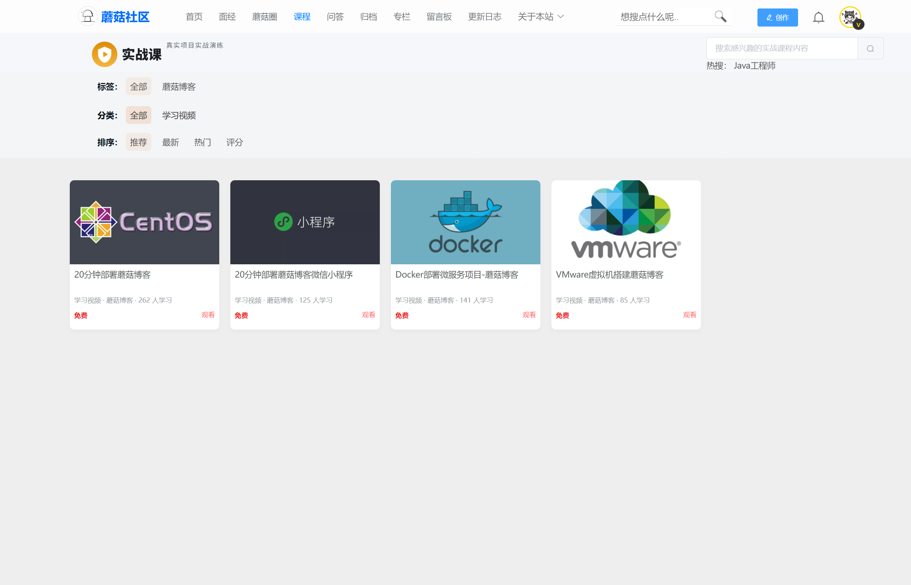

目前，蘑菇课程所展示的一些视频都是通过 **iframe** 的方式内嵌的 **B** 站播放器，内嵌的方式目前仅支持 **720P**，如果想要查看高清，可以直接点击跳转 **Bilibili** 观看。同时小伙伴们也可以在每个课程下面进行留言讨论~

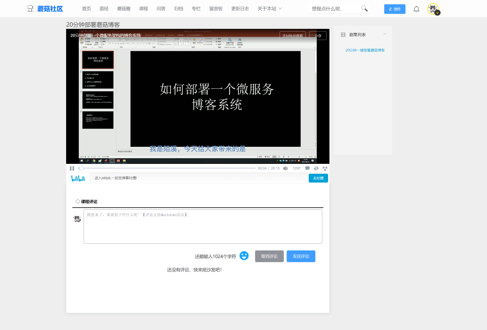

## 动态模块

为了小伙伴们能够在蘑菇随时随地分享每天的编程趣事，开发了蘑菇圈，在这里可以分享图片、分享链接、发布话题

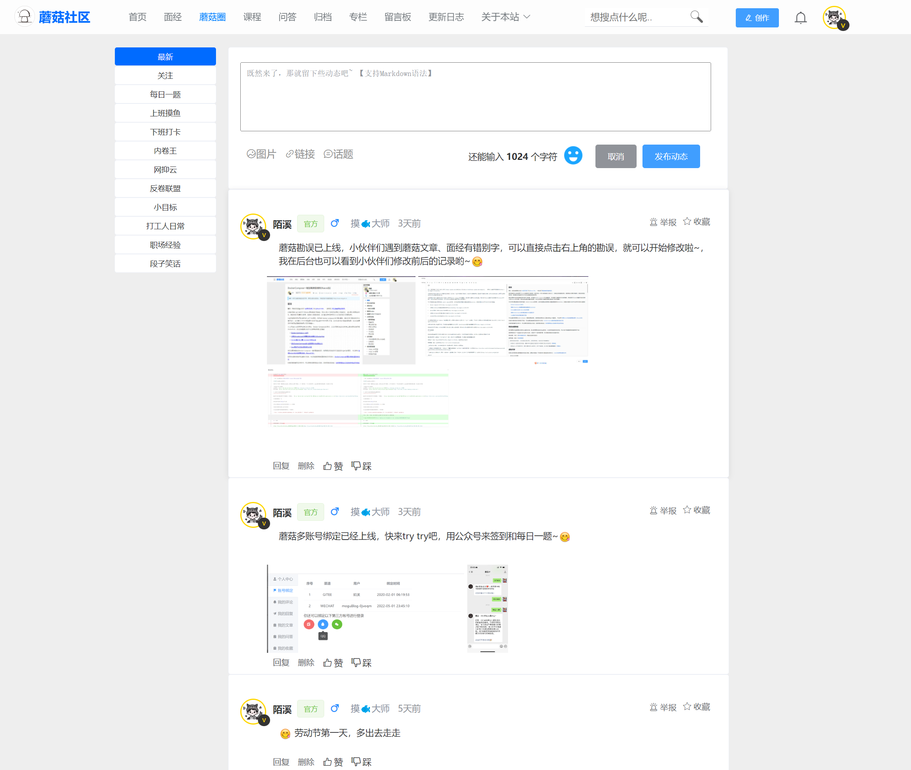

同时，在蘑菇圈你可以摸鱼划水，和小伙伴进行友好的技术交流，发布求助话题等待大神的帮助~

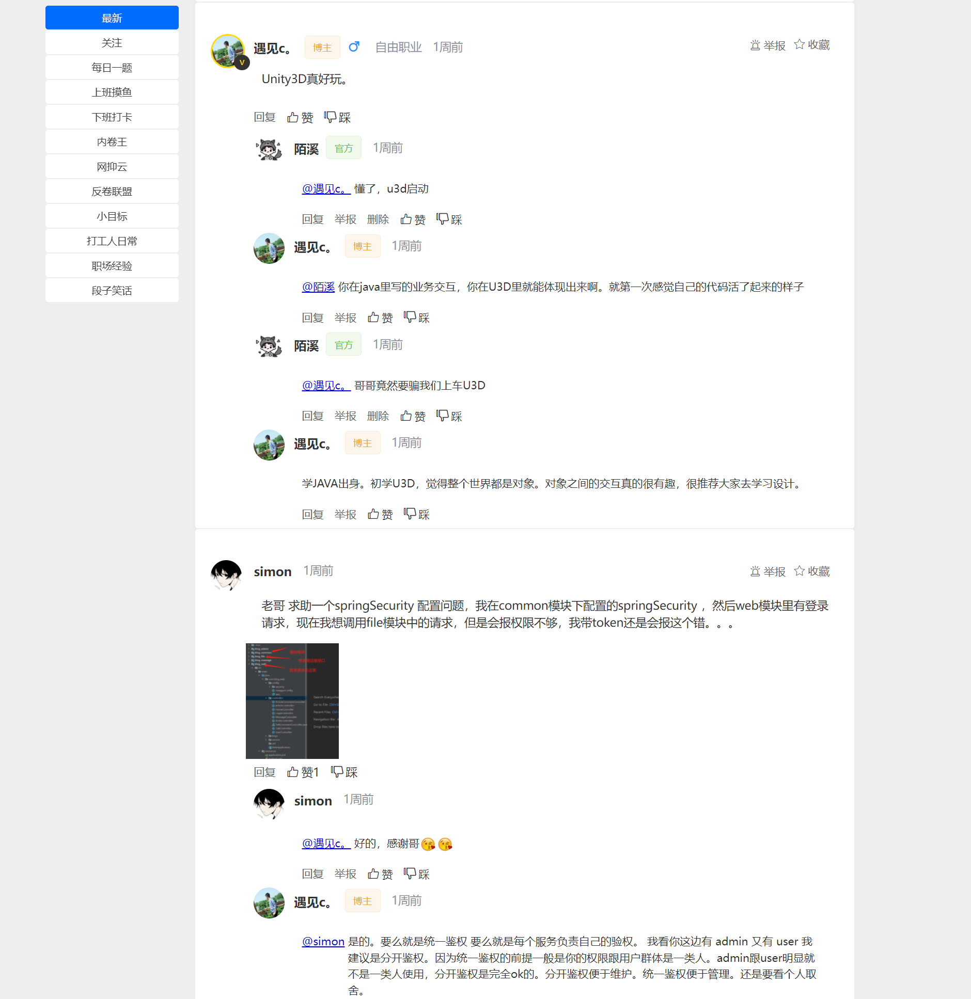

你可以对话题进行点赞和点踩，同时也可以收藏话题，发表的文章也可以进行收藏，在个人中心 -> 我的收藏，就可以看到自己收藏了那些内容了~

同时，对于一些恶意的动态，文章以及评论，欢迎小伙伴们点击边上的举报按钮。净化蘑菇环境，从你我做起~

## 面经模块

有不少小伙伴平时也有刷题面试的需求，但是通过公众号或者其它途径看到的面试题都不是很系统，可能只是某个知识点的内容。因此花了几个周末开发了一个面经的模块，对平时收集到的面经进行汇总，添加标签、设置精选、设置难度

小伙伴们可以通过标签、搜索、题型、难度、精选、是否有解 对面经进行筛选，也可以针对不同的编程语言进行专项训练，提高小伙伴们的面试技巧

同时，开启快问快答模式后，可以进行快速背题模式，支持隐藏解析、上一题、下一题，标记是否掌握

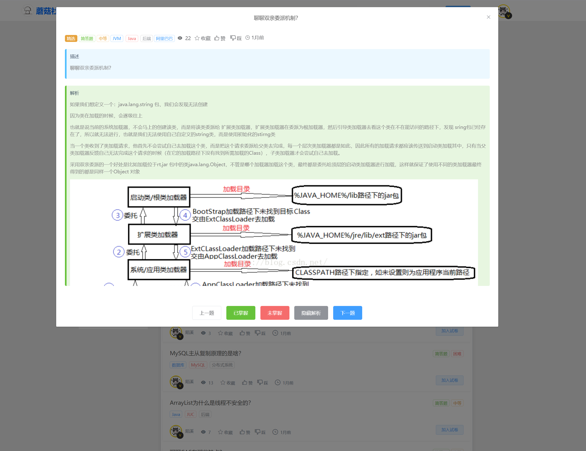

如果未开启快问快答模式，点击题目是会进入在题目详情页的，在这里可以对题目进行留言讨论，查看相似的题目

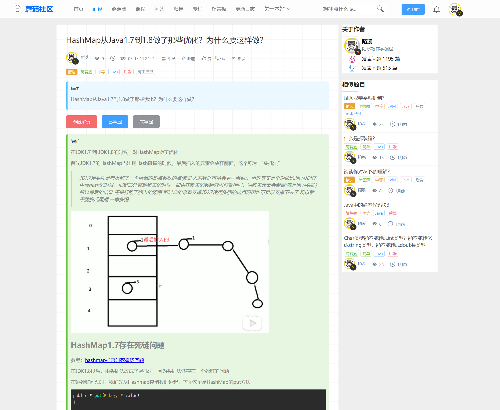

同时，目前题库也在完善中，也欢迎小伙伴们能够上传自己遇到的面试题，帮助更多的同学来学习

## 搜索更新

随着蘑菇社区模块的增加，小伙伴对搜索的需求也相应的增加了。目前搜索对应的类目也进行了增加，现在支持博客、面经、动态、问答以及用户搜索

## 群聊&私信模块

首先，特别感谢群里小伙伴 @周五 给蘑菇集成了群聊模块，目前支持登录的用户通过点击私信入口，进入到群聊中

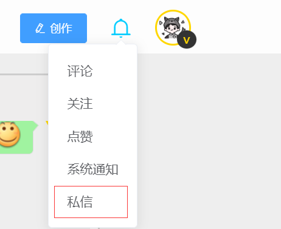

在蘑菇聊天中，也预设了官方的聊天群，在这里小伙伴们可以进行技术交流，也可以摸鱼吹水~

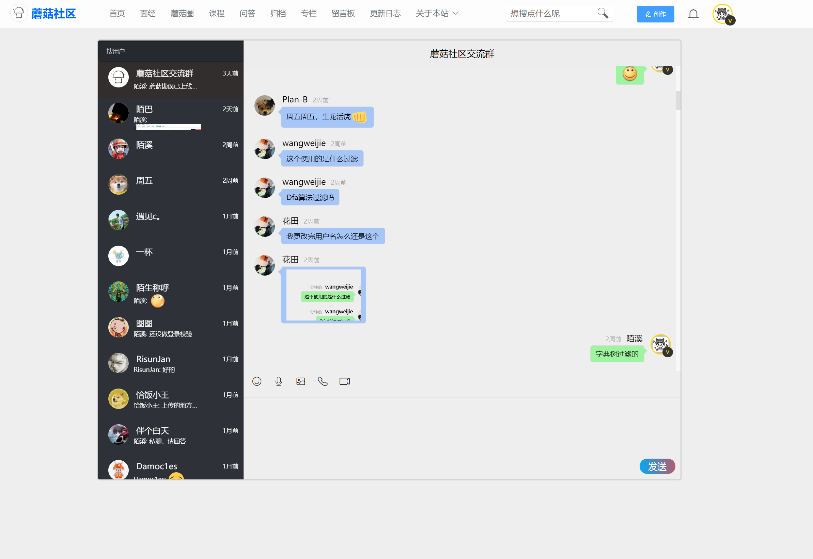

在阅读文章的时候，遇到不懂的问题，可以在文章进行留言，也可以直接向作者发起私信来进行问题的解决

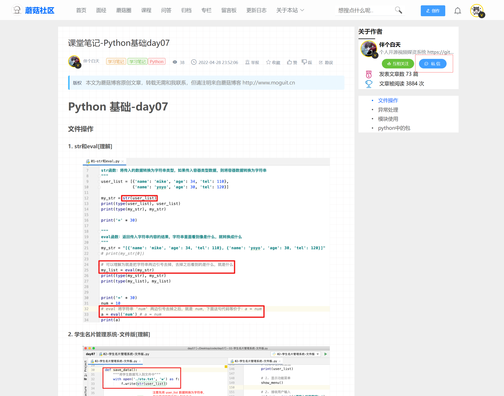

目前支持发送表情包，发送图片、语音聊天、视频聊天

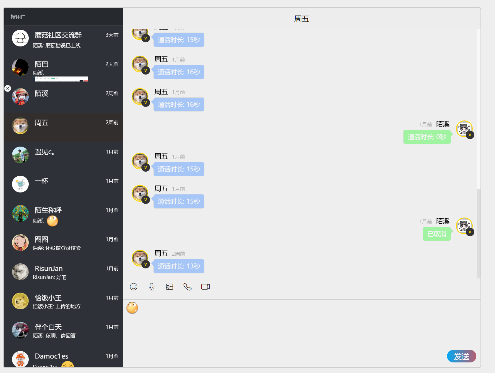

## 账号绑定

为了方便小伙伴们登录蘑菇，特意集成了微信公众号，小伙伴们可以直接公众号扫码登录蘑菇社区

同时，考虑到小伙伴们可能有多个账号，所以现在也支持多种账号绑定同一个蘑菇用户了，小伙伴在原有的账号下，可以绑定公众号

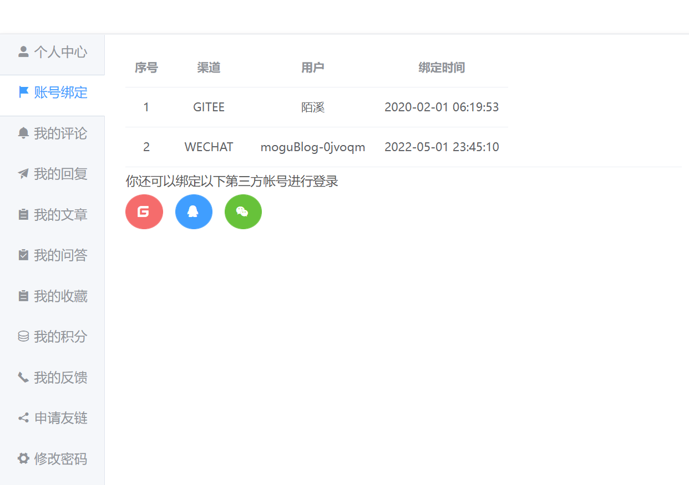

从而实现在公众号里进行签到、刷题、看文章等操作~

## 勘误功能

之前，又不少的小伙伴们说蘑菇的文档有错别字，所以在群里 @我 进行解决，但是等到我看到消息的时候，可能已经过了很久了，而且有时候可能也忘记了要去哪里修改，本次也非常感谢小伙伴 @亮亮的繁星相随 给蘑菇贡献了勘误功能。

当小伙伴们看到蘑菇文档、或者哪个面经有错别字的时候，可以直接点击上方的勘误功能

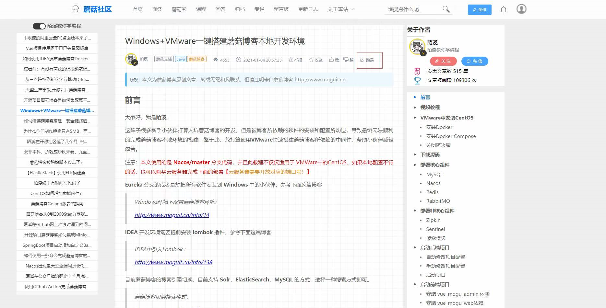

然后写上修改的原因，以及订正对应的错误区域，然后提交即可

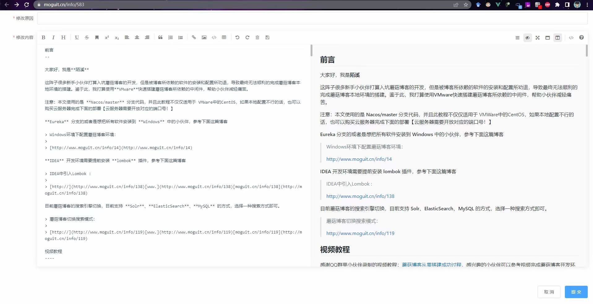

陌溪在后台看到了，会对提交的内容进行审核，同时为了方便查看到小伙伴修改的地方，特意审核的时候加入了文章 **Diff** 的功能，能够很方便的看到小伙伴们订正的地方~

## 通知模块

在通知模块中，小伙伴能够看到社区上的对自己的留言、回复、以及点赞、关注的通知

对于喜欢的博主可以进行关注，以后该博客发表文章、发表动态的时候就会收到消息

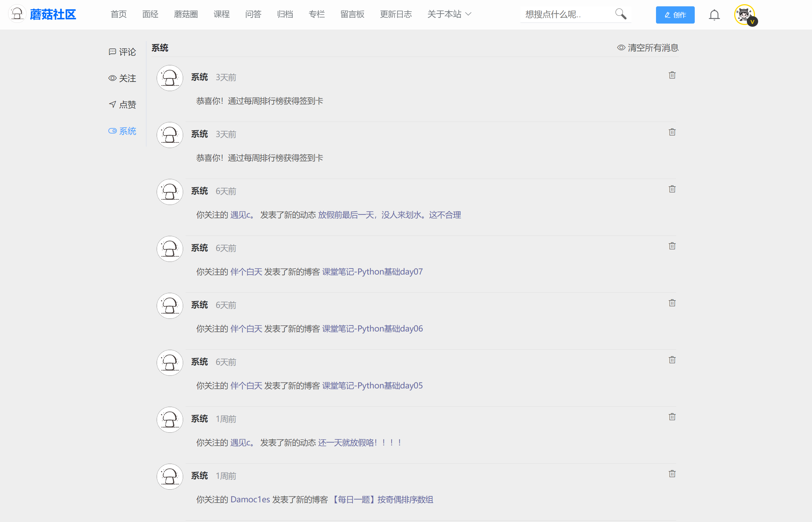

在个人中心页，可以看到有哪些小伙伴关注了自己，也可以进行互相关注~。在个人中心页，可以看到用户发表的文章、问答，动态和面经~

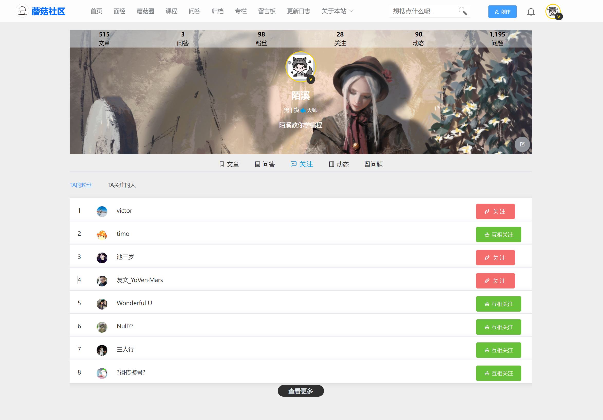

同时，为了提高用户主页的辨识度，小伙伴们还可以在个人主页修改自己的背景图，打造自己专属的背景风格~

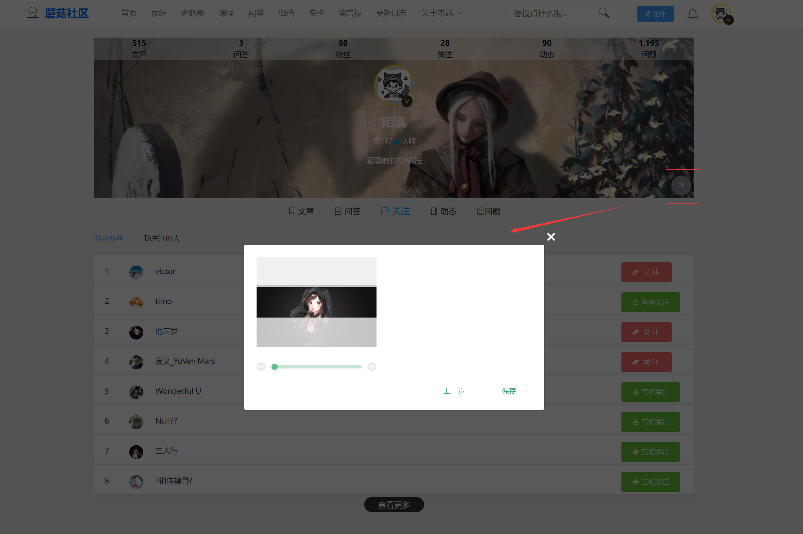

## SEO优化

[网站被收录了](https://www.moguit.cn/info/1092) ，**SEO** 问题一直也是被小伙伴们吐槽的一个地方了，因为蘑菇项目选型的时候，采用的是 **Vue** 作为前端框架，而 **Vue** 因为是客户端渲染，所以在很长的一段时间内搜索蘑菇博客，只能看到首页。

后面也在 **SEO** 方面做了一些改动，比如用 **nuxj.js** 重构蘑菇，所以有了 **nuxt_mogu_web** 项目，但是因为需要同时维护两个前端项目，但有新模块要更新的时候，需要写两遍，比较耗时耗力，所以在维护了一段时间后，就放弃了这个方式。

并且使用 **nuxt.js** 重构的，在页面打开的时候，也比 **vue** 项目更慢，这可能就是服务器渲染的弊端了。

后面，通过 **prender-alpine** 项目对

不同技术方案有一定差距，不能兼顾优点。但仔细想，需要这些技术优点的 "用户"，其实时不一样的，**Vue** 针对的是浏览器普通用户、**SSR** 针对的是网页爬虫，如 **googlebot**、**baiduspider** 等，那为什么我们不能给不同“用户”不同的页面呢，服务端动态渲染就是这种方案。

后来，陌溪在网上冲浪的时候，在 **Github** 上发现了 **prender-alpine** 这个开源项目

> https://github.com/tvanro/prerender-alpine

专门针对爬虫搭建了一套服务，大致原理如下，但如果识别到是普通用户过来，直接返回 **html** 和 **js** ，如果识别到是爬虫，那么会经过一层预渲染，从而返回一个完整的页面。

好了，关于蘑菇社区的一些功能更新，就介绍到这里了，也欢迎各位小伙伴们前来体验

> 蘑菇社区:  https://www.moguit.cn

同时如果小伙伴对某个模块想要进行了解的，陌溪也会考虑单独出几期文章来展开介绍~

我是陌溪，我们下期再见~