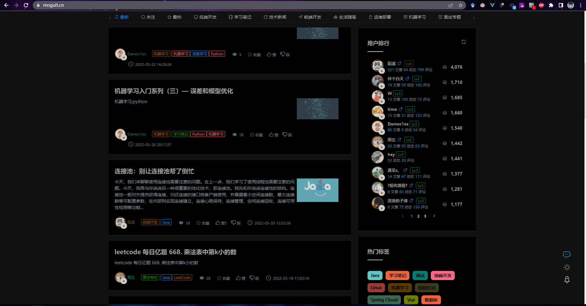
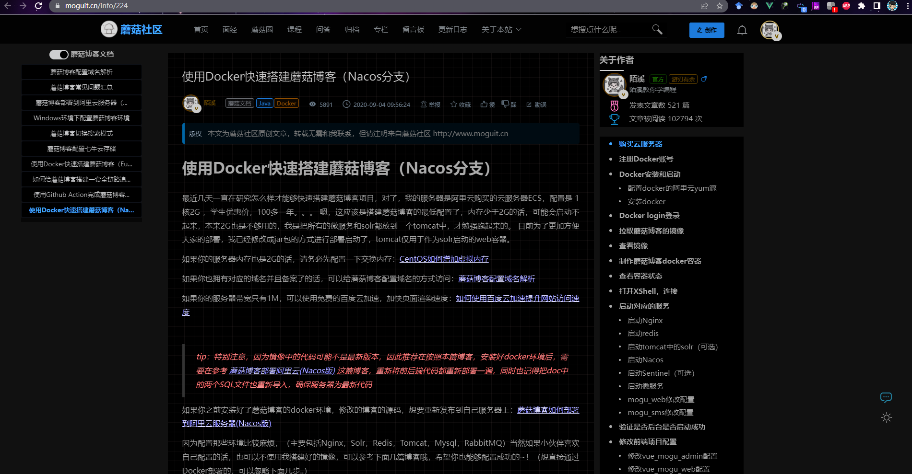
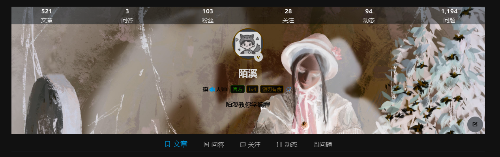
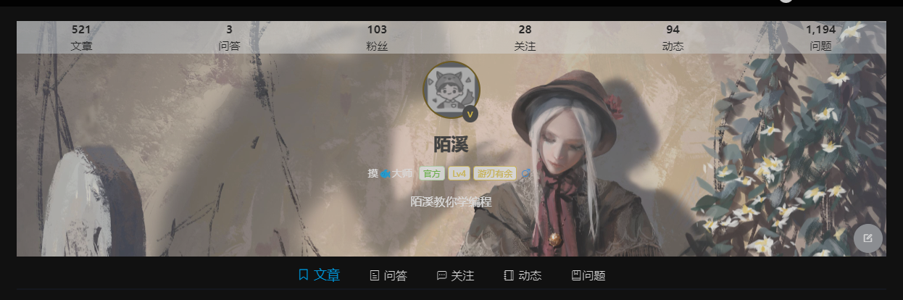

大家好，我是 **陌溪**

最近，看到不少网站都有暗黑模式，能够让我们在夜晚浏览网站的时候保护双眼，所以花费了半天的时间研究了一下，给蘑菇安排上了。

下面，先来几张蘑菇社区暗黑模式的图片，看看开启暗黑模式后的样子



然后是文章详情页，可以看到效果还是不错的



下面，让我们一起来学习一下，如何通过几行代码，给自己的网站安排上暗黑模式

首先，在网站的 全局 **CSS** 样式文件中，新增下面两个样式

```bash
html[data-theme=dark]{
 filter: invert(1) hue-rotate(180deg);
}
html[data-theme=dark] img{
 filter: invert(0.85) hue-rotate(180deg);
}
```

这里用到了 **CSS** 中的 **filter** 属性，也就是 **滤镜**。

提到 **滤镜**，可能有不少的小伙伴首先想到的就是 **PhotoShop** 之类的制图软件，通过此类软件的滤镜可以对图片进行美化。

而在 **CSS** 中，我们无需借助任何软件也可以实现很多种滤镜效果，例如模糊效果、透明效果、色彩反差调整、色彩反相等等。另外，通过 **CSS** 中的滤镜还能对网页中的元素或者视频进行处理。

**CSS** 中实现滤镜效果需要通过 **filter** 属性并配合一些函数来实现：

- **invert(%)**：反转图像，默认值为 0%，表示原始图像；100% 则表示完全反转，不允许使用负值

- **hue-rotate(deg)**：给图像应用色相旋转，该值用来定义色环的度数，默认值为 0deg，代表原始图像，最大值为 360deg
- **brightness(%)**：调整图像的亮度，默认值为 100％，代表原始图像；0％ 表示没有亮度，图像将完全变黑；当值超过 100％ 时图像将变得更亮
- **contrast(%)**：调整图像的对比度，默认值为 100％，代表原始图像；0％ 将使图像完全变黑；当值超过 100％ 时图像将获得更高的对比度

因为我们都知道，蘑菇都是以白色作为主题色的，所以通过 **invert** 色相反转后，原来的白色就会变成黑色，而黑色的字体就会变成白色，从而实现了暗黑模式。

上面的原理讲完了，下面我们就需要添加一个按钮，进行暗黑模式的切换了

```js
changeDarkModel(darkModel){
    if (darkModel == 1) {
        console.log("切换暗黑模式")
        window.document.documentElement.setAttribute('data-theme', 'dark')
    } else {
        console.log("切换亮白模式")
        window.document.documentElement.setAttribute('data-theme', 'light')
    }
    // 存储在cookie中
    setCookie("darkModel", darkModel, 31)
    this.darkModel = darkModel
},
```

这里使用到了 **documentElement.setAttribute()** 方法，给定元素节点添加一个新的属性值或是改变它的现有属性值。

当我们点击切换的时候， **data-theme** 的也会随着切换。

当切换成 **dark** 的时候，下面的 **CSS** 的 **属性选择器** 就会被激活，从而将网站的颜色进行反转。

```css
html[data-theme=dark]{
 filter: invert(1) hue-rotate(180deg);
}
html[data-theme=dark] img{
 filter: invert(0.85) hue-rotate(180deg);
}
```

细心的小伙伴，可能会发现，对于图片来说，同时进行反转了两次，这是因为一个正常的图片在经过反转了，变成了下面这样，属实有些阴间了



所以，就需要进行再次反转来修复，再次反转后看着就正常了~



同时，我们也可以将 **darkModel** 存储在 **Cookie** 中，从而实现刷新页面从缓存中读取是否开启暗黑模式

```js
let darkModel = getCookie("darkModel")
if (darkModel && darkModel == "1") {
	this.darkModel = 1
	window.document.documentElement.setAttribute('data-theme', 'dark')
} else {
	this.darkModel = 0
	window.document.documentElement.setAttribute('data-theme', 'light')
}
```

好了，本地关于蘑菇暗黑模式的实现，就到这里了

我是陌溪，我们下期再见
