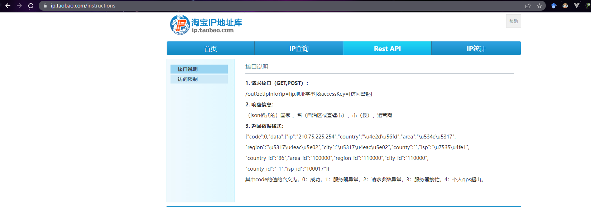
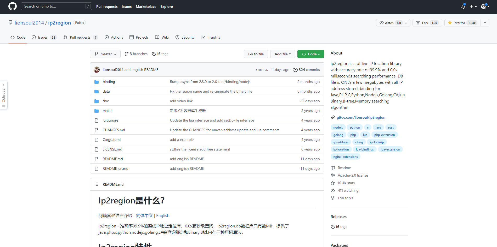
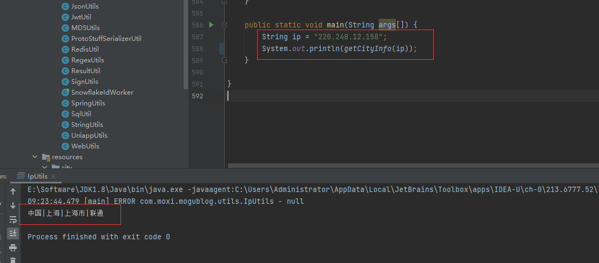
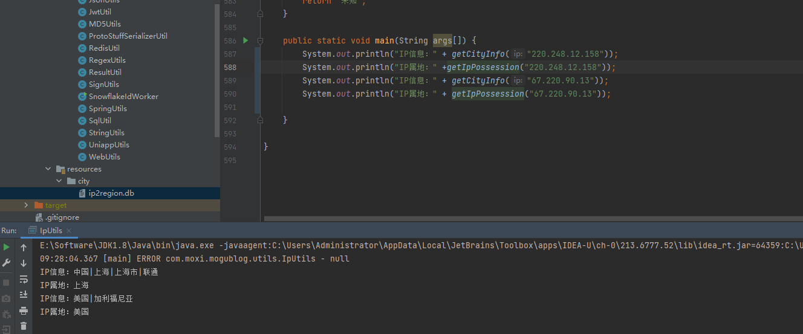

大家好，我是**陌溪**

细心的小伙伴可能会发现，最近蘑菇新上线了 **IP** 属地的功能，小伙伴在发表动态、发表评论以及聊天的时候，都会显示自己的 **IP** 属地信息


在蘑菇群聊中，也可以展示 IP 属地，下面是小伙伴们在交流群中显示的


快来蘑菇圈留言看看你在哪里吧～

下面，我就来讲讲，**Java** 中是如何获取 **IP** 属地的，主要分为以下几步

- 通过 HttpServletRequest 对象，获取用户的 **IP** 地址
- 通过 IP 地址，获取对应的省份、城市

首先需要写一个 **IP** 获取的工具类，因为每一次用户的 **Request** 请求，都会携带上请求的 **IP** 地址放到请求头中。

```java
public class IpUtil {
    public static String getIpAddr(ServerHttpRequest request) {
        HttpHeaders headers = request.getHeaders();
        String ipAddress = headers.getFirst("X-Forwarded-For");
        if (ipAddress == null || ipAddress.length() == 0 || "unknown".equalsIgnoreCase(ipAddress)) {
            ipAddress = headers.getFirst("Proxy-Client-IP");
        }
        if (ipAddress == null || ipAddress.length() == 0 || "unknown".equalsIgnoreCase(ipAddress)) {
            ipAddress = headers.getFirst("WL-Proxy-Client-IP");
        }
        if (ipAddress == null || ipAddress.length() == 0 || "unknown".equalsIgnoreCase(ipAddress)) {
            ipAddress = request.getRemoteAddress().getAddress().getHostAddress();
            if (ipAddress.equals("127.0.0.1") || ipAddress.equals("0:0:0:0:0:0:0:1")) {
                // 根据网卡取本机配置的IP
                try {
                    InetAddress inet = InetAddress.getLocalHost();
                    ipAddress = inet.getHostAddress();
                } catch (UnknownHostException e) {
                    log.error("根据网卡获取本机配置的IP异常", e);
                }

            }
        }

        // 对于通过多个代理的情况，第一个IP为客户端真实IP，多个IP按照','分割
        if (ipAddress != null && ipAddress.indexOf(",") > 0) {
            ipAddress = ipAddress.split(",")[0];
        }

        return ipAddress;
    }
}
```

这里有三个名词，分别是

- **X-Forwarded-For**：**一个 HTTP** 扩展头部，主要是为了让 **Web** 服务器获取访问用户的真实 **IP** 地址。每个 **IP** 地址，每个值通过逗号+空格分开，最左边是最原始客户端的 **IP** 地址，中间如果有多层代理，每⼀层代理会将连接它的客户端 **IP** 追加在 **X-Forwarded-For** 右边。
- **X-Real-IP**：一般只记录真实发出请求的客户端IP
- **Proxy-Client-IP**：这个一般是经过 **Apache http** 服务器的请求才会有，用 **Apache http** 做代理时一般会加上 **Proxy-Client-IP** 请求头
- **WL-Proxy-Client-IP**：也是通过 Apache http 服务器，在 **weblogic** 插件加上的头。

在我们获取到用户的 **IP** 地址后，那么就可以获取对应的 **ip** 信息了

蘑菇最开始使用的是淘宝 **IP** 库

> 地址：https://ip.taobao.com/


接入方式也比较简单，就是通过封装一个 **http** 请求，传入用户的 **ip** 作为参数，就可以返回 **ip** 对应的国家，省，城市 信息



原来的请求方式如下

```java
    /**
     * 获取IP地址来源
     *
     * @param content        请求的参数 格式为：name=xxx&pwd=xxx
     * @param encodingString 服务器端请求编码。如GBK,UTF-8等
     * @return
     * @throws UnsupportedEncodingException
     */
    public static String getAddresses(String content, String encodingString) {
        String ip = content.substring(3);
        if (!Util.isIpAddress(ip)) {
            log.info("IP地址为空");
            return null;
        }
        // 淘宝IP宕机，目前使用Ip2region：https://github.com/lionsoul2014/ip2region
        String cityInfo = getCityInfo(ip);
        log.info("返回的IP信息：{}", cityInfo);
        
        // TODO 淘宝接口目前已经宕机，因此暂时注释下面代码
        try {
            // 这里调用pconline的接口
            String urlStr = "http://ip.taobao.com/service/getIpInfo.php";
            // 从http://whois.pconline.com.cn取得IP所在的省市区信息
            String returnStr = getResult(urlStr, content, encodingString);
            if (returnStr != null) {
                // 处理返回的省市区信息
                log.info("调用IP解析接口返回的内容:" + returnStr);
                String[] temp = returnStr.split(",");
                //无效IP，局域网测试
                if (temp.length < 3) {
                    return "0";
                }
                // 国家
                String country = "";
                // 区域
                String area = "";
                // 省
                String region = "";
                // 市
                String city = "";
                // 县
                String county = "";
                // 运营商
                String isp = "";
                Map<String, Object> map = JsonUtils.jsonToMap(returnStr);

                if (map.get("code") != null) {
                    Map<String, String> data = (Map<String, String>) map.get("data");
                    country = data.get("country");
                    area = data.get("area");
                    region = data.get("region");
                    city = data.get("city");
                    county = data.get("area");
                    isp = data.get("isp");
                }

                log.info("获取IP地址对应的地址" + country + "=" + area + "=" + region + "=" + city + "=" + county + "=" + isp);
                StringBuffer result = new StringBuffer();
                result.append(country);
                result.append("|");
                result.append(region);
                result.append("|");
                result.append(city);
                result.append("|");
                result.append(isp);
                return result.toString();
            }
        } catch (Exception e) {
            log.error(e.getMessage());
            return null;
        }
        return null;
    }
```

但是，之前接入淘宝 **IP** 库的时候，也经常会遇到服务不可用的情况，并且由于限制了 **QPS** 为 **1**，所以如果访问量大的话，就没办法获取了。

而到现在的话倒好了，这个接口也不对外提供服务了，直接下线了，不让调用了。


后面，陌溪在 **Github** 冲浪的时候，发现了 **Ip2region** 项目。

一个准确率 **99.9%** 的离线 **IP** 地址定位库，**0.0x** 毫秒级查询，**ip2region.db** 数据库只有数 **MB**，提供了 java,php,c,python,nodejs,golang,c# 等查询绑定和**Binary**，**B树**，内存三种查询算法。



数据聚合了一些知名 **ip** 到地名查询提供商的数据，这些是他们官方的的准确率，经测试着实比经典的纯真 **IP** 定位准确一些。**ip2region** 的数据聚合自以下服务商的开放 **API** 或者数据。

- 80%, 淘宝IP地址库, http://ip.taobao.com/
-  ≈10%, GeoIP, https://geoip.com/
-  ≈2%, 纯真IP库, http://www.cz88.net/

>  **备注**：如果上述开放API或者数据都不给开放数据时ip2region将停止数据的更新服务。

每条 **ip** 数据段都固定了格式：

```
_城市Id|国家|区域|省份|城市|ISP_
```

只有中国的数据精确到了城市，其他国家有部分数据只能定位到国家，后前的选项全部是 **0**，已经包含了全部你能查到的大大小小的国家

生成的数据库文件 **ip2region.db** 只有几 **MB**，最小的版本只有 **1.5MB**，随着数据的详细度增加数据库的大小也慢慢增大，目前还没超过 **8MB**。

## 内置的三种查询算法

全部的查询客户端单次查询都在 **0.x** 毫秒级别，内置了三种查询算法

- **memory** 算法：整个数据库全部载入内存，单次查询都在0.1x毫秒内，C语言的客户端单次查询在0.00x毫秒级别。

- **binary** 算法：基于二分查找，基于ip2region.db文件，不需要载入内存，单次查询在0.x毫秒级别。

- **b-tree** 算法：基于btree算法，基于ip2region.db文件，不需要载入内存，单词查询在0.x毫秒级别，比binary算法更快。

# ip2region安装

下面，就让我们给项目引入 **ip2region**，进行 **ip** 信息转换吧 

首先引入 **maven** 依赖

```pom
<dependency>
    <groupId>org.lionsoul</groupId>
    <artifactId>ip2region</artifactId>
    <version>1.7.2</version>
</dependency>
```

然后编写一个工具类 **IpUtils** ，首先需要加载 **ip2region.db** 文件

```java
static {
    dbPath = createFtlFileByFtlArray() + "ip2region.db";
    try {
        config = new DbConfig();
    } catch (DbMakerConfigException e) {
        e.printStackTrace();
    }
    try {
        searcher = new DbSearcher(config, dbPath);
    } catch (FileNotFoundException e) {
        e.printStackTrace();
    }
}
```

在加载的时候，需要下载仓库中的  **ip2region.db** 文件，然后放到 **resource** 目录下


然后，通过内置的三种算法，分别转换用户 **ip** 地址

```java
    public static String getCityInfo(String ip) {

        if (StringUtils.isEmpty(dbPath)) {
            log.error("Error: Invalid ip2region.db file");
            return null;
        }
        if(config == null || searcher == null){
            log.error("Error: DbSearcher or DbConfig is null");
            return null;
        }
		
        //查询算法
        //B-tree, B树搜索（更快）
        int algorithm = DbSearcher.BTREE_ALGORITHM;

        //Binary,使用二分搜索
        //DbSearcher.BINARY_ALGORITHM

        //Memory,加载内存（最快）
        //DbSearcher.MEMORY_ALGORITYM
        try {
            // 使用静态代码块，减少文件读取操作
//            DbConfig config = new DbConfig();
//            DbSearcher searcher = new DbSearcher(config, dbPath);

            //define the method
            Method method = null;
            switch (algorithm) {
                case DbSearcher.BTREE_ALGORITHM:
                    method = searcher.getClass().getMethod("btreeSearch", String.class);
                    break;
                case DbSearcher.BINARY_ALGORITHM:
                    method = searcher.getClass().getMethod("binarySearch", String.class);
                    break;
                case DbSearcher.MEMORY_ALGORITYM:
                    method = searcher.getClass().getMethod("memorySearch", String.class);
                    break;
                default:
            }

            DataBlock dataBlock = null;
            if (Util.isIpAddress(ip) == false) {
                System.out.println("Error: Invalid ip address");
            }

            dataBlock = (DataBlock) method.invoke(searcher, ip);
            String ipInfo = dataBlock.getRegion();
            if (!StringUtils.isEmpty(ipInfo)) {
                ipInfo = ipInfo.replace("|0", "");
                ipInfo = ipInfo.replace("0|", "");
            }
            return ipInfo;

        } catch (Exception e) {
            e.printStackTrace();
        }

        return null;
    }
```

下面，我们编写 **main** 函数进行测试，发现可以正常的解析出 **ip** 信息



由于 ip 属地在国内的话，只会展示省份，而国外的话，只会展示国家。所以我们还需要对这个方法进行一下封装，得到获取 IP 属地的信息。

```bash
/**
 * 获取IP属地
 * @param ip
 * @return
 */
public static String getIpPossession(String ip) {
    String cityInfo = getCityInfo(ip);
    if (!StringUtils.isEmpty(cityInfo)) {
        cityInfo = cityInfo.replace("|", " ");
        String[] cityList = cityInfo.split(" ");
        if (cityList.length > 0) {
            // 国内的显示到具体的省
            if ("中国".equals(cityList[0])) {
                if (cityList.length > 1) {
                    return cityList[1];
                }
            }
            // 国外显示到国家
            return cityList[0];
        }
    }
    return "未知";
}
```

下面，我们在找一个 国外的 **IP** 测试一下效果。可以看到已经能够正常的显示 **IP** 属地信息了~



到这里如果获取用户的 IP 属地已经完成啦，如果想要了解关于更多 **ip2region** 的功能，欢迎访问其 **Github** 地址进行学习。

本期的学习之旅就到这里啦，我是陌溪，我们下期再见~

